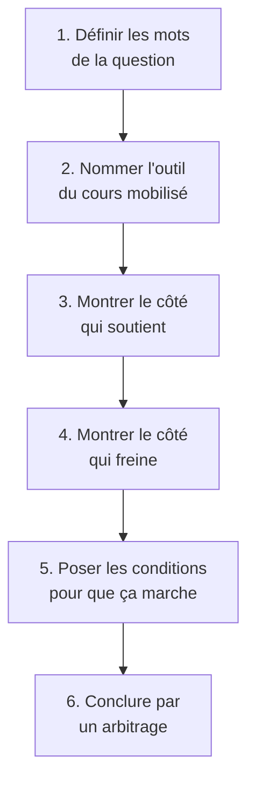

# 00 — Index et mode d'emploi

## À quoi sert ce dossier

Ce dossier contient **22 fiches**, une par question de révision. Chaque fiche est écrite comme un cours, pas comme un aide-mémoire.

Concrètement, chaque fiche vous donne :

1. **La réponse en une phrase**, tout en haut, pour que vous sachiez où on va.
2. **La définition de chaque mot** de la question. Beaucoup d'erreurs viennent d'un mot mal compris, pas d'un manque de connaissances.
3. **Le raisonnement complet** : pourquoi on fait ça et pas autre chose, d'où ça sort, ce qui se passerait si on faisait autrement.
4. **Des schémas** (blocs Mermaid, tableaux, barres) pour voir le mécanisme.
5. **Un exemple concret** déroulé du début à la fin.
6. **Les pièges** qui font perdre des points.

## Le code de provenance — lisez-le avant tout

Ce code apparaît partout dans les fiches. Il est là pour que vous sachiez toujours **d'où vient une affirmation**.

| Symbole | Signification | Ce que vous pouvez en faire |
|---|---|---|
| 📘 | Vient directement de vos supports de cours | Citable tel quel, y compris les chiffres |
| 🔎 | Mon interprétation ou mon raisonnement | Utilisable, mais c'est vous qui l'assumez |
| 📚 | Complément théorique hors cours | À mentionner comme un apport extérieur, jamais comme du cours |

> [!warning] Règle absolue
> Ne présentez **jamais** un 🔎 ou un 📚 comme s'il venait du cours. Si un examinateur vous demande d'où vient une affirmation et que vous ne savez pas répondre, elle vous coûte plus qu'elle ne vous rapporte.

## Les 22 fiches

### Bloc A — Le numérique et la durabilité
- [[Q01_Transformation_digitale_et_durabilite]]
- [[Q07_Numerique_pour_mesurer_et_piloter_impact]]
- [[Q08_Donnees_temps_reel_et_logistique_durable]]
- [[Q13_Innovation_digitale_et_durabilite]]
- [[Q16_Impact_environnemental_des_data_centers]]
- [[Q17_IA_et_consommation_energetique]]
- [[Q19_Blockchain_et_tracabilite_durable]]
- [[Q20_Risques_de_la_numerisation_au_dela_de_lecologie]]
- [[Q21_Le_cloud_soutient_il_la_durabilite]]

### Bloc B — Les outils de diagnostic
- [[Q02_PESTEL_secteur_alimentaire]]
- [[Q03_La_durabilite_comme_force_dans_un_SWOT]]
- [[Q04_Reduire_lempreinte_carbone_via_la_chaine_de_valeur]]
- [[Q09_PESTEL_entreprise_en_transition_ecologique]]
- [[Q10_Integrer_les_parties_prenantes]]
- [[Q14_Les_freins_internes_a_une_strategie_durable]]

### Bloc C — Modèle économique et positionnement
- [[Q05_Transformer_un_business_model_en_BM_durable]]
- [[Q06_Collaboration_ouverte_et_partenariats]]
- [[Q12_Transparence_labels_et_positionnement]]
- [[Q15_Le_greenwashing]]

### Bloc D — Conception et circularité
- [[Q11_Lecoconception]]
- [[Q18_Economie_circulaire_des_appareils_numeriques]]
- [[Q22_Integrer_les_ODD_dans_une_strategie_digitale]]

## La structure de raisonnement commune

Presque toutes ces questions se répondent avec la même architecture. Apprenez-la une fois, elle sert 22 fois.

**Pourquoi cette architecture ?** Parce que ces questions sont presque toutes des questions **à double tranchant**. Elles ne demandent pas « le numérique est-il bien ou mal », elles demandent « à quelles conditions ». Une réponse à sens unique passe à côté du sujet.

## Les cinq notions transversales

Ces cinq notions reviennent dans presque toutes les fiches. Si vous ne deviez retenir que ça :

| Notion | En une phrase | Fiche de référence |
|---|---|---|
| **Effet rebond** | Un gain d'efficacité peut être annulé par une hausse des volumes | [[Q08_Donnees_temps_reel_et_logistique_durable]] |
| **Sobriété** | 📘 Questionner les besoins en première intention, avant d'optimiser | [[Q13_Innovation_digitale_et_durabilite]] |
| **Externalité négative** | Un coût réel supporté par quelqu'un d'autre et absent du compte de résultat | [[Q05_Transformer_un_business_model_en_BM_durable]] |
| **3R dans l'ordre** | 📘 Réduire, réutiliser, puis « enfin seulement » recycler | [[Q18_Economie_circulaire_des_appareils_numeriques]] |
| **Périmètre élargi** | 📘 Des matières premières jusqu'à la fin de vie, pas seulement l'entreprise | [[Q04_Reduire_lempreinte_carbone_via_la_chaine_de_valeur]] |
