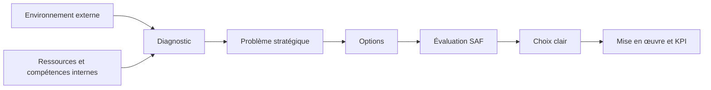

> [[00_Index_30_mises_en_situation|🗂 Index des 30 cas]]

# 30 mises en situation complexes — Stratégie d'entreprise
## Niveau Bachelor HEG — document d'entraînement approfondi

> **Objectif :** apprendre à raisonner comme un stratège, pas à réciter un chapitre. Chaque cas oblige à distinguer l'**externe** de l'**interne**, à croiser plusieurs outils, à identifier les tensions, puis à **trancher**.

---

## Mode d'emploi pour l'examen

### Méthode L-I-S-A-E-C

| Étape | Réflexe |
|---|---|
| **L — Lire** | Identifier le verbe de consigne et ce qui est réellement demandé. |
| **I — Identifier** | Choisir les notions pertinentes. |
| **S — Structurer** | Préparer 2 à 4 axes logiques. |
| **A — Argumenter** | Utiliser **D-E-I : Définir → Expliquer → Illustrer**. |
| **E — Étendre** | Faire au moins un lien transversal entre chapitres. |
| **C — Conclure** | Prendre position et justifier avec **SAF**. |

### Règle d'or sur le numérique

Sur tout sujet **IA, cloud, automatisation, blockchain, IoT ou plateforme**, répondre en double sens :

- **Que permet le numérique ?**
- **Quels nouveaux impacts, dépendances, exclusions ou effets rebond crée-t-il ?**

### Note sur VRIO

La grille **VRIO** est intégrée ici comme **complément méthodologique** demandé : **Valeur, Rareté, Imitabilité difficile, Organisation**. Les supports fournis insistent surtout sur les ressources matérielles/immatérielles, les compétences et le caractère difficilement imitable/transférable des avantages ; le terme VRIO n'y apparaît pas explicitement dans les documents retrouvés. Il est donc utilisé comme outil complémentaire, pas comme notion attribuée au cours.

---

---

> [[00_Index_30_mises_en_situation|🗂 Index des 30 cas]] · [[Q56_AgroTrace_SA|Commencer par le cas Q56]] ➡
