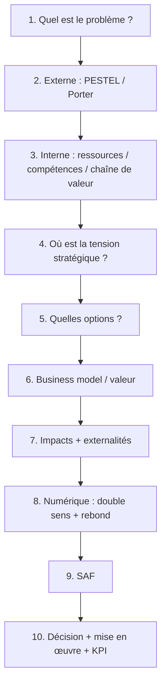

> ⬅ [[Q85_AlpFood]] · [[00_Index_30_mises_en_situation|🗂 Index des 30 cas]]

# Synthèse finale — comment réussir ces 30 cas à l'examen

## 1. Le fil rouge à mémoriser



## 2. La différence entre une réponse moyenne et une excellente réponse

| Réponse moyenne | Excellente réponse |
|---|---|
| Récite des définitions | Utilise les définitions pour comprendre le cas |
| Fait un PESTEL exhaustif sans hiérarchie | Sélectionne les facteurs réellement déterminants |
| Liste les forces et faiblesses | Relie les forces aux opportunités et les faiblesses aux menaces |
| Dit « l'IA améliore la performance » | Explique quel processus, quel mécanisme et quelle limite |
| Dit « c'est durable » | Montre impacts positifs **et** externalités négatives |
| Mesure uniquement l'efficacité par unité | Vérifie aussi les volumes et l'effet rebond |
| S'arrête au diagnostic | Compare les options et tranche avec SAF |
| Propose un outil | Construit une stratégie, une mise en œuvre et des KPI |

## 3. Les distinctions qu'il faut absolument maîtriser

### Force vs opportunité

```text
FORCE = interne = « ce que l'entreprise possède ou sait faire »
OPPORTUNITÉ = externe = « évolution favorable autour d'elle »
```

Exemple :

- **Demande croissante pour le local** = opportunité.
- **Marque locale réputée** = force.

### Objectif vs stratégie

- **Objectif :** où veut-on aller ? Exemple : réduire les déchets de 30 %.
- **Stratégie :** comment allons-nous y parvenir et avec quelles ressources ?

### Technologie vs avantage concurrentiel

Une technologie achetée sur le marché peut être facilement copiée. L'avantage durable se trouve souvent dans la combinaison :

```text
Technologie
+ données de qualité
+ savoir-faire métier
+ réputation
+ organisation
+ apprentissage
= compétence plus difficile à imiter
```

### Efficacité vs sobriété

- **Efficacité :** faire la même chose avec moins de ressources par unité.
- **Sobriété :** se demander d'abord si cette chose doit être faite, dans quelle quantité et avec quel niveau de service.

Exemple : compresser une vidéo est de l'efficacité ; se demander si quatre heures de vidéo 4K sont nécessaires est de la sobriété.

## 4. Mémo des outils

| Question entendue | Outil réflexe |
|---|---|
| « environnement », « marché », « tendance » | **PESTEL** |
| « concurrence », « fournisseurs », « clients », « substitut » | **Porter** |
| « force/faiblesse » | **Ressources / compétences / chaîne de valeur** |
| « synthèse du diagnostic » | **SWOT** |
| « avantage difficile à copier » | **Ressources immatérielles**, éventuellement **VRIO** en complément |
| « modèle économique » | **RCOV / BMC** |
| « rentabilité » | **Équation de profit** |
| « durable » | **BM durable / externalités / ODD / 3R** |
| « IA / cloud / data center » | **RNE + sobriété + effet rebond + T-D-R** |
| « seniors / handicap / inclusion » | **Accessibilité / POUR / exclusion indirecte** |
| « achat IT » | **Acheter moins → mieux → utiliser plus longtemps** |
| « utilisateurs / besoin » | **Observation / interview / sondage / focus group** |
| « recommandez » | **SAF** |

## 5. Phrase-type complète pour l'oral

> **« Je commence par le diagnostic externe : [facteur PESTEL/Porter] crée une menace ou une opportunité. En interne, l'entreprise possède [ressource/compétence] mais souffre de [faiblesse]. L'enjeu stratégique est donc [tension]. Je compare [option A] et [option B]. L'option que je recommande est [choix], car elle est souhaitable, acceptable et faisable sous [conditions]. Si le choix implique du numérique, j'ajoute que le numérique soutient [gain], mais peut freiner la durabilité par [empreinte/données/exclusion/rebond]. »**

## 6. Sources de cours mobilisées

Le document a été construit à partir des supports et fiches fournis dans le projet, notamment :

- **14 — Nouvelles questions probables (55 questions)** ;
- **15 — Méthodologie de réponse à l'examen** ;
- cours sur le **diagnostic externe PESTEL / Porter** ;
- cours sur le **diagnostic interne, ressources, compétences et chaîne de valeur** ;
- cours sur le **Business Model, RCOV et BMC** ;
- support sur le **Business Model Durable** ;
- cours sur la **durabilité, ODD, limites planétaires et Donut** ;
- support **numérique et durabilité / sobriété / effet rebond** ;
- supports sur la **Responsabilité numérique des entreprises (RNE)** ;
- cours sur les **achats durables IT et les 3R** ;
- cas **SilverDigital** sur l'accessibilité ;
- cas **Marché de l'Oncle Hansi** ;
- support **Collecter des données**.

> **Note de rigueur :** les entreprises et chiffres des 30 études de cas sont fictifs et servent à l'entraînement. Certains exemples technologiques (blockchain, jumeau numérique, architectures IA, etc.) sont des illustrations pédagogiques permettant de mobiliser les cadres du cours ; ils ne doivent pas être présentés comme des faits issus des supports. La grille **VRIO** est utilisée comme complément méthodologique demandé et non comme notion explicitement retrouvée dans les supports fournis.
