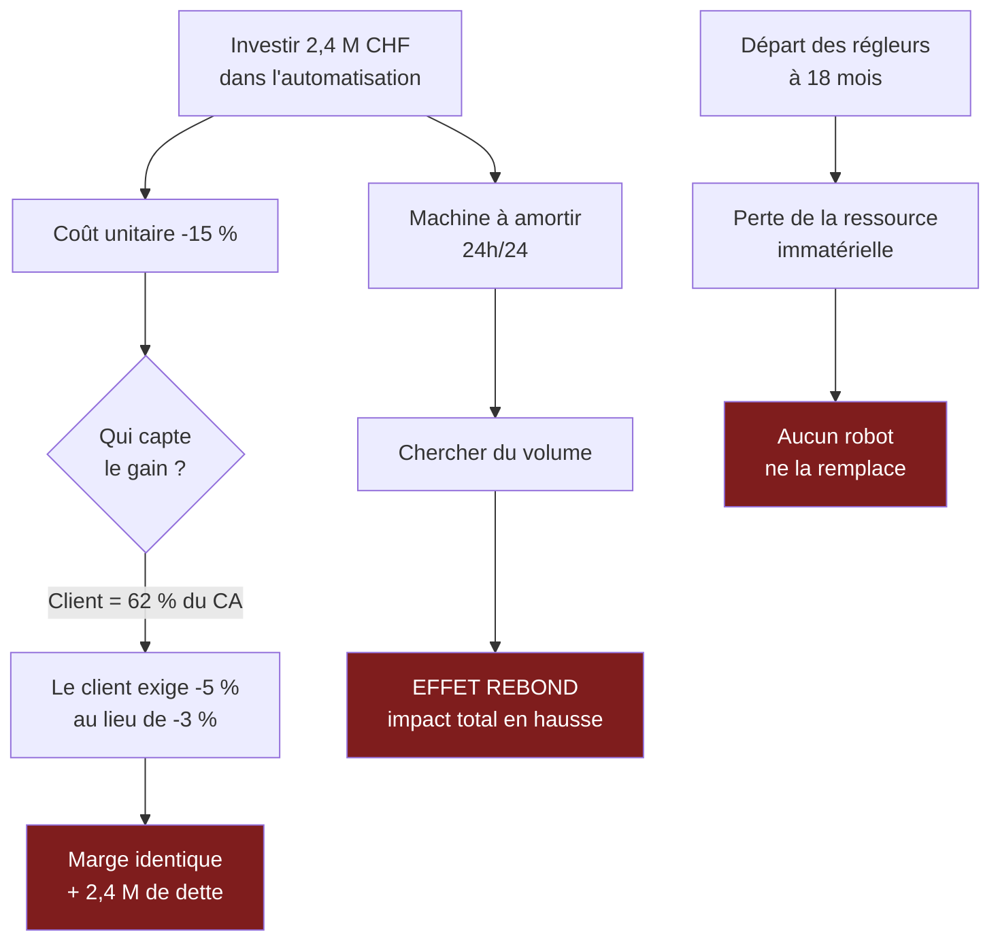

> ⬅ — · [[00_Index_Mises_en_situation|🗂 Index]] · [[CAS02_La_start-up_SaaS_qui_decouvre_ses_externalites]] ➡

# CAS 1 — Le sous-traitant horloger qui veut automatiser

> **L'entreprise.** *Décolletage Vallée SA*, Vallée de Joux. PME industrielle de **48 salariés**, fondée en 1974, transmise à la troisième génération. Elle usine des composants de mouvements (pignons, arbres, barillets) pour trois grandes maisons horlogères. **Chiffre d'affaires : 11 M CHF**, dont **62 % réalisés avec un seul client**. Ses machines à commande numérique ont entre 8 et 15 ans. Le carnet de commandes est plein, mais les marges s'érodent : les donneurs d'ordre exigent −3 % de prix par an. Deux concurrents ont installé des lignes robotisées fonctionnant la nuit sans opérateur. La moyenne d'âge des régleurs est de 54 ans et deux départs à la retraite sont prévus dans 18 mois.
>
> **La question posée.**
> *« La direction envisage d'investir 2,4 M CHF dans une ligne de production automatisée fonctionnant 24 h/24. Analysez cette option et formulez une recommandation. »*

---

## 🧩 Les notions clés

- **Chaîne de valeur** de Porter (activités principales / de soutien, marge)
- **Ressources matérielles et immatérielles** (diagnostic interne)
- **Avantage concurrentiel durable** (sens A : qui dure)
- **Pouvoir de négociation des clients** (force de Porter)
- **Effet rebond** (appliqué à la capacité de production)
- **Grille SAF** (souhaitabilité, acceptabilité, faisabilité)
- **Tension court terme / long terme**

## 📖 Définitions pour les nuls

| Notion | En une phrase simple |
|---|---|
| **Chaîne de valeur** | On découpe l'entreprise en 9 activités pour voir dans laquelle elle est bonne, dans laquelle elle est mauvaise 📘 |
| **Ressource matérielle** | Ce qui se touche et s'achète : machines, argent, bâtiments 📘 |
| **Ressource immatérielle** | Ce qui ne se touche pas : savoir-faire, réputation, organisation 📘 |
| **Avantage concurrentiel durable** | Une raison d'être meilleur que les autres, et qui résiste à la copie 📘 |
| **Pouvoir de négociation des clients** | Quand un client peut imposer ses conditions parce qu'on dépend de lui 📘 |
| **Effet rebond** | Quand un gain d'efficacité est mangé par une hausse du volume 🔎 |
| **SAF** | Un test en trois questions avant de se lancer : est-ce utile, acceptable, possible ? 📘 |

## 🔍 Décorticage de la consigne (L-I-S-A-E-C)

**L — Lire.** Deux verbes : « **analysez** » puis « **formulez une recommandation** ». « Analysez » impose de **mobiliser un outil** — on ne donne pas un avis, on décompose avec un cadre. « Formulez une recommandation » impose de **trancher** : une réponse qui finit par « cela dépend » échoue.

⚠️ Le piège est dans les chiffres du contexte. **62 % du chiffre d'affaires avec un seul client** n'est pas un détail décoratif : c'est la donnée la plus importante de l'énoncé, et c'est celle que l'étudiant moyen ignore parce qu'elle ne parle pas d'automatisation.

**I — Identifier.** Trois chapitres à croiser :

| Le mot de l'énoncé | Le chapitre qu'il appelle |
|---|---|
| « ligne de production », « machines » | **Chaîne de valeur** (activité principale n°2) 📘 |
| « 62 % avec un seul client », « −3 % par an » | **Porter** — pouvoir de négociation des clients 📘 |
| « départs à la retraite », « régleurs » | **Ressources immatérielles** — le savoir-faire 📘 |
| « 2,4 M CHF » | **SAF**, volet faisabilité 📘 |

**S — Structurer.** Le plan en trois temps :

1. **Où le problème se situe-t-il réellement ?** (diagnostic — et il n'est pas là où on croit)
2. **Que fait l'automatisation, et que ne fait-elle pas ?**
3. **Recommandation filtrée par le SAF.**

**E — Étendre.** Le pont à placer : automatisation → effet rebond → mais ici transposé à la **capacité industrielle**, pas à l'énergie. C'est ce transfert qui montre que vous avez compris le mécanisme et pas seulement mémorisé l'exemple.

**C — Conclure.** Trancher, et nommer la tension : investir dans la machine (visible, chiffrable) contre investir dans la transmission du savoir-faire (invisible, non chiffrable).

## 🧠 Le raisonnement stratégique (D-E-I)

### Axe 1 — Le vrai problème n'est pas la productivité, c'est la dépendance

**D — Définir.** 📘 Le **pouvoir de négociation des clients** est l'une des cinq forces de Porter. Il est d'autant plus fort que les clients sont **concentrés** et que le fournisseur a peu d'alternatives.

**E — Expliquer le mécanisme.** Quand un client représente 62 % de votre activité, ce n'est plus un client : c'est votre condition de survie. Il le sait. Il peut donc imposer une baisse de prix annuelle sans risque, parce que refuser signifie fermer.

🔎 Et voici le raisonnement décisif : **si l'entreprise automatise et baisse ses coûts, à qui profite le gain ?** Pas à elle. Le client, voyant que le fournisseur peut produire moins cher, exigera −5 % au lieu de −3 %. Le gain de productivité est **capté par celui qui a le pouvoir de négociation**.

**I — Illustrer.** Décolletage Vallée investit 2,4 M CHF, gagne 15 % de coût unitaire, et se retrouve dans deux ans avec la même marge, une dette de 2,4 M et une dépendance identique. Elle a payé pour améliorer la rentabilité de son client.

### Axe 2 — L'automatisation touche une case, le savoir-faire en traverse neuf

**D — Définir.** 📘 La chaîne de valeur distingue les **activités principales** (qui touchent le produit) et les **activités de soutien**, dont l'impact est « **transversal** sur toutes les unités et sections ».

**E — Expliquer.** L'automatisation agit sur une seule case : **la production**. Or les régleurs qui partent à la retraite relèvent de la case **ressources humaines**, qui est une activité de soutien — donc transversale.

🔎 Conséquence : leur départ ne dégrade pas seulement la production. Il dégrade la qualité, donc le service, donc la relation client, donc le marketing. **La case qui pose problème n'est pas celle où le problème se voit.**

**I — Illustrer.** Une ligne robotisée ne sait pas diagnostiquer une dérive de cote à l'oreille, ni décider qu'un lot passe malgré un écart de 2 microns. Ce jugement-là est une **ressource immatérielle** — 📘 « peu transférable, donc peu imitable, donc durable ». C'est précisément ce que l'entreprise est en train de perdre, et ce qu'aucun robot ne remplace.

### Axe 3 — L'effet rebond industriel

**D — Définir.** 🔎 L'**effet rebond** : un gain d'efficacité rend l'usage moins coûteux, donc plus fréquent, et le volume supplémentaire mange le gain.

**E — Expliquer.** Transposé à l'industrie : une ligne qui tourne 24 h/24 doit être **amortie**. Une machine à 2,4 M CHF arrêtée coûte de l'argent. La direction va donc chercher du volume pour la remplir.

🔎 Résultat en chaîne : pour remplir la ligne, on accepte des commandes à marge plus faible ; pour les obtenir, on baisse les prix ; on augmente donc la production totale, la consommation d'énergie, de matière et de fluides de coupe. **L'efficacité par pièce a monté. L'impact total a monté aussi.**

**I — Illustrer.** Décolletage Vallée produit aujourd'hui 900 000 pièces/an. Avec la nouvelle ligne, elle en produira 1,6 million pour rentabiliser l'outil — dont 400 000 à marge quasi nulle, acceptées uniquement pour ne pas laisser la machine tourner à vide.

## ⚖️ L'arbitrage et la recommandation (filtre SAF)

📘 Rappel du cours : « bien qu'une évaluation après coup soit plus aisée […], il est bien tard pour opérer des corrections ».

| Critère | Analyse | Verdict |
|---|---|---|
| **S — Souhaitabilité** | L'objectif réel est de **sortir de la dépendance** et de **préserver le savoir-faire**. L'automatisation ne sert ni l'un ni l'autre. | ❌ **Échoue** |
| **A — Acceptabilité** | 📘 Retour attendu ? Absorbé par le client. Risque ? 2,4 M de dette avec 62 % de dépendance = risque majeur. Opposition ? Les régleurs de 54 ans verront une menace, juste avant qu'on ait besoin d'eux pour transmettre. | ❌ **Échoue** |
| **F — Faisabilité** | Financièrement possible, mais les compétences de maintenance robotique n'existent pas dans l'entreprise. | ⚠️ **Fragile** |

### 🔎 La recommandation

> **Ne pas investir 2,4 M CHF dans l'automatisation intégrale. Réallouer environ 600 000 CHF sur trois axes, dans cet ordre :**
>
> 1. **Un programme de transmission du savoir-faire** (binômes régleur senior / apprenti sur 18 mois, documentation des tours de main). C'est la seule action qui protège la ressource immatérielle avant qu'elle ne sorte par la porte.
> 2. **Une automatisation ciblée** sur les seules opérations répétitives sans jugement (chargement, contrôle dimensionnel), qui libère du temps de régleur au lieu de le remplacer.
> 3. **Un plan de diversification client** visant à ramener le premier client sous 40 % en cinq ans, même au prix d'une marge plus faible sur les nouveaux comptes.

⚠️ **La tension à nommer explicitement à l'oral** : l'automatisation est **visible, chiffrable et rassurante** ; la transmission du savoir-faire est **invisible, non chiffrable et lente**. C'est exactement pour cette raison que la première est choisie et la seconde négligée. Un dirigeant se juge sur ce qu'il inaugure, pas sur ce qu'il préserve.

## ⚠️ Le piège classique

**L'erreur type :** répondre à la question posée. L'énoncé demande d'analyser l'automatisation, donc l'étudiant analyse l'automatisation — coûts, gains de productivité, retour sur investissement. Il produit un exposé correct et passe complètement à côté.

**Pourquoi c'est une erreur :** une bonne analyse stratégique commence par **requalifier le problème**. Ici, l'automatisation est une **solution proposée**, pas un problème. Le problème est ailleurs (dépendance + perte de savoir-faire), et l'accepter tel quel revient à valider un diagnostic qu'on n'a pas fait.

**Comment l'esquiver :** ouvrez systématiquement par une phrase du type *« Avant d'évaluer cette option, je vais vérifier à quel problème elle répond. »* Puis relisez l'énoncé en cherchant **les chiffres qu'on vous donne sans que la question ne les mentionne** : ils sont là exprès.

**Second piège, plus discret :** oublier que le gain de productivité est **capté par le client** quand celui-ci a le pouvoir de négociation. Beaucoup d'étudiants raisonnent comme si l'entreprise gardait ses économies. Elle ne les garde que si personne ne peut les lui prendre.

---

## 🗺️ Visuels de synthèse

### La chaîne de raisonnement



### Le chiffre qui tranche

```
Volume produit avant / après l'automatisation   (illustratif)

Aujourd'hui   ███████████████████                900 000 pièces
Après         ██████████████████████████████   1 600 000 pièces
              └──────── dont 400 000 à marge quasi nulle ────┘
              acceptées uniquement pour ne pas laisser
              la machine tourner à vide
```

⚠️ Graphique **illustratif** : les proportions servent le raisonnement, elles ne sont pas des données mesurées.

---

## 🔗 Navigation

⬅ — · [[00_Index_Mises_en_situation|🗂 Index des 27 cas]] · [[CAS02_La_start-up_SaaS_qui_decouvre_ses_externalites]] ➡
