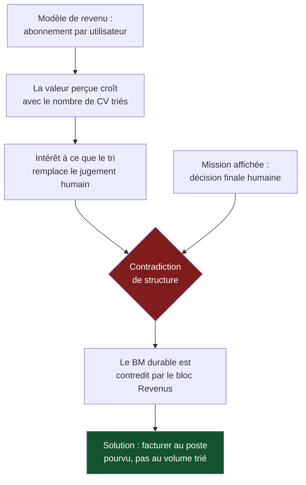

> ⬅ [[CAS01_Le_sous-traitant_horloger_qui_veut_automatiser]] · [[00_Index_Mises_en_situation|🗂 Index]] · [[CAS03_La_caisse_maladie_qui_ferme_ses_guichets]] ➡

# CAS 2 — La start-up SaaS qui découvre ses externalités

> **L'entreprise.** *Talenzo*, start-up genevoise de **26 salariés**, créée il y a 4 ans. Elle édite un logiciel de recrutement en mode SaaS : ses clients (des PME romandes) publient une annonce, et un système d'intelligence artificielle classe automatiquement les candidatures par « score de compatibilité ». **ARR : 3,1 M CHF**, croissance de 60 %/an. Le modèle est un abonnement mensuel par utilisateur. L'infrastructure tourne chez un hyperscaler américain. Les modèles sont réentraînés chaque semaine sur l'ensemble des candidatures traitées. Un fonds d'investissement propose 8 M CHF pour accélérer, à condition d'atteindre 10 M d'ARR en trois ans.
>
> **La question posée.**
> *« Le fonds exige une "trajectoire ESG" avant d'investir. Transformez le business model de Talenzo en business model durable et identifiez les tensions que cette transformation provoque. »*

---

## 🧩 Les notions clés

- **Business Model Canvas (BMC)** — les 9 blocs 📘
- **Business Model durable** — mission, impacts positifs, externalités négatives 📘
- **Métamorphose du BMC** 📘
- **Externalités négatives** et leur localisation
- **Sobriété numérique** et coût du numérique
- **Tension court terme / long terme**
- **Greenwashing** (risque de la démarche)

## 📖 Définitions pour les nuls

| Notion | En une phrase simple |
|---|---|
| **SaaS** | Un logiciel qu'on loue en ligne au lieu de l'acheter et de l'installer |
| **BMC** | Un tableau de 9 cases qui décrit comment une entreprise gagne de l'argent 📘 |
| **BM durable** | Le même tableau, plus trois cases : pourquoi on existe, ce qu'on apporte de bon, ce qu'on abîme 📘 |
| **Externalité négative** | Un dégât réel causé par l'entreprise, que quelqu'un d'autre paie 🔎 |
| **ESG** | Environnement, Social, Gouvernance : la grille par laquelle les investisseurs notent la responsabilité d'une entreprise 📚 |
| **Greenwashing** | Communiquer une vertu qu'on n'a pas 📘 |

## 🔍 Décorticage de la consigne (L-I-S-A-E-C)

**L — Lire.** Le verbe est « **transformez** » — c'est un verbe de **production**, pas de description. On attend un travail bloc par bloc, pas un discours général sur la durabilité. Et le second membre — « identifiez les tensions » — interdit une réponse enthousiaste : on attend explicitement ce qui **coince**.

**I — Identifier.** ⚠️ Le piège majeur de ce cas : l'énoncé parle de logiciel, donc l'étudiant part sur les data centers et l'empreinte carbone. Or **les externalités les plus graves de Talenzo sont sociales, pas écologiques** : un algorithme qui trie des candidatures peut reproduire des discriminations à grande échelle.

📘 Rappel qui débloque : la durabilité, c'est « satisfaire les besoins **de tous les individus**, aujourd'hui et demain, ici et ailleurs, dans le respect des limites planétaires ». Le social est dans la définition.

**S — Structurer.**
1. Où sont les externalités de Talenzo ? (les chercher là où on ne regarde pas)
2. La métamorphose bloc par bloc
3. Les trois tensions que cela crée

**E — Étendre.** Ponts disponibles : RNE (axe sociétal et technologique), AI Act 📚, sobriété numérique, accessibilité.

**C — Conclure.** Nommer le risque central : une trajectoire ESG imposée par un investisseur produit du **greenwashing** par défaut, parce que l'objectif réel est de débloquer 8 M, pas d'améliorer quoi que ce soit.

## 🧠 Le raisonnement stratégique (D-E-I)

### Axe 1 — Localiser les externalités : elles ne sont pas où l'on croit

**D — Définir.** 📘 Une **externalité négative** est un impact que l'entreprise cause sans le payer. 📘 Dans un business model, elle se cache le plus souvent dans la **structure de coûts** — sous forme de coûts **absents**.

**E — Expliquer.** Le test : pour chaque bloc du BMC, demander *« qui paie ce que nous ne payons pas ? »*

**I — Illustrer.** Chez Talenzo :

| Bloc du BMC | L'externalité cachée | Qui la paie |
|---|---|---|
| Activités clés (scoring IA) | **Discrimination algorithmique** : le modèle apprend sur les recrutements passés, donc reproduit leurs biais | Les candidats écartés sans savoir pourquoi |
| Ressources clés (données) | Des candidatures utilisées pour l'entraînement, sans que le candidat en soit informé | Les candidats, en perte de contrôle sur leurs données |
| Ressources clés (infrastructure) | Énergie et eau des data centers ; réentraînement hebdomadaire coûteux | Les territoires hôtes |
| Canaux (interface web) | Interface non accessible → exclusion des candidats en situation de handicap | Ces candidats |
| Partenaires (hyperscaler US) | Dépendance et transfert de données hors de Suisse | Les clients PME, en cas de litige |

🔎 **Le point qui fait la différence à l'oral** : les quatre premières lignes ne coûtent rien à Talenzo aujourd'hui. C'est exactement pour ça qu'elles n'apparaissent nulle part dans son BMC — et exactement pour ça qu'elles constituent un risque.

### Axe 2 — La métamorphose bloc par bloc

**D — Définir.** 📘 La **métamorphose du BMC** consiste à réécrire chaque bloc traditionnel en version durable. 📘 Le BM durable ajoute trois éléments : **mission / raison d'être**, **impacts positifs**, **externalités négatives**.

**E — Expliquer.** ⚠️ Ce n'est pas un exercice cosmétique. Chaque bloc réécrit implique un **coût réel** ou un **renoncement**. Un bloc réécrit sans coût est un bloc non réécrit.

**I — Illustrer.**

| Bloc | Version actuelle | Version durable | Ce que ça coûte |
|---|---|---|---|
| **Proposition de valeur** | « Trier 200 CV en 3 minutes » | « Élargir le vivier et objectiver la décision, décision finale humaine » | Argument de vente moins spectaculaire |
| **Segments** | PME romandes | Idem + engagement à ne pas vendre aux secteurs à fort risque discriminatoire | Marché adressable réduit |
| **Activités clés** | Scoring automatique | Scoring + **audit de biais trimestriel** + explicabilité de chaque score | ~120 k CHF/an |
| **Ressources clés** | Données de candidatures | Données **minimisées**, consentement explicite, anonymisation à l'entraînement | Modèle un peu moins performant |
| **Partenaires** | Hyperscaler US | Hébergeur suisse ou européen | +30 % sur l'infrastructure |
| **Canaux** | Interface web | Interface conforme **WCAG / POUR** 📘 | ~80 k CHF de refonte |
| **Structure de coûts** | Cloud + salaires | + audit, + conformité, + hébergement local | Marge brute en baisse |
| **Revenus** | Abonnement par utilisateur | ⚠️ à revoir : voir axe 3 | — |
| **➕ Mission** | *(absente)* | « Rendre le recrutement plus juste, pas seulement plus rapide » | Engageant : on sera jugé dessus |
| **➕ Impacts positifs** | *(absents)* | Élargissement du vivier, traçabilité des décisions | Mesurable, donc opposable |
| **➕ Externalités négatives** | *(cachées)* | Biais résiduels, empreinte de réentraînement, dépendance cloud | ⚠️ **Les écrire, c'est s'exposer** |

### Axe 3 — La tension que personne ne voit : le modèle de revenus

**D — Définir.** 🔎 Rappel du mécanisme de l'**effet rebond** appliqué aux modèles économiques : quand une entreprise gagne de l'argent **proportionnellement au volume d'usage**, son intérêt est d'augmenter ce volume.

**E — Expliquer.** Talenzo facture **par utilisateur et par mois**, et sa valeur perçue croît avec le nombre de CV traités. Elle a donc intérêt à ce que ses clients traitent **plus** de candidatures — donc à ce que le tri automatique remplace de plus en plus le jugement humain.

🔎 **C'est une contradiction de structure, pas un problème de bonne volonté.** La mission dit « décision finale humaine » ; le modèle de revenus récompense l'inverse.

**I — Illustrer.** Deux issues possibles pour Talenzo :

- **Facturation au poste pourvu** plutôt qu'au volume traité : l'entreprise gagne quand un recrutement réussit, pas quand beaucoup de CV sont écartés. Alignement rétabli.
- **Abonnement forfaitaire** décorrélé du volume : moins élégant, mais supprime l'incitation.

⚠️ Aucune des deux n'est neutre : les deux réduisent le revenu à court terme. C'est précisément ce qui rend la question stratégique et non technique.

## ⚖️ L'arbitrage et la recommandation (filtre SAF)

### Analyse à double sens du numérique 🔎

| Le numérique **soutient** la durabilité chez Talenzo | Le numérique **freine** la durabilité chez Talenzo |
|---|---|
| Il rend les décisions **traçables** : chaque score est enregistré, donc auditable — ce qu'un tri manuel ne permet pas | Il **industrialise le biais** : un recruteur biaisé lit 200 CV ; un algorithme biaisé en filtre 200 000 |
| Il **élargit le vivier** : on peut examiner des profils qu'on n'aurait jamais lus | Il crée une **exclusion invisible** : le candidat écarté n'apprend jamais pourquoi |
| Il permet de **mesurer** la diversité des embauches | Réentraînement hebdomadaire = coût énergétique récurrent et croissant |
| Dématérialisation du processus | **Effet rebond** : le tri devenu gratuit, on ouvre les annonces à des milliers de candidats qu'on n'aurait pas sollicités |

🔎 **La synthèse à formuler** : le numérique ne change pas la nature du problème (le recrutement a toujours été biaisé), il en change **l'échelle et la visibilité**. Il aggrave l'ampleur et facilite simultanément le contrôle. Ce qui décide, c'est lequel des deux on outille.

### Le SAF

| Critère | Analyse | Verdict |
|---|---|---|
| **S** | Une trajectoire ESG crédible sert la mission, ouvre les marchés publics et les grands comptes, et protège d'un durcissement réglementaire (📚 AI Act : les systèmes de recrutement sont classés à **risque élevé**) | ✅ **Passe** |
| **A** | 📘 Retour ? Différé. Risque ? Écrire ses externalités, c'est s'exposer. Opposition ? Le fonds veut 10 M d'ARR en 3 ans — la conformité ralentit | ❌ **C'est ici que ça bloque** |
| **F** | 26 salariés, aucune compétence interne en audit d'équité algorithmique. Recrutement ou partenariat externe nécessaires | ⚠️ **Fragile mais surmontable** |

### 🔎 La recommandation

> **Accepter l'investissement, mais renégocier le critère de performance.** Substituer à l'objectif unique « 10 M d'ARR en 3 ans » un double objectif : **8 M d'ARR + conformité auditée par un tiers indépendant**.
>
> **Le raisonnement à défendre** : un système de recrutement automatisé est classé à risque élevé par la réglementation européenne à venir 📚. Une non-conformité découverte à 10 M d'ARR détruit plus de valeur qu'une croissance ralentie n'en coûte. La conformité n'est pas un frein à la valorisation — c'est ce qui la rend **conservable**.
>
> **Priorité n°1 sur 12 mois** : l'audit de biais et l'explicabilité. Priorité n°2 : l'accessibilité de l'interface. Priorité n°3 seulement : la relocalisation de l'hébergement, qui coûte cher pour un gain moins critique.

## ⚠️ Le piège classique

**L'erreur type n°1 — chercher l'écologie et manquer le social.** L'énoncé dit « numérique », l'étudiant dit « data centers ». Il produit une réponse honorable sur l'empreinte carbone et rate la discrimination algorithmique, qui est l'externalité principale. **Réflexe correctif :** face à toute entreprise du numérique, balayer les **quatre axes de la RNE** 📘 — économique, technologique, environnemental, **sociétal** — et pas seulement le troisième.

**L'erreur type n°2 — la métamorphose gratuite.** Réécrire les neuf blocs en ajoutant l'adjectif « durable » devant chacun : « ressources durables », « canaux responsables ». Ça ne coûte rien, donc ça ne vaut rien. **Réflexe correctif :** pour chaque bloc réécrit, chiffrez ou nommez le **renoncement**. Sans renoncement, c'est du greenwashing.

**L'erreur type n°3 — oublier le bloc « revenus ».** C'est le bloc que tout le monde laisse intact, alors que c'est celui qui commande le comportement de l'entreprise. Un BM durable dont le modèle de revenus récompense encore le volume n'est pas durable : il est **contradictoire**.

---

## 🗺️ Visuels de synthèse

### La chaîne de raisonnement



### Le chiffre qui tranche

```
Où sont les externalités de Talenzo ?   (illustratif)

Discrimination algorithmique  ████████████████████  MAJEURE
Données d'entraînement        ███████████           forte
Accessibilité de l'interface  ███████               moyenne
Énergie des data centers      █████                 modérée
                              ▲
                              └── là où l'étudiant moyen
                                  regarde en premier
```

⚠️ Graphique **illustratif** : les proportions servent le raisonnement, elles ne sont pas des données mesurées.

---

## 🔗 Navigation

⬅ [[CAS01_Le_sous-traitant_horloger_qui_veut_automatiser]] · [[00_Index_Mises_en_situation|🗂 Index des 27 cas]] · [[CAS03_La_caisse_maladie_qui_ferme_ses_guichets]] ➡
