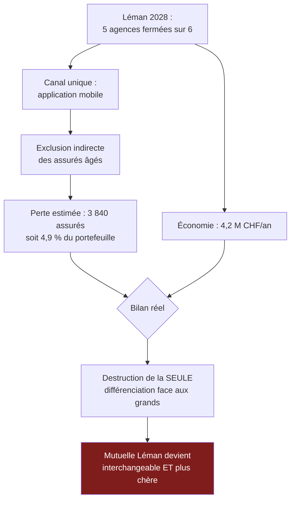

> ⬅ [[CAS02_La_start-up_SaaS_qui_decouvre_ses_externalites]] · [[00_Index_Mises_en_situation|🗂 Index]] · [[CAS04_Lepicerie_bio_prise_en_tenaille]] ➡

# CAS 3 — La caisse maladie qui ferme ses guichets

> **L'entreprise.** *Mutuelle Léman*, caisse maladie régionale, **190 collaborateurs**, 78 000 assurés en Suisse romande. Structure historique, fondée en 1948. Elle exploite encore **6 agences physiques** et un centre d'appels de 22 personnes. Ses coûts administratifs représentent 6,1 % des primes, contre 4,3 % pour les trois grands assureurs nationaux qui la concurrencent sur les mêmes cantons. Un projet baptisé « Léman 2028 » prévoit la fermeture de 5 agences sur 6, la réduction du centre d'appels à 8 personnes et le basculement de 90 % des interactions vers une application mobile et un chatbot. Économie annoncée : **4,2 M CHF/an**. **41 % des assurés de Mutuelle Léman ont plus de 65 ans** — c'est sa spécificité historique et la raison de sa réputation.
>
> **La question posée.**
> *« Évaluez le projet "Léman 2028" en croisant diagnostic interne et externe. Le risque est-il juridique ou stratégique ? »*

---

## 🧩 Les notions clés

- **Chaîne de valeur** (canaux, services, relation client)
- **Ressources immatérielles** — réputation 📘
- **Accessibilité numérique** et principes **WCAG / POUR** 📘
- **Exclusion indirecte** 📘
- **RNE** — axe sociétal 📘
- **Risque stratégique vs risque juridique** 📘
- **Matrice parties prenantes intérêt × pouvoir** 📘
- **Avantage concurrentiel durable**

## 📖 Définitions pour les nuls

| Notion | En une phrase simple |
|---|---|
| **Accessibilité numérique** | Faire en sorte qu'un service en ligne soit utilisable par **tout le monde**, y compris les personnes âgées ou handicapées 📘 |
| **POUR** | Les 4 principes WCAG : **P**erceptible, **U**tilisable, **C**ompréhensible, **R**obuste 📘 |
| **Exclusion indirecte** | Un service parfaitement légal exclut quand même toute une population, sans que personne ne l'ait voulu 📘 |
| **RNE** | Responsabilité numérique des entreprises : 4 axes — économique, technologique, environnemental, sociétal 📘 |
| **Risque stratégique** | Aucune loi n'est enfreinte, mais on perd des clients, sa réputation et son marché 📘 |
| **Ressource immatérielle** | Ce qui ne s'achète pas et ne se copie pas vite : ici, 76 ans de confiance 📘 |

## 🔍 Décorticage de la consigne (L-I-S-A-E-C)

**L — Lire.** Deux consignes emboîtées. « **Évaluez** » = porter un jugement argumenté. Et la question fermée — « juridique ou stratégique ? » — est **une invitation à réutiliser une formule du cours** : 📘 *« Le risque n'est pas juridique mais stratégique. »*

⚠️ Mais attention : reprendre la formule sans la démontrer ne vaut rien. Il faut **montrer** pourquoi la légalité ne protège pas.

**I — Identifier.** Le croisement demandé est explicite : « interne **et** externe ».

| Interne | Externe |
|---|---|
| Coûts administratifs à 6,1 % (faiblesse) | Trois grands assureurs à 4,3 % (rivalité) |
| Réseau d'agences (ressource matérielle coûteuse) | Vieillissement démographique (PESTEL — S) |
| Réputation auprès des seniors (ressource immatérielle) | Réglementation accessibilité (PESTEL — L) |
| 41 % d'assurés > 65 ans (à qualifier : force ou faiblesse ?) | Substituts : assurances 100 % digitales |

🔎 **La question la plus intéressante de ce cas** : les 41 % de seniors sont-ils une **force** ou une **faiblesse** ? La réponse — c'est les deux, et c'est exactement là que se joue la stratégie.

**S — Structurer.**
1. Le diagnostic croisé : la vraie nature des 41 %
2. Ce que le projet détruit sans le voir
3. Juridique ou stratégique : la démonstration
4. Recommandation

**C — Conclure.** Trancher sur un scénario alternatif chiffré, pas sur un « il faudrait faire attention ».

## 🧠 Le raisonnement stratégique (D-E-I)

### Axe 1 — Les 41 % : faiblesse comptable, force stratégique

**D — Définir.** 📘 Une **force** est interne. 📘 Une **ressource immatérielle** — réputation, relation, marque — fonde un avantage durable parce qu'elle est « peu transférable, donc peu imitable ».

**E — Expliquer.** Une population âgée coûte plus cher à servir : elle téléphone, elle vient au guichet, elle envoie des documents papier. C'est ce que voit le contrôle de gestion, et c'est vrai.

🔎 Mais c'est aussi une position que **personne ne peut copier rapidement**. Les trois grands assureurs sont structurellement mal placés pour servir cette clientèle : leurs process sont taillés pour du volume digital. Mutuelle Léman occupe donc un espace concurrentiel réel.

**I — Illustrer.** Reformulation à donner à l'oral :

> *« Les 6,1 % de coûts administratifs ne sont pas une inefficacité : ce sont les coûts d'une proposition de valeur différente. Comparer Mutuelle Léman aux grands assureurs sur ce ratio revient à reprocher à un restaurant de ne pas avoir les coûts d'un distributeur automatique. »*

⚠️ **Nuance obligatoire** : cela ne veut pas dire que 6,1 % est acceptable indéfiniment. L'écart de 1,8 point est réel et pèse sur les primes. La question n'est pas *faut-il réduire les coûts* mais **où** les réduire.

### Axe 2 — Ce que le projet détruit sans le voir

**D — Définir.** 📘 L'**exclusion indirecte** : un service légal et performant exclut de fait une population, sans intention discriminatoire.

**E — Expliquer le mécanisme, en trois temps.**

1. On ferme 5 agences sur 6 et on réduit le centre d'appels de 22 à 8 personnes.
2. Le canal restant est une application mobile. Or une part des assurés de plus de 75 ans n'a pas de smartphone récent, ou ne parvient pas à s'authentifier, ou a une acuité visuelle insuffisante.
3. 📘 Ils ne sont pas exclus par une décision. Ils sont exclus par un **défaut de conception** : on a conçu pour un utilisateur type, et cet utilisateur n'est pas le leur.

🔎 **L'effet pervers** : plus l'application est efficace pour ceux qui l'utilisent, plus la pression économique pousse à fermer le dernier guichet — donc plus ceux qui restent dehors sont pénalisés. **L'efficacité aggrave l'exclusion.**

**I — Illustrer.** 📘 Le cas SilverDigital du cours a documenté exactement ce mécanisme : **−12 % de clients de plus de 65 ans** après une bascule tout-numérique. Appliqué ici : 41 % × 78 000 = 32 000 assurés seniors. Une perte de 12 % représente **3 840 assurés**, soit environ 4,9 % du portefeuille total.

⚠️ Et une caisse maladie perd ses assurés de façon particulièrement brutale : le changement se fait **une fois par an, au 30 novembre, sans frais**. Il n'y a aucune friction de sortie.

### Axe 3 — Juridique ou stratégique : la démonstration

**D — Définir.** 📘 Le principe du cas SilverDigital : *« Aucune loi n'est enfreinte, mais la perte de clientèle, de réputation et de marché constitue un risque stratégique majeur. »*

**E — Expliquer.** Il faut poser les deux volets séparément.

**Le volet juridique** — il existe, mais il est faible et lent :

📘 Les références d'accessibilité du cours : l'**European Accessibility Act** (juin 2025), la norme suisse **eCH-0059**, la révision de la **LHand**. 📘 Ces textes contraignent d'abord le secteur public et progressivement certains services privés. Une caisse maladie privée en Suisse n'est pas frontalement hors la loi en fermant des guichets.

⚠️ 🔎 Mais : la contrainte se resserre, et surtout elle se resserre **par paliers brutaux** — un texte n'existe pas, puis il existe. Miser sur l'absence actuelle d'obligation, c'est parier que rien ne bougera.

**Le volet stratégique** — il est immédiat et massif :

| Ce qui est détruit | Pourquoi c'est stratégique |
|---|---|
| La ressource immatérielle « confiance des seniors » | 76 ans à construire, un exercice à perdre — et **non reconstituable** |
| La seule différenciation face aux grands assureurs | Sans elle, Mutuelle Léman devient un petit acteur générique moins efficace que les grands |
| Le bouche-à-oreille intergénérationnel | Les enfants conseillent leurs parents, et inversement |

**I — Illustrer.** 🔎 Le raisonnement décisif à formuler :

> *« Mutuelle Léman ne devient pas illégale. Elle devient interchangeable. Et une caisse interchangeable qui coûte plus cher que les grandes n'a aucune raison d'exister. Le projet économise 4,2 M en supprimant ce qui justifiait l'entreprise. »*

## ⚖️ L'arbitrage et la recommandation (filtre SAF)

### La matrice parties prenantes 📘

📘 Rappel : l'acceptabilité se teste avec l'analyse des parties prenantes (intérêt × pouvoir).

| Partie prenante | Intérêt | Pouvoir | Stratégie 📘 |
|---|---|---|---|
| Assurés seniors | **Fort** | **Fort** (ils partent sans frais au 30.11) | **Gérer de près** |
| Conseil d'administration | Fort | Fort | Gérer de près |
| Collaborateurs des agences | Fort | Faible | Informer |
| Autorité de surveillance | Faible aujourd'hui | Fort potentiellement | Surveiller |
| Assurés jeunes | Faible | Moyen | Informer |

⚠️ La case décisive : les seniors sont **fort intérêt / fort pouvoir**. C'est le quadrant où l'on ne passe jamais en force. Le projet « Léman 2028 » traite pourtant cette population comme si elle était sans pouvoir.

### Le SAF

| Critère | Analyse | Verdict |
|---|---|---|
| **S** | Réduire les coûts est légitime. Mais le faire en détruisant la seule différenciation contredit la mission et le positionnement | ❌ **Échoue sur la forme retenue** |
| **A** | 📘 Retour ? 4,2 M économisés contre ~3 840 assurés perdus (≈ 4,9 % des primes) : le calcul est probablement négatif. Risque ? Réputationnel majeur. Opposition ? Le quadrant le plus dangereux de la matrice | ❌ **Échoue** |
| **F** | Techniquement faisable, mais l'accessibilité de l'application n'est pas au niveau **POUR** 📘 | ⚠️ **Fragile** |

### 🔎 La recommandation : un scénario hybride

> **Rejeter « Léman 2028 » dans sa forme actuelle. Lui substituer un scénario hybride :**
>
> 1. **Conserver 3 agences sur 6** (au lieu d'une), positionnées géographiquement selon la densité d'assurés de plus de 70 ans, pas selon le loyer.
> 2. **Maintenir le centre d'appels à 15 personnes** (au lieu de 8) et en faire un **argument commercial**, pas un coût résiduel : « chez nous, quelqu'un décroche ».
> 3. **Développer l'application, mais conforme WCAG / POUR dès la conception** 📘 — contraste, taille de police, navigation au clavier, compatibilité lecteur d'écran.
> 4. **Chercher les 4,2 M ailleurs** : automatisation du **back-office** (traitement des factures, rapprochements, relances), qui est invisible pour l'assuré. 🔎 C'est le point le plus important de la recommandation.

⚠️ **La distinction à marteler à l'oral** : automatiser le **back-office** ≠ automatiser le **front-office**. Le premier réduit les coûts sans toucher à la relation. Le second réduit les coûts **en** détruisant la relation. Les deux figurent dans la même ligne budgétaire et n'ont rien à voir stratégiquement.

**L'économie attendue du scénario hybride** : environ 2,6 M CHF/an au lieu de 4,2 M — pour un risque de perte de portefeuille divisé par cinq. 🔎 C'est un arbitrage explicite, pas un compromis mou : on renonce à 1,6 M de gain certain pour éviter une perte probable bien supérieure.

## ⚠️ Le piège classique

**L'erreur type n°1 — traiter l'accessibilité comme un sujet moral.** L'étudiant dit « il faut penser aux personnes âgées, c'est important ». C'est vrai, et ça ne vaut aucun point : ce n'est pas un argument stratégique. **Réflexe correctif :** traduisez toujours l'accessibilité en **risque de portefeuille chiffré**. 📘 La formule du cours existe pour ça : *« le risque n'est pas juridique mais stratégique »*.

**L'erreur type n°2 — accepter la comparaison de ratios.** 6,1 % contre 4,3 % : l'étudiant conclut à l'inefficacité. Mais on ne compare des ratios que **toutes choses égales par ailleurs**, et ici les propositions de valeur diffèrent. **Réflexe correctif :** avant de comparer deux chiffres, demandez-vous s'ils mesurent la même chose.

**L'erreur type n°3 — oublier que les seniors ont du pouvoir.** On les classe spontanément en « fort intérêt / faible pouvoir » parce qu'on les imagine passifs. Or en assurance maladie, changer de caisse est **gratuit, annuel et sans friction**. Leur pouvoir de sortie est maximal. **Réflexe correctif :** le pouvoir d'une partie prenante ne se mesure pas à sa capacité à protester, mais à sa capacité à **partir**.

---

## 🗺️ Visuels de synthèse

### La chaîne de raisonnement



### Le chiffre qui tranche

```
Deux façons de chercher 4,2 M CHF   (illustratif)

FRONT-OFFICE  (projet actuel)
  Économie   ████████████████████  4,2 M
  Risque     ████████████████████  très élevé — détruit la relation

BACK-OFFICE  (recommandation)
  Économie   █████████████         2,6 M
  Risque     ████                  faible — invisible pour l'assuré

  → on renonce à 1,6 M certains pour éviter
    une perte probable bien supérieure
```

⚠️ Graphique **illustratif** : les proportions servent le raisonnement, elles ne sont pas des données mesurées.

---

## 🔗 Navigation

⬅ [[CAS02_La_start-up_SaaS_qui_decouvre_ses_externalites]] · [[00_Index_Mises_en_situation|🗂 Index des 27 cas]] · [[CAS04_Lepicerie_bio_prise_en_tenaille]] ➡
