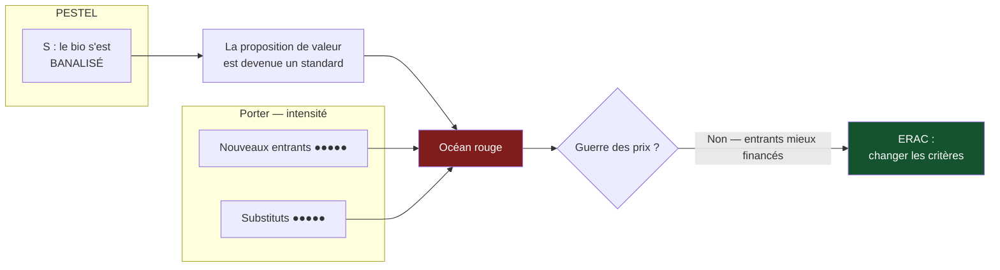

> ⬅ [[CAS03_La_caisse_maladie_qui_ferme_ses_guichets]] · [[00_Index_Mises_en_situation|🗂 Index]] · [[CAS05_Limprimerie_qui_doit_choisir_sa_mort]] ➡

# CAS 4 — L'épicerie bio prise en tenaille

> **L'entreprise.** *Le Panier Vert*, 4 magasins d'alimentation bio à Genève et Nyon, **31 salariés**, 8,7 M CHF de CA. Positionnement historique : bio, local, vrac, conseil. Depuis trois ans, les grandes surfaces ont développé des rayons bio à prix cassés ; une chaîne de discount bio allemande vient d'ouvrir deux points de vente dans le canton ; et un service de paniers en ligne livre à domicile avec abonnement. Les ventes du Panier Vert reculent de 4 %/an. Le fondateur envisage soit de baisser les prix, soit de « faire du digital ».
>
> **La question posée.**
> *« Réalisez un diagnostic externe du Panier Vert et proposez un repositionnement stratégique. »*

---

## 🧩 Les notions clés

- **PESTEL** (version du cours : le **E** fusionné écologique/éthique) 📘
- **Les 5 forces de Porter + l'État** (6e force du cours) 📘
- **Océan rouge / océan bleu**
- **Matrice ERAC** 📘 ⚠️ (deux formulations — voir plus bas)
- **Différenciation vs domination par les coûts**
- **SAF**

## 📖 Définitions pour les nuls

| Notion | En une phrase simple |
|---|---|
| **PESTEL** | Une check-list de 6 familles de facteurs extérieurs qui influencent l'entreprise 📘 |
| **Les 5 forces de Porter** | Cinq pressions qui grignotent la rentabilité d'un secteur : concurrents, entrants, substituts, clients, fournisseurs 📘 |
| **La 6e force** | 📘 Dans ce cours, on ajoute **l'État** : lois, subventions, normes |
| **Océan rouge** | Un marché saturé où tout le monde se bat sur les mêmes critères — l'eau devient rouge de sang |
| **Océan bleu** | Un espace qu'on crée et où personne ne se bat encore |
| **ERAC** | Une grille en 4 mouvements pour redessiner une offre 📘 |

⚠️ **Point de vigilance terminologique.** Vos notes personnelles donnent **E**xclure / **R**éduire / **A**ugmenter / **C**réer. Les slides du cours donnent **E**xclure / **R**enforcer / **A**tténuer / **C**réer. La logique est identique (on supprime, on baisse, on monte, on invente) mais les mots diffèrent. À l'oral, citez la version des slides et mentionnez que la formulation varie : ça montre que vous avez lu les supports.

## 🔍 Décorticage de la consigne (L-I-S-A-E-C)

**L — Lire.** « **Réalisez** un diagnostic externe » = produire une grille, pas discourir. « **Proposez** un repositionnement » = solutions concrètes + faisabilité.

⚠️ Le mot « **externe** » est une contrainte : ne parlez pas des ressources internes du Panier Vert dans la première partie. C'est le piège n°1 du cours : 📘 confondre opportunité (externe) et force (interne).

**I — Identifier.** « Diagnostic externe » = **PESTEL** (macro) **+ Porter** (secteur). Les deux, pas l'un ou l'autre. 📘 Et le lien entre eux : *« le PESTEL explique l'évolution des 5 forces »*.

**S — Structurer.**
1. PESTEL (6 dimensions, 1 facteur saillant chacune)
2. Porter + État : où la pression est-elle la plus forte ?
3. Le diagnostic en une phrase : océan rouge ou bleu ?
4. Repositionnement via ERAC + filtre SAF

**E — Étendre.** Pont naturel : le repositionnement mobilisera la **chaîne de valeur** (où créer la différence) et le **BM durable** (revenus circulaires : consigne, vrac, réemploi).

**C — Conclure.** Trancher entre les deux options du fondateur — et surtout, montrer qu'elles sont **toutes les deux mauvaises telles quelles**.

## 🧠 Le raisonnement stratégique (D-E-I)

### Axe 1 — Le PESTEL : un environnement qui se retourne

**D — Définir.** 📘 Le PESTEL liste six familles de facteurs **macro** : Politique, Économique, Socioculturel, Technologique, **É**cologique/éthique, Légal.

**E — Expliquer.** L'intérêt du PESTEL n'est pas de lister : c'est de repérer **ce qui change**. Un facteur stable n'est pas un facteur stratégique.

**I — Illustrer.**

| Dimension | Facteur saillant pour Le Panier Vert | Sens |
|---|---|---|
| **P** — Politique | Politique agricole suisse, soutien cantonal aux circuits courts | Favorable |
| **E** — Économique | Inflation alimentaire, pouvoir d'achat sous pression, tourisme d'achat vers la France | **Défavorable** |
| **S** — Socioculturel | Le bio s'est **banalisé** : il n'est plus un marqueur d'appartenance mais un rayon comme un autre | **Défavorable** ⚠️ |
| **T** — Technologique | Livraison à domicile, abonnements, applications de traçabilité | Ambivalent |
| **É** — Écologique/éthique | Attentes sur l'emballage, le gaspillage, la juste rémunération du producteur | **Favorable** |
| **L** — Légal | Normes d'étiquetage, réglementation du vrac, lois anti-gaspillage | Ambivalent |

🔎 **Le facteur décisif est le S.** Quand Le Panier Vert a ouvert, « bio » était une **différenciation**. Aujourd'hui, c'est un **standard**. L'entreprise n'a pas changé ; c'est le marché qui a absorbé sa proposition de valeur. C'est le mécanisme classique de l'érosion d'un avantage.

### Axe 2 — Porter : la tenaille

**D — Définir.** 📘 Les cinq forces mesurent la pression sur la rentabilité d'un secteur. 📘 Le cours ajoute une sixième force : **l'État**.

**E — Expliquer.** On note chaque force et on identifie **d'où vient l'étranglement**.

**I — Illustrer.**

| Force | Intensité | Justification |
|---|---|---|
| **Rivalité** | ●●●●○ | Grandes surfaces + spécialistes locaux sur le même bassin |
| **Nouveaux entrants** | ●●●●● | Le discount bio allemand vient d'entrer : **barrières faibles** |
| **Substituts** | ●●●●● | Paniers en ligne, marchés, vente directe à la ferme, AMAP |
| **Pouvoir des clients** | ●●●●○ | Zéro coût de changement, comparaison de prix immédiate |
| **Pouvoir des fournisseurs** | ●●○○○ | Petits producteurs locaux, peu concentrés |
| **État** 📘 | ●●●○○ | Subventions au local (favorable), normes (coût) |

🔎 **Diagnostic : océan rouge caractérisé.** Quatre forces sur six à intensité élevée, et surtout **entrants + substituts au maximum** — ce qui signifie que la pression ne vient pas des concurrents historiques mais de nouveaux modèles.

⚠️ La conclusion qui en découle est brutale : **dans un océan rouge où les entrants ont plus de moyens que vous, la guerre des prix est perdue d'avance.** La première option du fondateur (baisser les prix) est donc éliminée par le diagnostic, pas par une préférence.

### Axe 3 — Le repositionnement par l'ERAC

**D — Définir.** 📘 La **stratégie océan bleu** consiste à créer un espace non disputé, en redessinant les critères sur lesquels on se bat. Outil : la matrice **ERAC**.

**E — Expliquer.** Le principe : on ne bat pas un concurrent sur ses critères, on **change les critères**. Concrètement, on accepte d'être moins bon sur ce que le marché juge acquis, pour être seul sur autre chose.

**I — Illustrer.** ERAC appliqué au Panier Vert :

| Mouvement | Ce qu'on fait | Chez Le Panier Vert |
|---|---|---|
| **E — Exclure** | Supprimer un critère que le secteur tient pour acquis | Les **références de « bio industriel »** (marques bio des multinationales) : impossible d'y battre les grandes surfaces sur les prix, et leur présence brouille le positionnement |
| **R — Renforcer** *(vos notes : Augmenter)* | Pousser un critère bien au-delà du standard | Le **lien direct au producteur** : nom, ferme, distance, prix payé au producteur affiché en rayon |
| **A — Atténuer** *(vos notes : Réduire)* | Baisser un critère surinvesti | La **largeur de gamme** : 4 000 références deviennent 1 400. Moins de choix, moins de stock, moins d'invendus |
| **C — Créer** | Inventer un critère qui n'existe pas dans le secteur | Un **modèle de consigne et de vrac abonné** : contenants consignés, réapprovisionnement mensuel programmé, prix garanti sur 12 mois |

🔎 **Pourquoi ce dernier point est stratégique et pas cosmétique** : la consigne crée un **coût de changement** pour le client (il a des contenants chez lui, un abonnement en cours) — c'est-à-dire exactement ce qui manque au Panier Vert aujourd'hui. Et 📘 c'est un exemple de **revenu durable** au sens du BM durable : un revenu récurrent adossé à la circularité, pas à la vente de volume.

## ⚖️ L'arbitrage et la recommandation (filtre SAF)

### Les deux options du fondateur, testées

| Option | S | A | F | Verdict |
|---|---|---|---|---|
| **Baisser les prix** | ❌ Détruit le positionnement, et le diagnostic Porter montre que la bataille est perdue | ⚠️ Les producteurs locaux subiraient la pression | ✅ Techniquement possible | **Éliminée sur S** |
| **« Faire du digital »** | ⚠️ Trop vague pour être évaluée — le digital n'est pas une stratégie, c'est un moyen | ❌ Investissement lourd face à des plateformes déjà installées | ❌ Aucune compétence e-commerce en interne | **Éliminée sur A et F** |
| **Repositionnement ERAC** | ✅ Cohérent avec l'identité et le facteur É favorable | ⚠️ Réduire la gamme de 4 000 à 1 400 fera fuir une partie des clients | ⚠️ Demande une refonte du merchandising et de la logistique | **Retenue, sous conditions** |

### Analyse à double sens du numérique 🔎

⚠️ Le numérique n'est pas exclu de la recommandation — il est **subordonné** à la stratégie au lieu de la remplacer.

| Ce que le numérique **soutient** ici | Ce qu'il **freine** |
|---|---|
| Gestion de l'abonnement et de la consigne (rappels, suivi des contenants) | Une plateforme de livraison à domicile ajouterait des trajets, donc de l'impact |
| Traçabilité affichée en rayon (QR code producteur) | Coût de développement disproportionné pour 4 magasins |
| Prévision de la demande → moins d'invendus, donc moins de gaspillage | ⚠️ **Effet rebond** : un « clic & collect » trop simple peut augmenter le nombre de petites commandes fragmentées, chacune générant un déplacement |

### 🔎 La recommandation

> **Repositionnement ERAC, avec le numérique en soutien et non en vitrine.**
>
> - **Priorité 1 (0–6 mois)** : la réduction de gamme et l'exclusion du bio industriel. C'est gratuit, immédiat, et c'est ce qui libère la trésorerie et l'espace pour le reste.
> - **Priorité 2 (6–18 mois)** : le modèle consigne + abonnement, testé sur **un seul magasin** avant généralisation.
> - **Priorité 3** : l'affichage producteur (numérique léger : QR code, pas d'application).
> - **Renoncement assumé** : environ 8 % du chiffre d'affaires actuel, correspondant aux clients qui venaient pour les marques bio industrielles. 🔎 **C'est le prix du repositionnement, et il faut le dire — une stratégie sans renoncement n'en est pas une.**

## ⚠️ Le piège classique

**L'erreur type n°1 — mélanger interne et externe.** On demande un diagnostic **externe**, et l'étudiant écrit « faiblesse : les prix sont trop élevés ». Un prix est une décision interne. **Réflexe correctif :** avant chaque item, demandez-vous *« cela existerait-il si l'entreprise n'existait pas ? »* Si oui → externe. Si non → interne.

**L'erreur type n°2 — traiter « faire du digital » comme une option évaluable.** Ce n'en est pas une : c'est un moyen sans objectif. **Réflexe correctif :** exigez toujours la formulation complète — *le digital, pour quoi faire, pour quel client, contre quel concurrent ?* Une option qui ne survit pas à ces trois questions n'est pas une option.

**L'erreur type n°3 — faire un ERAC sans exclusion.** Les étudiants remplissent volontiers « Renforcer » et « Créer », et laissent « Exclure » vide ou timide. Or c'est **la case Exclure qui libère les ressources** qui financent les trois autres. Un ERAC sans exclusion est une liste de vœux.

---

## 🗺️ Visuels de synthèse

### La chaîne de raisonnement



### Le chiffre qui tranche

```
Les 6 forces du secteur   (illustratif, notation /5)

Nouveaux entrants   █████  5   ← discount bio allemand
Substituts          █████  5   ← paniers en ligne, AMAP
Rivalité            ████   4
Pouvoir clients     ████   4   ← zéro coût de changement
État                ███    3
Pouvoir fournisseurs██     2   ← petits producteurs dispersés

→ 4 forces sur 6 élevées = océan rouge caractérisé
```

⚠️ Graphique **illustratif** : les proportions servent le raisonnement, elles ne sont pas des données mesurées.

---

## 🔗 Navigation

⬅ [[CAS03_La_caisse_maladie_qui_ferme_ses_guichets]] · [[00_Index_Mises_en_situation|🗂 Index des 27 cas]] · [[CAS05_Limprimerie_qui_doit_choisir_sa_mort]] ➡
