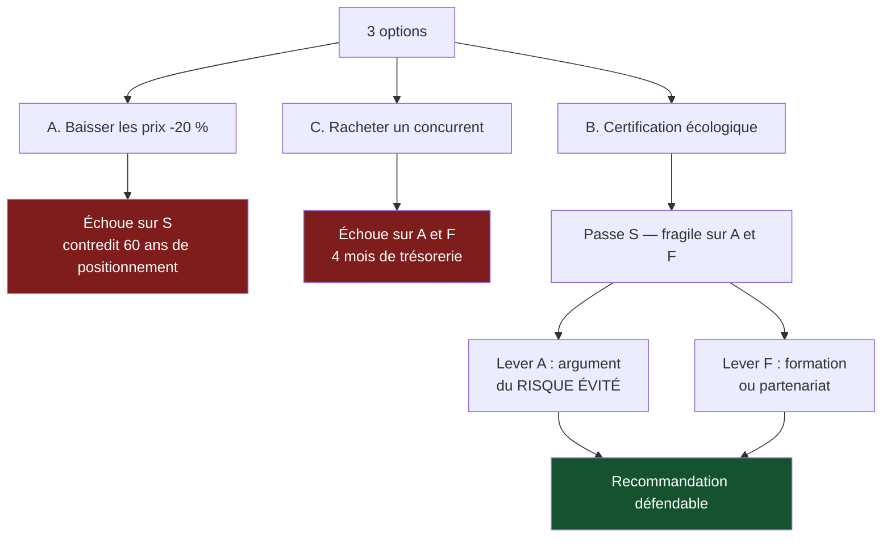

> ⬅ [[CAS04_Lepicerie_bio_prise_en_tenaille]] · [[00_Index_Mises_en_situation|🗂 Index]] · [[CAS06_La_fiduciaire_face_a_lIA_generative]] ➡

# CAS 5 — L'imprimerie qui doit choisir sa mort

> **L'entreprise.** *Imprimerie Berthoud*, Carouge. **35 salariés**, entreprise familiale depuis 1962. Activités : impression offset (brochures, catalogues, papeterie d'entreprise) et un petit atelier de finition. CA en baisse continue : 6,2 M CHF il y a huit ans, 3,9 M aujourd'hui. Le marché de l'impression commerciale recule de 6 %/an en Suisse romande. Deux presses offset ont 14 et 19 ans. La trésorerie couvre 4 mois d'exploitation. Trois options sont sur la table : (A) baisser les prix de 20 % pour remplir les presses ; (B) se spécialiser dans l'impression écologique certifiée ; (C) racheter un concurrent en difficulté pour consolider le marché.
>
> **La question posée.**
> *« Évaluez les trois options avec la grille SAF et formulez une recommandation argumentée. »*

---

## 🧩 Les notions clés

- **Grille SAF** 📘 (souhaitabilité / acceptabilité / faisabilité)
- **Analyse des parties prenantes** (outil de l'acceptabilité) 📘
- **Analyse des risques** (outil de l'acceptabilité) 📘
- **Diagnostic interne** — ressources et compétences 📘
- **Substituts** (force de Porter) — le numérique comme substitut
- **Différenciation par la durabilité**
- **Labels et asymétrie d'information**

## 📖 Définitions pour les nuls

| Notion | En une phrase simple |
|---|---|
| **SAF** | Trois questions avant de se lancer : est-ce **utile** pour nous, est-ce **acceptable** par les autres, est-ce **possible** avec ce qu'on a 📘 |
| **Souhaitabilité** | Est-ce que ça sert nos objectifs et notre identité ? |
| **Acceptabilité** | 📘 Le retour est-il acceptable ? Le risque est-il acceptable ? Les parties prenantes vont-elles s'opposer ? |
| **Faisabilité** | A-t-on les ressources et les compétences — ou peut-on raisonnablement les obtenir ? |
| **Substitut** | Un autre moyen de satisfaire le même besoin : ici, le PDF remplace la brochure 📘 |
| **Asymétrie d'information** | Le client ne peut pas vérifier ce que vous affirmez — d'où l'utilité d'un label 🔎 |

## 🔍 Décorticage de la consigne (L-I-S-A-E-C)

**L — Lire.** « **Évaluez** … avec la grille SAF » : l'outil est **imposé**. Ne pas l'utiliser explicitement est une faute de forme. « Formulez une recommandation **argumentée** » : il faut dire pourquoi les autres options échouent, pas seulement laquelle on retient.

**I — Identifier.** 📘 L'apport principal du SAF : *il dit **pourquoi** une option échoue, donc si elle est rattrapable.* C'est la phrase-clé du cas.

⚠️ Piège de méthode : appliquer le SAF comme une case à cocher (✅/❌) sans argument. Chaque cellule demande une justification en une phrase.

**S — Structurer.**
1. Rappel de la grille et de l'ordre (S → A → F, et pourquoi cet ordre)
2. Les trois options passées au filtre
3. Recommandation + conditions à lever

**E — Étendre.** Ponts : les substituts (pourquoi le marché recule), les labels (comment crédibiliser l'option B), le BM durable (revenus).

**C — Conclure.** Trancher, et **dire quoi corriger** sur l'option retenue.

## 🧠 Le raisonnement stratégique (D-E-I)

### Axe 0 — Pourquoi l'ordre S → A → F, et pas F d'abord

**D — Définir.** 📘 L'approche SAF teste une stratégie **avant** sa mise en œuvre, parce qu'*« il est bien tard pour opérer des corrections »* après cinq ans.

**E — Expliquer.** 🔎 Commencer par la **faisabilité** est le réflexe naturel — on écarte tout de suite ce qui semble hors de portée. Mais c'est **stérilisant** : on ne propose jamais que ce qu'on sait déjà faire, et toute transformation commence par une chose qu'on ne maîtrise pas encore.

**I — Illustrer.** Chez Berthoud, commencer par F conduirait à retenir l'option A (baisser les prix), la seule immédiatement réalisable — et donc à choisir l'option qui tue l'entreprise le plus vite. **L'ordre du SAF n'est pas une convention : c'est une protection.**

### Axe 1 — Option A : baisser les prix de 20 %

**D — Définir.** Une **domination par les coûts** suppose un avantage de structure durable (volume, technologie, accès aux matières).

**E — Expliquer.** Berthoud n'a aucun de ces avantages : ses presses sont plus anciennes que celles de ses concurrents, son volume est en baisse, et le marché lui-même recule de 6 %/an. Baisser les prix dans un marché qui se contracte ne redistribue pas les parts : cela **accélère l'épuisement de tous**.

**I — Illustrer.** À −20 % sur 3,9 M, l'entreprise perd environ 780 k CHF de marge brute. Avec 4 mois de trésorerie, elle n'a pas les moyens de tenir la guerre de prix qu'elle déclencherait.

| Critère | Analyse | Verdict |
|---|---|---|
| **S** | ❌ Contredit le positionnement qualité de 60 ans ; ne répond pas au vrai problème (le substitut numérique) | **Échoue** |
| **A** | ⚠️ Les salariés anticiperont des licenciements ; les banques verront la marge s'effondrer | Défavorable |
| **F** | ✅ Techniquement immédiat | Possible |

🔎 **Option A éliminée sur la souhaitabilité** — et c'est instructif : c'est la seule option pleinement faisable, et c'est la pire. Voilà pourquoi on ne commence pas par F.

### Axe 2 — Option C : racheter un concurrent

**D — Définir.** Une **consolidation** vise à racheter du volume pour améliorer le taux de charge des machines et éliminer un concurrent.

**E — Expliquer.** La logique n'est pas absurde en soi : dans un marché en déclin, la consolidation est un mouvement classique. Mais elle exige deux choses que Berthoud n'a pas : **de la trésorerie** et **une capacité d'intégration**.

**I — Illustrer.**

| Critère | Analyse | Verdict |
|---|---|---|
| **S** | ✅ Consolider un marché en déclin est stratégiquement cohérent | Passe |
| **A** | ❌ 📘 *Retour acceptable ?* Non chiffrable. *Risque acceptable ?* Non : 4 mois de trésorerie. *Opposition ?* Banques réticentes, salariés inquiets d'une fusion | **Échoue** |
| **F** | ❌ Trésorerie insuffisante ; aucune expérience d'intégration post-acquisition | **Échoue** |

🔎 **Option C éliminée sur A et F.** ⚠️ Et notez la nuance importante : elle n'est pas éliminée parce qu'elle est *mauvaise*, mais parce qu'elle est **hors de portée maintenant**. Une option qui échoue sur F peut redevenir valable si les conditions changent — ce n'est pas le cas d'une option qui échoue sur S. **C'est exactement ce que le SAF permet de distinguer, et c'est son apport principal.**

### Axe 3 — Option B : la spécialisation écologique certifiée

**D — Définir.** Une **différenciation** consiste à être choisi pour un critère que les autres ne servent pas. Un **label** est une certification par un tiers indépendant, qui réduit l'asymétrie d'information.

**E — Expliquer le mécanisme.** Deux ressorts se combinent :

1. **Côté demande** : les entreprises et les collectivités publiques intègrent de plus en plus de critères environnementaux dans leurs appels d'offres. Un imprimeur non certifié devient progressivement **inéligible**, indépendamment de son prix.
2. **Côté crédibilité** : Berthoud ne peut pas s'auto-déclarer écologique — 🔎 une affirmation faite par celui qui en profite ne vaut rien. Le label apporte le tiers de confiance sans lequel la différenciation n'est pas perçue.

**I — Illustrer.** Concrètement : encres végétales, papiers certifiés, gestion des solvants, bilan carbone par commande, certification reconnue. L'investissement est estimé à **200 000 CHF** sur 18 mois.

| Critère | Analyse | Verdict |
|---|---|---|
| **S** | ✅ Cohérent avec le savoir-faire qualité et avec le marché genevois (collectivités, ONG, institutions internationales) | **Passe** |
| **A** | ⚠️ 200 000 CHF avec 4 mois de trésorerie : les associés et la banque hésiteront | **Fragile** |
| **F** | ⚠️ Aucune compétence interne en certification environnementale | **Fragile** |

## ⚖️ L'arbitrage et la recommandation (filtre SAF)

### 🔎 La recommandation

> **Retenir l'option B — c'est la seule qui passe la souhaitabilité, donc la seule récupérable. Et le SAF dit exactement quoi corriger.**

**Lever la contrainte d'acceptabilité — en changeant l'argument.**

⚠️ L'erreur serait de présenter les 200 000 CHF comme un **investissement de croissance** (« nous allons gagner de nouveaux clients »). Personne n'y croira dans un marché en recul de 6 %/an.

🔎 Il faut retourner l'argument : présenter la dépense comme un **risque évité**. *« Sans certification, nous serons exclus des appels d'offres publics et institutionnels d'ici trois ans. La question n'est pas combien cela rapporte, mais combien cela évite de perdre. »* Le retour devient chiffrable en parts de marché protégées.

📘 C'est exactement le sens de la sous-question du cours : *« Le niveau de risque est-il acceptable ? »* — l'option risquée n'est pas celle qui investit, c'est celle qui ne fait rien.

**Lever la contrainte de faisabilité — sans recruter.**

Trois voies, par coût croissant :
1. **Formation** d'un collaborateur existant à la certification (le plus économique, le plus lent).
2. **Partenariat** avec une autre PME déjà certifiée : mutualisation de l'audit et du conseil. 🔎 C'est le mécanisme du bien collectif — aucune des deux ne financerait seule un expert, les deux ensemble le peuvent.
3. Recrutement d'un profil dédié (le plus rapide, le plus coûteux — à écarter vu la trésorerie).

**Le séquencement**, imposé par la trésorerie de 4 mois :

| Phase | Action | Coût | Objectif |
|---|---|---|---|
| 0–3 mois | Audit préalable + choix du label + dossier bancaire fondé sur le risque évité | ~15 k | Débloquer le financement |
| 3–9 mois | Certification sur **un seul segment** (papeterie d'entreprise) | ~90 k | Preuve de concept + premières références |
| 9–18 mois | Extension aux autres segments + communication | ~95 k | Repositionnement complet |

⚠️ **Le point à ne pas manquer** : ne pas tout certifier d'un coup. Avec 4 mois de trésorerie, un séquencement en trois phases n'est pas de la prudence, c'est une **condition de faisabilité**.

## ⚠️ Le piège classique

**L'erreur type n°1 — le SAF en cases à cocher.** Trois ✅ et deux ❌ dans un tableau, sans une phrase de justification. 📘 Le cours est explicite : chaque critère demande un argument. **Réflexe correctif :** une cellule = une raison, formulée en une phrase.

**L'erreur type n°2 — ne citer qu'une sous-question de l'acceptabilité.** 📘 Il y en a **trois** : retour, risque, opposition. Les étudiants n'en citent presque jamais qu'une (généralement l'opposition). **Réflexe correctif :** mémorisez-les comme un triplet indissociable, et citez aussi les outils associés — 📘 *analyse des parties prenantes, analyse des risques*.

**L'erreur type n°3 — dire « l'option B semble la meilleure » et s'arrêter là.** 🔎 Ce n'est pas une recommandation, c'est une préférence. La recommandation est : *« B est la seule souhaitable ; elle bute sur deux conditions précises ; voici comment les lever, dans cet ordre. »* La différence entre les deux formulations, c'est toute la note.

**L'erreur type n°4 — présenter l'investissement durable comme un gain.** Dans un marché en déclin, personne ne croit à un argument de croissance. **Réflexe correctif :** en durabilité, l'argument qui passe l'acceptabilité est presque toujours le **risque évité**, pas le revenu supplémentaire.

---

## 🗺️ Visuels de synthèse

### La chaîne de raisonnement



### Le chiffre qui tranche

```
Séquencement imposé par 4 mois de trésorerie   (illustratif)

0-3 mois    ██                     15 k   audit + dossier bancaire
3-9 mois    ███████████            90 k   certification 1 segment
9-18 mois   ████████████           95 k   extension + communication
            └─────── 200 k CHF au total ───────┘

⚠ Tout certifier d'un coup n'est pas de l'ambition,
  c'est une impossibilité de trésorerie
```

⚠️ Graphique **illustratif** : les proportions servent le raisonnement, elles ne sont pas des données mesurées.

---

## 🔗 Navigation

⬅ [[CAS04_Lepicerie_bio_prise_en_tenaille]] · [[00_Index_Mises_en_situation|🗂 Index des 27 cas]] · [[CAS06_La_fiduciaire_face_a_lIA_generative]] ➡
