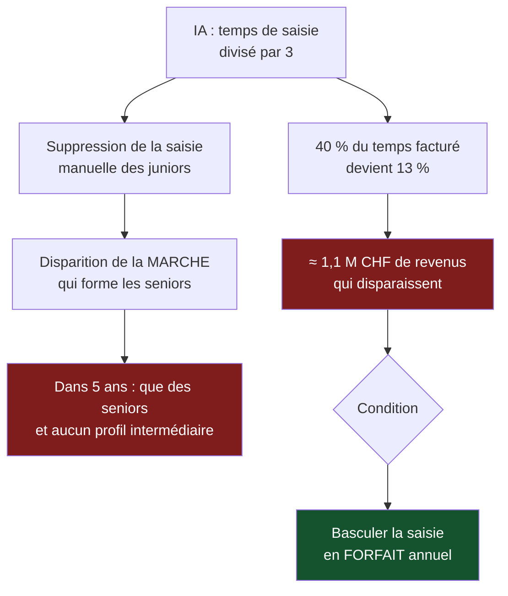

> ⬅ [[CAS05_Limprimerie_qui_doit_choisir_sa_mort]] · [[00_Index_Mises_en_situation|🗂 Index]] · [[CAS07_Le_fabricant_de_mobilier_qui_veut_vendre_moins]] ➡

# CAS 6 — La fiduciaire face à l'IA générative

> **L'entreprise.** *Fiduciaire Rive Gauche SA*, Genève. **24 collaborateurs** (12 comptables, 5 fiscalistes, 4 réviseurs, 3 administratifs). Clientèle : 340 PME romandes. CA 4,3 M CHF. Le métier repose sur la saisie comptable (40 % du temps facturé), la déclaration fiscale (30 %) et le conseil (30 % du temps, mais 55 % de la marge). Un concurrent lausannois annonce avoir divisé par trois son temps de saisie grâce à un outil de reconnaissance de documents couplé à un modèle de langage. Deux clients ont demandé une baisse d'honoraires « puisque l'IA fait le travail ». La direction hésite entre déployer l'IA massivement, la refuser, ou attendre.
>
> **La question posée.**
> *« Conseillez la direction sur l'intégration de l'IA. Quels effets sur le business model, les compétences et la responsabilité de la fiduciaire ? »*

---

## 🧩 Les notions clés

- **Ressources matérielles et immatérielles** 📘
- **Chaîne de valeur** — quelle activité l'IA touche-t-elle ?
- **Avantage concurrentiel durable** (sens A)
- **Effet rebond** appliqué au temps facturé
- **Équation de profit** 📘
- **RNE** — axes technologique et sociétal 📘
- 📚 **AI Act** — niveaux de risque (complément hors cours)
- **Sobriété numérique** — « questionner, transférer, améliorer » 📘

## 📖 Définitions pour les nuls

| Notion | En une phrase simple |
|---|---|
| **IA générative** | Un système qui produit du texte ou des documents à partir d'exemples appris 🔎 |
| **Équation de profit** | 📘 Revenus (fixes et variables) moins la structure de coûts |
| **Effet rebond** | Un gain d'efficacité mangé par une hausse du volume 🔎 |
| **Sobriété numérique** | 📘 « Mieux avec moins » : **Q**uestionner le besoin → **T**ransférer → **A**méliorer |
| **RNE** | 📘 Responsabilité numérique des entreprises : économique, technologique, environnemental, sociétal |
| **Ressource immatérielle** | 📘 Ce qui ne se copie pas vite : ici, la confiance et le jugement fiscal |

## 🔍 Décorticage de la consigne (L-I-S-A-E-C)

**L — Lire.** « **Conseillez** » = recommandation opérationnelle. Puis trois angles explicitement imposés : **business model**, **compétences**, **responsabilité**. ⚠️ Une réponse qui n'en traite que deux perd un tiers de la note, quelle que soit sa qualité sur les deux autres.

**I — Identifier.** Le mot « responsabilité » n'est pas là par hasard : il appelle la **RNE** 📘 et la question de qui répond d'une erreur produite par un système.

**S — Structurer.** Le plan est donné par l'énoncé — utilisez-le tel quel :
1. Effet sur le business model (où l'IA touche la chaîne de valeur et l'équation de profit)
2. Effet sur les compétences (que devient la ressource immatérielle)
3. Effet sur la responsabilité (RNE, données clients, imputabilité)
4. Recommandation SAF + double sens

**C — Conclure.** Trancher entre les trois postures (déployer / refuser / attendre) — et montrer que « attendre » est un choix, pas une absence de choix.

## 🧠 Le raisonnement stratégique (D-E-I)

### Axe 1 — Business model : l'IA attaque la case qui finance, pas celle qui rapporte

**D — Définir.** 📘 L'**équation de profit** = revenus − structure de coûts. 📘 La **chaîne de valeur** distingue les activités où l'on se distingue de celles où l'on est faible.

**E — Expliquer.** Le modèle actuel de Rive Gauche repose sur un équilibre discret : la **saisie** (40 % du temps) est peu rentable mais elle **occupe les équipes et finance leur présence**, tandis que le **conseil** (30 % du temps, 55 % de la marge) est ce qui fait vivre l'entreprise.

🔎 L'IA divise par trois le temps de saisie. Trois conséquences en cascade :

1. Le revenu associé à la saisie s'effondre (les clients le demandent déjà).
2. Les heures libérées doivent être **rebasculées vers le conseil** — sinon ce sont des heures non facturées.
3. Or le conseil ne se vend pas au même client, ni au même rythme, ni avec les mêmes personnes.

**I — Illustrer.** Si Rive Gauche déploie l'IA sans rien changer d'autre : 40 % du temps facturé devient 13 %, soit **environ 1,1 M CHF de revenus qui disparaissent**, sans que la structure de coûts ne baisse dans la même proportion. **L'IA améliore la productivité et détruit le chiffre d'affaires simultanément.** C'est le cœur du cas.

⚠️ **Le point à formuler à l'oral** : *« Le gain de productivité ne devient un gain économique que si le temps libéré est réaffecté à une activité vendable. Sinon c'est une destruction de revenu déguisée en modernisation. »*

### Axe 2 — Compétences : ce que l'IA prend et ce qu'elle ne prend pas

**D — Définir.** 📘 Les **ressources immatérielles** (organisation, technologie, réputation) fondent l'avantage durable parce qu'elles sont peu transférables donc peu imitables.

**E — Expliquer.** Ce que l'IA absorbe : la **tâche répétitive et vérifiable** (lire une facture, l'imputer, préremplir un formulaire). Ce qu'elle n'absorbe pas : le **jugement en situation d'incertitude** — savoir si une charge est déductible dans un cas limite, savoir quand appeler l'administration fiscale plutôt que déposer, connaître l'historique d'un client.

🔎 **Mais voici le mécanisme dangereux, et c'est celui que personne ne voit** : la saisie était le terrain d'**apprentissage** des juniors. C'est en imputant 4 000 factures qu'un comptable développe le flair qui fera de lui un fiscaliste. Si l'IA supprime la saisie, on supprime aussi **la marche d'escalier** qui produit les seniors.

**I — Illustrer.** Dans cinq ans, Rive Gauche aura 12 seniors de plus de 55 ans et aucun profil intermédiaire, parce que la génération suivante n'aura jamais fait le travail qui forme le jugement. 🔎 **L'IA ne détruit pas la compétence : elle détruit la filière qui la produit.** Nuance essentielle, et c'est elle qui commande la recommandation.

### Axe 3 — Responsabilité : qui signe ?

**D — Définir.** 📘 La **RNE** comporte quatre axes : économique, technologique, environnemental, **sociétal**. 📘 Trois principes de gestion responsable des données : **but déterminé, transparence, minimisation**.

**E — Expliquer.** Trois problèmes distincts, à ne pas confondre :

| Problème | Nature | Question à poser |
|---|---|---|
| **Confidentialité** | Données clients envoyées à un service externe | Où partent les documents comptables de 340 PME ? Le secret professionnel est-il préservé ? |
| **Imputabilité** | Une erreur produite par le système | Qui répond devant l'administration fiscale ? 🔎 Réponse : le réviseur qui a signé — l'outil n'a pas de responsabilité |
| **Explicabilité** | Une imputation contestée | Peut-on retracer pourquoi le système a proposé ce traitement ? |

**I — Illustrer.** 📚 **Complément hors cours** : l'AI Act européen distingue quatre niveaux de risque — inacceptable, élevé, limité, minimal. Un outil d'assistance comptable relèverait plutôt du risque **limité** (obligation de transparence) que du risque élevé. ⚠️ À présenter comme un complément, jamais comme du contenu de cours.

🔎 La conséquence pratique est indépendante du droit : **l'IA ne déplace pas la responsabilité.** Le collaborateur qui valide reste responsable de ce qu'il valide. Une fiduciaire qui déploie l'IA sans procédure de contrôle transfère le risque sur ses collaborateurs sans leur en donner les moyens.

## ⚖️ L'arbitrage et la recommandation (filtre SAF)

### Analyse à double sens du numérique 🔎

| L'IA **soutient** la durabilité de la fiduciaire | L'IA **freine** la durabilité de la fiduciaire |
|---|---|
| Suppression de tâches sans valeur ajoutée → meilleure qualité de travail | **Effet rebond** : le contrôle devenant peu coûteux, on multiplie les vérifications et les documents produits |
| Dématérialisation effective (moins d'archivage papier) | Coût énergétique des requêtes, invisible dans les comptes |
| Détection d'anomalies → moins d'erreurs, moins de redressements | Destruction de la filière de formation des juniors (durabilité **sociale** interne) |
| Temps libéré redéployable sur le conseil | Dépendance à un fournisseur externe, et exposition des données clients |

🔎 **Synthèse** : l'IA améliore chaque tâche et fragilise le système qui produit la compétence. C'est un gain d'efficacité local contre un risque structurel — exactement la forme d'un arbitrage court terme / long terme.

### Le SAF appliqué aux trois postures

| Posture | S | A | F | Verdict |
|---|---|---|---|---|
| **Déployer massivement** | ⚠️ Sert la productivité, mais détruit 1,1 M de revenus et la filière juniors | ❌ Les collaborateurs y verront un plan social déguisé | ✅ Techniquement accessible | **Écartée** |
| **Refuser** | ❌ Le concurrent lausannois a déjà bougé ; les clients demandent des baisses | ⚠️ Acceptable en interne, pas par les clients | ✅ Aucun effort | **Écartée sur S** |
| **Déploiement encadré et séquencé** | ✅ Protège la marge de conseil et la filière de compétences | ⚠️ Demande de renégocier les honoraires avec 340 clients | ⚠️ Nécessite une procédure de contrôle et une clause de confidentialité | **Retenue** |

### 🔎 La recommandation

> **Déployer, mais en trois conditions non négociables — et changer le modèle de facturation avant, pas après.**
>
> 1. **Basculer la saisie d'une facturation horaire à un forfait annuel par client.** 🔎 C'est le point le plus important : tant que la saisie est facturée à l'heure, tout gain de productivité se traduit mécaniquement en perte de revenu. Le forfait permet de conserver la valeur du gain au lieu de l'offrir.
> 2. **Sanctuariser la formation des juniors** : maintenir un volume de saisie manuelle sur les dossiers complexes, non pas par nostalgie mais parce que c'est le seul dispositif qui produit des seniors. 📘 C'est un investissement dans une **ressource immatérielle**.
> 3. **Encadrer la responsabilité** : hébergement conforme au secret professionnel, validation humaine obligatoire et tracée sur toute imputation, information des clients (📘 principe de **transparence**).
>
> **Et appliquer la sobriété numérique au sens du cours** 📘 — **Q**uestionner d'abord : quelles tâches ont vraiment besoin d'un modèle de langage ? Une simple reconnaissance de documents suffit pour 70 % des cas et coûte infiniment moins, en argent comme en énergie.

## ⚠️ Le piège classique

**L'erreur type n°1 — parler de l'IA comme d'un sujet technologique.** L'étudiant décrit ce que l'IA sait faire. Mais la question est stratégique : l'IA transforme **l'équation de profit**, et c'est là que la réponse doit se situer. **Réflexe correctif :** face à toute question « faut-il adopter telle technologie ? », demandez d'abord *« que fait-elle au modèle de revenus ? »*

**L'erreur type n°2 — oublier que le gain de productivité peut détruire du chiffre d'affaires.** Dans les métiers facturés à l'heure, produire plus vite signifie facturer moins. C'est contre-intuitif et c'est central ici. **Réflexe correctif :** repérez toujours **comment l'entreprise est payée** avant d'évaluer un gain d'efficacité.

**L'erreur type n°3 — croire que l'IA prend la responsabilité.** Elle ne prend rien : la signature reste humaine. **Réflexe correctif :** distinguez systématiquement **qui exécute** et **qui répond**.

---

## 🗺️ Visuels de synthèse

### La chaîne de raisonnement



### Le chiffre qui tranche

```
Répartition temps / marge   (illustratif)

              TEMPS FACTURÉ          MARGE
Saisie        ████████ 40 %          ███ 20 %
Fiscal        ██████ 30 %            ████ 25 %
Conseil       ██████ 30 %            ███████████ 55 %

→ L'IA attaque la case qui OCCUPE (saisie),
  pas celle qui RAPPORTE (conseil)
```

⚠️ Graphique **illustratif** : les proportions servent le raisonnement, elles ne sont pas des données mesurées.

---

## 🔗 Navigation

⬅ [[CAS05_Limprimerie_qui_doit_choisir_sa_mort]] · [[00_Index_Mises_en_situation|🗂 Index des 27 cas]] · [[CAS07_Le_fabricant_de_mobilier_qui_veut_vendre_moins]] ➡
