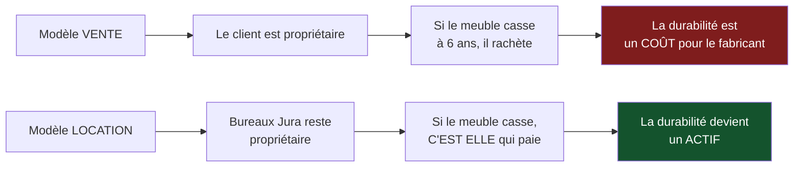

> ⬅ [[CAS06_La_fiduciaire_face_a_lIA_generative]] · [[00_Index_Mises_en_situation|🗂 Index]] · [[CAS08_Le_transporteur_qui_optimise_ses_tournees]] ➡

# CAS 7 — Le fabricant de mobilier qui veut vendre moins

> **L'entreprise.** *Bureaux Jura SA*, Delémont. Fabricant de mobilier de bureau, **112 salariés**, 24 M CHF de CA. Clients : entreprises, administrations, écoles. Le modèle repose sur la vente de mobilier neuf, renouvelé en moyenne tous les 8 ans par les clients. La matière première principale est le panneau de particules (importé) et l'acier. Deux menaces convergent : les appels d'offres publics intègrent désormais des critères de réemploi, et une plateforme de mobilier reconditionné a capté 6 % du marché romand en deux ans. La direction envisage de lancer une offre de **location de mobilier** avec reprise, remise à neuf et relocation.
>
> **La question posée.**
> *« Analysez le passage d'un modèle de vente à un modèle de location. Quelles transformations du business model, et quelles tensions court terme / long terme ? »*

---

## 🧩 Les notions clés

- **BMC** et **métamorphose du BMC** 📘
- **Revenus durables** — leasing, réemploi, services 📘
- **Économie circulaire** et **3R** (Réduire > Réutiliser > Recycler) 📘
- **Économie de la fonctionnalité** 🔎
- **Équation de profit** 📘
- **Externalités négatives** 📘
- **Tension court terme / long terme** 📘
- **Partenariats** (pour fermer la boucle)

## 📖 Définitions pour les nuls

| Notion | En une phrase simple |
|---|---|
| **Économie de la fonctionnalité** | On vend l'**usage** d'un objet, pas l'objet : louer un bureau plutôt que le vendre 🔎 |
| **3R** | 📘 **Réduire** d'abord, **Réutiliser** ensuite, **Recycler** en dernier — l'ordre compte |
| **Revenus durables** | 📘 Leasing, réemploi, services — plutôt que la vente de biens neufs |
| **Équation de profit** | 📘 Revenus moins coûts |
| **Besoin en fonds de roulement** | L'argent qu'il faut avancer avant d'être payé 🔎 |
| **Externalité négative** | Un dégât réel que l'entreprise ne paie pas 🔎 |

## 🔍 Décorticage de la consigne (L-I-S-A-E-C)

**L — Lire.** « **Analysez** le passage » = décomposer avec un outil (le BMC). « Quelles **tensions** » = on attend explicitement ce qui coince, pas un plaidoyer.

**I — Identifier.** Le mot « location » déclenche trois chapitres : **BM durable** (revenus durables), **économie circulaire / 3R**, et **équation de profit** (parce que louer change radicalement la trésorerie).

⚠️ Le piège de ce cas est **financier**, pas écologique. Passer de la vente à la location transforme un encaissement immédiat en un flux étalé sur des années. C'est le point que 80 % des étudiants ignorent.

**S — Structurer.**
1. Pourquoi ce basculement est **stratégiquement** justifié (pas seulement écologiquement)
2. La métamorphose du BMC, bloc par bloc
3. Les trois tensions CT/LT
4. Recommandation SAF

**C — Conclure.** Trancher sur un séquencement, avec un chiffre de trésorerie.

## 🧠 Le raisonnement stratégique (D-E-I)

### Axe 1 — Le renversement d'incitation

**D — Définir.** 🔎 Dans un modèle de **vente**, le fabricant gagne quand le client rachète. Dans un modèle de **location**, il gagne quand le bien dure.

**E — Expliquer le mécanisme.** C'est le point le plus profond du cas, et il faut le formuler exactement :

> 🔎 **En modèle de vente, la durabilité d'un produit est un coût pour le fabricant. En modèle de location, elle devient un actif.**

Pourquoi ? Parce que le propriétaire change. Aujourd'hui, Bureaux Jura vend un bureau : si celui-ci casse au bout de 6 ans, le client rachète — le fabricant y gagne. En location, le bureau reste la propriété de Bureaux Jura : s'il casse au bout de 6 ans, c'est **elle** qui paie la réparation.

**I — Illustrer.** Conséquence immédiate sur la conception : Bureaux Jura aurait intérêt à **surdimensionner** ses produits, à les rendre démontables, à standardiser les pièces d'usure — toutes choses qui coûtent plus cher à fabriquer et qui, en modèle de vente, seraient irrationnelles.

⚠️ **La phrase à retenir pour l'oral** : *« Le modèle de location ne rend pas l'entreprise vertueuse. Il aligne son intérêt économique sur la longévité. La vertu devient un sous-produit de l'incitation. »*

### Axe 2 — La métamorphose du BMC

**D — Définir.** 📘 La **métamorphose du BMC** : chaque bloc traditionnel est réécrit en version durable. 📘 Le BM durable ajoute mission, impacts positifs, externalités négatives.

**E — Expliquer.** ⚠️ Attention : ici, ce n'est pas une réécriture cosmétique — le changement de modèle **force** la réécriture de presque tous les blocs. C'est un excellent cas pour montrer que la métamorphose est une transformation réelle.

**I — Illustrer.**

| Bloc | Modèle vente | Modèle location | Ce qui change vraiment |
|---|---|---|---|
| **Proposition de valeur** | « Du mobilier de qualité » | « Un poste de travail disponible, entretenu, adaptable » | On vend une **disponibilité**, pas un objet |
| **Segments** | Acheteurs à budget d'investissement | Clients à budget de fonctionnement, administrations soumises à critères de réemploi | ⚠️ Ce n'est pas le même acheteur dans l'entreprise cliente |
| **Relations clients** | Transactionnelle, tous les 8 ans | **Continue**, contractuelle | Contact permanent = source d'information |
| **Canaux** | Revendeurs, appels d'offres | Vente directe + plateforme de suivi de parc | Désintermédiation |
| **Revenus** | Prix de vente encaissé à la livraison | **Loyer mensuel** sur 4 à 6 ans | 📘 Revenu durable, mais trésorerie inversée ⚠️ |
| **Ressources clés** | Usine, savoir-faire | Usine + **atelier de remise à neuf** + logistique de reprise + capital immobilisé | Nouveau métier |
| **Activités clés** | Fabriquer, vendre | Fabriquer, **louer, reprendre, remettre à neuf, relouer** | Boucle |
| **Partenaires** | Fournisseurs de panneaux | + logisticien de reprise + recycleur + **financeur** | 🔎 On ne ferme pas une boucle seul |
| **Coûts** | Matière, production | + stockage, transport de reprise, remise à neuf, **coût du capital** | Structure alourdie |
| **➕ Mission** | — | Prolonger la durée d'usage du mobilier de bureau | |
| **➕ Impacts positifs** | — | Réduction du mobilier mis au rebut, emplois locaux de remise à neuf | |
| **➕ Externalités** | Panneaux importés, fin de vie non gérée, colles | Résiduelles : transport de reprise, solvants de rénovation | ⚠️ Elles ne disparaissent pas, elles **changent de nature** |

### Axe 3 — Les trois tensions court terme / long terme

**D — Définir.** 📘 La **tension CT/LT** oppose des investissements immédiats à des bénéfices différés.

**E — Expliquer.** Ici, la tension est d'abord **comptable**, et c'est ce qui la rend redoutable.

**I — Illustrer.**

| Tension | Court terme | Long terme |
|---|---|---|
| **Trésorerie** ⚠️ | Un bureau vendu 800 CHF encaisse 800 CHF le jour de la livraison. Loué 18 CHF/mois sur 5 ans, il encaisse 1 080 CHF **mais étalés** — et l'entreprise a avancé le coût de fabrication | Revenus récurrents, prévisibles, plus élevés au total |
| **Compte de résultat** | Le CA chute la première année (on ne comptabilise plus la vente) alors que les coûts restent | Marge supérieure après le premier cycle de relocation |
| **Compétences** | Il faut créer un métier qu'on n'a pas (remise à neuf, gestion de parc) | Barrière à l'imitation : le concurrent qui vend ne sait pas remettre à neuf |

🔎 **Le calcul décisif** : si Bureaux Jura bascule 30 % de son activité en location, elle doit **financer environ 7,2 M CHF de mobilier** qu'elle ne sera payée qu'au fil des mois. C'est un **besoin en fonds de roulement** massif. Sans solution de financement, le projet est brillant et mortel.

## ⚖️ L'arbitrage et la recommandation (filtre SAF)

| Critère | Analyse | Verdict |
|---|---|---|
| **S** | ✅ Répond aux deux menaces (critères publics de réemploi, plateforme de reconditionné) et crée une barrière que les concurrents-vendeurs ne peuvent pas franchir vite | **Passe** |
| **A** | ⚠️ 📘 *Retour ?* Supérieur mais différé de 3-4 ans. *Risque ?* Trésorerie. *Opposition ?* Les revendeurs partenaires perdent leur commission et s'y opposeront frontalement | **Bloquée — c'est ici que ça se joue** |
| **F** | ⚠️ Pas d'atelier de remise à neuf, pas de logistique de reprise, pas de capacité de financement | **Fragile** |

### 🔎 La recommandation

> **Basculer, mais partiellement, progressivement, et en externalisant le financement.**
>
> 1. **Cibler d'abord le segment public** (administrations, écoles) : c'est lui qui est contraint par les critères de réemploi, donc celui où la location est un **argument d'éligibilité** et pas seulement de prix. Objectif : 15 % du CA en location à 3 ans, pas 30 %.
> 2. **Adosser le financement à un tiers** (société de leasing) : Bureaux Jura conserve la responsabilité opérationnelle du parc, mais n'immobilise pas 7,2 M. 🔎 C'est le point qui rend le projet faisable ; sans lui, tout le reste est théorique.
> 3. **Nouer un partenariat pour la remise à neuf** plutôt que créer l'atelier : un acteur de l'insertion professionnelle régionale, par exemple. 🔎 Une boucle a deux extrémités — Bureaux Jura n'en a qu'une.
> 4. **Traiter les revendeurs**, qui sont la vraie opposition : les intéresser au loyer récurrent plutôt que les priver de la marge de vente. Sans cela, ils saboteront le lancement en orientant les clients vers les concurrents.
>
> **Application des 3R dans l'ordre** 📘 : le modèle sert d'abord **Réduire** (moins de mobilier neuf fabriqué) et **Réutiliser** (remise à neuf). Le recyclage reste le dernier recours, en fin de vie réelle. ⚠️ Une réponse qui présenterait ce projet comme « du recyclage » inverserait la hiérarchie et perdrait des points.

## ⚠️ Le piège classique

**L'erreur type n°1 — voir l'écologie et manquer la trésorerie.** La location est un beau cas d'économie circulaire, et l'étudiant s'enthousiasme. Mais le vrai obstacle est le **besoin en fonds de roulement**. **Réflexe correctif :** dès qu'un modèle transforme un encaissement immédiat en flux étalé, posez la question du financement **avant** celle de l'impact.

**L'erreur type n°2 — croire que les externalités disparaissent.** Elles changent de nature : transport de reprise, solvants, stockage. **Réflexe correctif :** dans un BM durable, la case « externalités négatives » n'est jamais vide. Si elle l'est, c'est qu'on n'a pas cherché.

**L'erreur type n°3 — oublier les revendeurs.** Ils ne sont pas mentionnés comme un problème dans l'énoncé, mais 📘 l'acceptabilité impose de se demander *« les parties prenantes vont-elles s'opposer ? »*. Les intermédiaires désintermédiés sont l'opposition la plus prévisible et la plus sous-estimée de tous les projets de ce type.

---

## 🗺️ Visuels de synthèse

### La chaîne de raisonnement



### Le chiffre qui tranche

```
Le piège de trésorerie   (illustratif, un bureau)

VENTE      ████████████████████  800 CHF encaissés le jour J

LOCATION   ▌▌▌▌▌▌▌▌▌▌▌▌▌▌▌▌▌▌▌▌  1 080 CHF... sur 60 mois
           18 CHF/mois — et le coût de fabrication
           a été avancé par Bureaux Jura

→ Bascule de 30 % de l'activité = 7,2 M CHF à financer
  Sans leasing externe, le projet est brillant et mortel
```

⚠️ Graphique **illustratif** : les proportions servent le raisonnement, elles ne sont pas des données mesurées.

---

## 🔗 Navigation

⬅ [[CAS06_La_fiduciaire_face_a_lIA_generative]] · [[00_Index_Mises_en_situation|🗂 Index des 27 cas]] · [[CAS08_Le_transporteur_qui_optimise_ses_tournees]] ➡
