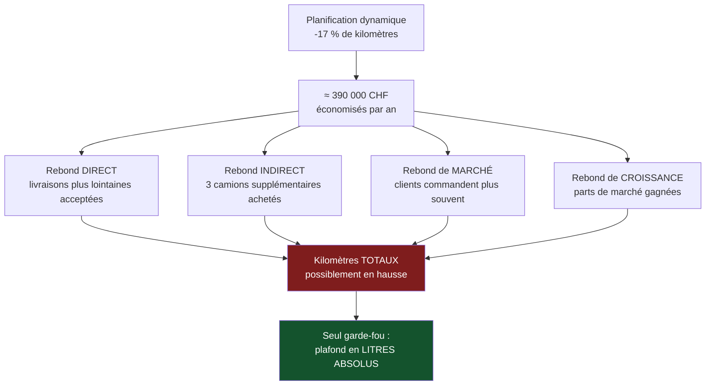

> ⬅ [[CAS07_Le_fabricant_de_mobilier_qui_veut_vendre_moins]] · [[00_Index_Mises_en_situation|🗂 Index]] · [[CAS09_Le_groupe_hotelier_qui_veut_un_label]] ➡

# CAS 8 — Le transporteur qui optimise ses tournées

> **L'entreprise.** *TransRomandie Sàrl*, Bussigny. Transporteur régional, **68 salariés**, 41 camions de livraison urbaine, 12 M CHF de CA. Clients : distributeurs alimentaires, pharmacies, quincailleries. Marge nette 2,8 %. Le carburant représente 19 % des coûts. Un fournisseur propose un système de **planification dynamique des tournées** : capteurs embarqués, recalcul en temps réel, prévision de trafic. Gain annoncé : **−17 % de kilomètres parcourus**. Investissement : 310 000 CHF plus 4 200 CHF/mois d'abonnement. La direction veut communiquer sur « une logistique décarbonée ».
>
> **La question posée.**
> *« Les données en temps réel permettent-elles une logistique réellement plus durable ? Analysez et conseillez TransRomandie. »*

---

## 🧩 Les notions clés

- **Effet rebond** (direct, indirect, de marché) 📘
- **Efficacité vs valeur absolue** 🔎
- **Chaîne de valeur** — logistique de commercialisation
- **Trois postes d'impact du numérique** : terminaux, data centers, réseaux 📘
- **Greenwashing** 📘
- **Parties prenantes** — les chauffeurs
- **RNE** — axe sociétal (surveillance des salariés) 📘

## 📖 Définitions pour les nuls

| Notion | En une phrase simple |
|---|---|
| **Planification dynamique** | Un logiciel qui recalcule l'ordre des livraisons en cours de route 🔎 |
| **Effet rebond** | Un gain d'efficacité mangé par une hausse du volume 📘 |
| **Efficacité** | La consommation **par unité** (par colis, par kilomètre) |
| **Valeur absolue** | La consommation **totale**, tout compris 🔎 |
| **Greenwashing** | 📘 Communiquer un engagement écologique qu'on ne tient pas réellement |
| **3 postes du numérique** | 📘 Terminaux + data centers + réseaux |

## 🔍 Décorticage de la consigne (L-I-S-A-E-C)

**L — Lire.** « **Réellement** plus durable » : le mot est un piège tendu. Il annonce que la réponse évidente (oui, moins de km = moins de CO₂) est insuffisante. Le verbe « analysez » impose un outil, « conseillez » impose de trancher.

**I — Identifier.** Question numérique → **réponse à double sens obligatoire**, et **l'effet rebond doit apparaître**. C'est le réflexe n°1 du cours sur tout sujet numérique.

**S — Structurer.**
1. Ce que le système apporte réellement (le oui)
2. Les trois raisons pour lesquelles le gain peut s'évaporer (le non)
3. La question oubliée : les chauffeurs
4. Recommandation + conditions de mesure

**C — Conclure.** Trancher, et surtout **imposer un indicateur** — c'est la conclusion la plus forte possible sur ce type de cas.

## 🧠 Le raisonnement stratégique (D-E-I)

### Axe 1 — Le gain est réel

**D — Définir.** 📘 La **logistique de commercialisation** est l'activité principale n°3 de la chaîne de valeur : « activités de livraison des biens et services au client ».

**E — Expliquer.** Trois mécanismes de gain distincts :
- **Moins de kilomètres à vide** : les retours sont réaffectés à d'autres enlèvements.
- **Moins d'attente** : le recalcul évite les créneaux saturés.
- **Maintenance prédictive** : les capteurs allongent la durée de vie des véhicules — 🔎 gain souvent négligé alors que la fabrication d'un camion pèse lourd.

**I — Illustrer.** Sur 12 M de CA et 19 % de carburant, −17 % de kilomètres représente environ **390 000 CHF/an** d'économie. L'investissement de 310 000 CHF plus 50 400 CHF d'abonnement annuel est donc remboursé en moins d'un an. Financièrement, l'affaire est bonne.

### Axe 2 — Les trois voies d'évaporation du gain

**D — Définir.** 📘 L'**effet rebond** : les gains d'efficacité sont **réabsorbés** par une hausse des usages. 📘 Le cours en distingue plusieurs formes : direct, indirect, de marché, de croissance.

**E — Expliquer.** Appliquons chaque forme à TransRomandie — c'est ce découpage qui transforme une remarque générale en analyse.

**I — Illustrer.**

| Forme de rebond | Mécanisme chez TransRomandie | Effet sur le total |
|---|---|---|
| **Direct** | Chaque tournée devient moins coûteuse → on accepte des livraisons plus lointaines qu'on refusait avant | Kilomètres regagnés |
| **Indirect** | Les 390 000 CHF économisés servent à acheter 3 camions supplémentaires | Flotte agrandie |
| **De marché** | Le coût de livraison baissant, les clients commandent plus souvent en plus petites quantités | Nombre de tournées en hausse |
| **De croissance** | L'entreprise devient plus compétitive, gagne des parts de marché, roule davantage | Impact total en hausse |

🔎 **Le raisonnement décisif à formuler à l'oral** :

> *« −17 % de kilomètres par livraison ne dit rien du total. Si le nombre de livraisons augmente de 25 %, les kilomètres totaux montent malgré l'optimisation. La seule question qui compte est : combien de litres de carburant TransRomandie a-t-elle achetés cette année par rapport à l'an dernier ? »*

⚠️ **Et le coût numérique propre** : 📘 les trois postes d'impact — les **terminaux** (41 boîtiers embarqués + serveurs), les **data centers** (recalcul permanent) et les **réseaux** (transmission continue). Ce coût est réel, probablement faible devant le gain carburant, mais il doit être **nommé** : l'omettre est le signe d'une analyse à sens unique.

### Axe 3 — La partie prenante oubliée : les chauffeurs

**D — Définir.** 📘 La **RNE** comporte un axe **sociétal**. 📘 L'acceptabilité d'une stratégie se teste en demandant si « les parties prenantes vont s'opposer ».

**E — Expliquer.** Un système de planification dynamique est **aussi** un système de surveillance : il enregistre la position, la vitesse, les temps d'arrêt, les écarts à l'itinéraire prescrit. Ce qui est présenté comme un outil d'optimisation est vécu comme un dispositif de contrôle.

🔎 Et il y a un effet secondaire spécifique : le recalcul en temps réel **retire au chauffeur son autonomie de décision**. Un chauffeur qui connaît sa tournée depuis 12 ans sait des choses que le système ignore — un quai encombré le mardi, un client qui n'ouvre pas avant 9 h. Imposer l'itinéraire calculé, c'est écraser une **ressource immatérielle** existante.

**I — Illustrer.** Le risque concret pour TransRomandie : turn-over accru dans un métier déjà en pénurie de main-d'œuvre. Le gain de 390 000 CHF se compare mal au coût de recrutement et de formation de 8 chauffeurs.

## ⚖️ L'arbitrage et la recommandation (filtre SAF)

### Analyse à double sens 🔎

| Le numérique **soutient** la durabilité | Le numérique **freine** la durabilité |
|---|---|
| Moins de km à vide, moins de carburant par livraison | Effet rebond sous quatre formes (direct, indirect, marché, croissance) |
| Maintenance prédictive → véhicules plus longtemps en service | Coût des 3 postes (terminaux, data centers, réseaux) 📘 |
| Mesure fine de l'empreinte → pilotable | Surveillance des chauffeurs → durabilité **sociale** dégradée |
| Moins de livraisons échouées, donc moins de repasses | Dépendance à un fournisseur externe et à ses données |

### Le SAF

| Critère | Analyse | Verdict |
|---|---|---|
| **S** | ✅ Réduit un coût majeur (19 % de carburant) et sert un positionnement bas carbone crédible dans les appels d'offres | **Passe** |
| **A** | ⚠️ 📘 *Retour ?* Excellent (< 1 an). *Risque ?* Modéré. *Opposition ?* **Les chauffeurs** — c'est le point faible | **Conditionnel** |
| **F** | ✅ Investissement absorbable, fournisseur existant | **Passe** |

### 🔎 La recommandation

> **Déployer, avec trois conditions — dont une qui est plus importante que le déploiement lui-même.**
>
> 1. **Fixer un objectif en valeur absolue, pas en efficacité.** L'indicateur de pilotage devient : *litres de carburant achetés par an, en total*, avec un plafond décroissant sur trois ans. 🔎 **C'est la seule protection contre l'effet rebond**, et c'est la recommandation centrale du cas. Un objectif en « litres aux 100 km » serait exactement l'indicateur qui masque le rebond.
> 2. **Associer les chauffeurs à la conception** : le système propose, le chauffeur peut refuser en justifiant. Cela préserve leur savoir-faire, améliore l'algorithme par leurs retours, et transforme un dispositif de contrôle en outil de travail. 📘 C'est le traitement d'une partie prenante à fort intérêt.
> 3. **Ne pas communiquer sur « une logistique décarbonée » avant d'avoir 12 mois de données absolues.** 📘 Communiquer un gain d'efficacité comme s'il s'agissait d'une réduction d'impact est exactement la définition du **greenwashing** : une allégation qui dépasse la réalité mesurée.

## ⚠️ Le piège classique

**L'erreur type n°1 — répondre « oui » et lister les avantages.** La question contient le mot « réellement » : elle appelle une réponse en double sens. **Réflexe correctif :** sur tout sujet numérique, la structure est *soutient ✅ / freine ⚠️ / condition*.

**L'erreur type n°2 — mentionner l'effet rebond sans le décomposer.** Dire « attention à l'effet rebond » vaut peu. Le décomposer en direct / indirect / marché / croissance appliqués au cas vaut beaucoup. **Réflexe correctif :** l'effet rebond n'est pas une formule à placer, c'est une grille à appliquer.

**L'erreur type n°3 — oublier la dimension sociale.** La durabilité n'est pas que le carburant. 📘 La RNE a un axe sociétal, et la surveillance des salariés en relève directement. **Réflexe correctif :** balayez les quatre axes de la RNE avant de conclure.

---

## 🗺️ Visuels de synthèse

### La chaîne de raisonnement



### Le chiffre qui tranche

```
Deux indicateurs, deux verdicts opposés   (illustratif)

Litres aux 100 km   ████████████░░░░░░░░  -17 %   ✅ « on progresse »
Litres achetés/an   ████████████████████  +12 %   ❌ l'impact monte

→ Un indicateur qui peut s'améliorer pendant que
  l'impact augmente n'est PAS un indicateur d'impact
```

⚠️ Graphique **illustratif** : les proportions servent le raisonnement, elles ne sont pas des données mesurées.

---

## 🔗 Navigation

⬅ [[CAS07_Le_fabricant_de_mobilier_qui_veut_vendre_moins]] · [[00_Index_Mises_en_situation|🗂 Index des 27 cas]] · [[CAS09_Le_groupe_hotelier_qui_veut_un_label]] ➡
