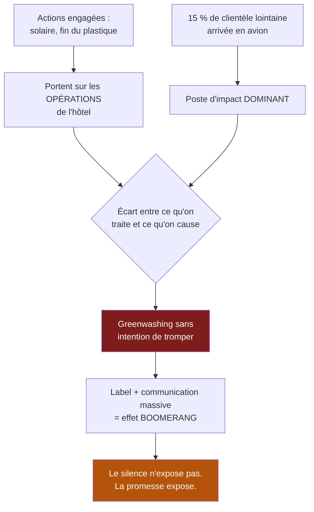

> ⬅ [[CAS08_Le_transporteur_qui_optimise_ses_tournees]] · [[00_Index_Mises_en_situation|🗂 Index]] · [[CAS10_Lediteur_de_logiciels_et_son_parc_informatique]] ➡

# CAS 9 — Le groupe hôtelier qui veut un label

> **L'entreprise.** *Alpes & Sens*, groupe hôtelier valaisan. **4 établissements** (3 et 4 étoiles), 260 salariés en haute saison, 31 M CHF de CA. Clientèle : 55 % suisse, 30 % européenne, 15 % lointaine (avion). Les hivers raccourcissent : deux stations desservies ont perdu 18 jours d'enneigement moyen en dix ans. Le groupe a installé des panneaux solaires, supprimé les bouteilles plastiques et affiche « Notre engagement pour la montagne » sur son site. Il envisage maintenant d'obtenir un label environnemental reconnu, et de communiquer massivement dessus.
>
> **La question posée.**
> *« Le label est-il un levier stratégique pertinent pour Alpes & Sens ? Analysez les risques et recommandez une démarche. »*

---

## 🧩 Les notions clés

- **Labels et asymétrie d'information** 🔎
- **Greenwashing** 📘
- **Différenciation** et proposition de valeur
- **PESTEL** — dimension **É** (écologique/éthique) 📘
- **Matrice parties prenantes intérêt × pouvoir** 📘
- **Chaîne de valeur** — où est réellement l'impact
- **Durabilité forte vs faible** 📘

## 📖 Définitions pour les nuls

| Notion | En une phrase simple |
|---|---|
| **Label** | Une certification délivrée par un organisme extérieur, qui atteste ce qu'on affirme 🔎 |
| **Asymétrie d'information** | Le client ne peut pas vérifier ce que vous dites ; il lui faut un tiers 🔎 |
| **Greenwashing** | 📘 Une communication qui **survend** l'engagement réel |
| **Durabilité faible** | On peut compenser un dégât par autre chose (planter des arbres pour un vol) 📘 |
| **Durabilité forte** | 📘 Le capital naturel est **non substituable** : on ne compense pas, on évite |

## 🔍 Décorticage de la consigne (L-I-S-A-E-C)

**L — Lire.** « Levier stratégique **pertinent** » : on demande si le label sert la stratégie, pas s'il est sympathique. « Analysez les **risques** » : le mot est explicite, il y en a, et le principal a un nom.

**I — Identifier.** ⚠️ Le piège central : l'énoncé énumère des actions vertueuses (solaire, plastique) et une clientèle dont **15 % arrive en avion**. Un étudiant attentif comprend que l'essentiel de l'impact du groupe n'est pas dans ce qu'il a traité.

**S — Structurer.**
1. À quoi sert un label (le mécanisme, avant l'avis)
2. Où est réellement l'impact d'Alpes & Sens — et ce que ça change
3. Le risque : greenwashing et effet boomerang
4. Recommandation

**C — Conclure.** Trancher : oui au label, non à la communication massive — et expliquer pourquoi cette dissociation est le cœur de la réponse.

## 🧠 Le raisonnement stratégique (D-E-I)

### Axe 1 — Pourquoi un label, et pourquoi il ne peut pas être auto-décerné

**D — Définir.** 🔎 Un **label** est une attestation délivrée par un tiers indépendant. Son rôle : réduire l'**asymétrie d'information** entre l'entreprise et son client.

**E — Expliquer.** Le mécanisme est simple et rigoureux : Alpes & Sens affirme être engagée pour la montagne. Pourquoi la croirait-on ? Elle a un intérêt évident à le dire, qu'elle dise vrai ou non, et le client ne peut pas vérifier.

🔎 **Une affirmation faite par celui qui en profite ne vaut rien — même quand elle est vraie.** C'est le vrai problème : l'hôtelier sincère et l'hôtelier menteur tiennent exactement le même discours. Seul un tiers qui n'a rien à gagner peut trancher.

**I — Illustrer.** Le bandeau « Notre engagement pour la montagne » actuellement affiché sur le site n'a donc **aucune valeur informative**. Il en a même une négative : il signale une entreprise qui communique sans preuve, ce qui est le premier indice de greenwashing pour un client averti.

🔎 **Retournement intéressant à placer** : Alpes & Sens a intérêt à ce que ses **concurrents** adoptent le même label. Un label que personne d'autre n'utilise ne signale rien au client, qui ne sait pas ce que c'est. La valeur d'une certification croît avec sa diffusion — l'un des rares cas où la propagation chez les rivaux vous enrichit.

### Axe 2 — Où est réellement l'impact : le déplacement du problème

**D — Définir.** 📘 La chaîne de valeur durable couvre « l'ensemble des activités, depuis les matières premières jusqu'au recyclage ou à la fin de vie ». 📘 La durabilité impose de considérer « ici **et ailleurs** ».

**E — Expliquer.** Les actions engagées (solaire, plastique) portent sur les **opérations de l'hôtel**. Or dans l'hôtellerie de montagne, l'impact dominant se situe presque toujours dans deux postes situés **hors** de l'établissement :

1. **Le transport des clients** — 15 % de clientèle lointaine par avion représente très probablement la majorité de l'empreinte du groupe.
2. **L'enneigement artificiel et l'infrastructure de station** — que le groupe ne contrôle pas mais dont il dépend et qu'il alimente commercialement.

**I — Illustrer.** 🔎 Formulation à donner :

> *« Alpes & Sens a supprimé les bouteilles en plastique dans des chambres occupées par des clients arrivés en avion. Ce n'est pas faux, mais ce n'est pas là que ça se joue. Traiter ce qu'on contrôle et ignorer ce qu'on cause est précisément le mécanisme qui produit le greenwashing sans intention de tromper. »*

⚠️ **Lien avec la durabilité forte** 📘 : compenser un vol long-courrier par des panneaux solaires relève de la **durabilité faible** — l'idée que les capitaux se substituent. La durabilité forte considère le capital naturel comme non substituable : elle impose de **réduire d'abord**, pas de compenser. 📘 Le cours l'écrit explicitement dans le BM durable : « réduire **ou** compenser » — mais l'ordre compte.

### Axe 3 — Le risque : l'effet boomerang

**D — Définir.** 📘 Le **greenwashing** est une communication qui survend l'engagement écologique réel : allégations vagues, sans preuve.

**E — Expliquer le mécanisme du risque.** 🔎 Ce point est contre-intuitif et il vaut des points :

> **Plus une entreprise communique sur son engagement, plus l'écart entre le discours et la réalité devient coûteux quand il est découvert.**

Le silence n'expose pas. La promesse expose. Une entreprise ordinaire dont on découvre un impact est jugée ordinaire ; une entreprise labellisée dont on découvre le même impact est jugée **menteuse**. Le label transforme un fait neutre en scandale potentiel.

**I — Illustrer.** Scénario réaliste : un média régional calcule l'empreinte réelle d'Alpes & Sens en incluant les vols de sa clientèle, et publie un article. Le groupe passe du statut d'hôtelier de montagne à celui d'exemple de greenwashing — et perd précisément la clientèle suisse et européenne sensible à ces sujets, c'est-à-dire son cœur de marché à 85 %.

### La matrice parties prenantes 📘

| Partie prenante | Intérêt | Pouvoir | Stratégie 📘 |
|---|---|---|---|
| Clientèle suisse/européenne | Fort et croissant | Fort (85 % du CA) | **Gérer de près** |
| Collaborateurs saisonniers | Moyen | Faible | Informer |
| Communes et remontées mécaniques | Fort | Fort (elles conditionnent l'attractivité) | **Gérer de près** |
| Médias et associations locales | Fort | Fort (capacité de révélation) | **Surveiller de près** |
| Clientèle lointaine | Faible | Moyen (15 % du CA) | Informer |

🔎 Lecture : les deux parties prenantes les plus puissantes sont la clientèle de proximité et les acteurs de la station. Toutes deux valorisent la **crédibilité**, pas la communication. La matrice conduit donc à la même conclusion que l'analyse d'impact.

## ⚖️ L'arbitrage et la recommandation (filtre SAF)

| Critère | Analyse | Verdict |
|---|---|---|
| **S** | ✅ Le label sert la différenciation dans un secteur où l'enneigement décroissant impose de vendre autre chose que la neige | **Passe** |
| **A** | ⚠️ 📘 *Retour ?* Différenciation réelle. *Risque ?* **Élevé si la communication précède la substance.** *Opposition ?* Les remontées mécaniques n'apprécieront pas qu'on parle de l'impact de la station | **Conditionnel** |
| **F** | ✅ Certification accessible ; coût modéré au regard de 31 M de CA | **Passe** |

### 🔎 La recommandation

> **Oui au label. Non à la communication massive — du moins pas maintenant, et pas dans cet ordre.**
>
> 1. **Obtenir le label d'abord, et le laisser parler seul pendant 12 mois.** Un label affiché sobrement est une preuve ; un label claironné est une promesse. La différence de risque est considérable.
> 2. **Traiter le poste dominant avant de communiquer** : mesurer l'empreinte du transport des clients et agir dessus — offres « séjour long » pour la clientèle lointaine (moins de vols par nuitée), partenariats ferroviaires, tarification incitative pour l'arrivée en train. 🔎 C'est la seule action qui rende le discours défendable.
> 3. **Repositionner l'offre indépendamment de la neige** : l'énoncé donne le vrai enjeu stratégique (−18 jours d'enneigement en dix ans). Le label et la démarche environnementale doivent servir un repositionnement « montagne quatre saisons », pas décorer un modèle qui dépend d'un actif en train de disparaître.
> 4. **Publier les chiffres, y compris les mauvais.** 📘 On évite le greenwashing par « des preuves chiffrées, des labels indépendants, de la transparence, un reporting vérifiable ». Publier une empreinte élevée mais en baisse est plus solide que publier un slogan.

## ⚠️ Le piège classique

**L'erreur type n°1 — juger le label en soi (bien / pas bien).** Un label n'est ni bon ni mauvais : c'est un **signal**, et sa valeur dépend de ce qu'il y a derrière. **Réflexe correctif :** demandez toujours *« que certifie exactement ce label, et sur quel périmètre ? »*

**L'erreur type n°2 — accepter le périmètre de l'entreprise.** L'énoncé parle de panneaux solaires et de bouteilles ; l'étudiant reste sur ces sujets. Mais 📘 « ici **et ailleurs** » interdit de considérer qu'un impact hors périmètre n'existe pas. **Réflexe correctif :** dans tout cas de durabilité, cherchez l'impact **en amont et en aval** avant de commenter les opérations internes.

**L'erreur type n°3 — confondre compensation et réduction.** 📘 L'ordre est réduire **puis** compenser. Un raisonnement qui met les deux sur le même plan adopte implicitement la **durabilité faible**, alors que le cours défend la **forte**. **Réflexe correctif :** dites explicitement laquelle des deux vous mobilisez.

---

## 🗺️ Visuels de synthèse

### La chaîne de raisonnement



### Le chiffre qui tranche

```
Où est réellement l'impact ?   (illustratif)

Transport des clients   ████████████████████  dominant
Infrastructure station  ████████              forte
Énergie des bâtiments   ███                   traitée ✅
Bouteilles plastique    ▌                     traitée ✅
                        └── ce sur quoi la communication porte

→ 85 % du CA vient d'une clientèle de proximité :
  elle valorise la crédibilité, pas le slogan
```

⚠️ Graphique **illustratif** : les proportions servent le raisonnement, elles ne sont pas des données mesurées.

---

## 🔗 Navigation

⬅ [[CAS08_Le_transporteur_qui_optimise_ses_tournees]] · [[00_Index_Mises_en_situation|🗂 Index des 27 cas]] · [[CAS10_Lediteur_de_logiciels_et_son_parc_informatique]] ➡
