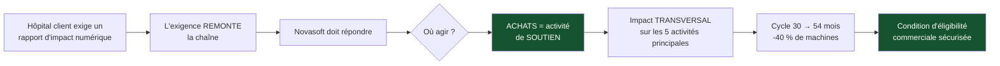

> ⬅ [[CAS09_Le_groupe_hotelier_qui_veut_un_label]] · [[00_Index_Mises_en_situation|🗂 Index]] · [[CAS11_La_cooperative_maraichere_qui_doute_de_son_modele]] ➡

# CAS 10 — L'éditeur de logiciels et son parc informatique

> **L'entreprise.** *Novasoft SA*, Fribourg. Éditeur de logiciels de gestion pour cabinets médicaux. **54 salariés** dont 38 développeurs, 7,8 M CHF de CA. Le parc informatique compte 54 postes de travail haut de gamme renouvelés **tous les 30 mois** par principe (« les développeurs doivent avoir les meilleures machines »), 3 baies de serveurs internes, et un budget IT annuel de 420 000 CHF. Le nouveau directeur financier découvre que personne ne sait ce que deviennent les anciennes machines. Un grand client hospitalier demande désormais un « rapport d'impact numérique » à ses fournisseurs.
>
> **La question posée.**
> *« Construisez une politique d'achats IT responsables pour Novasoft. Quel impact sur la chaîne de valeur et sur la relation client ? »*

---

## 🧩 Les notions clés

- **Achats IT responsables** 📘
- **Les 3R** : Réduire > Réutiliser > Recycler 📘
- **Coût du cycle de vie** 📘
- **Chaîne de valeur** — l'approvisionnement comme activité de **soutien** 📘
- **Trois postes d'impact du numérique** 📘
- **Sobriété numérique** 📘
- **Système de valeur** — l'exigence du client remonte la chaîne

## 📖 Définitions pour les nuls

| Notion | En une phrase simple |
|---|---|
| **Achats IT responsables** | 📘 Choisir son matériel informatique selon des critères qui dépassent le prix d'achat |
| **3R** | 📘 **Réduire** (acheter moins) → **Réutiliser** (reconditionné) → **Recycler** (dernier recours) |
| **Coût du cycle de vie** | 📘 Achat + fonctionnement + élimination — pas seulement le prix affiché |
| **Activité de soutien** | 📘 Une activité qui traverse toute l'entreprise : ici, les achats |
| **Système de valeur** | 📘 L'enchaînement des chaînes de valeur : fournisseur → vous → client |

## 🔍 Décorticage de la consigne (L-I-S-A-E-C)

**L — Lire.** « **Construisez** une politique » = produire un dispositif concret, avec des règles. Puis deux effets à traiter : **chaîne de valeur** et **relation client**. ⚠️ Le second est le plus intéressant et c'est celui qu'on oublie.

**I — Identifier.** L'énoncé contient une donnée décisive : le client hospitalier demande un rapport d'impact. 🔎 C'est le **système de valeur** en action — une exigence de durabilité qui remonte de maillon en maillon. Le sujet cesse d'être écologique pour devenir **commercial**.

**S — Structurer.**
1. Le diagnostic : où sont les 420 000 CHF et où est l'impact
2. La politique, construite selon les 3R **dans l'ordre**
3. L'effet chaîne de valeur : pourquoi les achats sont un levier transversal
4. L'effet relation client : le système de valeur

**C — Conclure.** Trancher sur le cycle de renouvellement — c'est la décision la plus lourde et la plus contestée.

## 🧠 Le raisonnement stratégique (D-E-I)

### Axe 1 — Le fait qui commande tout : l'impact est dans la fabrication

**D — Définir.** 📘 Les **trois postes d'impact du numérique** : terminaux, data centers, réseaux. 📘 Le **coût du cycle de vie** d'un achat IT comprend l'achat, le fonctionnement et l'élimination.

**E — Expliquer.** 🔎 Pour un poste de travail, l'essentiel de l'impact environnemental est déjà consommé **avant le premier allumage** : extraction des métaux, gravure des puces, assemblage, transport. L'électricité consommée ensuite est la part la plus faible.

⚠️ Conséquence directe et contre-intuitive : **éteindre les écrans la nuit est marginal ; passer de 30 à 60 mois de renouvellement est majeur.** Une politique d'achats responsables qui parle d'économies d'énergie sans toucher au cycle de renouvellement s'attaque au petit poste.

**I — Illustrer.** Novasoft renouvelle 54 postes tous les 30 mois. Passer à 54 mois divise **par 1,8** le nombre de machines fabriquées pour la même activité. Aucune action sur la consommation électrique ne produit un effet de cet ordre.

### Axe 2 — La politique, construite dans l'ordre des 3R

**D — Définir.** 📘 Les **3R** : **Réduire** > **Réutiliser** > **Recycler**, et l'ordre compte — 📘 « recycler est un dernier recours (coûteux en énergie) ». 📘 Relève de l'**ODD 12** (consommation et production responsables).

**E — Expliquer.** ⚠️ L'erreur universelle est de commencer par le recyclage, parce que c'est le plus visible et le moins conflictuel. Or c'est le moins efficace.

**I — Illustrer.** La politique proposée pour Novasoft :

| Niveau | Mesure concrète | Effet estimé |
|---|---|---|
| **1. RÉDUIRE** | Cycle de renouvellement porté de 30 à 54 mois, avec **dérogation motivée** pour les postes de compilation lourde | −40 % de machines achetées |
| | Suppression du principe « meilleure machine pour tous » : segmentation en 3 profils selon l'usage réel | −18 % sur le coût unitaire moyen |
| | Virtualisation des environnements de test au lieu de postes dédiés | −6 postes |
| **2. RÉUTILISER** | Achat de **postes reconditionnés** pour les profils bureautiques (administration, support) | −12 machines neuves/an |
| | Reprise organisée des machines sortantes par un reconditionneur régional, avec effacement certifié | Fin de l'angle mort actuel |
| | Remplacement des composants (SSD, RAM, batterie) plutôt que du poste entier | +18 mois de vie moyenne |
| **3. RECYCLER** | Filière DEEE agréée, en dernier recours uniquement, avec attestation | Traçabilité complète |

📘 **Le critère d'achat change aussi** : passer du **prix d'achat** au **coût du cycle de vie** (achat + fonctionnement + élimination). 🔎 Un poste reconditionné à 700 CHF avec 4 ans de vie utile bat un poste neuf à 1 900 CHF avec 30 mois de politique de renouvellement — mais seul le second apparaît « performant » dans un tableau de comparaison classique.

### Axe 3 — Pourquoi les achats sont le bon levier : l'effet transversal

**D — Définir.** 📘 Dans la chaîne de valeur, l'**approvisionnement** est une **activité de soutien**, dont « l'impact est **transversal** sur toutes les unités et sections ». ⚠️ 📘 Le cours 5 l'appelle « les achats ».

**E — Expliquer.** 🔎 C'est le point le plus fort de cette réponse : une décision prise dans une case de soutien se répercute sur **les cinq** activités principales simultanément. Changer de politique d'achat modifie d'un coup ce qui équipe la production (développement), les services, le marketing, la logistique.

⚠️ Et rappelons le piège du vocabulaire : « approvisionnement » désigne **deux cases différentes** dans la chaîne de valeur — le mouvement physique (activité principale n°1) et la **décision d'achat** (activité de soutien). C'est la seconde qui est en jeu ici.

**I — Illustrer.** Novasoft ne peut pas « réduire son impact » globalement — c'est trop vague pour être actionnable. Elle peut modifier **une case**, celle des achats, et obtenir un effet sur tout le reste. 🔎 **On découpe pour localiser, puis on agit sur la case la plus transversale.**

### Axe 4 — La relation client : le système de valeur

**D — Définir.** 📘 Le **système de valeur** est l'enchaînement des chaînes de valeur : celle du fournisseur, la vôtre, celle du client.

**E — Expliquer.** L'hôpital client de Novasoft subit lui-même des exigences (marchés publics, reporting). Pour y répondre, il doit connaître l'impact de ses fournisseurs. **L'exigence remonte donc la chaîne, maillon par maillon.**

🔎 Le basculement stratégique : ce que Novasoft prenait pour une question de conscience devient une **condition d'éligibilité commerciale**. Un fournisseur incapable de produire un rapport d'impact devient progressivement inéligible, indépendamment de la qualité de son logiciel.

**I — Illustrer.** Novasoft peut transformer cette contrainte en avantage : être le **premier** éditeur du secteur à fournir un rapport d'impact documenté. 🔎 L'avantage ne durera pas — les autres suivront — mais il ouvre les portes pendant 2 à 3 ans, ce qui suffit pour verrouiller des contrats pluriannuels.

## ⚖️ L'arbitrage et la recommandation (filtre SAF)

### Analyse à double sens 🔎

| Le numérique **soutient** ici | Le numérique **freine** ici |
|---|---|
| La virtualisation supprime des postes physiques | Elle déplace la charge vers les serveurs — 📘 il faut vérifier le bilan sur les 3 postes |
| Le suivi de parc permet de mesurer et donc de piloter | L'outil de suivi est lui-même un système à héberger |
| Le télétravail réduit les déplacements | ⚠️ **Effet rebond** : il multiplie les équipements (un poste au bureau **et** un à la maison) |

### Le SAF

| Critère | Analyse | Verdict |
|---|---|---|
| **S** | ✅ Réduit un coût réel (420 k CHF/an) et sécurise un client majeur | **Passe** |
| **A** | ⚠️ 📘 *Opposition ?* **Les 38 développeurs.** Le matériel est un marqueur de statut et de confort de travail dans ce métier. C'est la vraie difficulté | **Conditionnel** |
| **F** | ✅ Aucun obstacle technique ; filières de reconditionnement disponibles | **Passe** |

### 🔎 La recommandation

> **Adopter la politique, mais traiter l'opposition des développeurs comme le point critique du projet, pas comme un détail RH.**
>
> - **Segmenter au lieu d'uniformiser** : les développeurs sur compilation lourde gardent un cycle court ; les 22 autres postes passent à 54 mois. Une règle uniforme serait perçue comme une punition collective ; une règle fondée sur l'usage est défendable.
> - **Redistribuer visiblement une part de l'économie** : si la politique économise 140 000 CHF/an, en affecter une fraction à des équipements dont les développeurs bénéficient (écrans de qualité, sièges, formation). 🔎 Sans contrepartie visible, une mesure de sobriété est vécue comme une baisse de considération.
> - **Commencer par l'angle mort** : la reprise des machines sortantes. C'est immédiat, ça ne coûte rien, ça ne heurte personne, et ça produit le premier chapitre du rapport d'impact demandé par l'hôpital.
> - **Ne pas promettre un rapport d'impact complet avant d'avoir 6 mois de données réelles** — 📘 sinon on entre en greenwashing.

## ⚠️ Le piège classique

**L'erreur type n°1 — inverser les 3R.** Commencer par le recyclage, parce que c'est ce qui se voit. 📘 L'ordre est **Réduire > Réutiliser > Recycler**, et le recyclage est un dernier recours coûteux en énergie. **Réflexe correctif :** énoncez l'ordre explicitement et justifiez-le.

**L'erreur type n°2 — raisonner sur la consommation électrique.** C'est le poste que tout le monde cite et c'est le plus faible pour un terminal. **Réflexe correctif :** rappelez que l'impact d'un équipement est concentré dans sa **fabrication**, donc que la durée de vie est le levier n°1.

**L'erreur type n°3 — traiter les achats comme une fonction administrative.** 📘 C'est une activité de **soutien**, donc **transversale** : le levier le plus puissant et le moins visible. **Réflexe correctif :** citez le mot « transversal », il est dans les slides.

---

## 🗺️ Visuels de synthèse

### La chaîne de raisonnement



### Le chiffre qui tranche

```
Où est l'impact d'un poste de travail ?   (illustratif)

Fabrication   ████████████████████████  l'essentiel
Usage         ███                       marginal
Fin de vie    █                         faible

→ Éteindre les écrans la nuit : négligeable
→ Passer de 30 à 54 mois : DIVISE PAR 1,8
  le nombre de machines fabriquées
```

⚠️ Graphique **illustratif** : les proportions servent le raisonnement, elles ne sont pas des données mesurées.

---

## 🔗 Navigation

⬅ [[CAS09_Le_groupe_hotelier_qui_veut_un_label]] · [[00_Index_Mises_en_situation|🗂 Index des 27 cas]] · [[CAS11_La_cooperative_maraichere_qui_doute_de_son_modele]] ➡
