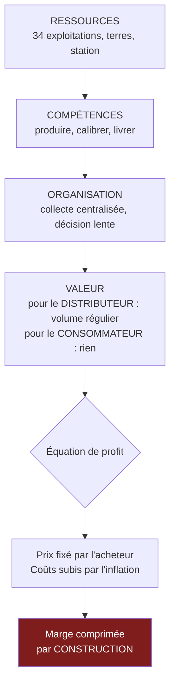

> ⬅ [[CAS10_Lediteur_de_logiciels_et_son_parc_informatique]] · [[00_Index_Mises_en_situation|🗂 Index]] · [[CAS12_La_fintech_qui_veut_faire_de_la_conformite_un_argument]] ➡

# CAS 11 — La coopérative maraîchère qui doute de son modèle

> **L'entreprise.** *Terre du Rhône*, coopérative maraîchère, plaine du Rhône valaisanne. **34 exploitations membres**, 6 salariés permanents à la structure centrale, 19 M CHF de volume commercialisé. Le modèle : la coopérative collecte, calibre, conditionne et vend aux deux grands distributeurs suisses, qui représentent **88 % des débouchés**. Les prix sont fixés annuellement par les acheteurs. Les marges des exploitants stagnent depuis six ans. Quatre membres, de moins de 40 ans, poussent pour créer une marque propre et vendre en direct (paniers, restauration collective, épiceries). Les autres craignent de perdre les volumes garantis.
>
> **La question posée.**
> *« Analysez le business model de Terre du Rhône avec le modèle RCOV. Une stratégie de vente directe est-elle pertinente ? »*

---

## 🧩 Les notions clés

- **Modèle RCOV** 📘 (Ressources, Compétences, Organisation, Valeur)
- **Équation de profit** 📘
- **Pouvoir de négociation des clients** (force de Porter) 📘
- **Ressources immatérielles** — la marque 📘
- **Labels** et proposition de valeur
- **ODD** et ancrage territorial 📘
- **SAF** et matrice parties prenantes 📘

## 📖 Définitions pour les nuls

| Notion | En une phrase simple |
|---|---|
| **RCOV** | 📘 Un modèle en 4 briques : les **R**essources et **C**ompétences, mises en **O**rganisation, produisent une proposition de **V**aleur, d'où découle le profit |
| **Coopérative** | Une entreprise détenue par ses membres, qui sont aussi ses fournisseurs 🔎 |
| **Équation de profit** | 📘 Revenus (fixes/variables) − structure de coûts |
| **Pouvoir de négociation du client** | 📘 Quand l'acheteur impose ses conditions parce que le vendeur dépend de lui |

## 🔍 Décorticage de la consigne (L-I-S-A-E-C)

**L — Lire.** L'outil est **imposé** : RCOV. Ne pas l'utiliser explicitement est une faute. Puis une question fermée — « pertinente ? » — donc il faut **trancher**.

**I — Identifier.** ⚠️ Le chiffre décisif est **88 % des débouchés chez deux acheteurs**. Comme au cas 1, c'est une situation de dépendance : tout gain de productivité de la coopérative sera capté par ses acheteurs.

**S — Structurer.**
1. RCOV du modèle actuel (les 4 briques)
2. Le diagnostic : où le modèle fuit
3. RCOV du modèle « vente directe »
4. Recommandation SAF — et la tension interne entre les générations de membres

**C — Conclure.** Trancher, et traiter explicitement le désaccord entre membres : dans une coopérative, l'acceptabilité **est** la stratégie.

## 🧠 Le raisonnement stratégique (D-E-I)

### Axe 1 — RCOV du modèle actuel

**D — Définir.** 📘 Le **RCOV** articule quatre éléments : **R**essources et **C**ompétences → **O**rganisation → proposition de **V**aleur → profit.

**E — Expliquer.** L'intérêt du RCOV par rapport au BMC : il part des **ressources et compétences** et montre comment elles se transforment en valeur. Il est donc mieux adapté qu'un BMC pour diagnostiquer une entreprise qui possède un actif et ne sait pas le valoriser.

**I — Illustrer.**

| Brique | Modèle actuel de Terre du Rhône |
|---|---|
| **Ressources** | 34 exploitations, terres de la plaine du Rhône, station de conditionnement, capital coopératif |
| **Compétences** | Production maraîchère, calibrage, logistique de collecte. ⚠️ **Aucune compétence commerciale ni marketing** |
| **Organisation** | Collecte centralisée → calibrage → livraison en gros. Décision collective, lente |
| **Valeur** | Pour les distributeurs : volume régulier, qualité constante, interlocuteur unique. **Pour le consommateur final : rien — il ne sait pas que Terre du Rhône existe** |

🔎 **Le diagnostic tombe de lui-même** : la coopérative crée de la valeur pour son **acheteur**, pas pour le **consommateur**. Elle n'est donc pas en position de négocier — elle est un fournisseur interchangeable de commodité.

### Axe 2 — Où le modèle fuit : l'équation de profit

**D — Définir.** 📘 L'**équation de profit** = revenus (fixes et variables) − structure de coûts.

**E — Expliquer.** Côté revenus : le prix est **fixé annuellement par les acheteurs**. La coopérative n'a donc aucun levier sur la moitié gauche de son équation. Côté coûts : ils suivent l'inflation (énergie, main-d'œuvre saisonnière, intrants).

🔎 **Conséquence mécanique** : une entreprise qui ne contrôle ni son prix ni ses coûts voit sa marge se comprimer par construction. La stagnation des marges depuis six ans n'est pas un accident conjoncturel, **c'est le résultat prévisible du modèle**.

**I — Illustrer.** Formulation pour l'oral :

> *« Terre du Rhône n'a pas un problème de productivité. Elle a un problème de position : elle a délégué à ses acheteurs la fixation de son revenu. Toute amélioration de ses coûts sera récupérée par eux lors de la négociation suivante. »*

### Axe 3 — RCOV du modèle « vente directe »

**E — Expliquer.** La vente directe ne modifie pas la brique **Ressources** — les terres et les exploitations sont les mêmes. Elle exige en revanche des **compétences** que la coopérative n'a pas, et transforme radicalement l'**organisation**.

**I — Illustrer.**

| Brique | Ce qui change | Difficulté |
|---|---|---|
| **Ressources** | + une marque, + une capacité de préparation de commandes fractionnées | Moyenne — la marque se construit lentement 📘 (ressource immatérielle) |
| **Compétences** | + vente, marketing, relation client, gestion des invendus | ⚠️ **Élevée — c'est le point de blocage** |
| **Organisation** | De la palette au colis : logistique inversée, commandes multiples, saisonnalité subie | ⚠️ Élevée |
| **Valeur** | Pour le consommateur : origine, fraîcheur, lien au producteur, prix juste payé à l'agriculteur | Forte — c'est ce qui manque aujourd'hui |

🔎 **Le gain n'est pas seulement le prix.** En vendant en direct, la coopérative récupère la **relation client**, donc l'information sur la demande, donc la capacité d'adapter ses cultures. Elle sort du statut de fournisseur de commodité.

⚠️ **Mais la contrainte est réelle** : la vente directe absorbe rarement plus de 15 à 25 % des volumes d'une structure de cette taille. Elle ne remplace pas les distributeurs — **elle les équilibre**.

## ⚖️ L'arbitrage et la recommandation (filtre SAF)

### La tension interne : quatre membres contre trente

📘 L'acceptabilité se teste avec la **matrice intérêt × pouvoir**.

| Partie prenante | Intérêt | Pouvoir | Stratégie 📘 |
|---|---|---|---|
| Les 4 membres < 40 ans | Fort | Faible individuellement, **fort si soutenus** | Informer et associer |
| Les 30 autres membres | Fort | **Fort** (vote coopératif) | **Gérer de près** |
| Les 2 distributeurs | Moyen | **Très fort** (88 % des débouchés) | **Gérer de près** |
| Les salariés de la structure | Fort | Faible | Informer |

🔎 **Le point délicat, et il faut le dire** : si Terre du Rhône lance une marque propre, les distributeurs peuvent le percevoir comme une concurrence et sanctionner la coopérative sur les volumes ou les prix. C'est le risque principal, et il est absent de l'énoncé.

### Le SAF

| Critère | Analyse | Verdict |
|---|---|---|
| **S** | ✅ Sortir d'une dépendance à 88 % et récupérer la fixation du prix sur une part de l'activité sert directement la finalité de la coopérative — le revenu de ses membres | **Passe** |
| **A** | ⚠️ 📘 *Retour ?* Meilleur prix unitaire mais coûts commerciaux nouveaux. *Risque ?* Représailles des distributeurs. *Opposition ?* 30 membres sur 34 | ❌ **Bloquée en l'état** |
| **F** | ⚠️ Aucune compétence commerciale interne, organisation inadaptée | **Fragile** |

### 🔎 La recommandation

> **Oui à la vente directe — mais en pilote, sur un périmètre restreint, et sans marque frontale la première année.**
>
> 1. **Commencer par la restauration collective** (EMS, cantines scolaires, hôpitaux du Valais) plutôt que par les paniers grand public. 🔎 Trois raisons : les volumes sont proches de ceux que la coopérative sait déjà préparer, les commandes sont régulières et prévisibles, et **les marchés publics valorisent l'origine locale** — la valeur est donc reconnue sans effort marketing.
> 2. **Objectif à 3 ans : 15 % des volumes en direct**, pas 50 %. Cela ramène la dépendance aux distributeurs de 88 % à ~73 % — un mouvement réel, absorbable, et qui ne déclenche pas de représailles.
> 3. **Acquérir la compétence par l'extérieur** : recruter un seul profil commercial partagé, ou s'associer à une autre coopérative pour mutualiser la fonction. 🔎 Aucune des deux ne financerait seule ce poste ; ensemble elles le peuvent — c'est le mécanisme du bien collectif.
> 4. **Traiter l'opposition des 30 membres avec un dispositif, pas un discours** : un pilote limité, budgété séparément, avec une clause de sortie à 24 mois si les objectifs ne sont pas atteints. ⚠️ Dans une coopérative, une stratégie qui ne passe pas le vote n'existe pas — **l'acceptabilité n'est pas un critère parmi trois, c'est le critère décisif**.

## ⚠️ Le piège classique

**L'erreur type n°1 — traiter le RCOV comme une liste.** Remplir quatre cases sans montrer l'enchaînement. 📘 Le RCOV est une **chaîne causale** : les ressources et compétences produisent une organisation, qui produit une proposition de valeur, qui produit le profit. **Réflexe correctif :** dites « donc » entre chaque brique.

**L'erreur type n°2 — proposer un basculement total.** L'étudiant enthousiaste recommande d'abandonner les distributeurs. C'est irréaliste et cela ignore le risque de représailles. **Réflexe correctif :** en stratégie, le mouvement crédible est presque toujours **partiel et séquencé**.

**L'erreur type n°3 — oublier la gouvernance.** Dans une coopérative, les fournisseurs sont les propriétaires et votent. Un plan techniquement excellent qui heurte 30 membres sur 34 ne verra jamais le jour. **Réflexe correctif :** identifiez toujours **qui décide** avant de recommander quoi que ce soit.

---

## 🗺️ Visuels de synthèse

### La chaîne de raisonnement



### Le chiffre qui tranche

```
Dépendance aux débouchés   (illustratif)

Aujourd'hui
 2 distributeurs  ██████████████████░░  88 %
 Autres canaux    ██                    12 %

Cible à 3 ans (vente directe en pilote)
 2 distributeurs  ███████████████░░░░░  73 %
 Restauration collective + direct  █████  27 %

→ Un mouvement réel, absorbable, qui ne
  déclenche pas de représailles
```

⚠️ Graphique **illustratif** : les proportions servent le raisonnement, elles ne sont pas des données mesurées.

---

## 🔗 Navigation

⬅ [[CAS10_Lediteur_de_logiciels_et_son_parc_informatique]] · [[00_Index_Mises_en_situation|🗂 Index des 27 cas]] · [[CAS12_La_fintech_qui_veut_faire_de_la_conformite_un_argument]] ➡
