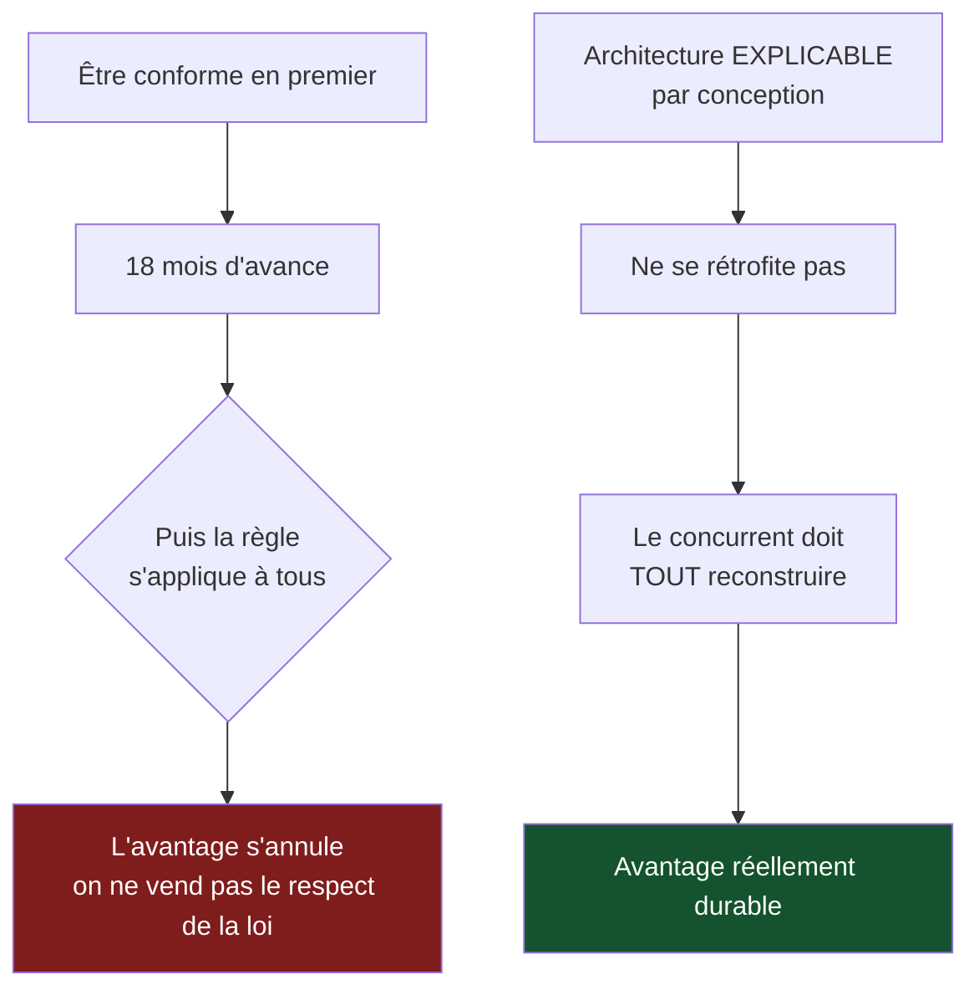

> ⬅ [[CAS11_La_cooperative_maraichere_qui_doute_de_son_modele]] · [[00_Index_Mises_en_situation|🗂 Index]] · [[CAS13_Le_fabricant_delectromenager_rattrape_par_la_reparabilite]] ➡

# CAS 12 — La fintech qui veut faire de la conformité un argument

> **L'entreprise.** *Payflow SA*, Zoug. **77 salariés**, solution de paiement et de scoring de crédit pour e-commerçants européens. 14 M CHF de CA. Un moteur algorithmique attribue en 200 ms une décision d'octroi de crédit à la consommation (« acheter maintenant, payer plus tard »). Le modèle est entraîné sur 40 millions de transactions. Taux de refus : 23 %. Un régulateur européen s'apprête à durcir les règles sur les décisions automatisées touchant l'accès au crédit. Deux concurrents communiquent sur leur « IA responsable ». Le CEO veut « prendre de l'avance sur la conformité et en faire un argument commercial ».
>
> **La question posée.**
> *« La conformité peut-elle constituer un avantage concurrentiel durable ? Analysez le cas Payflow et recommandez une trajectoire. »*

---

## 🧩 Les notions clés

- **Avantage concurrentiel durable** (sens A) 📘
- **Ressources immatérielles** 📘
- **RNE** — 4 axes, et rôles de gouvernance 📘
- **Privacy by design / by default** 📘
- **Principes de gestion responsable des données** 📘
- 📚 **AI Act** — 4 niveaux de risque (complément hors cours)
- **La 6e force : l'État** 📘
- **Exclusion indirecte** 📘

## 📖 Définitions pour les nuls

| Notion | En une phrase simple |
|---|---|
| **Scoring de crédit** | Un calcul automatique qui décide si on vous prête ou non 🔎 |
| **Privacy by design** | 📘 La protection des données est intégrée **dès la conception** |
| **Privacy by default** | 📘 Dans les slides du cours : « obtenir un **consentement libre et éclairé** ». ⚠️ Attention, une autre définition courante parle des « réglages par défaut les plus protecteurs » — connaissez la version des slides |
| **Avantage concurrentiel durable** | 📘 Un avantage difficile à imiter et à transférer |
| **Exclusion indirecte** | 📘 Un service légal qui exclut de fait une population, sans intention |
| **6e force** | 📘 L'État, ajouté aux 5 forces de Porter dans ce cours |

## 🔍 Décorticage de la consigne (L-I-S-A-E-C)

**L — Lire.** Question fermée sur un concept — « la conformité peut-elle constituer un avantage **durable** ? ». ⚠️ **Ici, « durable » signifie « qui dure », pas « écologique ».** Le repérer et le dire explicitement est un point facile et rarement pris.

**I — Identifier.** Trois blocs : **avantage concurrentiel** (chap. 1), **RNE et données** (chap. RNE), **État comme 6e force** (Porter).

**S — Structurer.**
1. Lever l'ambiguïté du mot « durable »
2. Pourquoi la conformité **n'est pas** un avantage durable au sens strict
3. Ce qui, autour d'elle, peut le devenir
4. L'angle mort : le taux de refus de 23 %
5. Recommandation

**C — Conclure.** Trancher avec nuance : oui, mais pas comme le CEO l'imagine.

## 🧠 Le raisonnement stratégique (D-E-I)

### Axe 0 — Lever l'ambiguïté (30 secondes qui rapportent)

🔎 À dire d'emblée :

> *« Le mot "durable" a deux sens dans ce cours. Ici, il qualifie un **avantage concurrentiel** : il signifie donc "qui résiste à l'imitation", et non "soutenable écologiquement". Je traite la question dans ce sens, et je reviendrai en conclusion sur ce que le second sens apporterait. »*

### Axe 1 — La conformité seule n'est pas un avantage durable

**D — Définir.** 📘 Un **avantage concurrentiel durable** est difficile à **imiter** et à **transférer**. 📘 Les ressources **immatérielles** en fondent un précisément parce qu'elles sont peu transférables.

**E — Expliquer.** La conformité échoue au test d'imitabilité, pour une raison structurelle :

🔎 **Une exigence réglementaire s'applique à tous les acteurs du marché en même temps.** Ce n'est donc pas un différenciateur durable — c'est un **ticket d'entrée** que tout le monde finira par payer. Celui qui s'y met en premier a une avance ; celle-ci s'annule dès que le texte entre en vigueur pour tous.

**I — Illustrer.** Si Payflow devient conforme 18 mois avant ses concurrents, elle bénéficie de 18 mois d'avance commerciale. Au 19e mois, la conformité devient obligatoire et cesse d'être un argument : **on ne vend pas le fait de respecter la loi.**

⚠️ C'est la nuance qui fait la différence entre une bonne et une excellente réponse. Beaucoup d'étudiants répondent « oui, la conformité est un avantage » et s'arrêtent là.

### Axe 2 — Ce qui, autour de la conformité, peut devenir durable

**D — Définir.** 📘 Une ressource immatérielle (organisation, technologie, réputation) fonde un avantage durable.

**E — Expliquer.** 🔎 Le raisonnement à mener : ce n'est pas **l'état** de conformité qui est durable, c'est ce qu'il faut **construire** pour l'atteindre. Trois éléments survivent à la généralisation de la règle :

| Ce qui est copiable vite | Ce qui ne l'est pas |
|---|---|
| Un dossier de conformité | Une **architecture technique explicable** dès l'origine |
| Une politique publiée | Une **organisation** avec DPO, CAIO, comité d'éthique 📘 |
| Un audit passé | Une **réputation** de fiabilité auprès des e-commerçants |
| Un label | Un **jeu de données propre** et documenté |

**I — Illustrer.** 🔎 Le point technique décisif : un modèle de scoring **explicable** ne se rétrofite pas. Un concurrent qui a construit une boîte noire performante ne peut pas la rendre explicable après coup — il doit tout reconstruire. **L'avance de Payflow ne serait pas dans le certificat, mais dans l'architecture.** C'est là qu'est l'avantage durable.

📘 Et l'ancrage organisationnel : le cours cite les rôles de gouvernance numérique — **DPO, CDO, CISO, CAIO, Green Officer, Accessibility Officer** — et rappelle que la **charte numérique est collective**, distincte de la stratégie.

### Axe 3 — L'État comme 6e force

**D — Définir.** 📘 Le cours ajoute **l'État** aux cinq forces de Porter.

**E — Expliquer.** L'État n'est pas seulement une contrainte : il **redistribue les positions**. Un durcissement réglementaire élève les barrières à l'entrée et élimine les acteurs incapables de s'y conformer.

**I — Illustrer.** Pour Payflow, le durcissement annoncé est donc **ambivalent** : il coûte, mais il élimine une partie des petits concurrents qui ne pourront pas financer la mise en conformité. 🔎 Un acteur de 77 salariés à 14 M CHF est assez grand pour absorber le coût, assez petit pour bouger vite. **La réglementation joue en sa faveur — à condition qu'elle bouge maintenant.**

📚 **Complément hors cours** : l'AI Act européen classe les systèmes en quatre niveaux — inacceptable, élevé, limité, minimal — et les systèmes touchant à l'accès au crédit relèveraient du niveau **élevé** (conformité stricte). ⚠️ À présenter comme un complément, jamais comme du contenu de slides.

### Axe 4 — L'angle mort : que se cache-t-il derrière 23 % de refus ?

**D — Définir.** 📘 L'**exclusion indirecte** : un service légal et performant exclut de fait une population, sans intention discriminatoire.

**E — Expliquer.** 🔎 C'est l'axe que personne ne traite, et c'est le plus fort. Un modèle entraîné sur 40 millions de transactions passées apprend les régularités du passé — **y compris ses biais**. Si historiquement certaines catégories (jeunes, indépendants, personnes récemment arrivées, certains codes postaux) obtenaient moins de crédit, le modèle reproduira ce schéma et le présentera comme un fait statistique.

⚠️ Et le mécanisme est auto-renforçant : les personnes refusées ne génèrent pas de données de remboursement, donc le modèle ne peut jamais apprendre qu'il avait tort. **Le refus se confirme lui-même.**

**I — Illustrer.** Payflow refuse 23 % des demandes. Elle ne sait pas :
- si ce taux est homogène entre catégories de population ;
- combien de ces refus étaient des faux négatifs (des clients qui auraient remboursé) ;
- quelle explication elle donnerait si un régulateur ou un client la demandait.

🔎 **La conclusion commerciale** : chaque faux refus est un client perdu pour l'e-commerçant partenaire. Améliorer l'équité du modèle n'est donc pas seulement une obligation — c'est une **augmentation du chiffre d'affaires** des clients de Payflow, donc un argument de vente réel. **C'est l'articulation qui transforme la conformité en valeur.**

## ⚖️ L'arbitrage et la recommandation (filtre SAF)

### Analyse à double sens 🔎

| Le numérique **soutient** la durabilité chez Payflow | Le numérique **freine** la durabilité chez Payflow |
|---|---|
| Décision tracée, donc auditable — impossible avec un conseiller humain | Industrialisation du biais : un humain biaisé traite 30 dossiers, un modèle en traite 3 millions |
| Accès au crédit élargi à des profils qu'une banque n'examinerait pas | Exclusion invisible : le refusé n'apprend jamais pourquoi |
| Mesure de l'équité possible, donc pilotable | Facilitation du surendettement : le crédit instantané réduit la friction qui protégeait 🔎 |
| Empreinte carbone faible par transaction | ⚠️ **Effet rebond** : le crédit devenu invisible et gratuit à l'usage augmente le volume total d'endettement |

⚠️ **La dernière ligne est celle qui distingue une excellente réponse.** Le modèle économique de Payflow repose sur le **volume de crédits accordés**. Son intérêt est donc que les gens empruntent plus — ce qui contredit frontalement la durabilité sociale (plancher social : accès à un revenu et à un logement stables). C'est une **contradiction de structure**, pas un problème de bonne volonté.

### Le SAF

| Critère | Analyse | Verdict |
|---|---|---|
| **S** | ✅ Sert la position de Payflow face à un durcissement qui éliminera des concurrents plus petits | **Passe** |
| **A** | ⚠️ 📘 *Retour ?* Réel mais indirect. *Risque ?* Auditer son propre modèle, c'est risquer de découvrir des biais qu'on devra corriger. *Opposition ?* L'équipe technique défendra la performance du modèle actuel | **Conditionnel** |
| **F** | ⚠️ Compétences en équité algorithmique rares et chères ; refonte de l'architecture nécessaire | **Fragile mais finançable** |

### 🔎 La recommandation

> **Oui, engager la trajectoire — mais en corrigeant la thèse du CEO sur deux points.**
>
> 1. **L'avantage n'est pas dans la conformité, il est dans l'architecture explicable.** Communiquer sur « nous sommes conformes » sera copié en 18 mois. Construire un moteur explicable par conception ne l'est pas : le concurrent devrait tout reconstruire. C'est là qu'il faut investir en priorité.
> 2. **Auditer le taux de refus par segment avant tout le reste.** C'est à la fois l'obligation la plus probable du futur texte, le risque réputationnel le plus élevé, et un gisement commercial (les faux refus sont du chiffre d'affaires perdu pour les clients de Payflow).
> 3. **Créer la fonction de gouvernance** — 📘 un CAIO ou un comité d'éthique algorithmique — avant que le régulateur ne l'exige. 🔎 Une organisation ne se copie pas aussi vite qu'un document.
> 4. **Traiter la question du volume de crédit.** ⚠️ Point difficile mais indispensable : tant que Payflow gagne proportionnellement au montant emprunté, son modèle économique pousse au surendettement. Une trajectoire crédible doit inclure des garde-fous (plafonds, détection de fragilité, refus proactif) — même s'ils réduisent le revenu à court terme. Sans cela, la démarche restera une conformité de façade.

## ⚠️ Le piège classique

**L'erreur type n°1 — ne pas voir le double sens de « durable ».** L'étudiant part sur l'écologie alors que la question porte sur la résistance à l'imitation. **Réflexe correctif :** regardez ce que l'adjectif qualifie. Il qualifie « avantage » → sens A (pérennité). Il qualifierait « stratégie » ou « business model » → sens B (soutenabilité).

**L'erreur type n°2 — répondre « oui, la conformité est un avantage » sans nuance.** La conformité s'impose à tous, donc elle s'annule. **Réflexe correctif :** testez toute source d'avantage par la question *« un concurrent peut-il l'obtenir, et en combien de temps ? »*

**L'erreur type n°3 — ignorer le taux de refus.** Il est dans l'énoncé, il n'est pas commenté par la question, et c'est le cœur du sujet. **Réflexe correctif :** les chiffres donnés sans être exploités par la question sont toujours volontaires.

---

## 🗺️ Visuels de synthèse

### La chaîne de raisonnement



### Le chiffre qui tranche

```
Ce qui se copie vite / ce qui ne se copie pas   (illustratif)

Un dossier de conformité   █░░░░░░░░░░░░░░░░░░░  copié en semaines
Une politique publiée      █░░░░░░░░░░░░░░░░░░░  copiée en semaines
Un label                   ███░░░░░░░░░░░░░░░░░  copié en mois
Une organisation, un DPO   ██████████░░░░░░░░░░  copiée en années
Une architecture explicable████████████████████  À RECONSTRUIRE

→ L'avantage n'est pas dans le certificat,
  il est dans ce qu'il a fallu bâtir pour l'obtenir
```

⚠️ Graphique **illustratif** : les proportions servent le raisonnement, elles ne sont pas des données mesurées.

---

## 🔗 Navigation

⬅ [[CAS11_La_cooperative_maraichere_qui_doute_de_son_modele]] · [[00_Index_Mises_en_situation|🗂 Index des 27 cas]] · [[CAS13_Le_fabricant_delectromenager_rattrape_par_la_reparabilite]] ➡
