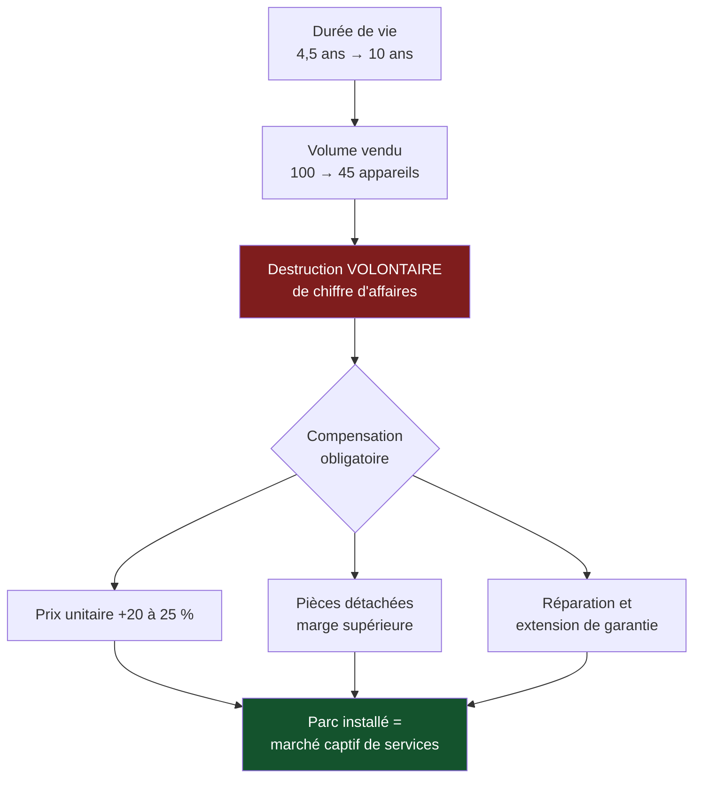

> ⬅ [[CAS12_La_fintech_qui_veut_faire_de_la_conformite_un_argument]] · [[00_Index_Mises_en_situation|🗂 Index]] · [[CAS14_Lagence_de_voyage_que_le_web_a_videe]] ➡

# CAS 13 — Le fabricant d'électroménager rattrapé par la réparabilité

> **L'entreprise.** *Elveco SA*, Neuchâtel. Fabricant de petit électroménager (robots de cuisine, bouilloires, aspirateurs), **230 salariés**, 47 M CHF de CA, dont 60 % à l'export européen. Le modèle repose sur un renouvellement rapide : durée de vie moyenne constatée de 4,5 ans, pièces détachées disponibles 2 ans après l'arrêt d'un modèle, appareils assemblés par collage (non démontables). Marge brute 38 %. Une évolution réglementaire européenne impose progressivement la disponibilité des pièces détachées et un indice de réparabilité affiché. Un concurrent allemand vient de lancer une gamme « réparable 10 ans » avec un prix supérieur de 25 %.
>
> **La question posée.**
> *« Elveco doit-elle rendre ses produits réparables ? Analysez les conséquences sur le business model et l'avantage concurrentiel. »*

---

## 🧩 Les notions clés

- **Obsolescence** et durée de vie
- **Éco-conception** 📘
- **3R** — Réduire et Réutiliser 📘
- **BM durable** — externalités négatives 📘
- **Équation de profit** 📘
- **L'État comme 6e force** 📘
- **Durabilité forte** 📘
- **Avantage concurrentiel durable**

## 📖 Définitions pour les nuls

| Notion | En une phrase simple |
|---|---|
| **Éco-conception** | 📘 Concevoir un produit en minimisant son impact sur **tout le cycle de vie** : matières, production, usage, fin de vie |
| **Indice de réparabilité** | Une note affichée qui indique si un appareil se répare facilement 🔎 |
| **Obsolescence** | Le fait qu'un produit cesse d'être utilisable ou désirable 🔎 |
| **Externalité négative** | 📘 Un dégât réel que l'entreprise ne paie pas |
| **Marge brute** | Ce qui reste du prix de vente après le coût direct de production 🔎 |

## 🔍 Décorticage de la consigne (L-I-S-A-E-C)

**L — Lire.** Question fermée (« doit-elle ? ») → il faut trancher. Puis deux angles imposés : **business model** et **avantage concurrentiel**.

**I — Identifier.** ⚠️ L'énoncé contient une contradiction structurelle qu'il faut nommer : le modèle d'Elveco **repose sur** le renouvellement rapide. Rendre les produits durables n'est pas une amélioration marginale — **c'est une attaque contre sa propre source de revenus**.

**S — Structurer.**
1. La contradiction : la durabilité du produit contre le modèle économique
2. Ce que la réglementation change (l'État comme force)
3. La transformation du BM
4. Recommandation SAF

**C — Conclure.** Trancher, et surtout dire **comment** compenser la perte de volume.

## 🧠 Le raisonnement stratégique (D-E-I)

### Axe 1 — La contradiction fondatrice

**D — Définir.** 📘 L'**éco-conception** minimise l'impact sur tout le cycle de vie. 🔎 Un produit réparable dure plus longtemps, donc se rachète moins souvent.

**E — Expliquer.** Posons le mécanisme sans détour :

> 🔎 **Elveco vend 100 appareils par client sur une vie. Si la durée de vie passe de 4,5 à 10 ans, elle en vend 45. Son chiffre d'affaires unitaire doit donc plus que doubler pour compenser — ou son modèle doit changer de nature.**

⚠️ C'est ici que la plupart des raisonnements sur l'économie circulaire deviennent naïfs. Rendre un produit durable **n'est pas neutre économiquement** : c'est une destruction volontaire de volume. Le dire est ce qui distingue une analyse d'un plaidoyer.

**I — Illustrer.** Avec 47 M CHF de CA et 38 % de marge brute, une baisse de volume de 45 % non compensée ramènerait la marge brute de ~17,9 M à ~9,8 M. Aucune économie de coût ne comble un tel écart.

### Axe 2 — Mais l'État ne laisse pas le choix

**D — Définir.** 📘 Le cours ajoute **l'État** comme sixième force de Porter.

**E — Expliquer.** 🔎 Le raisonnement décisif : la question n'est pas *« Elveco veut-elle rendre ses produits réparables ? »* mais *« Elveco peut-elle continuer à ne pas le faire ? »*

Trois portes se referment simultanément :
- **La règle** : disponibilité obligatoire des pièces, indice affiché.
- **Le client** : l'indice rend l'information comparable en rayon — l'asymétrie d'information qui protégeait Elveco disparaît.
- **Le concurrent** : l'allemand a déjà bougé et occupe le terrain « réparable » ; plus Elveco attend, plus ce positionnement est verrouillé par un autre.

**I — Illustrer.** 🔎 L'avantage actuel d'Elveco — 38 % de marge brute sur des produits collés qui durent 4,5 ans — repose sur un **coût non payé** : la fin de vie des appareils, supportée par la collectivité, et l'impossibilité pour le client de comparer. Ce n'est pas une compétence, c'est une **situation**. Et cette situation se referme.

⚠️ **La formule à retenir** : *« Un avantage fondé sur ce qu'on ne paie pas n'est pas un avantage : c'est un délai. »*

### Axe 3 — La transformation du business model

**D — Définir.** 📘 Le **BM durable** ajoute au BMC la mission, les impacts positifs et les **externalités négatives**. 📘 Les **revenus durables** : leasing, réemploi, services.

**E — Expliquer.** Si le volume de vente baisse, il faut **d'autres sources de revenus sur le même parc installé**. C'est le passage d'un revenu **transactionnel** à un revenu **récurrent**.

**I — Illustrer.**

| Bloc | Avant | Après | Effet sur l'équation de profit 📘 |
|---|---|---|---|
| **Proposition de valeur** | Un appareil performant, pas cher | Un appareil qui dure 10 ans et se répare | Prix unitaire +20 à 25 % justifié |
| **Revenus** | Vente unique | Vente + **pièces détachées** + **réparation** + accessoires + extension de garantie payante | Revenus récurrents sur 10 ans |
| **Activités clés** | Concevoir, assembler | + concevoir **démontable**, gérer un stock de pièces sur 10 ans, animer un réseau de réparateurs | Coûts logistiques nouveaux |
| **Partenaires** | Fournisseurs, distributeurs | + **réseau de réparateurs indépendants** | 🔎 On ne ferme pas une boucle seul |
| **Ressources clés** | Outil industriel | + catalogue de pièces + documentation technique publique | Actif immatériel nouveau |
| **➕ Externalités** | Appareils non réparables → DEEE, collage, obsolescence | Résiduelles : transport de pièces, extraction des matériaux neufs | ⚠️ Elles diminuent, elles ne disparaissent pas |

🔎 **Le point économique clé** : les pièces détachées ont typiquement une marge **supérieure** à celle des appareils neufs. Un parc installé de 10 ans est un **marché captif de services**, pas seulement une perte de renouvellement. C'est ce qui rend le basculement finançable.

## ⚖️ L'arbitrage et la recommandation (filtre SAF)

| Critère | Analyse | Verdict |
|---|---|---|
| **S** | ✅ La réglementation et le comparatif client rendent l'ancien modèle non tenable ; le nouveau positionnement est cohérent avec une image « fabriqué en Suisse » | **Passe** |
| **A** | ⚠️ 📘 *Retour ?* Décalé de 3-4 ans (le temps que le parc réparable se constitue). *Risque ?* Perte de volume immédiate et certaine. *Opposition ?* Les distributeurs, dont la rotation de stock va baisser | **Bloquée à court terme** |
| **F** | ⚠️ Refonte de la conception (fin du collage), création d'une logistique de pièces sur 10 ans, réseau de réparateurs à construire | **Lourde mais faisable sur 3 ans** |

### 🔎 La recommandation

> **Oui, mais par gamme et non par décret — et en commençant par le segment où le prix supporte la hausse.**
>
> 1. **Lancer une gamme haute réparable à 10 ans**, sur les robots de cuisine (produit à forte valeur affective, prix élevé, client prêt à payer 25 % de plus). Ne pas toucher aux bouilloires d'entrée de gamme la première année : le prix n'y supporte pas la hausse.
> 2. **Rendre la documentation technique publique** et ouvrir le catalogue de pièces aux réparateurs indépendants. 🔎 Contre-intuitif mais stratégique : Elveco n'a pas les moyens de créer un réseau de SAV en Europe. En ouvrant, elle transforme des réparateurs indépendants en **canal de distribution de ses pièces** — le revenu de service arrive sans investissement de réseau.
> 3. **Basculer le mix de revenus explicitement** : objectif de 18 % du CA en pièces et services à 5 ans, contre ~3 % aujourd'hui. Sans objectif chiffré sur ce poste, la baisse de volume ne sera pas compensée.
> 4. **Traiter les distributeurs** : leur rotation de stock baisse, ils s'y opposeront. Les intéresser à la marge sur les pièces et les extensions de garantie.
>
> **Application des 3R** 📘 : la démarche sert **Réduire** (moins d'appareils fabriqués) et **Réutiliser** (prolongation d'usage). ⚠️ Le recyclage reste le dernier recours — présenter cette stratégie comme « du recyclage » inverserait la hiérarchie.

## ⚠️ Le piège classique

**L'erreur type n°1 — traiter la réparabilité comme une amélioration sans coût.** C'est une destruction volontaire de volume. **Réflexe correctif :** chaque fois qu'une mesure durable allonge la durée de vie d'un produit, calculez immédiatement ce qu'elle retire au chiffre d'affaires, puis cherchez la compensation. Sans compensation identifiée, la recommandation est irréaliste.

**L'erreur type n°2 — présenter la réglementation comme une contrainte pure.** 📘 L'État est une **force** au sens de Porter : il redistribue les positions. Ici il élimine les concurrents low-cost non conformes. **Réflexe correctif :** demandez toujours *« à qui cette règle profite-t-elle ? »*

**L'erreur type n°3 — oublier que le service est plus rentable que le produit.** Les étudiants voient la perte de vente et pas le gain de pièces et de réparation. **Réflexe correctif :** dans tout cas de circularité, cherchez le **revenu récurrent** que le parc installé rend possible.

---

## 🗺️ Visuels de synthèse

### La chaîne de raisonnement



### Le chiffre qui tranche

```
Mix de revenus à faire basculer   (illustratif)

Aujourd'hui
 Vente d'appareils  ███████████████████░  97 %
 Pièces et services █                      3 %

Cible à 5 ans
 Vente d'appareils  ████████████████░░░░  82 %
 Pièces et services ████                  18 %

→ Sans objectif chiffré sur ce poste,
  la baisse de volume ne sera pas compensée
```

⚠️ Graphique **illustratif** : les proportions servent le raisonnement, elles ne sont pas des données mesurées.

---

## 🔗 Navigation

⬅ [[CAS12_La_fintech_qui_veut_faire_de_la_conformite_un_argument]] · [[00_Index_Mises_en_situation|🗂 Index des 27 cas]] · [[CAS14_Lagence_de_voyage_que_le_web_a_videe]] ➡
