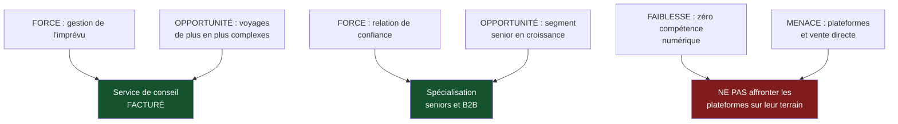

> ⬅ [[CAS13_Le_fabricant_delectromenager_rattrape_par_la_reparabilite]] · [[00_Index_Mises_en_situation|🗂 Index]] · [[CAS15_La_clinique_privee_et_ses_donnees_de_patients]] ➡

# CAS 14 — L'agence de voyage que le web a vidée

> **L'entreprise.** *Évasions Voyages*, 3 agences en ville de Genève, **19 salariés**, 6,4 M CHF de volume d'affaires, marge d'agence 9 %. Clientèle historique : familles et retraités, âge moyen 58 ans. Le volume recule de 7 %/an depuis six ans. Les plateformes de réservation en ligne et les compagnies aériennes en vente directe ont capté la clientèle jeune. Les loyers des trois vitrines représentent 14 % des charges. La direction hésite : fermer deux agences et créer un site de réservation, ou se recentrer sur un métier de conseil facturé.
>
> **La question posée.**
> *« Réalisez un SWOT d'Évasions Voyages et proposez une orientation stratégique cohérente. »*

---

## 🧩 Les notions clés

- **SWOT** et son croisement 📘
- **Substituts** (force de Porter) 📘
- **Distinction force / opportunité** — le piège classique 📘
- **Ressources immatérielles** 📘
- **Équation de profit** 📘
- **Différenciation vs domination par les coûts**
- **SAF** 📘

## 📖 Définitions pour les nuls

| Notion | En une phrase simple |
|---|---|
| **SWOT** | 📘 Un tableau à 4 cases : Forces et Faiblesses (**interne**), Opportunités et Menaces (**externe**) |
| **Substitut** | 📘 Un autre moyen de satisfaire le même besoin : réserver soi-même en ligne remplace l'agence |
| **Force** | Quelque chose que **l'entreprise possède ou sait faire** |
| **Opportunité** | Quelque chose qui existe **dans l'environnement**, indépendamment d'elle |
| **Marge d'agence** | Le pourcentage que l'agence garde sur le montant vendu 🔎 |

## 🔍 Décorticage de la consigne (L-I-S-A-E-C)

**L — Lire.** « **Réalisez** un SWOT » = produire la grille. « Proposez une orientation **cohérente** » : le mot « cohérente » signifie qu'elle doit **découler** du SWOT, pas s'y ajouter.

**I — Identifier.** 📘 Le piège n°1 du cours est ici : confondre **force** (interne) et **opportunité** (externe). Et 📘 la deuxième erreur, plus subtile : *« rester descriptif sans croisement »* — un SWOT qui n'est pas croisé ne produit aucune recommandation.

**S — Structurer.**
1. Le SWOT (4 cases, 3-4 items chacune)
2. **Le croisement** — c'est là que la valeur se crée
3. Les deux options passées au SAF
4. Recommandation

**C — Conclure.** Trancher entre « site de réservation » et « conseil facturé » — et montrer que la première option est une impasse.

## 🧠 Le raisonnement stratégique (D-E-I)

### Axe 1 — Le SWOT, avec la discipline interne/externe

**D — Définir.** 📘 **Forces et faiblesses = interne. Opportunités et menaces = externe.**

**E — Expliquer.** 🔎 Le test infaillible : *« cela existerait-il si l'entreprise n'existait pas ? »* Si oui → externe. Si non → interne.

**I — Illustrer.**

| **FORCES** (interne) | **FAIBLESSES** (interne) |
|---|---|
| Connaissance fine des destinations et des opérateurs | Structure de coûts fixes élevée (3 vitrines = 14 % des charges) |
| Relation de confiance avec une clientèle fidèle 📘 *ressource immatérielle* | Aucune compétence numérique interne |
| Capacité à gérer l'imprévu (annulation, rapatriement, réacheminement) | Clientèle vieillissante non renouvelée |
| Réputation locale construite sur 25 ans | Modèle de revenu dépendant d'une commission qui s'érode |

| **OPPORTUNITÉS** (externe) | **MENACES** (externe) |
|---|---|
| Complexification des voyages (visas, correspondances, assurances, annulations) | **Substituts** : plateformes et vente directe des compagnies 📘 |
| Attentes croissantes sur le voyage responsable (train, séjours longs) | Recul structurel du marché de l'agence physique |
| Vieillissement démographique : segment senior en croissance | Pression sur les commissions des tour-opérateurs |
| Marchés B2B : voyages d'affaires de PME sans service interne | Concurrence des créateurs de contenu et conseillers indépendants |

⚠️ **Erreur à ne surtout pas commettre** : écrire « le vieillissement de notre clientèle » dans les **forces** parce qu'elle est fidèle. La fidélité est une force (interne, c'est le fruit de la relation construite) ; le vieillissement est une **menace** (externe, démographique). Le même fait se lit dans deux cases selon ce qu'on regarde.

### Axe 2 — Le croisement : là où naît la recommandation

**D — Définir.** 📘 Croiser un SWOT : **Forces × Opportunités** (que saisir ?) et **Faiblesses × Menaces** (que parer ?).

**E — Expliquer.** 🔎 Un SWOT non croisé est une description. Le croisement transforme quatre listes en options stratégiques.

**I — Illustrer.**

| Croisement | Ce qu'il produit |
|---|---|
| **Force** (gestion de l'imprévu) × **Opportunité** (complexification des voyages) | → **Un service de conseil et d'assistance facturé**, indépendant de la commission |
| **Force** (relation de confiance) × **Opportunité** (segment senior en croissance) | → **Spécialisation seniors** : rythme adapté, accompagnement, assurances |
| **Faiblesse** (aucune compétence numérique) × **Menace** (plateformes) | → ⚠️ **Ne pas affronter les plateformes sur leur terrain** |
| **Faiblesse** (coûts fixes) × **Menace** (recul du marché) | → **Réduire le nombre de vitrines**, mais sans supprimer la présence physique qui fonde la confiance |

🔎 **Le croisement le plus important est le troisième**, et il élimine une des deux options de la direction : créer un site de réservation reviendrait à concurrencer des plateformes disposant de budgets techniques mille fois supérieurs, avec zéro compétence interne. **C'est une faiblesse mise face à une menace : la pire combinaison possible.**

### Axe 3 — Le vrai problème est dans l'équation de profit

**D — Définir.** 📘 L'**équation de profit** : revenus (fixes/variables) − structure de coûts.

**E — Expliquer.** Évasions Voyages est payée par une **commission sur le volume vendu**. Or ce que l'agence apporte réellement — le conseil, la connaissance, la gestion de crise — n'est pas rémunéré directement : il est offert et financé par la commission.

🔎 **Conséquence** : quand le client peut réserver ailleurs, il prend le conseil gratuitement à l'agence et achète en ligne. L'agence supporte le coût de son service sans en percevoir le revenu.

**I — Illustrer.** La reformulation stratégique à donner :

> *« Évasions Voyages n'a pas un problème de canal, elle a un problème de modèle de revenu. Elle vend gratuitement ce qui a de la valeur et facture ce qui n'en a plus. Créer un site ne corrige rien : cela numérise le mauvais modèle. »*

## ⚖️ L'arbitrage et la recommandation (filtre SAF)

### Analyse à double sens du numérique 🔎

| Le numérique **soutient** ici | Le numérique **freine** ici |
|---|---|
| Outils de suivi client, rappels, dossiers de voyage numériques | Un site de réservation exigerait des compétences et un budget inexistants |
| Visioconseil : servir des clients hors du bassin genevois sans nouvelle vitrine | Dématérialiser la relation détruirait la ressource immatérielle (le contact) |
| Comparaison d'itinéraires bas carbone (train vs avion) comme argument | ⚠️ **Effet rebond** : la réservation devenue trop simple augmente le nombre de courts séjours en avion |

### Le SAF sur les deux options

| Option | S | A | F | Verdict |
|---|---|---|---|---|
| **Fermer 2 agences + site de réservation** | ❌ Affronte les plateformes sur leur terrain, détruit la relation qui est la seule force | ⚠️ Licenciements, clientèle historique perdue | ❌ Aucune compétence numérique interne | **Écartée sur S et F** |
| **Recentrage sur le conseil facturé** | ✅ Valorise la force réelle et répond à l'opportunité (complexification) | ⚠️ Faire payer ce qui était gratuit : résistance clients certaine | ⚠️ Nécessite de formaliser et tarifer le conseil | **Retenue** |

### 🔎 La recommandation

> **Recentrage sur un métier de conseil facturé, avec une réduction partielle de l'empreinte immobilière.**
>
> 1. **Fermer une agence sur trois** (pas deux) : réduire les 14 % de charges sans supprimer la présence physique qui fonde la relation. 🔎 La vitrine n'est pas un canal de vente, c'est une preuve d'existence pour une clientèle qui achète de la confiance.
> 2. **Instaurer des honoraires de conseil**, déduits du voyage si celui-ci est réservé à l'agence. 🔎 Ce mécanisme résout élégamment la résistance : le client qui achète ne paie rien de plus, le client qui vient « pomper » du conseil paie. Le conseil cesse d'être gratuit sans devenir cher.
> 3. **Spécialiser sur deux segments** issus du croisement : **seniors** (relation, rythme, sécurité) et **PME sans service voyage** (B2B, facturation, gestion des imprévus).
> 4. **Ajouter l'argument bas carbone** comme différenciation : itinéraires train, séjours longs plutôt que multiples courts séjours. 📘 C'est aussi une réponse à l'opportunité « voyage responsable » — et ⚠️ un argument que les plateformes, rémunérées au volume de réservations, ne peuvent pas porter sincèrement.

## ⚠️ Le piège classique

**L'erreur type n°1 — confondre force et opportunité.** 📘 C'est le piège explicitement signalé par le cours. **Réflexe correctif :** appliquez le test *« cela existerait-il sans l'entreprise ? »* à chaque item.

**L'erreur type n°2 — un SWOT descriptif.** Quatre listes, puis une recommandation qui n'en découle pas. 📘 Le cours l'écrit : *« piège : rester descriptif sans croisement »*. **Réflexe correctif :** ajoutez toujours une section « croisements » explicite, avec des flèches.

**L'erreur type n°3 — répondre « il faut se digitaliser ».** C'est le réflexe automatique, et il est ici exactement contre-indiqué : l'entreprise n'a aucune compétence numérique et la menace vient précisément d'acteurs numériques mieux armés. **Réflexe correctif :** le numérique n'est pas une réponse par défaut. Vérifiez d'abord s'il tombe dans la case Force × Opportunité ou dans la case Faiblesse × Menace.

---

## 🗺️ Visuels de synthèse

### La chaîne de raisonnement



### Le chiffre qui tranche

```
Le problème n'est pas le canal, c'est le revenu   (illustratif)

CE QUI A DE LA VALEUR        CE QUI EST FACTURÉ
 Conseil        ████████      Conseil        ░░░░░░░░  gratuit
 Connaissance   ███████       Réservation    ████████  commission
 Gestion crise  ████████                     (qui s'érode)

→ L'agence offre ce qui vaut et facture ce qui
  ne vaut plus. Un site ne corrige rien :
  il numérise le mauvais modèle.
```

⚠️ Graphique **illustratif** : les proportions servent le raisonnement, elles ne sont pas des données mesurées.

---

## 🔗 Navigation

⬅ [[CAS13_Le_fabricant_delectromenager_rattrape_par_la_reparabilite]] · [[00_Index_Mises_en_situation|🗂 Index des 27 cas]] · [[CAS15_La_clinique_privee_et_ses_donnees_de_patients]] ➡
