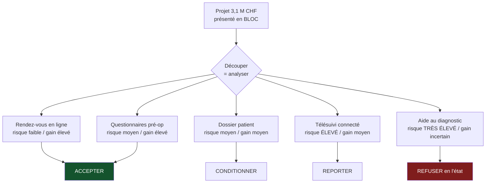

> ⬅ [[CAS14_Lagence_de_voyage_que_le_web_a_videe]] · [[00_Index_Mises_en_situation|🗂 Index]] · [[CAS16_La_brasserie_artisanale_et_leau]] ➡

# CAS 15 — La clinique privée et ses données de patients

> **L'entreprise.** *Clinique du Parc*, Lausanne. Établissement privé de 90 lits, **410 collaborateurs**, 78 M CHF de CA. Spécialités : orthopédie, cardiologie, imagerie. Un projet de « parcours patient numérique » prévoit : prise de rendez-vous en ligne, dossier patient consultable par application, questionnaires pré-opératoires numériques, télésuivi post-opératoire par objets connectés, et un module d'aide au diagnostic en imagerie. Budget : 3,1 M CHF sur 3 ans. La patientèle a une moyenne d'âge de 61 ans. La direction médicale s'inquiète ; la direction financière met en avant 1,4 M CHF d'économies administratives annuelles.
>
> **La question posée.**
> *« Évaluez le projet en croisant RNE, accessibilité et chaîne de valeur. Formulez une recommandation. »*

---

## 🧩 Les notions clés

- **RNE** — 4 axes 📘
- **Gestion responsable des données** — but déterminé, transparence, minimisation 📘
- **Privacy by design / by default** 📘
- **Accessibilité numérique** — principes **POUR** 📘
- **Exclusion indirecte** 📘
- **Chaîne de valeur** — où le numérique agit
- **Rôles de gouvernance numérique** 📘
- **Risque stratégique vs juridique** 📘

## 📖 Définitions pour les nuls

| Notion | En une phrase simple |
|---|---|
| **RNE** | 📘 4 axes : **É**conomique, **T**echnologique, **E**nvironnemental, **S**ociétal |
| **Minimisation** | 📘 Ne collecter que les données strictement nécessaires |
| **But déterminé** | 📘 Savoir et dire à quoi servira chaque donnée collectée |
| **POUR** | 📘 **P**erceptible, **U**tilisable, **C**ompréhensible, **R**obuste |
| **Exclusion indirecte** | 📘 Un service légal exclut de fait une population, sans intention |
| **Télésuivi** | Un suivi médical à distance par capteurs ou application 🔎 |

## 🔍 Décorticage de la consigne (L-I-S-A-E-C)

**L — Lire.** Trois outils imposés, à croiser : **RNE**, **accessibilité**, **chaîne de valeur**. ⚠️ Une réponse qui n'en mobilise que deux perd un tiers de la note.

**I — Identifier.** Deux données décisives dans l'énoncé : **moyenne d'âge 61 ans** (accessibilité) et **données de santé** (le type de donnée le plus sensible qui soit).

**S — Structurer.**
1. La chaîne de valeur : où le projet agit réellement, et où il ne devrait pas
2. La RNE : les 4 axes, balayés
3. L'accessibilité : le risque chiffré
4. Recommandation : découper le projet

**C — Conclure.** ⚠️ La bonne réponse ne dit ni oui ni non au projet global : elle le **découpe** en modules qu'on accepte, qu'on conditionne et qu'on refuse.

## 🧠 Le raisonnement stratégique (D-E-I)

### Axe 1 — Chaîne de valeur : cinq modules très différents

**D — Définir.** 📘 La chaîne de valeur distingue les **activités principales** (qui touchent le produit ou le client) des **activités de soutien** (transversales).

**E — Expliquer.** 🔎 Le projet est présenté comme un bloc de 3,1 M CHF. C'est une erreur d'analyse : les cinq modules n'agissent pas au même endroit et n'ont pas le même profil de risque. **On découpe pour décider.**

**I — Illustrer.**

| Module | Case de la chaîne de valeur | Risque | Gain |
|---|---|---|---|
| Prise de rendez-vous en ligne | Logistique amont / relation client | **Faible** (donnée peu sensible) | Élevé (économie administrative) |
| Questionnaires pré-opératoires | Logistique amont | Moyen (données de santé) | Élevé |
| Dossier patient consultable | Services | Moyen | Moyen (satisfaction) |
| **Télésuivi par objets connectés** | Services | ⚠️ **Élevé** (donnée continue, hors établissement) | Moyen |
| **Aide au diagnostic en imagerie** | Production (acte médical) | ⚠️⚠️ **Très élevé** (responsabilité médicale) | Incertain |

🔎 **Constat qui structure toute la réponse** : les 1,4 M CHF d'économies annoncés proviennent presque entièrement des **deux premiers modules**, qui sont les moins risqués. Les deux derniers concentrent le risque et apportent le gain le plus incertain.

⚠️ **Distinction essentielle, transposable à tous les cas** : automatiser le **back-office** (rendez-vous, questionnaires, facturation) ≠ automatiser **l'acte de production** (le diagnostic). Le premier réduit les coûts sans toucher au métier ; le second engage la responsabilité et la qualité.

### Axe 2 — RNE : balayer les quatre axes

**D — Définir.** 📘 La **RNE** comporte quatre axes : **économique, technologique, environnemental, sociétal**.

**E — Expliquer.** 🔎 Balayer les quatre est un réflexe de méthode qui évite de ne traiter que l'écologie.

**I — Illustrer.**

| Axe RNE 📘 | Enjeu chez Clinique du Parc |
|---|---|
| **Économique** | Dépendance à un éditeur unique pour le dossier patient ; coût de sortie ; pérennité du fournisseur sur 10 ans |
| **Technologique** | Sécurité (une donnée de santé volée n'est jamais récupérable), interopérabilité avec le dossier électronique du patient, explicabilité du module d'imagerie |
| **Environnemental** | Objets connectés distribués aux patients : fabrication, remplacement, fin de vie. 🔎 L'impact est dans la **fabrication**, pas dans l'usage |
| **Sociétal** | **Accessibilité** pour une patientèle de 61 ans de moyenne d'âge ; consentement réel ; risque de tri implicite entre patients « connectés » et les autres |

📘 **Les trois principes de gestion des données** appliqués :
- **But déterminé** : à quoi sert précisément chaque donnée du télésuivi ? Si la réponse est « on verra plus tard », le principe est violé.
- **Transparence** : le patient sait-il que ses données de sommeil ou d'activité sont enregistrées en continu ?
- **Minimisation** : un télésuivi post-opératoire orthopédique a-t-il besoin d'une mesure permanente, ou d'un relevé quotidien ?

📘 **Privacy by design** : la protection est intégrée dès la conception — ici, cela signifie choisir l'architecture (données locales ou centralisées) **avant** de développer, pas après. 📘 **Privacy by default**, au sens des slides : obtenir un **consentement libre et éclairé** — ce qui, pour un patient en pré-opératoire, pose une question réelle : un consentement donné la veille d'une intervention est-il libre ?

📘 **Gouvernance** : le cours cite les rôles **DPO, CISO, CAIO**. Une clinique traitant des données de santé sans DPO identifié est en défaut d'organisation, pas seulement de conformité.

### Axe 3 — Accessibilité : le risque chiffré

**D — Définir.** 📘 Les 4 principes **POUR** : Perceptible, Utilisable, Compréhensible, Robuste. 📘 L'**exclusion indirecte** : un service légal exclut sans intention.

**E — Expliquer.** Avec une patientèle de 61 ans de moyenne, une part significative aura des difficultés avec une application : acuité visuelle, dextérité (post-opératoire orthopédique — mains ou épaules opérées !), authentification à deux facteurs, absence de smartphone récent.

🔎 **Le détail qui montre qu'on a lu l'énoncé** : la clinique est spécialisée en **orthopédie**. Une partie de ses patients sort de l'établissement avec une main, un poignet ou une épaule immobilisés. Leur demander de manipuler une application de télésuivi est une contradiction opérationnelle, pas seulement une question d'accessibilité théorique.

**I — Illustrer.** 📘 Le cas SilverDigital documente **−12 % de clients de plus de 65 ans** après une bascule numérique. ⚠️ Mais 📘 la formule du cours s'applique ici avec une gravité supplémentaire : *« le risque n'est pas juridique mais stratégique »* — et en milieu médical, il devient aussi **clinique**. Un patient qui ne remplit pas son questionnaire pré-opératoire n'est pas un client perdu : c'est un risque d'incident.

## ⚖️ L'arbitrage et la recommandation (filtre SAF)

### Analyse à double sens 🔎

| Le numérique **soutient** ici | Le numérique **freine** ici |
|---|---|
| Moins d'erreurs de transcription, dossier accessible en urgence | Une faille de sécurité sur des données de santé est **irréversible** |
| Télésuivi → détection précoce de complications | Exclusion des patients les moins à l'aise, qui sont souvent les plus fragiles |
| Économies administratives réinvestissables dans le soin | Objets connectés : matériel fabriqué, distribué, remplacé |
| Réduction des déplacements post-opératoires | ⚠️ **Effet rebond** : le suivi devenu peu coûteux multiplie les mesures, les alertes et les consultations de contrôle |

### Le SAF, module par module

| Module | S | A | F | Décision |
|---|---|---|---|---|
| Rendez-vous en ligne | ✅ | ✅ si canal téléphonique maintenu | ✅ | **Accepter** |
| Questionnaires pré-op | ✅ | ⚠️ | ✅ | **Accepter avec double canal obligatoire** |
| Dossier patient | ✅ | ⚠️ sécurité | ⚠️ interopérabilité | **Conditionner** |
| Télésuivi connecté | ⚠️ | ❌ consentement et accessibilité | ⚠️ | **Reporter et tester** |
| Aide au diagnostic | ⚠️ | ❌ responsabilité médicale non résolue | ❌ | **Refuser en l'état** |

### 🔎 La recommandation

> **Approuver le projet à hauteur d'environ 1,8 M sur 3,1 M, en le découpant en trois vagues.**
>
> **Vague 1 (0–12 mois)** — rendez-vous en ligne et questionnaires pré-opératoires, avec **maintien inconditionnel du canal téléphonique et papier**. C'est là que sont les 1,4 M d'économies, et c'est là que le risque est le plus faible. 🔎 Ne jamais fermer l'ancien canal : le double canal n'est pas un surcoût, c'est **la condition** de l'économie, parce qu'il évite de perdre les patients qui ne suivent pas.
>
> **Vague 2 (12–24 mois)** — dossier patient, conditionné à trois prérequis : DPO nommé, audit de sécurité indépendant, conformité **POUR** vérifiée par des tests avec de vrais patients de plus de 70 ans. 📘 L'accessibilité se conçoit dès l'origine, elle ne se rattrape pas.
>
> **Vague 3 (24–36 mois)** — télésuivi, **en pilote sur une seule spécialité et sur base volontaire**, avec évaluation clinique avant généralisation.
>
> **Module refusé** : l'aide au diagnostic en imagerie, tant que trois questions n'ont pas de réponse écrite — qui signe le diagnostic, comment une décision est-elle explicable, que se passe-t-il en cas de divergence entre le radiologue et le système. ⚠️ 🔎 **Le système ne prend aucune responsabilité : le médecin qui valide reste responsable de ce qu'il valide.** Déployer sans procédure revient à transférer le risque sur les praticiens sans leur en donner les moyens.

## ⚠️ Le piège classique

**L'erreur type n°1 — évaluer le projet en bloc.** Répondre « oui, c'est une bonne modernisation » ou « non, c'est risqué ». **Réflexe correctif :** dès qu'un projet contient plusieurs modules, découpez-les et évaluez-les séparément. Le découpage **est** l'analyse.

**L'erreur type n°2 — ne traiter que l'axe environnemental de la RNE.** 📘 Il y en a quatre. Ici, le sociétal et le technologique dominent largement. **Réflexe correctif :** énoncez les quatre axes et remplissez-les tous, même brièvement.

**L'erreur type n°3 — oublier que l'accessibilité est ici un enjeu de sécurité.** En dehors du médical, l'exclusion coûte des clients. En médical, elle coûte des incidents. **Réflexe correctif :** adaptez la gravité du risque au secteur ; ne récitez pas la formule SilverDigital telle quelle.

---

## 🗺️ Visuels de synthèse

### La chaîne de raisonnement



### Le chiffre qui tranche

```
Les économies viennent des modules les moins risqués (illustratif)

Rendez-vous en ligne    ████████████  ~0,8 M  risque ▌
Questionnaires pré-op   ████████      ~0,6 M  risque ██
Dossier patient         ██            ~0,1 M  risque ███
Télésuivi               ▌             ~0,0 M  risque ████████
Aide au diagnostic      ▌             ~0,0 M  risque ██████████

→ 1,4 M d'économies sur 1,4 M viennent des 2 premiers
```

⚠️ Graphique **illustratif** : les proportions servent le raisonnement, elles ne sont pas des données mesurées.

---

## 🔗 Navigation

⬅ [[CAS14_Lagence_de_voyage_que_le_web_a_videe]] · [[00_Index_Mises_en_situation|🗂 Index des 27 cas]] · [[CAS16_La_brasserie_artisanale_et_leau]] ➡
