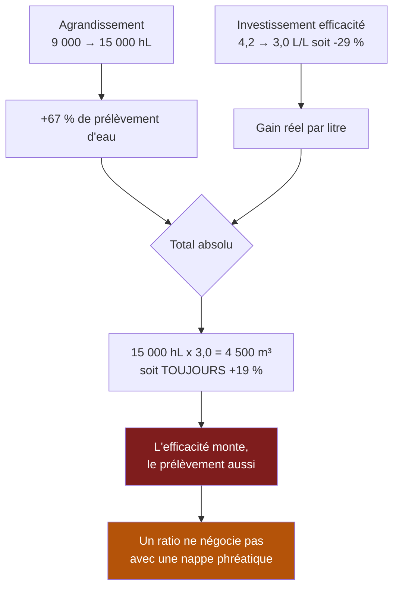

> ⬅ [[CAS15_La_clinique_privee_et_ses_donnees_de_patients]] · [[00_Index_Mises_en_situation|🗂 Index]] · [[CAS17_Lentreprise_de_nettoyage_qui_ne_sait_pas_ce_quelle_vaut]] ➡

# CAS 16 — La brasserie artisanale et l'eau

> **L'entreprise.** *Brasserie du Salève*, Bernex (GE). **22 salariés**, 3,4 M CHF de CA, 9 000 hL/an. Bières artisanales vendues en Suisse romande (60 % restauration, 40 % détail). L'eau est la matière première principale : **4,2 litres d'eau consommés par litre de bière produite**. La brasserie communique sur son ancrage local et ses malts suisses. Deux étés consécutifs ont vu des restrictions d'usage de l'eau dans le canton. Le prix de l'énergie a doublé en trois ans. Un projet d'agrandissement à 15 000 hL est à l'étude.
>
> **La question posée.**
> *« Analysez la stratégie d'agrandissement à la lumière des limites planétaires et du système de valeur. Recommandez. »*

---

## 🧩 Les notions clés

- **Limites planétaires** (Rockström) 📘
- **Durabilité forte vs faible** 📘
- **Donut de Raworth** — plafond écologique 📘
- **Chaîne de valeur durable** et **système de valeur** 📘
- **Éco-conception** 📘
- **PESTEL** — dimensions É et L 📘
- **Effet rebond** 🔎
- **SAF** 📘

## 📖 Définitions pour les nuls

| Notion | En une phrase simple |
|---|---|
| **Limites planétaires** | 📘 9 seuils physiques (Rockström, 2009) au-delà desquels « la vie sur terre ne peut plus être assurée » ; **7 sur 9 sont franchies** |
| **Durabilité forte** | 📘 Le capital naturel est **non substituable** : on ne remplace pas de l'eau par de l'argent |
| **Donut** | 📘 L'espace juste entre un **plancher social** (12 fondements) et un **plafond écologique** (9 limites) |
| **Système de valeur** | 📘 L'enchaînement des chaînes de valeur : fournisseurs → vous → clients |
| **Ressource commune** | Une ressource que plusieurs acteurs partagent et qu'aucun ne contrôle 🔎 |

## 🔍 Décorticage de la consigne (L-I-S-A-E-C)

**L — Lire.** Deux cadres imposés : **limites planétaires** et **système de valeur**. Le second est le plus discriminant : il oblige à sortir du périmètre de la brasserie.

**I — Identifier.** ⚠️ L'énoncé pose un piège classique : la brasserie communique sur son ancrage local et ses malts suisses (ce qu'elle contrôle) alors que sa contrainte critique est l'**eau**, qu'elle ne contrôle pas.

**S — Structurer.**
1. Le cadre : ce que les limites planétaires disent d'un projet d'agrandissement
2. L'eau n'est pas une matière première comme une autre
3. Le système de valeur : où est vraiment l'impact
4. Recommandation SAF

**C — Conclure.** Trancher sur l'agrandissement : oui, non, ou autrement.

## 🧠 Le raisonnement stratégique (D-E-I)

### Axe 1 — Ce que les limites planétaires changent dans un projet de croissance

**D — Définir.** 📘 Les **limites planétaires** sont neuf seuils quantitatifs — 📘 « lorsque ces limites sont dépassées en continu sur le long terme, la vie sur terre ne peut plus être assurée ». 📘 **7 sur 9 sont aujourd'hui franchies**. 📘 Le **donut de Raworth** en fait le **plafond écologique**, complément du plancher social.

**E — Expliquer.** 🔎 La différence entre un cadre classique et un cadre de limites planétaires tient en une phrase :

> **Dans un raisonnement classique, une ressource est une contrainte de coût : si elle est chère, on paie plus. Dans un raisonnement de limites, c'est une contrainte de volume : au-delà d'un seuil, aucun prix ne débloque la ressource.**

📘 C'est exactement le sens de la **durabilité forte** : le capital naturel n'est pas substituable. Une brasserie ne peut pas remplacer l'eau par du capital, du travail ou de la technologie. Elle peut réduire sa consommation par litre — pas s'en passer.

**I — Illustrer.** Deux étés consécutifs de restrictions cantonales ne sont pas un aléa météorologique : c'est le signal que la ressource entre dans une zone de rationnement administratif. 🔎 Une usine qu'on ne peut pas alimenter en eau ne produit rien, quel que soit son carnet de commandes.

### Axe 2 — L'eau n'est pas une matière première comme une autre

**D — Définir.** 🔎 Une **ressource commune** est partagée par plusieurs acteurs et contrôlée par aucun : chacun y puise, personne n'en garantit la disponibilité.

**E — Expliquer.** Le malt s'achète : s'il manque, on change de fournisseur, on paie plus cher. L'eau ne s'achète pas de la même façon : elle est locale, non transportable en volume, et son accès dépend d'une **autorité publique** qui arbitre entre usages concurrents — agriculture, ménages, industrie.

⚠️ 📘 Ce qui fait entrer ici la **sixième force du cours : l'État**. En période de restriction, l'ordre de priorité est politique, et l'industrie de boisson n'est jamais en tête.

**I — Illustrer.** Le calcul à poser :

```
Aujourd'hui :   9 000 hL × 4,2 L d'eau/L de bière ≈  3 780 m³ d'eau/an
Projet    :    15 000 hL × 4,2                     ≈  6 300 m³ d'eau/an
                                                     ────────────────
                                        + 67 % de prélèvement
```

🔎 **Et voici le raisonnement d'effet rebond appliqué** : supposons que la brasserie investisse dans un système de récupération et passe de 4,2 à 3,0 L/L — un gain d'efficacité de 29 %, remarquable. Si elle produit simultanément 15 000 hL :

```
15 000 hL × 3,0  ≈  4 500 m³  →  toujours +19 % par rapport à aujourd'hui
```

⚠️ **L'efficacité s'améliore, le prélèvement total augmente.** C'est exactement la structure de l'effet rebond, et c'est le point à formuler à l'oral : **seul le total absolu compte face à une limite physique. Un ratio ne négocie pas avec une nappe phréatique.**

### Axe 3 — Le système de valeur : l'impact est en amont

**D — Définir.** 📘 Le **système de valeur** est l'enchaînement des chaînes de valeur. 📘 La chaîne de valeur durable couvre « depuis les matières premières jusqu'au recyclage ou à la fin de vie ».

**E — Expliquer.** L'eau consommée **dans** la brasserie (4,2 L/L) est visible et mesurée. Mais l'eau consommée **en amont**, pour produire l'orge et le houblon, est d'un ordre de grandeur supérieur — l'irrigation agricole domine largement tout bilan hydrique de brasserie.

🔎 Conséquence stratégique : la brasserie communique sur ses malts suisses comme sur un argument de proximité. Or si ces malts proviennent de cultures irriguées dans un bassin sous tension, **le local n'est pas automatiquement le sobre**. Proximité et faible impact sont deux critères différents, et les confondre est une erreur fréquente.

**I — Illustrer.** Trois maillons à traiter séparément :

| Maillon du système de valeur | Impact eau | Contrôle de la brasserie |
|---|---|---|
| **Amont** : culture de l'orge et du houblon | **Dominant** | Faible — sauf par le choix des fournisseurs (achats = activité de **soutien** 📘) |
| **Brasserie** : brassage, nettoyage, refroidissement | Mesuré (4,2 L/L) | **Fort** |
| **Aval** : distribution, consigne, lavage des fûts | Faible mais réel | Moyen |

⚠️ La case « achats » est une activité de **soutien**, donc **transversale** 📘. C'est le levier le plus puissant et le moins visible : choisir des variétés d'orge peu irriguées agit davantage que tous les investissements en interne.

## ⚖️ L'arbitrage et la recommandation (filtre SAF)

| Critère | Analyse | Verdict |
|---|---|---|
| **S** | ⚠️ L'agrandissement sert la croissance, mais **contredit frontalement le positionnement** de la brasserie sur l'ancrage local et la responsabilité. Une PME qui augmente de 67 % son prélèvement d'eau pendant des restrictions cantonales n'est pas cohérente | ⚠️ **Fragile** |
| **A** | ❌ 📘 *Retour ?* Réel. *Risque ?* Une autorisation de prélèvement refusée rend l'outil inutilisable. *Opposition ?* Commune, riverains, autorité cantonale — et médias, sur un sujet très sensible localement | ❌ **Échoue** |
| **F** | ⚠️ Techniquement possible ; l'autorisation administrative est le point d'incertitude | ⚠️ **Conditionnelle** |

### 🔎 La recommandation

> **Ne pas agrandir de 9 000 à 15 000 hL. Retenir un scénario en deux temps qui découple la croissance du volume d'eau.**
>
> **Temps 1 — Réduire avant d'augmenter (0–18 mois).**
> - Recirculation des eaux de refroidissement et de rinçage : cible **3,0 L/L** au lieu de 4,2.
> - Récupération de la chaleur du brassage : traite simultanément le doublement du prix de l'énergie (PESTEL — E).
> - **Engagement public sur un plafond absolu** de prélèvement annuel, pas sur un ratio. 🔎 C'est la mesure la plus importante et la plus rare : elle rend l'effet rebond impossible et donne à la brasserie un argument que ses concurrents n'ont pas.
>
> **Temps 2 — Croître autrement (18–36 mois).**
> - Agrandissement limité à **12 000 hL**, soit un prélèvement total inférieur à celui d'aujourd'hui grâce au gain d'efficacité.
> - **Monter en valeur plutôt qu'en volume** : bières de garde, séries limitées, prix unitaire supérieur. 🔎 C'est la seule voie de croissance compatible avec une contrainte de volume physique — on augmente le chiffre d'affaires sans augmenter les litres.
> - **Travailler l'amont** : contractualiser avec des producteurs d'orge sur des variétés et des pratiques peu irriguées. 📘 C'est le levier transversal des achats.
>
> **L'argument à porter devant l'autorité cantonale** : une brasserie qui **réduit son prélèvement absolu tout en croissant** obtient bien plus facilement ses autorisations qu'une brasserie qui promet d'être efficace. 🔎 Dans un régime de rationnement, la légitimité devient une ressource stratégique — et elle n'est pas imitable rapidement.

## ⚠️ Le piège classique

**L'erreur type n°1 — raisonner en ratio face à une limite physique.** « Nous passons de 4,2 à 3,0 L/L, donc nous progressons. » Faux si le total augmente. **Réflexe correctif :** face à une limite planétaire, la seule unité valable est la **valeur absolue**.

**L'erreur type n°2 — confondre local et sobre.** Les malts suisses sont un argument de proximité, pas d'impact hydrique. **Réflexe correctif :** 📘 « ici et ailleurs » impose de regarder l'amont ; la proximité géographique ne dit rien du prélèvement.

**L'erreur type n°3 — appliquer la durabilité faible sans le savoir.** Proposer de « compenser » la hausse de prélèvement par un financement de restauration de zone humide. 📘 Le cours défend la **durabilité forte** : le capital naturel n'est pas substituable. **Réflexe correctif :** réduire d'abord, compenser ensuite — et jamais l'inverse.

---

## 🗺️ Visuels de synthèse

### La chaîne de raisonnement



### Le chiffre qui tranche

```
Scénarios de prélèvement d'eau   (illustratif, m³/an)

Aujourd'hui 9 000 hL à 4,2 L/L    ██████████████     3 780
Projet     15 000 hL à 4,2 L/L    ███████████████████ 6 300
Projet + efficacité 3,0 L/L       ██████████████████  4 500
RECOMMANDÉ 12 000 hL à 3,0 L/L    █████████████       3 600  ✅

→ Seul le dernier scénario croît SANS augmenter
  le prélèvement absolu
```

⚠️ Graphique **illustratif** : les proportions servent le raisonnement, elles ne sont pas des données mesurées.

---

## 🔗 Navigation

⬅ [[CAS15_La_clinique_privee_et_ses_donnees_de_patients]] · [[00_Index_Mises_en_situation|🗂 Index des 27 cas]] · [[CAS17_Lentreprise_de_nettoyage_qui_ne_sait_pas_ce_quelle_vaut]] ➡
