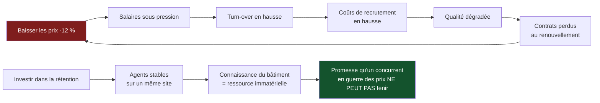

> ⬅ [[CAS16_La_brasserie_artisanale_et_leau]] · [[00_Index_Mises_en_situation|🗂 Index]] · [[CAS18_Lhebergeur_suisse_qui_vend_du_cloud_vert]] ➡

# CAS 17 — L'entreprise de nettoyage qui ne sait pas ce qu'elle vaut

> **L'entreprise.** *Net Services SA*, Genève. Nettoyage de bureaux et d'immeubles, **310 salariés** (dont 280 agents de nettoyage, majoritairement à temps partiel), 14 M CHF de CA. Marché : appels d'offres remportés au prix, renouvelés tous les 2 à 3 ans. Marge nette 3,1 %. Turn-over annuel des agents : **48 %**. Coût de recrutement et formation estimé à 1 400 CHF par agent. Un concurrent vient de remporter deux contrats importants en cassant les prix de 12 %. Le directeur envisage de suivre.
>
> **La question posée.**
> *« Net Services peut-elle construire un avantage concurrentiel durable dans un secteur où l'on achète au prix ? Analysez et recommandez. »*

---

## 🧩 Les notions clés

- **Avantage concurrentiel durable** (sens A) 📘
- **Ressources matérielles vs immatérielles** 📘
- **Chaîne de valeur** — la GRH comme activité de **soutien** transversale 📘
- **Équation de profit** 📘
- **Durabilité sociale** et plancher social (donut) 📘
- **Différenciation dans un marché de commodité**
- **RNE** — axe sociétal 📘

## 📖 Définitions pour les nuls

| Notion | En une phrase simple |
|---|---|
| **Commodité** | Un service perçu comme identique chez tous les fournisseurs, donc acheté au prix 🔎 |
| **Turn-over** | La proportion de salariés qui partent chaque année 🔎 |
| **Ressource immatérielle** | 📘 Organisation, technologie, réputation — peu transférable, donc peu imitable |
| **Activité de soutien** | 📘 Une activité transversale : la GRH en fait partie |
| **Plancher social** | 📘 Les 12 fondements du donut : revenu et travail, santé, logement, équité… |

## 🔍 Décorticage de la consigne (L-I-S-A-E-C)

**L — Lire.** ⚠️ Attention au sens de « durable » : il qualifie **avantage concurrentiel** → **sens A, qui dure**. Le dire explicitement rapporte.

La question est piégée par sa formulation : « dans un secteur où l'on achète au prix » suggère que la réponse est non. Il faut **contester la prémisse**.

**I — Identifier.** Le chiffre décisif est le **turn-over de 48 %**. Il n'est pas mentionné par la question. Il est donc là exprès.

**S — Structurer.**
1. Le calcul que personne ne fait : ce que coûte le turn-over
2. Pourquoi la guerre des prix est perdue d'avance
3. Où se construit un avantage dans ce secteur
4. Recommandation SAF

**C — Conclure.** Trancher contre la baisse de prix, avec un chiffre.

## 🧠 Le raisonnement stratégique (D-E-I)

### Axe 1 — Le coût caché qui change tout le diagnostic

**D — Définir.** 📘 L'**équation de profit** : revenus − structure de coûts.

**E — Expliquer.** 🔎 Le turn-over n'apparaît nulle part comme une ligne budgétaire. Il est réparti dans les salaires, dans le temps d'encadrement, dans les erreurs de qualité, dans les pénalités contractuelles. C'est un coût **réel et invisible** — la définition même de ce qu'un diagnostic sérieux doit faire apparaître.

**I — Illustrer.**

```
280 agents × 48 % de turn-over  =  134 remplacements/an
134 × 1 400 CHF                 ≈  188 000 CHF/an de coût direct
                                   soit ~1,3 % du CA
Or la marge nette est de         3,1 %
→ le turn-over consomme environ 43 % de la marge nette
```

⚠️ **Et ce n'est que le coût direct.** S'y ajoutent : la qualité dégradée les premières semaines, les réclamations clients, le temps des chefs d'équipe, les contrats perdus au renouvellement pour insatisfaction.

🔎 **La reformulation stratégique** : *« Net Services n'a pas un problème de prix. Elle a un problème de rétention, qui se manifeste comme un problème de prix. »*

### Axe 2 — Pourquoi baisser les prix de 12 % est suicidaire

**D — Définir.** Une **domination par les coûts** suppose un avantage de structure durable.

**E — Expliquer.** Net Services a 3,1 % de marge nette. Baisser les prix de 12 % dans un secteur où la main-d'œuvre représente l'essentiel des coûts signifie : soit rogner sur les salaires (ce qui aggrave le turn-over, donc les coûts, donc la qualité), soit réduire le temps passé par site (ce qui dégrade la prestation et fait perdre les contrats au renouvellement).

🔎 **La boucle est vicieuse et il faut la nommer** :

```
Baisse de prix → salaires plus bas → turn-over ↑ → coûts de recrutement ↑
       ↑                                                      │
       └──────── perte de contrats ← qualité ↓ ←──────────────┘
```

**I — Illustrer.** À −12 % sur 14 M CHF, Net Services perd 1,68 M de chiffre d'affaires pour une marge nette de 434 000 CHF. **L'entreprise devient structurellement déficitaire au premier contrat renouvelé à ce prix.**

### Axe 3 — Où se construit l'avantage : la GRH comme activité transversale

**D — Définir.** 📘 La **gestion des ressources humaines** est une **activité de soutien**, dont « l'impact est **transversal** sur toutes les unités et sections ». 📘 Les ressources **immatérielles** fondent l'avantage durable parce qu'elles sont peu transférables.

**E — Expliquer.** 🔎 Voici le raisonnement central du cas, et il vaut bien au-delà du nettoyage :

> **Dans un service à forte intensité de main-d'œuvre, la stabilité des équipes *est* la qualité du service.** Un agent qui connaît le bâtiment depuis trois ans sait quels bureaux sont sensibles, quels horaires conviennent, quel interlocuteur prévenir. Un agent arrivé la semaine dernière ne le sait pas et ne peut pas le savoir.

Cette connaissance est une **ressource immatérielle** : elle ne s'achète pas, elle ne se transfère pas, elle se détruit à chaque départ. Un concurrent qui casse les prix ne peut pas l'acquérir — il peut seulement en faire l'économie, temporairement.

⚠️ Et parce que la GRH est une activité de **soutien**, agir dessus produit un effet sur les cinq activités principales à la fois : la prestation, la relation client, le service, la logistique, la commercialisation.

**I — Illustrer.** Ce que Net Services peut construire et qui ne se copie pas en 18 mois :

| Levier | Effet direct | Effet sur l'avantage |
|---|---|---|
| Horaires regroupés au lieu de vacations fragmentées | Trajets réduits, revenu plus stable | Rétention ↑ |
| Contrats à taux d'occupation plus élevé | Sortie du sous-emploi subi 📘 *plancher social* | Rétention ↑↑ |
| Affectation stable à un même site | Connaissance du bâtiment | **Qualité perçue par le client** |
| Formation certifiante (produits, sécurité, accessibilité) | Compétence réelle | Différenciation dans les appels d'offres |
| Encadrement de proximité | Résolution des problèmes en amont | Moins de réclamations |

📘 **Lien avec le donut** : améliorer les conditions d'emploi n'est pas seulement social — cela touche le **plancher social** (revenu et travail décents), et c'est simultanément le levier de rentabilité de l'entreprise. 🔎 **C'est un des rares cas où durabilité sociale et performance économique convergent directement**, sans décalage temporel. Il faut le dire : ça ne se produit pas si souvent.

## ⚖️ L'arbitrage et la recommandation (filtre SAF)

### La question du numérique 🔎

⚠️ Le numérique n'est pas dans l'énoncé, mais il vaut la peine d'être évoqué brièvement, car c'est un secteur où l'on propose beaucoup d'outils :

| Ce que le numérique **soutient** | Ce qu'il **freine** |
|---|---|
| Planification des tournées, réduction des trajets d'agents | ⚠️ Le contrôle par badge ou géolocalisation dégrade la relation de confiance — donc **aggrave le turn-over**, c'est-à-dire exactement le problème à résoudre |
| Signalement des incidents par application, traçabilité pour le client | Une application exclut les agents peu à l'aise avec le numérique ou non francophones |
| Preuve de prestation → argument dans les appels d'offres | Coût d'équipement et de licences sur 280 agents |

🔎 **Conclusion sur ce point** : dans ce secteur, le numérique de contrôle est contre-productif ; le numérique de **preuve** (montrer au client ce qui a été fait) est utile. La distinction est fine et elle vaut des points.

### Le SAF

| Option | S | A | F | Verdict |
|---|---|---|---|---|
| **Baisser les prix de 12 %** | ❌ Détruit la marge et aggrave le turn-over qui est la cause du problème | ❌ Salariés, et clients à terme (qualité) | ✅ Immédiat | **Écartée sur S** |
| **Investir dans la rétention** | ✅ Attaque la cause réelle, construit un actif non imitable | ⚠️ Coûte avant de rapporter ; les clients ne paieront pas plus tout de suite | ⚠️ Demande de revoir les plannings et les contrats | **Retenue** |

### 🔎 La recommandation

> **Ne pas suivre la baisse de 12 %. Accepter de perdre les contrats attribués au prix seul, et réallouer l'effort sur la rétention.**
>
> 1. **Objectif chiffré : ramener le turn-over de 48 % à 30 % en deux ans.** Gain estimé : ~70 000 CHF/an de coûts directs, plus les effets qualité. 🔎 C'est l'équivalent d'une hausse de prix de 0,5 % obtenue sans négociation.
> 2. **Regrouper les vacations** : passer de trois interventions courtes à une intervention longue par agent. Effet immédiat sur les trajets non payés, qui sont la première cause de départ dans ce métier.
> 3. **Stabiliser les affectations** et en faire un **argument commercial explicite** dans les appels d'offres : « le même agent sur votre site pendant toute la durée du contrat ». 🔎 C'est une promesse qu'un concurrent en guerre des prix ne peut pas tenir — donc une vraie différenciation.
> 4. **Cibler les appels d'offres qui intègrent des critères sociaux** (collectivités, institutions, régies engagées). Le marché « prix seul » n'est pas le seul marché ; y renoncer partiellement est un choix de périmètre, donc une décision stratégique au sens propre.
>
> ⚠️ **La tension à assumer** : Net Services perdra des contrats à court terme. C'est le prix du repositionnement. Une stratégie sans renoncement n'en est pas une.

## ⚠️ Le piège classique

**L'erreur type n°1 — accepter que le secteur soit « un marché de prix ».** C'est vrai pour la partie du marché qui achète au prix. Ce n'est pas vrai pour tout le marché. **Réflexe correctif :** un marché indifférencié est presque toujours un marché **segmenté qu'on n'a pas segmenté**.

**L'erreur type n°2 — traiter le social comme un supplément d'âme.** Ici, améliorer les conditions de travail est **le levier de rentabilité principal**. **Réflexe correctif :** traduisez toujours la durabilité sociale en euros ou en francs — turn-over, absentéisme, qualité, recrutement.

**L'erreur type n°3 — proposer du numérique de surveillance.** Il paraît moderne et il aggrave le problème central. **Réflexe correctif :** avant de proposer un outil, demandez ce qu'il fait à la **cause** du problème, pas à ses symptômes.

---

## 🗺️ Visuels de synthèse

### La chaîne de raisonnement



### Le chiffre qui tranche

```
Ce que le turn-over consomme   (illustratif)

Marge nette totale        ████████████████████  3,1 % du CA
Coût direct du turn-over  ████████░░░░░░░░░░░░  1,3 % du CA

  280 agents × 48 % = 134 remplacements/an
  134 × 1 400 CHF   ≈ 188 000 CHF

→ Le turn-over consomme ~43 % de la marge nette
  — et ce n'est que le coût DIRECT
```

⚠️ Graphique **illustratif** : les proportions servent le raisonnement, elles ne sont pas des données mesurées.

---

## 🔗 Navigation

⬅ [[CAS16_La_brasserie_artisanale_et_leau]] · [[00_Index_Mises_en_situation|🗂 Index des 27 cas]] · [[CAS18_Lhebergeur_suisse_qui_vend_du_cloud_vert]] ➡
