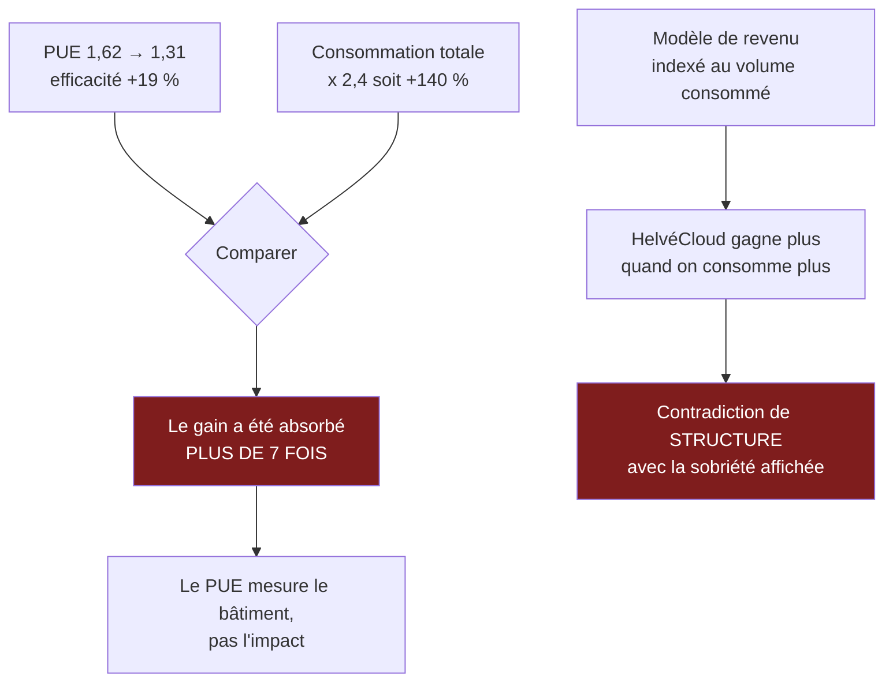

> ⬅ [[CAS17_Lentreprise_de_nettoyage_qui_ne_sait_pas_ce_quelle_vaut]] · [[00_Index_Mises_en_situation|🗂 Index]] · [[CAS19_Le_distributeur_textile_et_la_tracabilite]] ➡

# CAS 18 — L'hébergeur suisse qui vend du « cloud vert »

> **L'entreprise.** *HelvéCloud SA*, Zurich et Genève. Hébergeur de données et fournisseur de cloud privé pour PME et institutions suisses. **140 salariés**, 29 M CHF de CA, deux centres de données. Argument de vente : **souveraineté** (données stockées en Suisse) et **énergie hydraulique**. Le PUE (indicateur d'efficacité énergétique) est passé de 1,62 à 1,31 en quatre ans. La consommation électrique totale, elle, a été multipliée par 2,4 sur la même période, tirée par la demande de services d'IA. La direction veut lancer une campagne « le cloud le plus propre de Suisse ».
>
> **La question posée.**
> *« Le cloud soutient-il ou freine-t-il la durabilité ? Analysez le cas HelvéCloud et conseillez sur la campagne envisagée. »*

---

## 🧩 Les notions clés

- **Trois postes d'impact du numérique** 📘 : terminaux, data centers, réseaux
- **Effet rebond** 📘
- **Efficacité vs valeur absolue** 🔎
- **Sobriété numérique** — Questionner / Transférer / Améliorer 📘
- **Greenwashing** 📘
- **IA et consommation énergétique** 📘
- **Différenciation** et souveraineté

## 📖 Définitions pour les nuls

| Notion | En une phrase simple |
|---|---|
| **Cloud** | Des serveurs mutualisés qu'on loue au lieu de posséder les siens 🔎 |
| **PUE** | Un ratio : l'électricité totale du centre divisée par celle qui sert vraiment aux serveurs. Plus il est proche de 1, plus le bâtiment est efficace 🔎 |
| **Souveraineté des données** | Le fait que les données restent sous juridiction suisse 🔎 |
| **Effet rebond** | 📘 Les gains d'efficacité sont réabsorbés par la hausse des usages |
| **Sobriété numérique** | 📘 « Mieux avec moins » : **Q**uestionner → **T**ransférer → **A**méliorer |

## 🔍 Décorticage de la consigne (L-I-S-A-E-C)

**L — Lire.** Question à double sens explicitement demandée (« soutient ou freine »). Puis « conseillez sur la campagne » → il faut trancher sur la communication.

**I — Identifier.** ⚠️ Les deux chiffres de l'énoncé forment un **piège volontaire** : le PUE s'améliore (1,62 → 1,31) et la consommation totale explose (× 2,4). C'est exactement la structure de l'effet rebond, et c'est tout le sujet.

**S — Structurer.**
1. Ce que le cloud apporte réellement (le soutien)
2. Le mécanisme du rebond, chiffré sur ce cas
3. La question de la campagne : greenwashing ou pas
4. Recommandation

**C — Conclure.** Trancher : la campagne dans sa formulation actuelle est indéfendable, et il faut dire pourquoi précisément.

## 🧠 Le raisonnement stratégique (D-E-I)

### Axe 1 — Le cloud soutient la durabilité : le mécanisme de mutualisation

**D — Définir.** 📘 Les **trois postes d'impact** du numérique sont les **terminaux**, les **data centers** et les **réseaux**.

**E — Expliquer.** Un serveur installé dans le local technique d'une PME tourne en moyenne à un taux d'utilisation très faible : il est dimensionné pour le pic, pas pour la moyenne. Il consomme presque autant à vide qu'en charge. Mutualiser cent serveurs sous-utilisés dans un centre optimisé produit un gain réel et substantiel.

**I — Illustrer.** HelvéCloud a de vrais arguments :
- **PUE de 1,31** contre typiquement 1,8 à 2,2 pour un local serveur d'entreprise.
- **Énergie hydraulique**, contre le mix électrique moyen ailleurs.
- **Taux d'utilisation élevé** grâce à la virtualisation.
- **Durée de vie du matériel** mieux gérée qu'en PME, où les serveurs sont souvent renouvelés par précaution.

🔎 Sur le plan de la **souveraineté**, l'argument est également solide et il relève de la RNE (axe économique) : ne pas dépendre d'un fournisseur soumis à une juridiction étrangère est un enjeu réel pour une institution suisse.

### Axe 2 — Le cloud freine la durabilité : le rebond, chiffré

**D — Définir.** 📘 L'**effet rebond** : les gains d'efficacité sont **réabsorbés** par une hausse des usages.

**E — Expliquer.** Posons le calcul, parce que c'est lui qui emporte la conviction :

```
Efficacité du bâtiment :  PUE 1,62 → 1,31   =  amélioration de ~19 %
Consommation totale    :  × 2,4              =  hausse de 140 %

→ Le gain d'efficacité a été absorbé plus de sept fois par la croissance du volume.
```

🔎 **La formulation à donner à l'oral** :

> *« HelvéCloud n'a pas réduit sa consommation : elle a réduit le gaspillage par unité pendant qu'elle multipliait les unités par deux et demi. Un PUE ne mesure pas l'impact, il mesure l'efficacité du bâtiment. C'est un indicateur de gestion, pas un indicateur environnemental. »*

⚠️ Et il faut ajouter le mécanisme causal, pas seulement le constat : **le cloud « illimité » supprime le frein qui limitait l'usage**. Quand stocker ne coûte presque rien, plus personne ne trie, ne supprime, ne compresse. Quand la puissance de calcul est disponible en un clic, on lance des entraînements de modèles qu'on n'aurait jamais financés en interne.

**I — Illustrer.** 📘 Le cours donne l'ordre de grandeur : la demande des data centers liée à l'**IA croît d'environ +16 %/an**, soit un doublement tous les quatre ans environ. 📘 Et une requête de chatbot représente environ **4,32 g de CO₂**. HelvéCloud n'est donc pas victime d'un accident : elle est portée par une tendance structurelle qui va continuer.

⚠️ **Le point le plus dérangeant, et le plus fort à l'oral** : le modèle économique d'HelvéCloud repose sur le **volume consommé**. Elle gagne plus quand ses clients stockent et calculent davantage. Son intérêt économique est donc directement opposé à la sobriété qu'elle prétend incarner. **C'est une contradiction de structure**, pas un défaut de sincérité.

### Axe 3 — La campagne : où passe la ligne du greenwashing

**D — Définir.** 📘 Le **greenwashing** est une communication qui **survend** l'engagement écologique réel — allégations vagues, sans preuve.

**E — Expliquer.** 🔎 Le test à appliquer à un slogan : *« l'affirmation resterait-elle vraie si on donnait tous les chiffres ? »*

« Le cloud le plus propre de Suisse » :
- Vrai si l'on parle de PUE et de mix énergétique.
- Faux si l'on parle de consommation totale, qui a été multipliée par 2,4.
- Et « propre » est une allégation **absolue**, alors que la réalité est **relative** (moins consommateur que l'alternative).

⚠️ **Le mécanisme du risque** : plus une entreprise communique, plus l'écart entre le discours et la réalité devient coûteux quand il est révélé. Une entreprise ordinaire dont on publie la consommation est jugée ordinaire. Une entreprise qui se dit « la plus propre » dont on publie la même consommation est jugée **menteuse**.

**I — Illustrer.** Un journaliste ou une association obtient la consommation totale d'HelvéCloud sur cinq ans. Le titre s'écrit tout seul. Et le dommage frappe précisément la clientèle institutionnelle suisse, qui est le cœur de cible.

## ⚖️ L'arbitrage et la recommandation (filtre SAF)

### La synthèse à double sens 🔎

| Le cloud **soutient** la durabilité | Le cloud **freine** la durabilité |
|---|---|
| Mutualisation : taux d'usage élevé contre serveurs locaux sous-utilisés | **Concentration** de la consommation dans les data centers |
| PUE et mix énergétique bien meilleurs qu'en local | **Effet rebond** : l'abondance perçue supprime tout tri et toute compression |
| Gestion professionnelle de la durée de vie du matériel | Le modèle économique **récompense le volume** |
| Souveraineté des données (axe économique de la RNE 📘) | Dépendance : le client ne maîtrise plus son infrastructure |

🔎 **La phrase de synthèse** : *« Le cloud est plus efficient par unité, et c'est précisément cette efficience qui nourrit l'augmentation du volume. Il est plus propre par gigaoctet et plus lourd au total. »*

### Le SAF appliqué à la campagne

| Critère | Analyse | Verdict |
|---|---|---|
| **S** | ⚠️ La différenciation par la souveraineté et l'énergie est légitime ; l'allégation « le plus propre » ne l'est pas | **Fragile en l'état** |
| **A** | ❌ 📘 *Risque acceptable ?* Non : risque réputationnel majeur auprès d'une clientèle institutionnelle sensible. *Opposition ?* Associations, médias spécialisés | ❌ **Échoue** |
| **F** | ✅ Une campagne est toujours faisable — c'est bien le problème | **Sans objet** |

### 🔎 La recommandation

> **Renoncer au slogan « le plus propre de Suisse ». Le remplacer par une position vérifiable et, surtout, changer ce que l'entreprise mesure.**
>
> 1. **Publier la consommation totale annuelle**, en valeur absolue, avec le PUE **et** le volume. 🔎 Contre-intuitif mais stratégique : publier un chiffre en hausse en l'expliquant est infiniment plus crédible que ne publier que le ratio flatteur. Et cela retire d'avance toute munition à un futur article.
> 2. **Se fixer un engagement en absolu** : par exemple, plafonner la consommation totale à partir de l'année N+2 malgré la croissance du chiffre d'affaires. 🔎 **C'est la seule forme d'engagement qui résiste à l'effet rebond.** Un engagement en PUE n'en est pas un.
> 3. **Appliquer la sobriété numérique au sens du cours** 📘 — **Q**uestionner d'abord : proposer aux clients un service d'audit de leurs données dormantes, et facturer ce service. 🔎 Cela retourne partiellement la contradiction de modèle : HelvéCloud gagne alors de l'argent en aidant ses clients à consommer moins.
> 4. **Positionner la campagne sur la souveraineté**, qui est un argument vrai, vérifiable, et que les hyperscalers ne peuvent pas copier. 🔎 C'est une différenciation plus solide que l'écologie, parce qu'elle est structurelle et non comparative.

## ⚠️ Le piège classique

**L'erreur type n°1 — répondre « le cloud est plus vert que les serveurs locaux » et s'arrêter.** C'est vrai **par unité** et faux **au total**. **Réflexe correctif :** systématiquement, distinguez l'unité et le total, et dites laquelle des deux vous commentez.

**L'erreur type n°2 — prendre le PUE pour un indicateur environnemental.** Il mesure l'efficacité du bâtiment, pas l'impact. **Réflexe correctif :** demandez toujours *« cet indicateur peut-il s'améliorer pendant que l'impact augmente ? »* Si oui, ce n'est pas un indicateur d'impact.

**L'erreur type n°3 — ne pas voir la contradiction du modèle économique.** C'est l'argument le plus fort du cas et le moins cité. **Réflexe correctif :** demandez toujours *« l'entreprise gagne-t-elle plus quand on consomme plus ? »* Si oui, tous ses engagements de sobriété doivent être lus avec méfiance.

---

## 🗺️ Visuels de synthèse

### La chaîne de raisonnement



### Le chiffre qui tranche

```
Le slogan « le cloud le plus propre » à l'épreuve (illustratif)

Efficacité du bâtiment (PUE)  ████░░░░░░░░░░░░░░░░  -19 %   ✅
Consommation totale           ████████████████████  +140 %  ❌

→ Test à appliquer à tout slogan :
  « l'affirmation resterait-elle vraie
    si on donnait TOUS les chiffres ? »
```

⚠️ Graphique **illustratif** : les proportions servent le raisonnement, elles ne sont pas des données mesurées.

---

## 🔗 Navigation

⬅ [[CAS17_Lentreprise_de_nettoyage_qui_ne_sait_pas_ce_quelle_vaut]] · [[00_Index_Mises_en_situation|🗂 Index des 27 cas]] · [[CAS19_Le_distributeur_textile_et_la_tracabilite]] ➡
