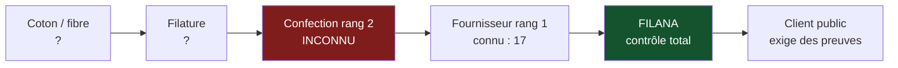

> ⬅ [[CAS18_Lhebergeur_suisse_qui_vend_du_cloud_vert]] · [[00_Index_Mises_en_situation|🗂 Index]] · [[CAS20_Lecole_privee_et_lattention_de_ses_eleves]] ➡

# CAS 19 — Le distributeur textile et la traçabilité

> **L'entreprise.** *Filana SA*, Lausanne. Distributeur de vêtements de travail et d'uniformes (hôtellerie, santé, industrie, services de sécurité). **86 salariés**, 32 M CHF de CA. Filana ne fabrique rien : elle conçoit, fait produire par **17 fournisseurs** répartis dans 6 pays d'Asie et d'Europe de l'Est, importe et distribue. Ses clients sont majoritairement des institutions publiques et des grandes entreprises. Trois appels d'offres perdus en un an pour absence de « preuve de conditions sociales de production ». Filana ne connaît pas les sous-traitants de ses fournisseurs. Un projet de traçabilité par blockchain lui est proposé à 480 000 CHF.
>
> **La question posée.**
> *« Comment Filana peut-elle sécuriser la durabilité de sa chaîne d'approvisionnement ? La blockchain est-elle la bonne réponse ? »*

---

## 🧩 Les notions clés

- **Système de valeur** 📘
- **Chaîne de valeur durable** — des matières premières à la fin de vie 📘
- **Partenariats** et **ODD 17** 📘
- **Achats comme activité de soutien** 📘
- **Traçabilité** et asymétrie d'information
- **Durabilité sociale** — plancher social 📘
- **Blockchain** — 📚 exemple technologique, à ne pas présenter comme du cours
- **Greenwashing** 📘

## 📖 Définitions pour les nuls

| Notion | En une phrase simple |
|---|---|
| **Système de valeur** | 📘 L'enchaînement des chaînes de valeur : votre fournisseur, vous, votre client |
| **Rang 1 / rang 2** | Votre fournisseur direct (rang 1) ; le fournisseur de votre fournisseur (rang 2), que vous ne connaissez souvent pas 🔎 |
| **Traçabilité** | Pouvoir dire d'où vient chaque élément d'un produit 🔎 |
| **Blockchain** | Un registre partagé et très difficile à falsifier 📚 |
| **Plancher social** | 📘 Les 12 fondements du donut : dont revenu et travail décents |

## 🔍 Décorticage de la consigne (L-I-S-A-E-C)

**L — Lire.** Deux questions. La première est ouverte (« comment sécuriser »), la seconde est fermée et piégée (« la blockchain est-elle la bonne réponse ? »). ⚠️ Une question fermée sur une technologie appelle presque toujours une réponse nuancée : la technologie résout un problème précis, rarement celui qu'on croit.

**I — Identifier.** Le mot-clé de l'énoncé est « **ne connaît pas les sous-traitants de ses fournisseurs** ». C'est un problème de **connaissance**, pas de **registre**.

**S — Structurer.**
1. Le vrai problème : responsabilité sans autorité
2. Pourquoi la blockchain ne résout pas ce problème-là
3. Ce qui le résout : contrat + partenariat + audit
4. Recommandation

**C — Conclure.** Trancher sur la blockchain (non, ou pas maintenant) et proposer l'alternative.

## 🧠 Le raisonnement stratégique (D-E-I)

### Axe 1 — Responsabilité sans autorité

**D — Définir.** 📘 Le **système de valeur** est l'enchaînement des chaînes de valeur. 📘 La chaîne de valeur durable couvre « depuis les matières premières jusqu'au recyclage ou à la fin de vie ».

**E — Expliquer.** Filana ne fabrique rien. **Tout son impact social et environnemental se situe hors de son périmètre juridique**, chez 17 fournisseurs et un nombre inconnu de sous-traitants.

🔎 Elle est donc dans la situation la plus inconfortable qui soit : **responsable de ce qu'elle ne gouverne pas**. Ses clients institutionnels lui demandent des comptes sur des ateliers dont elle ignore l'existence.

⚠️ Et il faut écarter l'objection facile : « ce ne sont pas nos usines, donc ce n'est pas notre problème ». Faux. **Ces ateliers tournent parce que Filana commande.** Elle ne tient pas la machine, mais elle est la raison pour laquelle elle tourne.

**I — Illustrer.**

```
[ Coton / fibre ]→[ Filature ]→[ Confection rang 2 ]→[ Fournisseur rang 1 ]→[ FILANA ]→[ Client public ]
      ?                ?              ?  ← inconnu        connu (17)          contrôle      exige des preuves
                                                                                 total
```

Filana ne contrôle qu'une case sur six, et c'est celle où il ne se passe presque rien.

### Axe 2 — Pourquoi la blockchain ne résout pas ce problème

**D — Définir.** 📚 Une **blockchain** est un registre partagé et très difficile à falsifier. ⚠️ Ce concept ne figure pas dans les slides du cours : à présenter comme un exemple technologique.

**E — Expliquer.** 🔎 C'est le raisonnement décisif du cas, et il se formule en une phrase :

> **Une blockchain garantit qu'une information n'a pas été modifiée après avoir été inscrite. Elle ne garantit pas que cette information était vraie au moment de l'inscription.**

Autrement dit, le registre est infalsifiable, l'entrée ne l'est pas. Si un fournisseur déclare « conditions conformes » et que c'est faux, la blockchain conserve fidèlement un mensonge pour l'éternité. **On a sécurisé le stockage d'une donnée dont on n'a pas sécurisé la production.**

**I — Illustrer.** Le problème de Filana est en amont du registre :
- Elle ne connaît pas ses fournisseurs de rang 2 → aucune donnée à inscrire.
- Elle n'a aucun moyen de vérifier ce que ses fournisseurs de rang 1 déclarent → la donnée inscrite n'est pas fiable.
- Ses clients demandent une **preuve**, pas un enregistrement.

⚠️ **Et le coût numérique** : 480 000 CHF pour un dispositif qui ne traite pas la cause. 📘 Le cours signale d'ailleurs que certaines blockchains sont très énergivores — appliquer une solution lourde à un problème mal posé cumule les inconvénients.

🔎 **Nuance à apporter pour ne pas être caricatural** : la blockchain **deviendra** utile — mais après. Une fois la chaîne cartographiée, les fournisseurs audités et les données produites de façon fiable, un registre partagé entre plusieurs donneurs d'ordre a un intérêt réel. **C'est une question de séquence, pas de valeur.**

### Axe 3 — Ce qui résout réellement : contrat, partenariat, audit

**D — Définir.** 📘 Les **achats** sont une activité de **soutien**, à impact **transversal**. 📘 Les **partenariats** constituent l'un des **5P** de l'Agenda 2030 et l'objet de l'**ODD 17**.

**E — Expliquer.** 🔎 Face à une responsabilité sans autorité, il n'existe que deux instruments :

**1. La contrainte contractuelle.** « Si vous voulez notre commande, voici les conditions. » Puissante, mais limitée : elle ne descend qu'**un cran**. Filana peut contraindre ses 17 fournisseurs de rang 1 ; elle ne peut rien imposer au rang 2 qu'elle ne connaît pas.

⚠️ D'où une clause décisive : **obliger contractuellement le rang 1 à déclarer et faire auditer son rang 2**. On utilise l'autorité qu'on a sur le maillon accessible pour atteindre celui qui ne l'est pas.

**2. Le partenariat.** 🔎 Filana pèse 32 M CHF. Face à un fournisseur asiatique qui sert dix donneurs d'ordre, son poids de négociation est faible. Seule, elle n'obtiendra ni transparence ni audit.

Avec d'autres distributeurs suisses ou européens de vêtements professionnels, le volume cumulé change tout. Et l'audit d'un même fournisseur, financé une fois pour cinq donneurs d'ordre, coûte cinq fois moins cher à chacun.

**I — Illustrer.** 🔎 C'est le mécanisme du **bien collectif** : aucun distributeur ne financera seul un programme d'audit dont ses concurrents profiteront gratuitement. Un engagement **simultané** débloque une valeur qui existait déjà mais que la méfiance mutuelle empêchait de réaliser.

⚠️ **Limite juridique à mentionner** : cette coopération entre concurrents doit rester cantonnée aux critères sociaux et environnementaux. Toute coordination sur les **prix**, les **volumes** ou la **répartition des clients** serait une entente illicite. Le mot « durabilité » n'est pas une autorisation.

## ⚖️ L'arbitrage et la recommandation (filtre SAF)

### Analyse à double sens 🔎

| Le numérique **soutient** ici | Le numérique **freine** ici |
|---|---|
| Un registre partagé rend les preuves opposables et non modifiables | Il ne fiabilise pas la donnée à l'entrée — risque de **greenwashing certifié** |
| Une plateforme d'audit mutualisée réduit les coûts | 480 k CHF sur un CA de 32 M : disproportionné pour un problème de connaissance |
| La cartographie numérique de la chaîne rend le pilotage possible | Certaines blockchains sont très énergivores 📘 |
| Les clients publics acceptent des preuves numériques standardisées | Dépendance à une solution propriétaire |

### Le SAF

| Option | S | A | F | Verdict |
|---|---|---|---|---|
| **Blockchain à 480 k maintenant** | ❌ Ne traite pas la cause (méconnaissance du rang 2) | ⚠️ Coût élevé, bénéfice non démontrable auprès des clients | ⚠️ Suppose des données qui n'existent pas | **Écartée sur S** |
| **Cartographie + clauses + audit mutualisé** | ✅ Attaque la cause et répond exactement à l'exigence des appels d'offres | ⚠️ Certains fournisseurs refuseront ; il faudra en changer | ⚠️ Demande une fonction achats renforcée | **Retenue** |

### 🔎 La recommandation

> **Refuser le projet blockchain en l'état. Engager un programme en trois étapes sur 24 mois, pour environ 180 000 CHF.**
>
> **Étape 1 (0–6 mois) — Cartographier.** Obtenir de chacun des 17 fournisseurs la déclaration de ses sites de production et de ses sous-traitants. 🔎 Simple, peu coûteux, et déjà révélateur : le fournisseur qui refuse de déclarer se désigne lui-même.
>
> **Étape 2 (6–18 mois) — Contractualiser et auditer.** Clause d'audit inopiné, obligation de déclaration du rang 2, droit de visite. Puis audit tiers sur les fournisseurs représentant 80 % des volumes. ⚠️ Prévoir de **perdre 2 à 4 fournisseurs** : c'est le signe que la démarche est réelle et non cosmétique.
>
> **Étape 3 (18–24 mois) — Mutualiser.** Rejoindre ou créer un groupement de donneurs d'ordre partageant les audits. 📘 C'est l'ODD 17 en pratique : les problèmes de durabilité dépassent le périmètre d'un acteur.
>
> **Et ensuite seulement, envisager le registre partagé** — quand il y aura des données fiables à y inscrire et plusieurs acteurs pour le partager.

## ⚠️ Le piège classique

**L'erreur type n°1 — répondre « oui » à la blockchain parce que c'est le mot attendu.** 📘 Le cours lui-même invite à discuter : registre infalsifiable **mais** énergivore et coûteux. **Réflexe correctif :** demandez toujours *« quelle est la cause du problème, et cette technologie l'atteint-elle ? »*

**L'erreur type n°2 — s'arrêter au rang 1.** Auditer ses 17 fournisseurs directs et déclarer la chaîne « tracée ». 📘 « Ici et ailleurs » impose de descendre plus loin. **Réflexe correctif :** demandez toujours *« et le fournisseur de mon fournisseur ? »*

**L'erreur type n°3 — oublier le partenariat.** L'étudiant raisonne comme si Filana pouvait imposer seule ses conditions. Avec 32 M de CA face à des industriels asiatiques, elle ne le peut pas. **Réflexe correctif :** quand le poids de négociation est insuffisant, la seule voie est **collective**.

---

## 🗺️ Visuels de synthèse

### La chaîne de raisonnement



### Le chiffre qui tranche

```
Ce que la blockchain garantit / ne garantit pas (illustratif)

Intégrité APRÈS inscription   ████████████████████  garantie
Véracité À l'inscription      ░░░░░░░░░░░░░░░░░░░░  aucune

→ Un registre infalsifiable conservera
  fidèlement un mensonge pour l'éternité.

Budget comparé
 Blockchain immédiate   ████████████████████  480 k  ❌ cause non traitée
 Cartographie + audit   ███████               180 k  ✅ cause traitée
```

⚠️ Graphique **illustratif** : les proportions servent le raisonnement, elles ne sont pas des données mesurées.

---

## 🔗 Navigation

⬅ [[CAS18_Lhebergeur_suisse_qui_vend_du_cloud_vert]] · [[00_Index_Mises_en_situation|🗂 Index des 27 cas]] · [[CAS20_Lecole_privee_et_lattention_de_ses_eleves]] ➡
