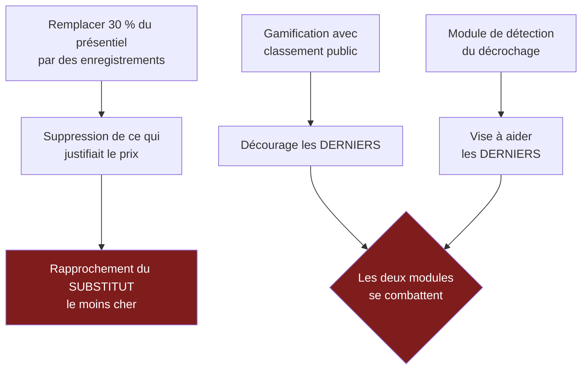

> ⬅ [[CAS19_Le_distributeur_textile_et_la_tracabilite]] · [[00_Index_Mises_en_situation|🗂 Index]] · [[CAS21_Lentreprise_de_construction_et_la_regle_qui_change]] ➡

# CAS 20 — L'école privée et l'attention de ses élèves

> **L'entreprise.** *Institut Berlioz*, école de commerce privée à Genève. **1 200 étudiants**, 140 enseignants, 24 M CHF de CA. Concurrence forte des hautes écoles publiques (gratuites ou peu chères) et de plateformes de formation en ligne à bas coût. Un projet de « campus augmenté » prévoit : plateforme d'apprentissage avec gamification (points, badges, classements), assistant conversationnel disponible 24 h/24, analyse comportementale des connexions pour détecter le décrochage, et cours enregistrés remplaçant 30 % des heures en présentiel. Budget : 2,2 M CHF. Argument avancé : « attirer une génération native du numérique ».
>
> **La question posée.**
> *« Analysez le projet sous l'angle de l'économie de l'attention et de la RNE. Le numérique renforce-t-il ici la proposition de valeur ? »*

---

## 🧩 Les notions clés

- **Économie de l'attention** et **dark patterns** 📘
- **RNE** — 4 axes, notamment sociétal et technologique 📘
- **Proposition de valeur** (BMC) 📘
- **Substituts** (force de Porter) 📘
- **Sobriété numérique** — questionner le besoin 📘
- **Gestion responsable des données** — but déterminé, minimisation 📘
- **Accessibilité** 📘
- **Effet rebond** 🔎

## 📖 Définitions pour les nuls

| Notion | En une phrase simple |
|---|---|
| **Économie de l'attention** | 📘 Capter le « temps de cerveau disponible » — l'attention devient la ressource qu'on exploite |
| **Dark pattern** | 📘 Une interface conçue pour vous faire faire ce que vous n'auriez pas choisi |
| **Gamification** | Ajouter des points, badges et classements pour rendre une activité accrocheuse 🔎 |
| **Proposition de valeur** | 📘 Ce pour quoi le client vous choisit plutôt qu'un autre |
| **Minimisation** | 📘 Ne collecter que les données strictement nécessaires |

## 🔍 Décorticage de la consigne (L-I-S-A-E-C)

**L — Lire.** Deux cadres imposés : **économie de l'attention** et **RNE**. Puis une question fermée sur la proposition de valeur.

**I — Identifier.** ⚠️ Le piège central : l'argument « attirer une génération native du numérique » est une **justification de moyens**, pas une proposition de valeur. Il faut le contester.

🔎 Et il y a une question stratégique de fond que l'énoncé pose sans le dire : si l'Institut Berlioz remplace 30 % du présentiel par des cours enregistrés, **en quoi se distingue-t-il encore d'une plateforme en ligne à bas coût ?** Il se rapproche de son substitut le moins cher.

**S — Structurer.**
1. La proposition de valeur : qu'achète-t-on à 24 M CHF ?
2. L'économie de l'attention : la gamification et ses effets
3. La RNE : l'analyse comportementale des étudiants
4. Recommandation module par module

**C — Conclure.** Trancher — et le verdict n'est pas uniforme selon les modules.

## 🧠 Le raisonnement stratégique (D-E-I)

### Axe 1 — La proposition de valeur : se rapprocher de son substitut est une faute stratégique

**D — Définir.** 📘 La **proposition de valeur** est le bloc central du BMC : ce pour quoi le client choisit cette entreprise. 📘 Un **substitut** satisfait le même besoin autrement.

**E — Expliquer.** Pourquoi un étudiant paie-t-il une école privée alors que des cours en ligne coûtent quelques centaines de francs ? 🔎 Certainement pas pour le contenu : le contenu est disponible gratuitement partout. Il paie pour ce qui n'est **pas** transmissible en ligne :

- l'encadrement individualisé et la disponibilité des enseignants ;
- le réseau et les liens entre étudiants ;
- le cadre et le rythme qui obligent à travailler ;
- la reconnaissance du diplôme et l'accès aux entreprises.

**I — Illustrer.** 🔎 Le raisonnement décisif :

> *« En remplaçant 30 % du présentiel par des enregistrements, l'Institut Berlioz supprime exactement ce qui justifiait son prix, et se rapproche du produit de ses concurrents les moins chers. C'est un mouvement vers le substitut, pas une différenciation. »*

⚠️ Et l'argument « génération native du numérique » ne tient pas à l'examen : les étudiants passent déjà l'essentiel de leur journée devant un écran. **Ce qui est rare pour eux n'est pas le numérique — c'est l'attention humaine.** Une école qui vend du présentiel dans un monde saturé d'écrans a un positionnement plus solide que l'inverse.

### Axe 2 — L'économie de l'attention : la gamification est-elle pédagogique ?

**D — Définir.** 📘 L'**économie de l'attention** consiste à capter le temps de cerveau disponible ; ses mécanismes incluent les **dark patterns**, les boucles dopaminergiques, les bulles de filtres, et le principe « si c'est gratuit, c'est vous le produit ».

**E — Expliquer.** 🔎 Il faut distinguer deux choses que la gamification confond :

| Ce que la gamification produit | Ce que l'école prétend viser |
|---|---|
| **De l'engagement** : du temps passé sur la plateforme | **De l'apprentissage** : de la compréhension durable |
| Une motivation **extrinsèque** (le badge) | Une motivation **intrinsèque** (comprendre) |
| Une mesure facile (connexions, points) | Une mesure difficile (compétence réelle) |

⚠️ Le risque documenté : les mécanismes de récompense **substituent** la motivation extrinsèque à l'intrinsèque. L'étudiant travaille pour le classement, puis cesse de travailler quand le classement disparaît.

**I — Illustrer.** 🔎 Un classement public entre 1 200 étudiants a un second effet, spécifiquement contraire à la mission d'une école : il **décourage les derniers**. Or les derniers du classement sont précisément ceux que le module « détection du décrochage » prétend aider. **Les deux modules se combattent.**

Et l'effet rebond guette : l'assistant disponible 24 h/24 rend la question « gratuite ». On pose donc beaucoup plus de questions, souvent superficielles, au lieu de chercher soi-même — l'effort cognitif étant précisément ce qui produit l'apprentissage.

### Axe 3 — La RNE : analyser le comportement d'étudiants

**D — Définir.** 📘 La **RNE** comporte quatre axes. 📘 Les principes de gestion responsable des données : **but déterminé, transparence, minimisation**.

**E — Expliquer.** L'analyse comportementale des connexions est le module le plus sensible du projet. Trois questions à poser :

| Principe 📘 | Question à poser à l'Institut |
|---|---|
| **But déterminé** | À quoi servent précisément ces données ? Détecter un décrochage — ou évaluer les étudiants, ou les enseignants ? |
| **Transparence** | L'étudiant sait-il que son heure de connexion, sa durée de lecture et son inactivité sont enregistrées ? |
| **Minimisation** | Détecter un décrochage nécessite-t-il un suivi comportemental continu, ou une alerte sur les absences suffit-elle ? |

📘 **Privacy by default** au sens des slides — obtenir un **consentement libre et éclairé**. ⚠️ Question réelle : un étudiant qui paie sa scolarité peut-il refuser librement le suivi comportemental, ou le refus est-il socialement impossible ? **Un consentement qu'on ne peut pas refuser sans conséquence n'est pas libre.**

**I — Illustrer.**

| Axe RNE 📘 | Enjeu à l'Institut Berlioz |
|---|---|
| **Économique** | Dépendance à un éditeur de plateforme ; 2,2 M investis dans un outil dont on ne maîtrise pas l'évolution |
| **Technologique** | Sécurité des données d'étudiants mineurs ou jeunes majeurs ; explicabilité de l'algorithme de détection |
| **Environnemental** | Hébergement, vidéos en streaming, équipements individuels requis |
| **Sociétal** | Surveillance, gamification addictive, **accessibilité** (étudiants en situation de handicap, sous-titrage des enregistrements) |

⚠️ 📘 Sur l'accessibilité : des cours enregistrés non sous-titrés créent une **exclusion indirecte** directe. Les principes **POUR** s'appliquent : Perceptible (sous-titres, contraste), Utilisable, Compréhensible, Robuste.

## ⚖️ L'arbitrage et la recommandation (filtre SAF)

### Analyse à double sens 🔎

| Le numérique **soutient** la proposition de valeur | Le numérique **la freine** |
|---|---|
| Ressources disponibles en rattrapage pour les étudiants absents ou malades | Remplacer 30 % du présentiel rapproche l'école de son substitut low-cost |
| Détection précoce du décrochage → intervention humaine plus rapide | Surveillance comportementale → relation de défiance |
| Sous-titres et transcriptions → **accessibilité améliorée** | Gamification → motivation extrinsèque, découragement des derniers |
| Moins de trajets domicile-campus | ⚠️ **Effet rebond** : équipements individuels, streaming, questions superficielles à l'assistant |

### Le SAF, module par module

| Module | S | A | F | Décision |
|---|---|---|---|---|
| Cours enregistrés **en complément** | ✅ | ✅ | ✅ | **Accepter** — avec sous-titrage obligatoire |
| Cours enregistrés **en remplacement de 30 %** | ❌ Détruit la proposition de valeur | ❌ Enseignants et parents s'y opposeront | ✅ | **Refuser** |
| Assistant conversationnel | ⚠️ | ⚠️ | ✅ | **Conditionner** — cadrer les usages |
| Détection du décrochage | ✅ | ⚠️ consentement | ⚠️ explicabilité | **Conditionner** fortement |
| Gamification avec classement public | ❌ | ❌ | ✅ | **Refuser** |

### 🔎 La recommandation

> **Approuver environ 1,2 M sur 2,2 M, en inversant la logique du projet : le numérique doit *libérer* du temps humain, pas le remplacer.**
>
> 1. **Aucun remplacement du présentiel.** Les enregistrements sont un **complément** (rattrapage, révision, accessibilité), jamais une substitution. 🔎 La règle stratégique : ne jamais numériser ce qui constitue votre différence par rapport à votre substitut le moins cher.
> 2. **Gamification sans classement public.** Conserver la progression individuelle (l'étudiant se compare à lui-même) ; supprimer le classement entre pairs, qui décourage ceux qu'il faudrait aider.
> 3. **Détection du décrochage : oui, mais avec trois garde-fous.** Alerte sur des indicateurs simples et déclarés (absences, rendus non remis) plutôt que suivi comportemental continu — 📘 principe de **minimisation** ; information explicite des étudiants — 📘 **transparence** ; et **l'alerte déclenche un appel humain**, jamais une action automatique.
> 4. **Réallouer 400 000 CHF du budget vers du temps d'enseignant** : tutorat individuel, permanences. 🔎 C'est le point le plus important : dans un marché où le contenu est gratuit et abondant, **l'attention humaine est la seule ressource rare**. C'est elle qu'on vend à 24 M CHF, et c'est elle qu'il faut renforcer.
> 5. **Sous-titrer et transcrire tous les enregistrements** dès l'origine — 📘 l'accessibilité se conçoit, elle ne se rattrape pas.

## ⚠️ Le piège classique

**L'erreur type n°1 — accepter « attirer une génération native du numérique » comme argument.** C'est un slogan, pas une proposition de valeur. **Réflexe correctif :** demandez toujours *« qu'est-ce que le client achète, et pourquoi paierait-il plus cher que l'alternative ? »*

**L'erreur type n°2 — confondre engagement et apprentissage.** La gamification augmente le temps passé ; ce n'est pas la même chose que la compétence acquise. **Réflexe correctif :** demandez ce que l'indicateur mesure réellement, et s'il peut s'améliorer pendant que le résultat se dégrade.

**L'erreur type n°3 — traiter l'analyse comportementale comme un simple outil pédagogique.** C'est une collecte de données personnelles. 📘 Les trois principes — but déterminé, transparence, minimisation — s'appliquent intégralement. **Réflexe correctif :** dès qu'un projet observe des personnes, sortez la grille RNE avant la grille pédagogique.

---

## 🗺️ Visuels de synthèse

### La chaîne de raisonnement



### Le chiffre qui tranche

```
Qu'achète-t-on à 24 M CHF ?   (illustratif)

Le contenu des cours      █░░░░░░░░░░░░░░░░░░░  gratuit partout
L'encadrement humain      ████████████████████  rare et cher
Le réseau et le cadre     ████████████████      non transmissible
La reconnaissance         ██████████████        institutionnelle

→ Ce qui est rare pour un étudiant n'est pas
  le numérique : c'est l'ATTENTION HUMAINE
```

⚠️ Graphique **illustratif** : les proportions servent le raisonnement, elles ne sont pas des données mesurées.

---

## 🔗 Navigation

⬅ [[CAS19_Le_distributeur_textile_et_la_tracabilite]] · [[00_Index_Mises_en_situation|🗂 Index des 27 cas]] · [[CAS21_Lentreprise_de_construction_et_la_regle_qui_change]] ➡
