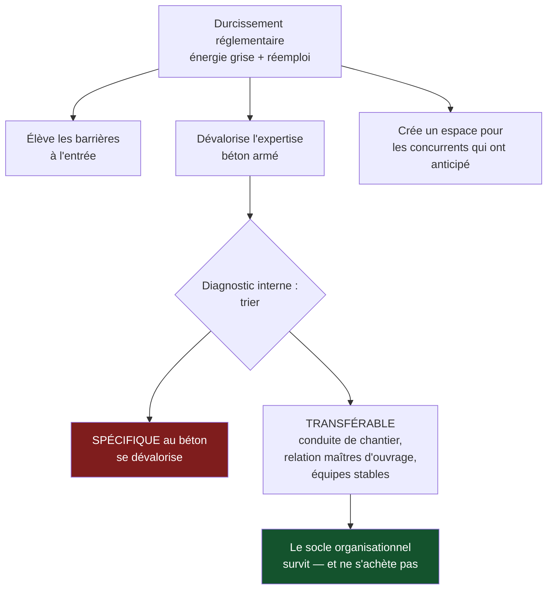

> ⬅ [[CAS20_Lecole_privee_et_lattention_de_ses_eleves]] · [[00_Index_Mises_en_situation|🗂 Index]] · [[CAS22_La_plateforme_de_livraison_et_son_plancher_social]] ➡

# CAS 21 — L'entreprise de construction et la règle qui change

> **L'entreprise.** *Constructions Rive SA*, canton de Vaud. Entreprise générale de construction, **175 salariés**, 62 M CHF de CA. Activité : logements collectifs et bâtiments administratifs, dont **45 % en marchés publics**. Compétence historique : béton armé, méthodes éprouvées, équipes stables. Un durcissement réglementaire cantonal impose progressivement des exigences sur l'énergie grise des matériaux et sur le réemploi des éléments de démolition. Deux concurrents ont investi dans la construction bois et le réemploi. Constructions Rive n'a aucune compétence dans ces domaines et son bureau technique est réticent.
>
> **La question posée.**
> *« Analysez l'impact de l'évolution réglementaire sur la position concurrentielle de Constructions Rive et proposez une trajectoire. »*

---

## 🧩 Les notions clés

- **La 6e force : l'État** 📘
- **PESTEL** — dimensions P, L, É 📘
- **Barrières à l'entrée** et redistribution des positions
- **Ressources et compétences** — diagnostic interne 📘
- **Avantage concurrentiel durable** 📘
- **Économie circulaire** et réemploi 📘
- **SAF** — faisabilité et acquisition de compétences 📘
- **Actifs échoués** 🔎

## 📖 Définitions pour les nuls

| Notion | En une phrase simple |
|---|---|
| **Énergie grise** | L'énergie consommée pour fabriquer et transporter un matériau, avant même qu'il soit posé 🔎 |
| **Réemploi** | Réutiliser un élément (poutre, fenêtre, dalle) tel quel dans un autre bâtiment 🔎 |
| **6e force** | 📘 L'État, ajouté aux 5 forces de Porter dans ce cours |
| **Barrière à l'entrée** | Ce qui empêche un nouveau concurrent d'arriver facilement 📘 |
| **Actif échoué** | Un équipement encore neuf devenu inutilisable parce que la règle a changé 🔎 |

## 🔍 Décorticage de la consigne (L-I-S-A-E-C)

**L — Lire.** « **Analysez l'impact** » sur la **position concurrentielle** : on ne demande pas si la règle est bonne, mais ce qu'elle fait aux rapports de force. Puis « proposez une **trajectoire** » : un plan séquencé, pas une mesure isolée.

**I — Identifier.** ⚠️ Le réflexe faible est de traiter la réglementation comme une contrainte. 📘 Le cours ajoute l'**État** comme sixième force précisément parce qu'il **redistribue les positions** — il fait des gagnants et des perdants.

**S — Structurer.**
1. Ce que la règle fait au secteur (pas à l'entreprise)
2. Le diagnostic interne : compétence ou actif échoué ?
3. Le risque des 45 % de marchés publics
4. Trajectoire filtrée par le SAF

**C — Conclure.** Trancher sur le mode d'acquisition de la compétence : faire, acheter ou s'associer.

## 🧠 Le raisonnement stratégique (D-E-I)

### Axe 1 — Une règle ne contraint pas, elle redistribue

**D — Définir.** 📘 Le cours ajoute **l'État** aux cinq forces de Porter. 📘 Les **barrières à l'entrée** déterminent la facilité avec laquelle de nouveaux concurrents s'installent.

**E — Expliquer.** 🔎 Le raisonnement à mener en trois temps :

1. Une nouvelle exigence technique **élève les barrières** : les acteurs qui savent faire sont protégés, ceux qui ne savent pas sont exclus.
2. Elle **dévalorise les compétences existantes** : le savoir-faire béton de Constructions Rive ne disparaît pas, mais il cesse d'être suffisant.
3. Elle **crée un espace** pour les acteurs qui ont anticipé — ici, les deux concurrents déjà positionnés.

**I — Illustrer.** Constructions Rive doit comprendre qu'elle ne subit pas un surcoût administratif : elle subit une **redéfinition du terrain de jeu**. Son avantage historique — des méthodes éprouvées, des équipes stables sur le béton — est en train de devenir un **coût d'adaptation** au lieu d'être une force.

⚠️ **La question à se poser** : combien de ses actifs deviennent des **actifs échoués** ? Coffrages, matériel de béton, expertise du bureau technique, relations fournisseurs. Ces éléments ne disparaissent pas, mais leur valeur stratégique s'érode sans qu'aucune écriture comptable ne le signale.

### Axe 2 — Diagnostic interne : ce qui survit et ce qui ne survit pas

**D — Définir.** 📘 Le diagnostic interne consiste en « l'analyse des ressources matérielles et immatérielles » et « l'analyse de la chaîne de valeur ». 📘 Les ressources **immatérielles** sont peu transférables, donc peu imitables.

**E — Expliquer.** 🔎 Il faut trier ce qui est **spécifique au béton** de ce qui est **transférable à toute construction**.

**I — Illustrer.**

| Ressource / compétence | Spécifique au béton ? | Verdict |
|---|---|---|
| Expertise béton armé du bureau technique | ✅ Oui | **Se dévalorise** |
| Matériel de coffrage et de coulage | ✅ Oui | **Actif échoué partiel** |
| Conduite de chantier, coordination des corps de métier | ❌ Non | **Transférable — c'est le socle** |
| Relations avec les maîtres d'ouvrage publics | ❌ Non | **Transférable, et précieuse** |
| Équipes stables, faible turn-over | ❌ Non | **Transférable — ressource immatérielle forte** |
| Capacité à répondre à des appels d'offres complexes | ❌ Non | **Transférable** |

🔎 **Ce tableau est le cœur de la réponse** : ce que Constructions Rive perd est **technique** ; ce qu'elle conserve est **organisationnel et relationnel**. Or c'est justement l'organisationnel qui est le plus difficile à copier. **La compétence technique s'achète ou se recrute ; la capacité à mener un chantier de 40 M sans dérapage ne s'achète pas.**

C'est ce qui rend la situation redressable — et c'est aussi ce qui indique **par où** passer.

### Axe 3 — Le risque immédiat : 45 % du CA

**D — Définir.** 📘 L'**acceptabilité** interroge notamment le niveau de **risque**.

**E — Expliquer.** Les marchés publics sont le premier canal par lequel une exigence environnementale devient contraignante : ils intègrent les critères avant que la loi ne les généralise. 🔎 **Constructions Rive n'a donc pas cinq ans devant elle : elle a le temps du prochain cycle d'appels d'offres.**

**I — Illustrer.**

```
CA total                     62 M CHF
Dont marchés publics (45 %)  27,9 M CHF   ← exposé en premier
Perte de la moitié de ce
segment sur 3 ans            ≈ 14 M CHF   soit 22 % du CA total
```

⚠️ Et l'effet est **discontinu**, pas progressif : on ne perd pas 5 % par an. On perd un appel d'offres entier, puis un autre. La perte arrive par paliers brutaux, ce qui rend l'anticipation d'autant plus nécessaire.

## ⚖️ L'arbitrage et la recommandation (filtre SAF)

### Trois voies d'acquisition de la compétence

| Voie | S | A | F | Commentaire |
|---|---|---|---|---|
| **Former en interne** | ✅ | ⚠️ Le bureau technique est réticent | ❌ Trop lent (3-5 ans) face au cycle des appels d'offres | Nécessaire mais insuffisant seul |
| **Racheter une entreprise bois** | ✅ | ⚠️ Coût et intégration | ⚠️ Cher, et les cibles sont déjà courtisées | Envisageable à moyen terme |
| **S'associer / sous-traiter en groupement** | ✅ | ✅ | ✅ Immédiat | 🔎 **La seule voie compatible avec le calendrier** |

### Analyse à double sens du numérique 🔎

⚠️ Le numérique n'est pas au cœur de l'énoncé, mais il est un levier réel ici — et savoir le placer sans forcer montre de la maîtrise :

| Ce qu'il **soutient** | Ce qu'il **freine** |
|---|---|
| La maquette numérique du bâtiment permet de calculer l'énergie grise dès la conception, donc de la réduire | Coût de licences et de formation, sur un bureau technique déjà réticent |
| Un inventaire numérique des éléments de démolition rend le réemploi organisable | ⚠️ **Effet rebond** : la conception assistée accélère la production de variantes et de projets, donc de construction totale |
| Le suivi numérique de chantier réduit les reprises et les déchets | Dépendance à des outils propriétaires |

### 🔎 La recommandation

> **Une trajectoire en trois horizons, dont le premier commence maintenant et ne coûte presque rien.**
>
> **Horizon 1 (0–12 mois) — Ne pas perdre les marchés publics.**
> Constituer un **groupement momentané d'entreprises** avec un charpentier-constructeur bois régional pour répondre conjointement aux appels d'offres. 🔎 Constructions Rive apporte ce qu'elle a de non imitable — la conduite de chantier, la surface financière, la relation aux maîtres d'ouvrage — et son partenaire apporte la compétence technique. **On achète du temps sans acheter de compétence.**
> Parallèlement : cartographier l'énergie grise des projets en cours, pour savoir où l'on se situe.
>
> **Horizon 2 (12–36 mois) — Internaliser progressivement.**
> Former deux ingénieurs du bureau technique, recruter un profil « réemploi et matériaux biosourcés », et se doter d'un outil de calcul d'énergie grise intégré à la conception. ⚠️ Traiter la réticence du bureau technique comme un point d'acceptabilité à part entière : elle ne se règle pas par une note de service. La faire travailler **avec** le partenaire de l'horizon 1 est le meilleur dispositif de transfert.
>
> **Horizon 3 (36 mois et au-delà) — Se différencier.**
> Développer une compétence propre sur le **réemploi**, plus rare et plus difficile à imiter que la construction bois. 🔎 Le réemploi suppose un réseau (déconstructeurs, plateformes de stockage, assureurs), c'est-à-dire une **ressource organisationnelle** — précisément le type d'avantage que Constructions Rive sait construire et que ses concurrents actuels, positionnés sur la technique bois, n'ont pas.
>
> ⚠️ **La tension à nommer** : l'horizon 1 protège le chiffre d'affaires mais ne construit aucun avantage — il enrichit un partenaire. L'horizon 3 construit un avantage mais ne rapporte rien avant trois ans. Les mener en parallèle est coûteux ; ne mener que le premier revient à devenir sous-traitant de son propre marché.

## ⚠️ Le piège classique

**L'erreur type n°1 — traiter la réglementation comme un simple coût.** 📘 L'État est une **force** : il redistribue les positions et élève les barrières. **Réflexe correctif :** demandez toujours *« à qui cette règle profite-t-elle, et qui élimine-t-elle ? »*

**L'erreur type n°2 — conclure que l'entreprise est condamnée.** Elle perd une compétence technique, elle conserve un socle organisationnel très difficile à copier. **Réflexe correctif :** dans tout diagnostic interne, triez ce qui est **spécifique à la technologie menacée** et ce qui est **transférable**.

**L'erreur type n°3 — recommander la formation interne comme réponse unique.** Elle est nécessaire, mais son délai (3 à 5 ans) est incompatible avec le calendrier des appels d'offres. **Réflexe correctif :** confrontez toujours le **délai d'acquisition** d'une compétence au **délai de la menace**. C'est exactement ce que teste la faisabilité du SAF.

---

## 🗺️ Visuels de synthèse

### La chaîne de raisonnement



### Le chiffre qui tranche

```
L'exposition par les marchés publics   (illustratif)

CA total                    ████████████████████  62 M CHF
dont marchés publics 45 %   █████████░░░░░░░░░░░  27,9 M  ← exposé en 1er
perte de la moitié / 3 ans  ████░░░░░░░░░░░░░░░░  14 M    = 22 % du CA

⚠ La perte n'est pas progressive : on perd un
  appel d'offres entier, puis un autre. Par PALIERS.
```

⚠️ Graphique **illustratif** : les proportions servent le raisonnement, elles ne sont pas des données mesurées.

---

## 🔗 Navigation

⬅ [[CAS20_Lecole_privee_et_lattention_de_ses_eleves]] · [[00_Index_Mises_en_situation|🗂 Index des 27 cas]] · [[CAS22_La_plateforme_de_livraison_et_son_plancher_social]] ➡
