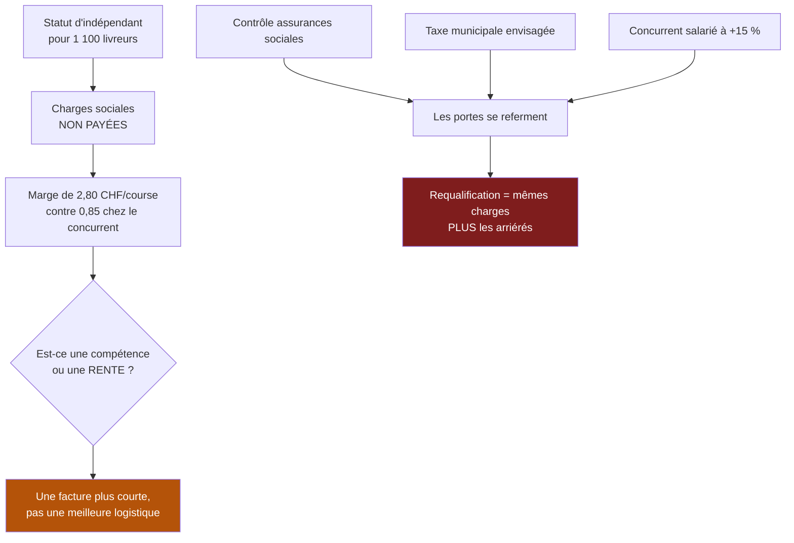

> ⬅ [[CAS21_Lentreprise_de_construction_et_la_regle_qui_change]] · [[00_Index_Mises_en_situation|🗂 Index]] · [[CAS23_La_PME_de_mecanique_qui_veut_vendre_des_heures_de_machine]] ➡

# CAS 22 — La plateforme de livraison et son plancher social

> **L'entreprise.** *Rapido*, plateforme de livraison de repas active à Genève, Lausanne et Fribourg. **34 salariés** au siège, **1 100 livreurs** sous statut d'indépendant. 41 M CHF de volume de commandes, 9,2 M CHF de revenus (commission de 22 % aux restaurants + frais de livraison). L'application utilise des notifications, un système de bonus pour les créneaux difficiles, et un score de livreur qui conditionne l'accès aux créneaux rémunérateurs. Un contrôle des assurances sociales met en cause le statut d'indépendant. Deux villes envisagent une taxe sur les livraisons. Un concurrent salarie ses livreurs et affiche des prix 15 % plus élevés.
>
> **La question posée.**
> *« Le modèle de Rapido est-il durable ? Analysez et proposez une transformation du business model. »*

---

## 🧩 Les notions clés

- **Les deux sens de « durable »** ⚠️
- **Donut de Raworth** — **plancher social** 📘
- **Externalités négatives** dans le BM 📘
- **BM durable** — mission, impacts, externalités 📘
- **Économie de l'attention** et **dark patterns** 📘
- **La 6e force : l'État** 📘
- **Rente vs compétence** 🔎
- **SAF** 📘

## 📖 Définitions pour les nuls

| Notion | En une phrase simple |
|---|---|
| **Plancher social** | 📘 Les 12 fondements du donut : alimentation, santé, éducation, **revenu et travail**, logement, équité… — en dessous, la vie n'est pas décente |
| **Externalité négative** | 📘 Un coût réel supporté par quelqu'un d'autre que celui qui le cause |
| **Dark pattern** | 📘 Une interface conçue pour obtenir un comportement que l'utilisateur n'aurait pas choisi |
| **Rente** | Un profit qui vient d'une **situation**, pas d'une compétence 🔎 |
| **Statut d'indépendant** | Un travailleur qui n'est pas salarié : pas de charges sociales pour le donneur d'ordre 🔎 |

## 🔍 Décorticage de la consigne (L-I-S-A-E-C)

**L — Lire.** ⚠️ « Le modèle est-il **durable** ? » — **ambiguïté volontaire**. Ici, les **deux sens** s'appliquent, et c'est tout l'intérêt du cas. Le dire d'emblée est un point facile :

> 🔎 *« Le mot "durable" a deux sens. Je vais montrer qu'ici ils convergent : le modèle est insoutenable socialement (sens B), et cette insoutenabilité menace directement sa pérennité (sens A). »*

**I — Identifier.** L'externalité principale de Rapido est **sociale**, pas écologique. 📘 Le donut fournit le cadre : le **plancher social** inclut explicitement « revenu et travail ».

**S — Structurer.**
1. Où sont les externalités (et pourquoi elles sont invisibles dans les comptes)
2. Le sens A : pourquoi l'avantage est une rente qui se referme
3. L'économie de l'attention : les mécanismes de l'application
4. Transformation du BM + SAF

**C — Conclure.** Trancher sur un scénario de transformation, avec le prix à payer.

## 🧠 Le raisonnement stratégique (D-E-I)

### Axe 1 — L'externalité est la marge

**D — Définir.** 📘 Une **externalité négative** est un impact que l'entreprise cause sans le payer. 📘 Dans un business model, elle se cache souvent dans la **structure de coûts**, sous forme de coûts **absents**.

**E — Expliquer.** 🔎 Comparons Rapido à son concurrent, qui salarie :

```
                              Rapido            Concurrent
Revenu par livraison           8,00              8,00
Rémunération du livreur       -5,20             -5,20
Charges sociales               0,00             -1,15   ← non payé chez Rapido
Assurance accident             0,00             -0,25   ← non payé
Congés, maladie, formation     0,00             -0,55   ← non payé
                             ------            ------
Marge par livraison            2,80              0,85
```

⚠️ **Rapido n'est pas plus efficace que son concurrent. Elle a une facture plus courte.** L'écart de 1,95 par livraison ne vient d'aucune innovation logistique : il vient de coûts payés par d'autres — le livreur qui n'a pas de couverture, et la collectivité qui prendra en charge l'accident ou la retraite.

**I — Illustrer.** 📘 C'est exactement ce que le **plancher social** du donut nomme : un travail qui ne procure ni revenu stable, ni protection, ni perspective passe sous le plancher. 🔎 Et le **score de livreur** aggrave le mécanisme : il transfère au travailleur le risque de variation de la demande tout en lui retirant l'autonomie censée justifier son statut d'indépendant.

### Axe 2 — Sens A : une rente, pas une compétence

**D — Définir.** 🔎 Une **rente** est un profit qui vient d'une situation, pas d'une capacité. Ce qui vient d'une compétence résiste au changement d'environnement ; ce qui vient d'une situation disparaît avec elle.

**E — Expliquer.** L'avantage de Rapido repose sur la **permission de ne pas payer** les charges sociales. Cette permission n'est pas une loi de la nature : c'est un état temporaire du droit. Et l'énoncé indique que **deux portes se referment simultanément** :

| Porte | Signal dans l'énoncé | Effet |
|---|---|---|
| **La règle** | Contrôle des assurances sociales sur le statut d'indépendant | Requalification → charges rétroactives |
| **L'État local** | Taxe sur les livraisons envisagée dans deux villes | Coût par course |
| **Le concurrent** | Modèle salarié à +15 % déjà sur le marché | Il devient la référence, donc l'écart de prix devient explicable |

**I — Illustrer.** 🔎 Le raisonnement décisif :

> *« Si les 1 100 livreurs sont requalifiés en salariés, Rapido ne rejoint pas simplement son concurrent : elle se retrouve avec sa structure de coûts, sans son organisation, avec des arriérés à payer et une réputation dégradée. Elle tombe plus bas que celui qui payait depuis le début. »*

⚠️ **La formule à retenir** : *un avantage fondé sur des coûts non payés n'est pas un avantage, c'est un délai.* Et ce délai s'achève quand une seule des trois portes se referme.

### Axe 3 — L'économie de l'attention appliquée aux deux côtés

**D — Définir.** 📘 L'**économie de l'attention** capte le temps de cerveau disponible ; ses mécanismes incluent les **dark patterns** et les boucles de récompense.

**E — Expliquer.** 🔎 Point souvent manqué : Rapido applique ces mécanismes **sur deux populations** distinctes.

| Population | Mécanisme | Effet |
|---|---|---|
| **Les clients** | Notifications, promotions limitées dans le temps, frais de livraison affichés séparément du prix | Commandes impulsives, coût réel peu lisible |
| **Les livreurs** | Bonus sur créneaux difficiles, score conditionnant l'accès au travail, gamification des objectifs | Travail aux heures dangereuses, dépendance à un algorithme |

⚠️ Le second cas est le plus grave et le moins discuté : **une interface qui pousse un travailleur à accepter des conditions qu'il refuserait autrement est un dark pattern appliqué à l'emploi.** Ce n'est plus du marketing, c'est du management algorithmique.

**I — Illustrer.** 🔎 Et l'effet rebond opère aussi : la livraison devenue quasi gratuite à l'usage (frais faibles, un clic) multiplie le nombre de commandes fractionnées — un repas commandé séparément par chaque colocataire au lieu d'une commande commune. **Chaque course est optimisée, le nombre total de courses explose.**

## ⚖️ L'arbitrage et la recommandation (filtre SAF)

### Analyse à double sens 🔎

| Le numérique **soutient** la durabilité | Le numérique **freine** la durabilité |
|---|---|
| Optimisation des tournées → moins de km par course | Effet rebond : multiplication des commandes fractionnées |
| Accès à un revenu d'appoint flexible pour des personnes exclues de l'emploi classique | Le même système transfère tout le risque au travailleur |
| Traçabilité des courses → possibilité de prouver le temps travaillé | Score algorithmique opaque, sans recours |
| Livraison à vélo électrique possible en ville dense | Fabrication et remplacement des équipements ; emballages |

🔎 **Synthèse** : la plateforme n'a pas inventé le travail précaire, elle l'a **industrialisé et rendu pilotable à distance**. Elle en amplifie l'échelle tout en fournissant, paradoxalement, les données qui permettraient de le réguler.

### La transformation du BM

| Bloc | Aujourd'hui | Transformé | Coût |
|---|---|---|---|
| **Ressources clés** | 1 100 indépendants | Un noyau salarié + un volant flexible déclaré | +1,95 CHF/livraison |
| **Structure de coûts** | Charges sociales absentes | Charges internalisées | ~2,1 M CHF/an |
| **Revenus** | Commission 22 % + frais de livraison | Commission + frais **ajustés** + abonnement client | À reconstruire |
| **Proposition de valeur (restaurants)** | Volume et visibilité | + fiabilité, moins de turn-over de livreurs, moins d'incidents | Argument réel |
| **Relations** | Score algorithmique | Score **explicable** avec droit de recours | Coût faible, effet fort |
| **➕ Mission** | *(absente)* | Rendre la livraison viable pour ceux qui la font | Engageante |
| **➕ Externalités** | *(cachées)* | Charges non payées, accidents, emballages, congestion | ⚠️ Les écrire, c'est s'exposer |

### Le SAF

| Critère | Analyse | Verdict |
|---|---|---|
| **S** | ✅ Le modèle actuel est menacé par trois portes simultanées ; l'internalisation sécurise l'existence même de l'entreprise | **Passe** |
| **A** | ❌ 📘 *Retour ?* Négatif à court terme. *Risque ?* Perte de compétitivité prix. *Opposition ?* Investisseurs et restaurants (qui refuseront une commission plus élevée) | ❌ **C'est là que ça bloque** |
| **F** | ⚠️ Techniquement faisable ; le financement du surcoût de 2,1 M/an est le point dur | **Fragile** |

### 🔎 La recommandation

> **Internaliser par étapes, en commençant avant la contrainte — parce que le faire sous contrainte coûte beaucoup plus cher.**
>
> 1. **Salarier d'abord le noyau régulier** (les ~250 livreurs qui font plus de 20 h/semaine), et conserver un statut déclaré et couvert pour les occasionnels. 🔎 Cela traite la partie du risque juridique la plus exposée pour environ 45 % du coût total.
> 2. **Rendre le score explicable et contestable.** Coût faible, effet majeur sur le turn-over et sur le risque réglementaire. 📘 C'est aussi un enjeu de RNE (axe technologique).
> 3. **Répercuter le coût de façon lisible plutôt que de le dissimuler** : un supplément affiché « couverture sociale des livreurs » plutôt qu'une hausse de commission cachée. 🔎 Le concurrent facture déjà 15 % de plus et survit : le marché tolère l'écart quand il est expliqué.
> 4. **Traiter la commande fractionnée** : tarification dégressive pour les commandes groupées à une même adresse. Cela réduit l'effet rebond, les kilomètres et le coût — les trois à la fois.
> 5. **Anticiper la taxe municipale** en négociant plutôt qu'en subissant : proposer aux villes un engagement (vélos, zones, horaires) contre un régime prévisible.
>
> ⚠️ **La tension à assumer devant les investisseurs** : la marge par livraison passe de 2,80 à 0,85. C'est brutal. L'argument à défendre n'est pas « nous serons plus vertueux » mais **« nous existerons encore »** — et une entreprise requalifiée rétroactivement paie les mêmes charges **plus** les arriérés, les amendes et la réputation.

## ⚠️ Le piège classique

**L'erreur type n°1 — chercher l'écologie.** L'étudiant parle emballages et vélos électriques. L'externalité principale est **sociale** et vaut 1,95 CHF par course. **Réflexe correctif :** 📘 le plancher social fait partie du donut au même titre que le plafond écologique.

**L'erreur type n°2 — ne traiter qu'un seul sens de « durable ».** Ici les deux s'appliquent et **convergent**. Le montrer est ce qui distingue une excellente réponse. **Réflexe correctif :** énoncez l'ambiguïté, puis montrez le canal causal entre les deux sens.

**L'erreur type n°3 — croire que la vertu suffit comme argument.** Devant des investisseurs, « c'est plus juste » ne pèse rien. **Réflexe correctif :** traduisez toujours l'insoutenabilité en **risque daté et chiffré** — requalification, arriérés, taxe.

---

## 🗺️ Visuels de synthèse

### La chaîne de raisonnement



### Le chiffre qui tranche

```
Décomposition de la marge par livraison   (illustratif, CHF)

              RAPIDO            CONCURRENT
Revenu        ████████ 8,00     ████████ 8,00
Rémunération  -5,20             -5,20
Charges soc.   0,00  ← absente  -1,15
Assurance      0,00  ← absente  -0,25
Congés/maladie 0,00  ← absente  -0,55
              ────────          ────────
MARGE         ███ 2,80          ▌ 0,85

→ L'écart de 1,95 ne vient d'aucune innovation :
  il vient de coûts payés par d'autres
```

⚠️ Graphique **illustratif** : les proportions servent le raisonnement, elles ne sont pas des données mesurées.

---

## 🔗 Navigation

⬅ [[CAS21_Lentreprise_de_construction_et_la_regle_qui_change]] · [[00_Index_Mises_en_situation|🗂 Index des 27 cas]] · [[CAS23_La_PME_de_mecanique_qui_veut_vendre_des_heures_de_machine]] ➡
