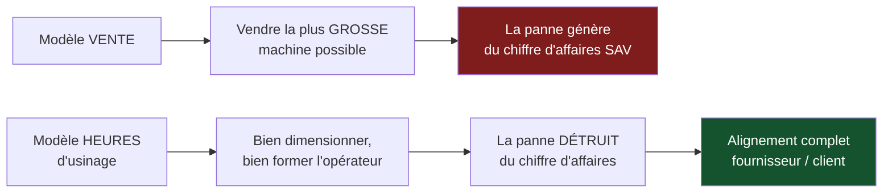

> ⬅ [[CAS22_La_plateforme_de_livraison_et_son_plancher_social]] · [[00_Index_Mises_en_situation|🗂 Index]] · [[CAS24_La_banque_privee_et_ses_fonds_durables]] ➡

# CAS 23 — La PME de mécanique qui veut vendre des heures de machine

> **L'entreprise.** *Precimec SA*, Le Locle. Fabricant de machines d'usinage de précision pour l'industrie médicale et horlogère. **95 salariés**, 28 M CHF de CA. Elle vend des machines entre 180 000 et 900 000 CHF, avec un service après-vente représentant 11 % du CA. Ses clients — souvent des PME de 20 à 60 personnes — hésitent de plus en plus devant l'investissement, et certains utilisent leurs machines à moins de 40 % de leur capacité. Un concurrent allemand propose désormais une formule « paiement à l'heure d'usinage ». Precimec envisage de suivre.
>
> **La question posée.**
> *« Precimec doit-elle passer à un modèle d'économie de la fonctionnalité ? Analysez les conséquences sur le business model, la trésorerie et l'impact environnemental. »*

---

## 🧩 Les notions clés

- **Économie de la fonctionnalité** / servitisation 🔎
- **BMC** et **métamorphose** 📘
- **Revenus durables** 📘
- **Équation de profit** et besoin en fonds de roulement 📘
- **3R** — Réduire, Réutiliser 📘
- **Effet rebond** 🔎
- **Avantage concurrentiel durable** 📘
- **SAF** 📘

## 📖 Définitions pour les nuls

| Notion | En une phrase simple |
|---|---|
| **Économie de la fonctionnalité** | Vendre l'**usage** d'un bien plutôt que le bien : des heures d'usinage plutôt qu'une machine 🔎 |
| **Servitisation** | Le passage d'un fabricant de produits à un fournisseur de services 🔎 |
| **Taux d'utilisation** | La part du temps où une machine tourne réellement 🔎 |
| **Besoin en fonds de roulement** | L'argent à avancer avant d'être payé 🔎 |
| **Revenus durables** | 📘 Leasing, réemploi, services — plutôt que vente de biens neufs |

## 🔍 Décorticage de la consigne (L-I-S-A-E-C)

**L — Lire.** Question fermée + trois angles imposés : **business model**, **trésorerie**, **impact environnemental**. ⚠️ Traiter les trois est obligatoire.

**I — Identifier.** Le chiffre clé de l'énoncé : **certaines machines tournent à moins de 40 % de leur capacité**. 🔎 C'est la justification économique et écologique du modèle — et c'est ce qu'il faut exploiter.

**S — Structurer.**
1. Pourquoi le modèle a du sens : le gisement de sous-utilisation
2. La transformation du BM
3. La trésorerie : le vrai obstacle
4. L'impact environnemental — avec l'effet rebond
5. Recommandation SAF

**C — Conclure.** Trancher sur un périmètre et un mode de financement.

## 🧠 Le raisonnement stratégique (D-E-I)

### Axe 1 — Le gisement : 60 % de capacité inutilisée

**D — Définir.** 🔎 L'**économie de la fonctionnalité** consiste à vendre un usage plutôt qu'un bien. Le fournisseur reste propriétaire et facture la performance.

**E — Expliquer.** Une machine à 600 000 CHF utilisée à 40 % représente 360 000 CHF de capital immobilisé qui ne produit rien. Le client le sait, et c'est précisément pour cela qu'il hésite à investir.

🔎 Le renversement : Precimec peut transformer ce gaspillage en revenu partagé. Si elle facture à l'heure, le client ne paie que ce qu'il utilise, et Precimec peut placer la capacité résiduelle ailleurs — ou dimensionner plus juste.

**I — Illustrer.** 🔎 **Le renversement d'incitation, comme dans le cas 7 mais plus fort** :

> **En modèle de vente, Precimec a intérêt à vendre la plus grosse machine possible. En modèle horaire, elle a intérêt à ce que la machine tourne — donc à bien dimensionner, à bien former l'opérateur, et à ce que la machine ne tombe jamais en panne.**

C'est un alignement complet entre l'intérêt du fournisseur et celui du client. En modèle de vente, la panne génère du chiffre d'affaires SAV ; en modèle horaire, elle en détruit.

### Axe 2 — La transformation du business model

**D — Définir.** 📘 La **métamorphose du BMC** réécrit chaque bloc.

**I — Illustrer.**

| Bloc | Vente | Heures d'usinage | Difficulté |
|---|---|---|---|
| **Proposition de valeur** | Une machine performante | Une **capacité d'usinage garantie**, sans immobilisation de capital | Forte : c'est un argument majeur pour une PME |
| **Segments** | Entreprises capables d'investir 600 k | + PME sans capacité d'investissement, + démarrages d'activité | ⚠️ **Élargissement réel du marché** |
| **Revenus** | Prix de vente + SAV (11 %) | Loyer horaire, revenu récurrent | Trésorerie inversée ⚠️ |
| **Ressources clés** | Usine, savoir-faire | + **parc de machines en propriété** + capital + télémétrie | Capital lourd |
| **Activités clés** | Concevoir, fabriquer, dépanner | + piloter la disponibilité, maintenance **prédictive**, reconditionner, redéployer | Nouveau métier |
| **Partenaires** | Fournisseurs | + **financeur** (leasing), + logisticien | Indispensable |
| **Coûts** | Production | + capital immobilisé + maintenance préventive + reprise | Structure alourdie |
| **➕ Impacts positifs** | — | Machines mieux utilisées, durée de vie allongée, accès élargi | Mesurable |
| **➕ Externalités** | Machines sous-utilisées, fin de vie non gérée | Résiduelles : transport, pièces, énergie d'usinage | ⚠️ Réduites, pas nulles |

📘 **Le lien avec les 3R** : ce modèle sert **Réduire** (moins de machines fabriquées pour le même volume usiné) et **Réutiliser** (une machine reprise est reconditionnée et redéployée). ⚠️ Le recyclage reste le dernier recours.

### Axe 3 — La trésorerie : l'obstacle réel

**D — Définir.** 📘 L'**équation de profit** : revenus − coûts. 🔎 Le **besoin en fonds de roulement** est l'argent avancé avant encaissement.

**E — Expliquer.** ⚠️ C'est le point que la plupart des raisonnements sur la servitisation ignorent, et c'est celui qui tue les projets.

**I — Illustrer.**

```
Modèle vente :     machine à 600 000 CHF  →  encaissée à la livraison
Modèle horaire :   même machine           →  facturée ~85 CHF/h
                                             × 1 200 h/an ≈ 102 000 CHF/an
                                          →  6 ans pour récupérer le capital
```

🔎 Si Precimec bascule 20 % de son activité (≈ 5,6 M CHF de CA) en modèle horaire, elle doit **financer environ 5,6 M CHF de machines** qu'elle n'encaissera que sur six ans. Avec 28 M de CA, c'est hors de portée sans solution externe.

⚠️ **Et un effet comptable brutal** : la première année du basculement, le chiffre d'affaires **baisse** (on ne comptabilise plus les ventes) alors que les coûts de production restent identiques. Un dirigeant qui ne l'a pas anticipé annulera le projet au premier trimestre.

### Axe 4 — L'impact environnemental, avec le rebond

**E — Expliquer.** Les gains sont réels :
- Moins de machines fabriquées pour le même volume usiné (l'impact d'une machine-outil est massivement dans sa **fabrication** : acier, fonte, électronique).
- Durée de vie allongée par la maintenance prédictive.
- Reconditionnement et redéploiement au lieu de la mise au rebut.

⚠️ **Mais l'effet rebond guette, sous deux formes** :

| Forme | Mécanisme |
|---|---|
| **Accès élargi** | Des PME qui ne pouvaient pas se payer une machine y accèdent désormais → **plus d'usinage total**, donc plus d'énergie et de matière |
| **Modèle de revenu** | 🔎 Precimec est payée **à l'heure d'usinage**. Son intérêt économique est que les machines tournent **plus**. C'est une contradiction de structure avec la sobriété |

🔎 **Le point à formuler** : *« Le modèle réduit l'impact par pièce usinée et peut augmenter le nombre total de pièces usinées. Comme toujours, seul le total absolu tranche. »*

## ⚖️ L'arbitrage et la recommandation (filtre SAF)

| Critère | Analyse | Verdict |
|---|---|---|
| **S** | ✅ Répond à la vraie objection des clients (l'investissement), élargit le marché, et crée une barrière : un concurrent-vendeur ne sait pas gérer un parc | **Passe** |
| **A** | ⚠️ 📘 *Retour ?* Supérieur mais étalé sur 6 ans. *Risque ?* Trésorerie et baisse comptable du CA la première année. *Opposition ?* Les commerciaux, rémunérés à la vente | **Conditionnelle** |
| **F** | ❌ Sans partenaire financier, le besoin de fonds de roulement est rédhibitoire | ❌ **Bloquante en l'état** |

### 🔎 La recommandation

> **Oui, mais uniquement adossé à un financeur, sur un périmètre limité, et avec le système de rémunération interne modifié avant le lancement.**
>
> 1. **Adosser le financement à une société de leasing.** Precimec reste responsable de la disponibilité et de la maintenance ; le financeur porte le capital. 🔎 Sans cela, le projet est théorique — c'est la condition de faisabilité n°1.
> 2. **Cibler un segment précis** : les PME de 20 à 40 personnes en démarrage ou en diversification, qui n'achètent pas aujourd'hui. 🔎 **Ne pas cannibaliser les clients qui achètent déjà** : on ajoute un marché, on ne transforme pas l'existant. Objectif : 12 % du CA à 4 ans.
> 3. **Changer la rémunération des commerciaux avant le lancement.** ⚠️ Un commercial payé à la commission sur vente sabotera un modèle locatif, sans même le vouloir. C'est le point d'acceptabilité interne le plus concret et le plus souvent oublié.
> 4. **Investir dans la télémétrie et la maintenance prédictive** : dans ce modèle, chaque heure d'arrêt est une perte directe pour Precimec. C'est ce qui rend l'investissement rentable — et c'est aussi ce qui allonge la durée de vie des machines.
> 5. **Fixer un indicateur absolu** : suivre le nombre de machines fabriquées pour un volume d'usinage donné, et non seulement le taux d'utilisation. 🔎 C'est le garde-fou contre l'effet rebond, et c'est ce qui rend le discours environnemental défendable.

## ⚠️ Le piège classique

**L'erreur type n°1 — négliger la trésorerie.** La servitisation est séduisante et financièrement redoutable. **Réflexe correctif :** dès qu'un modèle transforme un encaissement immédiat en flux étalé, chiffrez le besoin de financement **avant** de recommander quoi que ce soit.

**L'erreur type n°2 — oublier la contradiction du modèle de revenu.** Être payé à l'heure d'usinage aligne l'intérêt sur l'usage, donc contre la sobriété. **Réflexe correctif :** demandez toujours *« l'entreprise gagne-t-elle plus quand on consomme plus ? »*

**L'erreur type n°3 — ignorer l'opposition interne.** Les commerciaux sont la première cause d'échec des projets de servitisation. **Réflexe correctif :** 📘 l'acceptabilité inclut les parties prenantes **internes**, pas seulement les clients et les financeurs.

---

## 🗺️ Visuels de synthèse

### La chaîne de raisonnement



### Le chiffre qui tranche

```
Le gisement et le piège   (illustratif)

TAUX D'UTILISATION CLIENT
 Utilisé      ████████░░░░░░░░░░░░  40 %
 Inutilisé    ░░░░░░░░████████████  60 %  ← 360 k CHF immobilisés

RÉCUPÉRATION DU CAPITAL — machine à 600 k CHF
 Vente        ████████████████████  encaissé jour J
 Heures       ▌▌▌▌▌▌  85 CHF/h × 1 200 h ≈ 102 k/an → 6 ans

→ Basculer 20 % de l'activité = 5,6 M à financer.
  Sans leasing externe : impossible.
```

⚠️ Graphique **illustratif** : les proportions servent le raisonnement, elles ne sont pas des données mesurées.

---

## 🔗 Navigation

⬅ [[CAS22_La_plateforme_de_livraison_et_son_plancher_social]] · [[00_Index_Mises_en_situation|🗂 Index des 27 cas]] · [[CAS24_La_banque_privee_et_ses_fonds_durables]] ➡
