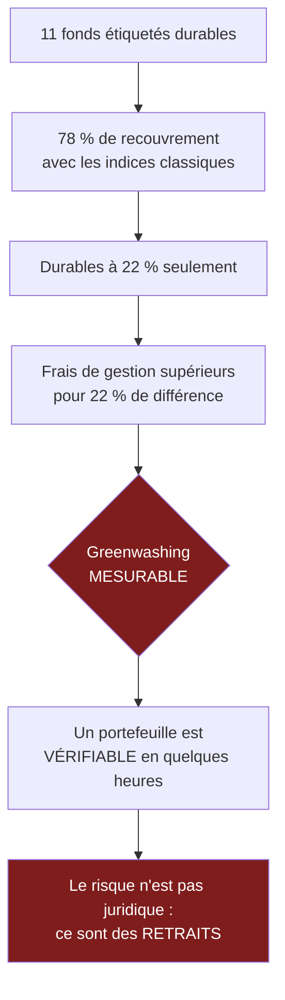

> ⬅ [[CAS23_La_PME_de_mecanique_qui_veut_vendre_des_heures_de_machine]] · [[00_Index_Mises_en_situation|🗂 Index]] · [[CAS25_La_chaine_de_magasins_de_sport_et_son_passage_a_lomnicanal]] ➡

# CAS 24 — La banque privée et ses fonds « durables »

> **L'entreprise.** *Banque Rive-Droite & Cie*, Genève. Banque privée, **240 collaborateurs**, 8,4 Mrd CHF d'actifs sous gestion. 62 % de la clientèle a plus de 60 ans, mais une transmission générationnelle massive est en cours : les héritiers, plus jeunes, interrogent systématiquement les critères de placement. La banque propose 11 fonds étiquetés « durables », dont l'analyse montre qu'ils reproduisent à 78 % la composition des indices classiques. Un régulateur européen durcit les règles sur les allégations de durabilité financière. Deux concurrents ont lancé des fonds à impact mesuré, plus chers en frais de gestion.
>
> **La question posée.**
> *« Analysez le risque stratégique lié à l'offre "durable" de la banque et proposez une trajectoire crédible. »*

---

## 🧩 Les notions clés

- **Greenwashing** 📘
- **Labels, tiers de confiance et asymétrie d'information** 🔎
- **Durabilité forte vs faible** 📘
- **Ressources immatérielles** — la réputation 📘
- **La 6e force : l'État** 📘
- **Matrice parties prenantes** 📘
- **Risque stratégique vs juridique** 📘

## 📖 Définitions pour les nuls

| Notion | En une phrase simple |
|---|---|
| **Actifs sous gestion** | L'argent des clients que la banque gère 🔎 |
| **Fonds durable** | Un placement censé sélectionner des entreprises responsables 🔎 |
| **Indice classique** | Un panier standard de grandes entreprises, sans critère de durabilité 🔎 |
| **Greenwashing** | 📘 Une communication qui survend l'engagement réel |
| **Durabilité faible** | 📘 On admet la substitution (compenser plutôt qu'éviter) |

## 🔍 Décorticage de la consigne (L-I-S-A-E-C)

**L — Lire.** « **Risque stratégique** » : le vocabulaire est celui du cours — 📘 *« le risque n'est pas juridique mais stratégique »*. « Trajectoire **crédible** » : le mot « crédible » est le sujet même du cas.

**I — Identifier.** Le chiffre décisif : **78 % de recouvrement avec les indices classiques**. 🔎 Cela signifie que les fonds « durables » de la banque ne sont durables qu'à 22 %. C'est un écart entre le discours et la réalité — la définition du greenwashing.

**S — Structurer.**
1. Le diagnostic : un écart mesurable entre l'étiquette et le contenu
2. Le risque : trois portes qui se referment
3. Pourquoi la réputation est la ressource critique **ici plus qu'ailleurs**
4. Trajectoire + SAF

**C — Conclure.** Trancher : reconstruire l'offre ou retirer l'étiquette — les deux options honnêtes.

## 🧠 Le raisonnement stratégique (D-E-I)

### Axe 1 — Le diagnostic : 78 %, c'est un chiffre, pas une opinion

**D — Définir.** 📘 Le **greenwashing** est une communication qui survend l'engagement écologique réel : allégations vagues, sans preuve.

**E — Expliquer.** 🔎 L'intérêt de ce cas est que le greenwashing y est **mesurable**. On ne discute pas d'intentions : si un fonds « durable » contient 78 % des mêmes titres qu'un indice ordinaire, l'écart entre la promesse et le produit est quantifié.

⚠️ Et il y a une aggravation propre à la finance : le client paie souvent des **frais de gestion supérieurs** pour un fonds étiqueté durable. Il paie donc un supplément pour une différence de 22 %. Ce n'est plus seulement une allégation excessive, c'est un problème de **prix par rapport au service rendu**.

**I — Illustrer.** 🔎 Un client, un journaliste ou un régulateur peut refaire ce calcul en quelques heures à partir de données publiques. **Contrairement à une chaîne d'approvisionnement opaque, un portefeuille est vérifiable.** Le risque de révélation n'est pas hypothétique : il est technique et facile.

### Axe 2 — Les trois portes qui se referment

**D — Définir.** 📘 Le cours ajoute **l'État** comme sixième force : il redistribue les positions.

**E — Expliquer.** 🔎 L'avantage actuel de la banque — facturer plus cher un produit à peine différent — repose sur une **asymétrie d'information** : le client ne peut pas vérifier facilement. Trois portes referment cette asymétrie :

| Porte | Mécanisme | Horizon |
|---|---|---|
| **La règle** | Durcissement des exigences sur les allégations de durabilité financière | Court |
| **Le client** | La transmission générationnelle amène des héritiers qui posent des questions techniques | En cours |
| **Le concurrent** | Deux acteurs proposent déjà des fonds à impact mesuré | Immédiat |

⚠️ **Et la fermeture est discontinue** : rien pendant des années, puis un article, un contrôle, un client qui publie son analyse. La pression s'accumule sans effet visible, puis tout bascule d'un coup.

**I — Illustrer.** La banque a 8,4 Mrd sous gestion. 🔎 Un scandale de greenwashing ne coûte pas une amende : il coûte des **retraits**. Et en banque privée, les retraits sont massifs et rapides — un client mécontent transfère 40 M en trois semaines.

### Axe 3 — Pourquoi la réputation est ici la ressource critique

**D — Définir.** 📘 Les ressources **immatérielles** (organisation, technologie, **réputation**) fondent l'avantage durable parce qu'elles sont peu transférables donc peu imitables.

**E — Expliquer.** 🔎 Dans la banque privée, le produit est largement indifférencié : tout le monde peut acheter les mêmes titres. **Ce qui se vend, c'est la confiance.** La réputation n'est donc pas un actif parmi d'autres : c'est le produit lui-même.

⚠️ D'où une asymétrie brutale : une réputation se construit en décennies et se détruit en un article. Et une banque privée dont on découvre qu'elle a survendu un produit ne perd pas seulement les clients de ce produit — elle perd la présomption d'honnêteté sur **tous** ses produits.

**I — Illustrer.**

| Partie prenante | Intérêt | Pouvoir | Stratégie 📘 |
|---|---|---|---|
| Héritiers (nouvelle génération) | **Fort** | **Fort** (ils décident du transfert) | **Gérer de près** |
| Clients historiques | Moyen | Fort | Satisfaire |
| Régulateur | Fort | **Fort** | **Gérer de près** |
| Gérants internes | Fort (leur pratique change) | Moyen | Informer et associer |
| Médias spécialisés | Fort | Fort (capacité de révélation) | Surveiller |

🔎 Lecture : la nouvelle génération de clients et le régulateur sont dans le même quadrant, et ils demandent **la même chose** — de la vérifiabilité. C'est une convergence rare et exploitable.

## ⚖️ L'arbitrage et la recommandation (filtre SAF)

### La question de la durabilité forte 📘

⚠️ Un point de fond à soulever : la plupart des fonds « durables » procèdent par **exclusion partielle** et par **compensation** — logique de **durabilité faible**, qui admet la substitution. 📘 Le cours défend la **durabilité forte** : le capital naturel n'est pas substituable.

🔎 Appliqué ici : un fonds qui détient une entreprise très polluante et compense par une entreprise vertueuse pratique une arithmétique de durabilité faible. Une trajectoire crédible suppose de choisir explicitement laquelle des deux logiques on applique — et de le dire au client.

### Le SAF

| Option | S | A | F | Verdict |
|---|---|---|---|---|
| **Ne rien changer** | ❌ Trois portes se referment ; l'écart est mesurable par n'importe qui | ❌ Risque de retraits massifs | ✅ | **Écartée** |
| **Retirer l'étiquette « durable »** | ⚠️ Honnête, mais abandonne un marché en croissance | ⚠️ Perte commerciale immédiate | ✅ | **Option de repli** |
| **Reconstruire l'offre** | ✅ Répond au régulateur, aux héritiers et aux concurrents | ⚠️ Coût, et perte de performance possible à court terme | ⚠️ Compétences d'analyse d'impact à acquérir | **Retenue** |

### 🔎 La recommandation

> **Reconstruire l'offre en trois vagues, et surtout : réduire le nombre de fonds avant d'en améliorer la qualité.**
>
> 1. **Passer de 11 fonds « durables » à 3.** 🔎 Contre-intuitif mais central : onze fonds étiquetés durables dont aucun ne l'est vraiment est un risque multiplié par onze. Trois fonds réellement différenciés valent mieux qu'une gamme dont la promesse est diluée.
> 2. **Publier le taux de recouvrement avec l'indice de référence**, fonds par fonds. 🔎 C'est la mesure la plus forte et la moins coûteuse : elle transforme une allégation invérifiable en donnée vérifiable, et elle retire d'avance toute munition à un article hostile.
> 3. **Choisir explicitement la logique appliquée** — exclusion, engagement actionnarial, ou impact mesuré — et la nommer au client. 📘 Dire si l'on se place en durabilité forte (éviter) ou faible (compenser) est un acte de transparence.
> 4. **Faire vérifier par un tiers indépendant.** 🔎 Une banque ne peut pas s'auto-certifier : une affirmation faite par celui qui en profite ne vaut rien, même quand elle est vraie.
> 5. **Traiter les gérants internes** : leur pratique change, leurs indicateurs de performance aussi. Une offre durable évaluée sur la seule performance financière trimestrielle redeviendra un indice déguisé en dix-huit mois.
>
> ⚠️ **La tension à assumer** : réduire la gamme et publier les écarts fera baisser les encours « durables » à court terme. C'est le prix de la crédibilité — et c'est infiniment moins cher qu'une révélation subie.

## ⚠️ Le piège classique

**L'erreur type n°1 — traiter le greenwashing comme un problème d'image.** C'est un problème de **produit** : le fonds n'est pas ce qu'il prétend être. **Réflexe correctif :** cherchez l'écart mesurable entre la promesse et le contenu, et chiffrez-le.

**L'erreur type n°2 — recommander « plus de communication ».** Communiquer davantage sur un écart existant l'aggrave. **Réflexe correctif :** en matière de durabilité, la substance précède toujours le discours — jamais l'inverse.

**L'erreur type n°3 — oublier les gérants.** On peut réécrire une politique de placement ; si les gérants restent évalués sur la performance trimestrielle, rien ne change. **Réflexe correctif :** demandez toujours *« sur quoi les gens sont-ils évalués ? »* — c'est ce qui détermine leur comportement réel.

---

## 🗺️ Visuels de synthèse

### La chaîne de raisonnement



### Le chiffre qui tranche

```
Composition réelle d'un fonds « durable »   (illustratif)

Identique à l'indice classique  ███████████████░░░░░  78 %
Réellement différencié          ████░░░░░░░░░░░░░░░░  22 %

STRATÉGIE DE GAMME
 Aujourd'hui  11 fonds étiquetés  ██████████████████████  risque × 11
 Recommandé    3 fonds réels      ██████                  risque × 3

→ Réduire la gamme AVANT d'en améliorer la qualité
```

⚠️ Graphique **illustratif** : les proportions servent le raisonnement, elles ne sont pas des données mesurées.

---

## 🔗 Navigation

⬅ [[CAS23_La_PME_de_mecanique_qui_veut_vendre_des_heures_de_machine]] · [[00_Index_Mises_en_situation|🗂 Index des 27 cas]] · [[CAS25_La_chaine_de_magasins_de_sport_et_son_passage_a_lomnicanal]] ➡
