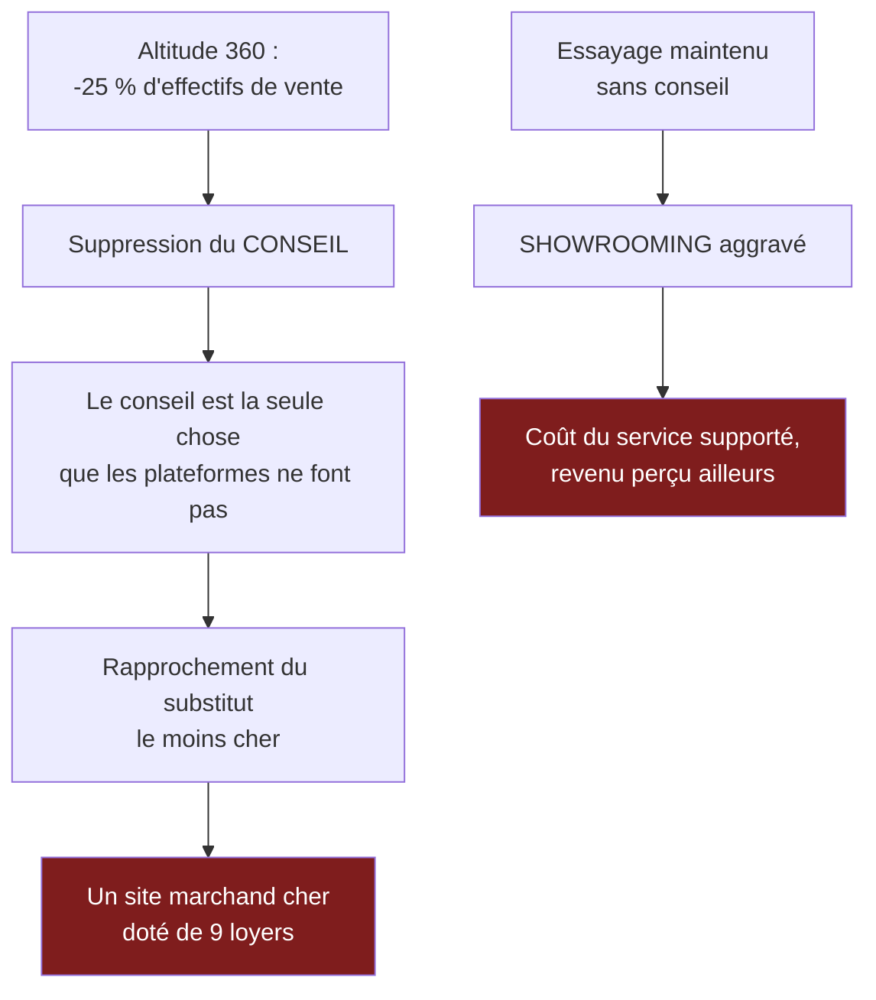

> ⬅ [[CAS24_La_banque_privee_et_ses_fonds_durables]] · [[00_Index_Mises_en_situation|🗂 Index]] · [[CAS26_Le_recycleur_qui_ne_peut_pas_fermer_la_boucle_seul]] ➡

# CAS 25 — La chaîne de magasins de sport et son passage à l'omnicanal

> **L'entreprise.** *Altitude Sports*, 9 magasins en Suisse romande, **240 salariés**, 68 M CHF de CA. Vente d'équipement de montagne, running, ski. Concurrence : plateformes de e-commerce internationales (prix inférieurs de 15 à 25 %) et marques vendant en direct. Le CA recule de 3 %/an. Projet « Altitude 360 » : site marchand, application avec compte fidélité, écrans en magasin remplaçant les catalogues papier, caisses automatiques, et réduction de 25 % des effectifs de vente au profit d'un « conseil augmenté par tablette ». Budget 4,8 M CHF, économies annoncées 2,1 M CHF/an.
>
> **La question posée.**
> *« Évaluez "Altitude 360" en croisant chaîne de valeur, proposition de valeur et accessibilité. Recommandez. »*

---

## 🧩 Les notions clés

- **Chaîne de valeur** — quelles cases le projet touche 📘
- **Proposition de valeur** (BMC) 📘
- **Substituts** (Porter) 📘
- **Accessibilité** et **exclusion indirecte** 📘
- **Ressources immatérielles** — la compétence des vendeurs 📘
- **Risque stratégique** 📘
- **Effet rebond** 🔎

## 📖 Définitions pour les nuls

| Notion | En une phrase simple |
|---|---|
| **Omnicanal** | Vendre à la fois en magasin, en ligne et sur mobile, de façon cohérente 🔎 |
| **Showrooming** | Venir essayer en magasin puis acheter moins cher en ligne 🔎 |
| **Proposition de valeur** | 📘 Ce pour quoi le client vous choisit plutôt qu'un autre |
| **Exclusion indirecte** | 📘 Un service légal qui exclut de fait une population |

## 🔍 Décorticage de la consigne (L-I-S-A-E-C)

**L — Lire.** Trois cadres imposés à croiser. ⚠️ Le troisième — accessibilité — est celui qu'on oublie dans un contexte commercial, alors qu'il est décisif ici (caisses automatiques, tablettes, application).

**I — Identifier.** Le point critique : le projet réduit de **25 % les effectifs de vente**. 🔎 Or dans l'équipement de montagne, le conseil est précisément ce que les plateformes ne savent pas faire. Le projet supprime la différence avec le substitut.

**S — Structurer.**
1. Qu'achète-t-on chez Altitude qu'on n'achète pas en ligne ?
2. Le projet, décomposé par case de la chaîne de valeur
3. L'accessibilité : caisses automatiques et application
4. Recommandation module par module

**C — Conclure.** Trancher module par module, comme au cas 15.

## 🧠 Le raisonnement stratégique (D-E-I)

### Axe 1 — La proposition de valeur : le conseil est le produit

**D — Définir.** 📘 La **proposition de valeur** est ce pour quoi le client choisit cette entreprise. 📘 Un **substitut** satisfait le même besoin autrement.

**E — Expliquer.** 🔎 Pourquoi un client paie-t-il 20 % de plus chez Altitude qu'en ligne ? Trois raisons, et une seule est solide :

| Raison | Solidité |
|---|---|
| La disponibilité immédiate | Faible — la livraison en 24 h l'a annulée |
| Le retour facile | Faible — les plateformes le proposent aussi |
| **Le conseil et l'essayage** — savoir quel crampon va avec quelle chaussure, quelle taille de ski selon le niveau | ✅ **Forte, et non reproductible en ligne** |

**I — Illustrer.** 🔎 Le raisonnement décisif :

> *« Altitude Sports ne vend pas des chaussures : elle vend le fait de ne pas se tromper de chaussures. Une erreur de matériel en montagne peut coûter cher, parfois dangereusement. C'est ce risque évité que le client paie 20 % plus cher. »*

⚠️ Réduire de 25 % les effectifs de vente revient donc à **supprimer le produit tout en gardant les coûts de l'immobilier**. Après le projet, Altitude devient un site marchand cher doté de neuf loyers — soit le pire des deux modèles.

Et le mécanisme du **showrooming** s'aggrave : moins de conseil, mais toujours de l'essayage. Le client essaie sur place et achète en ligne. **L'entreprise supporte le coût du service sans en percevoir le revenu.**

### Axe 2 — Le projet, décomposé par case

**D — Définir.** 📘 La chaîne de valeur distingue les activités **principales** des activités de **soutien** transversales.

**I — Illustrer.**

| Module | Case touchée | Effet sur la proposition de valeur | Verdict |
|---|---|---|---|
| Site marchand | Canaux / logistique aval | Neutre à positif (capte les clients qui achètent en ligne de toute façon) | ✅ |
| Application fidélité | Relation client | Positif (connaître le client, le rappeler avant la saison) | ✅ |
| Écrans remplaçant les catalogues | Marketing et ventes | Neutre — ⚠️ et le gain écologique est douteux (voir plus bas) | ⚠️ |
| Caisses automatiques | Logistique aval | Négatif si elles remplacent le contact ; neutre si elles le complètent | ⚠️ |
| **−25 % d'effectifs de vente** | **Services + Marketing/ventes** | ❌ **Détruit la seule différence avec le substitut** | ❌ |
| Conseil par tablette | Services | ⚠️ Un vendeur avec tablette est meilleur ; **une tablette sans vendeur ne conseille pas** | ⚠️ |

🔎 **Le point à formuler** : les 2,1 M CHF d'économies annoncés proviennent presque entièrement du seul module qui détruit de la valeur. Les modules qui créent de la valeur (site, application) ne génèrent aucune économie — ils génèrent du revenu, ce qui n'est pas la même chose et suppose un autre calcul.

### Axe 3 — Accessibilité : les deux angles morts

**D — Définir.** 📘 Les 4 principes **POUR** : Perceptible, Utilisable, Compréhensible, Robuste. 📘 L'**exclusion indirecte** : un service légal exclut sans intention.

**E — Expliquer.** Deux modules posent problème :

**Les caisses automatiques.** Elles supposent une dextérité, une lecture d'écran, une compréhension d'interface, parfois un moyen de paiement sans contact. Elles excluent une part de la clientèle âgée ou en situation de handicap — et dans un magasin de sport, elles excluent aussi les clients qui viennent avec du matériel encombrant ou en tenue de sport.

**L'application.** Si les promotions et le programme de fidélité deviennent exclusivement accessibles par application, les clients sans smartphone récent paient plus cher que les autres pour le même produit. 🔎 **C'est une discrimination tarifaire de fait, sans intention discriminatoire** — la définition exacte de l'exclusion indirecte.

**I — Illustrer.** 📘 Le principe du cas SilverDigital s'applique : *« le risque n'est pas juridique mais stratégique »*. Altitude ne violerait aucune loi. Elle perdrait simplement la part de clientèle la moins à l'aise avec le numérique — souvent la plus âgée, c'est-à-dire, dans le sport de montagne, une clientèle au pouvoir d'achat élevé et fidèle.

## ⚖️ L'arbitrage et la recommandation (filtre SAF)

### Analyse à double sens 🔎

| Le numérique **soutient** | Le numérique **freine** |
|---|---|
| Le site capte les clients qui achèteraient ailleurs en ligne | Il peut cannibaliser les ventes en magasin à marge supérieure |
| L'application permet de rappeler le client au bon moment (avant la saison) | Exclusion des clients non équipés ; promotions réservées de fait |
| La tablette donne au vendeur l'accès au stock et aux fiches techniques | Une tablette **sans** vendeur ne conseille pas |
| Écrans : moins de catalogues papier | ⚠️ **Effet rebond et impact déplacé** : neuf magasins équipés d'écrans allumés en continu, fabriqués et remplacés tous les 5 ans, pèsent probablement plus que les catalogues supprimés. 🔎 Le calcul doit être fait, pas supposé |

### Le SAF

| Critère | Analyse | Verdict |
|---|---|---|
| **S** | ⚠️ Se moderniser est souhaitable ; **supprimer le conseil ne l'est pas** — cela rapproche l'entreprise de son substitut le moins cher | ⚠️ **Partiellement** |
| **A** | ❌ 📘 *Retour ?* 2,1 M d'économies contre une perte de différenciation non chiffrée. *Opposition ?* Vendeurs, et clientèle historique | ❌ **Échoue sur le module central** |
| **F** | ✅ Techniquement accessible | **Passe** |

### 🔎 La recommandation

> **Approuver le projet à hauteur d'environ 3,2 M sur 4,8 M, en supprimant la réduction d'effectifs et en réorientant l'économie recherchée.**
>
> 1. **Aucune réduction des effectifs de vente.** 🔎 La règle : ne jamais numériser ce qui constitue votre différence par rapport à votre substitut le moins cher. Chercher les 2,1 M ailleurs — logistique, back-office, gestion des stocks, renégociation des baux.
> 2. **Site marchand et application : oui**, mais positionnés comme **prolongement du conseil** et non comme canal de prix. 🔎 Altitude ne gagnera jamais la guerre des prix contre une plateforme internationale ; elle peut gagner celle du conseil continu (suivi du matériel, rappel d'entretien, reprise, essais).
> 3. **Caisses automatiques en complément, jamais en remplacement.** Maintenir au moins une caisse servie dans chaque magasin — 📘 double canal obligatoire, comme au cas 15.
> 4. **Promotions accessibles hors application** (carte physique, code en caisse). Sinon, discrimination tarifaire de fait.
> 5. **Écrans : faire le calcul avant de décider.** ⚠️ Comparer l'impact réel de neuf installations sur cinq ans à celui des catalogues supprimés. Si le calcul est défavorable, ne pas communiquer dessus — 📘 sinon c'est du greenwashing.
> 6. **Utiliser la tablette pour renforcer le vendeur** : accès au stock des neuf magasins, historique du client, fiches techniques. Un vendeur outillé vend mieux qu'un vendeur seul ; une tablette seule ne vend rien.

## ⚠️ Le piège classique

**L'erreur type n°1 — assimiler numérisation et modernisation.** Certains modules créent de la valeur, un seul en détruit, et c'est celui qui porte les économies. **Réflexe correctif :** décomposez tout projet en modules et évaluez-les séparément.

**L'erreur type n°2 — supposer le gain écologique des écrans.** Remplacer du papier par de l'électronique n'est pas automatiquement un gain : l'impact d'un écran est concentré dans sa **fabrication**. **Réflexe correctif :** exigez le calcul complet avant toute affirmation.

**L'erreur type n°3 — oublier l'accessibilité en contexte commercial.** On l'associe au secteur public ou médical. Elle vaut autant en magasin, et elle s'y traduit directement en chiffre d'affaires perdu. **Réflexe correctif :** dès qu'un canal humain est remplacé par un canal numérique, posez la question **POUR**.

---

## 🗺️ Visuels de synthèse

### La chaîne de raisonnement



### Le chiffre qui tranche

```
Les modules du projet : valeur créée / détruite (illustratif)

Site marchand        ████████░░░░░░░░  crée   — 0 économie
Application fidélité ███████░░░░░░░░░  crée   — 0 économie
Écrans en magasin    ██░░░░░░░░░░░░░░  neutre — gain éco douteux
Caisses automatiques ░░░░░░░░░░░░░░░░  neutre à négatif
-25 % de vendeurs    ████████████████  DÉTRUIT — 2,1 M d'économies
                                        ▲
→ Toutes les économies viennent du SEUL module
  qui détruit de la valeur
```

⚠️ Graphique **illustratif** : les proportions servent le raisonnement, elles ne sont pas des données mesurées.

---

## 🔗 Navigation

⬅ [[CAS24_La_banque_privee_et_ses_fonds_durables]] · [[00_Index_Mises_en_situation|🗂 Index des 27 cas]] · [[CAS26_Le_recycleur_qui_ne_peut_pas_fermer_la_boucle_seul]] ➡
