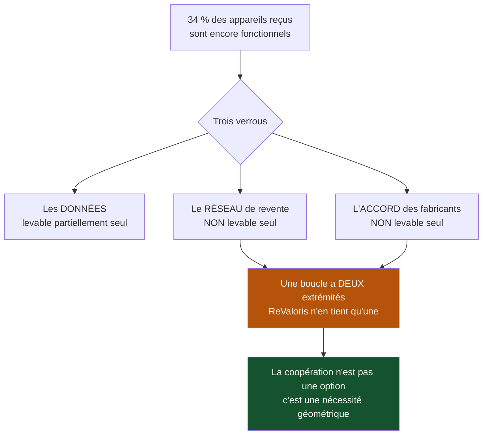

> ⬅ [[CAS25_La_chaine_de_magasins_de_sport_et_son_passage_a_lomnicanal]] · [[00_Index_Mises_en_situation|🗂 Index]] · [[CAS27_Le_studio_de_jeux_video_et_son_modele_de_monetisation]] ➡

# CAS 26 — Le recycleur qui ne peut pas fermer la boucle seul

> **L'entreprise.** *ReValoris SA*, Yverdon. Traitement de déchets d'équipements électriques et électroniques (DEEE). **58 salariés**, 9,6 M CHF de CA. Activité : collecte, démantèlement, tri, revente de matières (métaux, plastiques) et de composants. Marge dépendante du cours des matières premières, très volatile. Deux constats : **34 % des appareils reçus sont encore fonctionnels ou réparables**, mais ReValoris les broie car elle n'a ni le droit de revendre les données qu'ils contiennent, ni le réseau pour écouler des appareils reconditionnés, ni l'accord des fabricants. Un projet de filière de réemploi est à l'étude avec trois autres acteurs romands, dont un concurrent direct.
>
> **La question posée.**
> *« Comment ReValoris peut-elle passer du recyclage au réemploi ? Analysez le rôle des partenariats et de la coopétition. »*

---

## 🧩 Les notions clés

- **3R** — pourquoi l'ordre compte 📘
- **Économie circulaire** et **ODD 12** 📘
- **Partenariats** et **ODD 17**, les **5P** 📘
- **Coopétition** 📘
- **Système de valeur** 📘
- **Bien collectif** 🔎
- **RNE** — protection des données 📘
- **SAF** 📘

## 📖 Définitions pour les nuls

| Notion | En une phrase simple |
|---|---|
| **DEEE** | Déchets d'équipements électriques et électroniques : ordinateurs, téléphones, électroménager 🔎 |
| **Réemploi** | Réutiliser l'appareil tel quel ; **recyclage** = le broyer pour récupérer la matière 🔎 |
| **Coopétition** | 📘 Coopérer avec des concurrents — ici, sur ce qui ne fait pas choisir le client |
| **Bien collectif** | Un bénéfice partagé par tous, que personne n'a intérêt à financer seul 🔎 |
| **ODD 17** | 📘 L'objectif de développement durable consacré aux **partenariats** |

## 🔍 Décorticage de la consigne (L-I-S-A-E-C)

**L — Lire.** « **Comment** passer » = plan opérationnel. « Analysez le **rôle** des partenariats et de la coopétition » = les deux notions sont imposées et doivent être **définies**, pas seulement citées.

**I — Identifier.** Le chiffre décisif : **34 % d'appareils fonctionnels broyés**. 🔎 C'est une destruction de valeur pure — et elle a trois causes distinctes (données, réseau, accord des fabricants) qu'il faut traiter séparément.

**S — Structurer.**
1. Pourquoi le réemploi vaut mieux que le recyclage (les 3R, justifiés)
2. Les trois verrous, et pourquoi aucun ne se lève seul
3. Partenariats et coopétition : les mécanismes
4. Recommandation SAF

**C — Conclure.** Trancher sur la structure de la filière, y compris avec un concurrent.

## 🧠 Le raisonnement stratégique (D-E-I)

### Axe 1 — Les 3R : pourquoi broyer un appareil fonctionnel est une perte

**D — Définir.** 📘 Les **3R** dans l'ordre : **Réduire** > **Réutiliser** > **Recycler** — 📘 recycler est « un dernier recours (coûteux en énergie) ». 📘 Relève de l'**ODD 12**.

**E — Expliquer.** 🔎 La raison de fond, souvent mal comprise : l'essentiel de l'impact d'un appareil électronique est concentré dans sa **fabrication** — extraction des métaux, gravure, assemblage, transport. Recycler récupère une fraction de la matière ; **l'énergie et les procédés de fabrication, eux, sont définitivement perdus.**

Réemployer conserve **tout** : la matière **et** la valeur ajoutée de fabrication.

**I — Illustrer.** 🔎 L'écart de valeur est aussi économique :

```
Un ordinateur portable broyé   →  quelques francs de métaux
Le même reconditionné et vendu →  180 à 350 CHF
```

⚠️ ReValoris détruit donc chaque jour une valeur économique et environnementale, non par négligence mais parce que **trois verrous** l'en empêchent. Le diagnostic ne porte pas sur la volonté, il porte sur les verrous.

### Axe 2 — Trois verrous, aucun ne se lève seul

**E — Expliquer.** Décomposons, car chacun appelle une réponse différente :

| Verrou | Nature | Peut-on le lever seul ? |
|---|---|---|
| **Les données** contenues dans les appareils | Juridique et technique (RNE, protection des données 📘) | ⚠️ Partiellement — un procédé d'effacement certifié est finançable, mais coûteux pour 9,6 M de CA |
| **Le réseau de revente** | Commercial | ❌ Non — ReValoris est un industriel, pas un distributeur |
| **L'accord des fabricants** (pièces, documentation, garantie) | Rapport de force | ❌ **Absolument pas** — 58 salariés face à des industriels mondiaux |

🔎 **Le constat qui structure toute la réponse** : deux verrous sur trois sont **hors de portée d'un acteur seul**. Ce n'est pas un problème de moyens ou d'ambition, c'est un problème de **taille et de position**. La coopération n'est donc pas une option sympathique — c'est la **seule voie géométriquement possible**.

### Axe 3 — Partenariat et coopétition : les mécanismes

**D — Définir.**
- Un **partenariat** est un accord durable entre organisations indépendantes autour d'un objectif commun, avec partage des risques. 🔎 Le test : *l'autre partie a-t-elle intérêt à ma réussite ?* Si non, c'est un fournisseur, pas un partenaire.
- 📘 La **coopétition** consiste à coopérer avec des concurrents.
- 📘 Les **5P** de l'Agenda 2030 incluent **Partenariats** ; l'**ODD 17** y est consacré.

**E — Expliquer.** Quatre mécanismes rendent la coopération nécessaire ici :

**1. Le périmètre.** ReValoris intervient en fin de chaîne. Ce qui détermine la réparabilité d'un appareil a été décidé en amont, à la conception. Elle est responsable d'un résultat qu'elle ne gouverne pas.

**2. La boucle a deux extrémités.** 🔎 Une boucle d'économie circulaire relie une fin de vie à un nouvel usage. ReValoris tient l'extrémité « fin de vie » ; elle ne tient pas l'extrémité « nouvel usage ». **Une entreprise seule ne peut pas fermer un cercle : elle n'en tient qu'un bout.** C'est une impossibilité géométrique, pas un manque d'effort.

**3. Le bien collectif.** Un procédé d'effacement de données certifié, une norme de reconditionnement, une négociation avec les fabricants : chacun de ces éléments profite à **tous** les acteurs de la filière. Aucun n'a donc intérêt à le financer seul. 🔎 Mais un **engagement simultané** de quatre acteurs débloque une valeur qui existait déjà et que la méfiance mutuelle empêchait de réaliser.

**4. La crédibilité.** Un label de reconditionnement auto-décerné ne convaincra ni les fabricants, ni les assureurs, ni les acheteurs publics. Il faut un tiers — donc une structure collective.

**I — Illustrer.** ⚠️ **La limite juridique à énoncer impérativement** : la coopération entre ReValoris et son concurrent doit porter sur ce qui **ne fait pas choisir le client** — norme technique, effacement des données, négociation avec les fabricants, plateforme logistique commune. Elle ne doit **jamais** porter sur les prix, les volumes ou la répartition des clients : ce serait une **entente illicite**. Le mot « durabilité » n'est pas une autorisation.

🔎 Et le test de sérieux du partenariat : *à quoi chaque partenaire a-t-il renoncé ?* Si aucun n'a renoncé à rien, ce n'est pas un partenariat, c'est une photo de groupe.

## ⚖️ L'arbitrage et la recommandation (filtre SAF)

### Analyse à double sens 🔎

| Le numérique **soutient** ici | Le numérique **freine** ici |
|---|---|
| Effacement certifié et traçable des données → lève le verrou n°1 | Le contenu des appareils crée précisément le risque juridique qui bloque le réemploi 📘 |
| Plateforme de mise en relation avec les acheteurs de reconditionné | Coût de développement disproportionné pour un acteur seul → **argument de plus pour mutualiser** |
| Passeport numérique de l'appareil (historique, tests, garantie) | Dépendance à une plateforme partagée avec un concurrent : question de gouvernance |
| Diagnostic automatisé du matériel entrant → tri plus rapide | ⚠️ **Effet rebond** : un reconditionné bon marché peut s'**ajouter** au parc au lieu de remplacer un achat neuf |

### Le SAF

| Critère | Analyse | Verdict |
|---|---|---|
| **S** | ✅ Le réemploi vaut économiquement 30 à 100 fois le broyage et remonte d'un cran dans la hiérarchie des 3R. Il réduit aussi la dépendance au cours des matières, source de la volatilité actuelle | **Passe fortement** |
| **A** | ⚠️ 📘 *Retour ?* Élevé. *Risque ?* Juridique (données) et concurrentiel (coopérer avec un rival). *Opposition ?* Les fabricants, qui n'ont aucun intérêt à voir circuler des appareils reconditionnés | **Conditionnelle** |
| **F** | ❌ Seul : impossible. ✅ En filière : réaliste | **Faisable uniquement à plusieurs** |

### 🔎 La recommandation

> **Engager la filière à quatre, avec un périmètre de coopération délimité par écrit dès le premier jour.**
>
> 1. **Créer une structure commune** (association ou société de filière) portant trois objets, et trois seulement : la **norme d'effacement et de reconditionnement**, la **certification par un tiers**, et la **négociation collective avec les fabricants** pour l'accès aux pièces et à la documentation. 🔎 Ces trois objets sont des biens collectifs : aucun acteur ne les financerait seul, tous en profitent.
> 2. **Délimiter explicitement ce qui reste concurrentiel** : les prix, les clients, les volumes, les canaux de revente propres. ⚠️ Mettre cette délimitation par écrit protège juridiquement et rend la coopération soutenable dans la durée.
> 3. **Commencer par le verrou des données**, qui est le plus dur et le plus discriminant : une norme d'effacement certifiée est la clé qui ouvre les deux autres verrous (les acheteurs publics et les entreprises ne rachèteront jamais sans elle).
> 4. **Cibler d'abord le marché B2B et institutionnel** : écoles, associations, administrations. Ils achètent en volume, ils valorisent l'origine locale, et ils acceptent le reconditionné plus facilement que le grand public.
> 5. **Traiter l'effet rebond dès la conception de l'offre** : positionner le reconditionné comme **remplacement** d'un achat neuf (reprise obligatoire de l'ancien appareil à l'achat), pas comme équipement supplémentaire. 🔎 Sans cela, la filière ajoute des appareils au parc au lieu d'en éviter la fabrication — et perd sa justification environnementale.

## ⚠️ Le piège classique

**L'erreur type n°1 — traiter le recyclage comme l'objectif.** 📘 C'est le **dernier** des 3R. Le réemploi lui est supérieur parce qu'il conserve la valeur ajoutée de fabrication. **Réflexe correctif :** énoncez l'ordre et **justifiez-le** par l'impact concentré dans la fabrication.

**L'erreur type n°2 — parler de partenariat sans dire ce que chacun apporte et abandonne.** Une liste de partenaires n'est pas un partenariat. **Réflexe correctif :** posez le test *« l'autre a-t-il intérêt à ma réussite ? »* et *« à quoi chacun renonce-t-il ? »*

**L'erreur type n°3 — présenter la coopétition sans sa limite juridique.** Coopérer avec un concurrent est légal sur les normes, illégal sur les prix. **Réflexe correctif :** nommez toujours la frontière — cela montre que vous savez de quoi vous parlez.

---

## 🗺️ Visuels de synthèse

### La chaîne de raisonnement



### Le chiffre qui tranche

```
Valeur d'un ordinateur portable selon la filière (illustratif)

Broyé — recyclage matière   ▌                     quelques CHF
Reconditionné — réemploi    ████████████████████  180 à 350 CHF

POURQUOI : l'impact est concentré dans la FABRICATION
 Fabrication  ████████████████████████
 Usage        ███
 Fin de vie   █

→ Recycler récupère une fraction de la matière.
  L'énergie de fabrication est définitivement perdue.
```

⚠️ Graphique **illustratif** : les proportions servent le raisonnement, elles ne sont pas des données mesurées.

---

## 🔗 Navigation

⬅ [[CAS25_La_chaine_de_magasins_de_sport_et_son_passage_a_lomnicanal]] · [[00_Index_Mises_en_situation|🗂 Index des 27 cas]] · [[CAS27_Le_studio_de_jeux_video_et_son_modele_de_monetisation]] ➡
