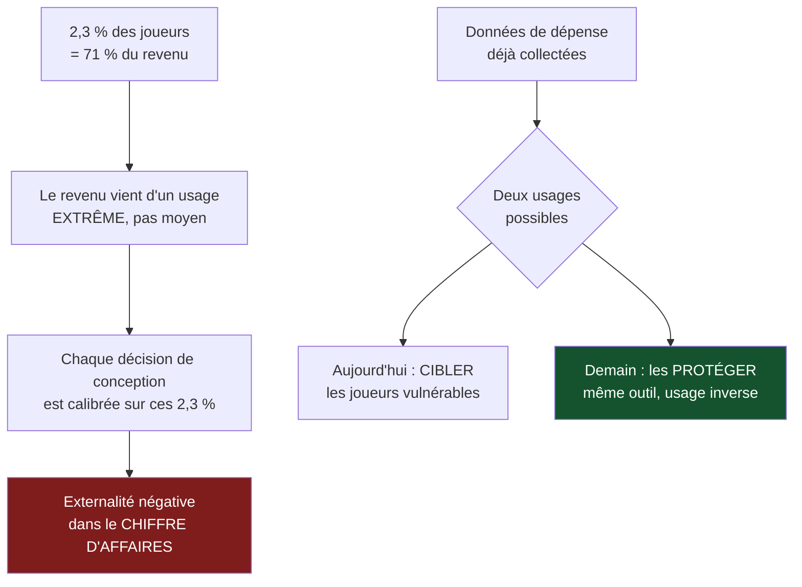

> ⬅ [[CAS26_Le_recycleur_qui_ne_peut_pas_fermer_la_boucle_seul]] · [[00_Index_Mises_en_situation|🗂 Index]] · — ➡

# CAS 27 — Le studio de jeux vidéo et son modèle de monétisation

> **L'entreprise.** *Pixel Léman*, Genève. Studio de jeux vidéo mobiles, **46 salariés**, 12 M CHF de CA. Un jeu principal, gratuit au téléchargement, monétisé par achats intégrés : bonus, accélérateurs de progression, coffres à contenu aléatoire. **2,3 % des joueurs génèrent 71 % du revenu.** Durée de session moyenne : 47 minutes. Le studio utilise des notifications de rappel, des récompenses de connexion quotidienne et des offres à durée limitée. Un durcissement réglementaire européen sur les mécaniques aléatoires et la protection des mineurs se prépare. Un éditeur propose de racheter le studio, sous condition d'un audit de conformité.
>
> **La question posée.**
> *« Le modèle de Pixel Léman est-il soutenable ? Analysez sous l'angle de l'économie de l'attention et de la RNE, et proposez une transformation. »*

---

## 🧩 Les notions clés

- **Économie de l'attention**, **dark patterns**, boucles dopaminergiques 📘
- **RNE** — axes sociétal et technologique 📘
- **Équation de profit** 📘
- **Externalités négatives** 📘
- **Les deux sens de « durable »** ⚠️
- **La 6e force : l'État** 📘
- **Rente vs compétence** 🔎

## 📖 Définitions pour les nuls

| Notion | En une phrase simple |
|---|---|
| **Free-to-play** | Le jeu est gratuit ; on gagne de l'argent sur les achats à l'intérieur 🔎 |
| **Coffre aléatoire** | On paie sans savoir ce qu'on obtient — mécanique proche du jeu de hasard 🔎 |
| **Dark pattern** | 📘 Une interface conçue pour obtenir un comportement non choisi |
| **Économie de l'attention** | 📘 Capter le temps de cerveau disponible ; « si c'est gratuit, c'est vous le produit » |
| **Externalité négative** | 📘 Un dégât réel supporté par quelqu'un d'autre |

## 🔍 Décorticage de la consigne (L-I-S-A-E-C)

**L — Lire.** ⚠️ « **Soutenable** » : cette fois le mot renvoie clairement au **sens B**. Mais comme au cas 22, il faut montrer que les deux sens **convergent** : le modèle est insoutenable socialement **et** menacé dans son existence.

**I — Identifier.** Le chiffre décisif : **2,3 % des joueurs génèrent 71 % du revenu**. 🔎 Ce n'est pas une statistique commerciale ordinaire — c'est la signature d'un modèle qui repose sur un très petit nombre d'utilisateurs à comportement extrême.

**S — Structurer.**
1. Ce que révèle la concentration du revenu
2. Les mécanismes d'attention, nommés un par un
3. La RNE et le durcissement réglementaire
4. Transformation + SAF

**C — Conclure.** Trancher, avec le prix de la transformation.

## 🧠 Le raisonnement stratégique (D-E-I)

### Axe 1 — Ce que 2,3 % / 71 % veut dire

**D — Définir.** 📘 L'**équation de profit** : revenus − structure de coûts. 📘 Une **externalité négative** est un coût réel supporté par un tiers.

**E — Expliquer.** 🔎 Le raisonnement à mener, et il est inconfortable :

Si 2,3 % des joueurs apportent 71 % du revenu, cela signifie que le revenu ne vient pas d'un usage moyen mais d'un usage **extrême**. Une petite minorité dépense des sommes considérables. Or dans ce type de modèle, cette minorité correspond très largement à des personnes ayant une relation problématique au jeu — la littérature du secteur les désigne d'ailleurs par un terme emprunté au casino.

⚠️ **La conséquence stratégique est brutale** : Pixel Léman n'optimise pas son jeu pour l'ensemble de ses joueurs. Elle l'optimise pour les 2,3 %. Chaque décision de conception — fréquence des offres, coût des accélérateurs, rareté des contenus — est calibrée sur eux.

**I — Illustrer.** 🔎 Formulation pour l'oral :

> *« Le revenu de Pixel Léman ne dépend pas du nombre de joueurs satisfaits, mais de l'intensité de dépense d'une minorité vulnérable. C'est une externalité négative parfaitement localisée : elle est dans le chiffre d'affaires, pas dans les coûts. »*

📘 Et cela relève du **plancher social** du donut : un modèle qui prospère sur la fragilité de certains passe sous le plancher, même quand il est parfaitement légal.

### Axe 2 — Les mécanismes d'attention, nommés

**D — Définir.** 📘 L'**économie de l'attention** capte le temps de cerveau disponible. Mécanismes cités par le cours : **dark patterns**, boucles dopaminergiques, bulles de filtres, « si c'est gratuit, c'est vous le produit ».

**E — Expliquer.** 🔎 Nommer chaque mécanisme présent dans le jeu vaut plus que discourir sur l'attention en général :

| Mécanique du jeu | Mécanisme théorique 📘 | Effet visé |
|---|---|---|
| Récompense de connexion quotidienne | Boucle de renforcement | Rendre l'absence coûteuse |
| Coffre à contenu aléatoire | Récompense à ratio variable | Le mécanisme le plus addictif connu |
| Offre à durée limitée | Pression temporelle / dark pattern | Empêcher la délibération |
| Notification de rappel | Capture d'attention | Ramener le joueur sans qu'il l'ait décidé |
| Accélérateur de progression payant | Friction créée puis vendue | 🔎 On installe l'obstacle, puis on vend le remède |

⚠️ La dernière ligne est la plus révélatrice : **le studio fabrique lui-même l'attente qu'il fait payer**. Ce n'est pas de la valeur créée, c'est de la valeur extraite.

**I — Illustrer.** Une session moyenne de 47 minutes sur mobile n'est pas le signe d'un jeu excellent : c'est le signe d'un jeu **conçu pour retenir**. 🔎 Distinction essentielle : un bon jeu donne envie de revenir ; un jeu optimisé pour la rétention rend le départ désagréable. Ce n'est pas la même chose.

### Axe 3 — RNE et fermeture réglementaire

**D — Définir.** 📘 La **RNE** comporte quatre axes : économique, technologique, environnemental, **sociétal**. 📘 Le cours ajoute **l'État** comme sixième force.

**E — Expliquer.** 🔎 Comme au cas 22, l'avantage de Pixel Léman est une **rente** : il repose sur la permission actuelle d'employer des mécaniques que la réglementation n'encadre pas encore. Trois portes se referment :

| Porte | Signal | Conséquence |
|---|---|---|
| **La règle** | Durcissement européen sur les mécaniques aléatoires et les mineurs | Certaines mécaniques deviendront interdites |
| **L'acquéreur** | L'éditeur exige un audit de conformité | Le prix de vente dépend du résultat |
| **Les plateformes** | Les magasins d'applications durcissent leurs propres politiques | Retrait possible du jeu |

⚠️ **Le point spécifique et décisif** : ici, la fermeture n'est pas seulement future — **elle est déjà arrivée**, sous la forme de l'audit exigé par l'acquéreur. Une valorisation d'entreprise se calcule sur des revenus **récurrents et défendables** ; des revenus dépendant à 71 % de mécaniques bientôt interdites seront décotés massivement.

**I — Illustrer.** 🔎 L'argument à porter en interne : *« Nos revenus ne sont pas un actif tant qu'ils reposent sur des mécaniques dont la légalité est temporaire. Transformer le modèle avant l'audit augmente la valorisation ; le faire après la réglementation la détruit. »*

## ⚖️ L'arbitrage et la recommandation (filtre SAF)

### Analyse à double sens 🔎

| Le numérique **soutient** | Le numérique **freine** |
|---|---|
| Un jeu mobile a une empreinte matérielle faible par utilisateur | Il capte du temps de vie à grande échelle — externalité invisible |
| Les données permettent de **détecter** les comportements de dépense problématiques | Les mêmes données servent aujourd'hui à **cibler** ces joueurs |
| Distribution sans support physique | Serveurs, notifications permanentes, renouvellement des terminaux |
| Possibilité de plafonds paramétrables et de pauses assistées | ⚠️ **Effet rebond** : l'accès sans friction multiplie le temps de jeu total |

🔎 **La ligne 2 est la plus forte** : Pixel Léman possède déjà les données qui lui permettraient de protéger les joueurs vulnérables. Elle s'en sert pour les identifier comme cible commerciale. **Le même outil, retourné, devient un dispositif de protection.** C'est là que se situe la transformation.

### Le SAF

| Critère | Analyse | Verdict |
|---|---|---|
| **S** | ✅ Sécurise la valorisation, la conformité et l'accès aux plateformes ; aligne le studio sur un marché qui se durcit | **Passe** |
| **A** | ❌ 📘 *Retour ?* Négatif à court terme (une part importante des 71 % disparaît). *Risque ?* Chute immédiate du revenu. *Opposition ?* Investisseurs, équipe monétisation | ❌ **C'est le blocage central** |
| **F** | ✅ Techniquement simple — les données existent déjà | **Passe** |

### 🔎 La recommandation

> **Transformer avant l'audit, en trois mouvements, et accepter une baisse de revenu chiffrée plutôt que subie.**
>
> 1. **Supprimer les coffres à contenu aléatoire payants**, ou les rendre à contenu visible (le joueur sait ce qu'il achète). 🔎 C'est la mécanique la plus visée par les réglementations : la conserver revient à parier que rien ne changera.
> 2. **Instaurer des plafonds de dépense paramétrables par défaut**, et une détection des dépenses atypiques déclenchant une pause plutôt qu'une offre. 🔎 Retourner l'outil : les mêmes données, le même modèle prédictif, l'usage inverse.
> 3. **Rééquilibrer l'équation de profit** : passer d'un revenu concentré sur 2,3 % à un revenu réparti — abonnement mensuel modéré, extensions de contenu payantes, cosmétiques sans effet sur le jeu. ⚠️ **C'est le mouvement structurant** : tant que le revenu dépend d'une minorité extrême, chaque décision de conception y reviendra, quelles que soient les intentions affichées.
> 4. **Protection renforcée des mineurs** : vérification d'âge, plafonds abaissés, notifications désactivées par défaut en soirée. 📘 Cela relève de l'axe sociétal de la RNE et anticipe directement le texte à venir.
>
> ⚠️ **La tension à assumer devant l'acquéreur et les investisseurs** : la transformation coûtera probablement 30 à 40 % du revenu la première année. L'argument n'est pas moral, il est financier — **des revenus non défendables ne se valorisent pas.** Un acquéreur paie un multiple sur des revenus récurrents, pas sur des revenus en sursis.

## ⚠️ Le piège classique

**L'erreur type n°1 — traiter le sujet comme une question de goût.** « Les jeux mobiles, c'est discutable. » Ce n'est pas une analyse. **Réflexe correctif :** appuyez-vous sur les mécanismes nommés par le cours (dark patterns, boucles, attention) et sur les chiffres de l'énoncé.

**L'erreur type n°2 — ignorer la concentration du revenu.** 2,3 % / 71 % est **la** donnée du cas. **Réflexe correctif :** quand un énoncé donne une répartition très déséquilibrée, elle est le sujet.

**L'erreur type n°3 — parler d'éthique sans parler de valorisation.** Devant des investisseurs, seul l'argument financier passe. **Réflexe correctif :** traduisez toujours l'insoutenabilité en **risque daté et chiffré**.

---

## 🗺️ Visuels de synthèse

### La chaîne de raisonnement



### Le chiffre qui tranche

```
Concentration du revenu   (illustratif)

Part des joueurs   ▌░░░░░░░░░░░░░░░░░░░   2,3 %
Part du revenu     ██████████████░░░░░░  71,0 %

VALORISATION À L'AUDIT
 Revenus défendables      ██████░░░░░░░░░░░░░░  ~30 %
 Revenus en sursis        ░░░░░░██████████████  ~70 %

→ Un acquéreur paie un multiple sur des revenus
  RÉCURRENTS, pas sur des revenus en sursis
```

⚠️ Graphique **illustratif** : les proportions servent le raisonnement, elles ne sont pas des données mesurées.

---

## 🔗 Navigation

⬅ [[CAS26_Le_recycleur_qui_ne_peut_pas_fermer_la_boucle_seul]] · [[00_Index_Mises_en_situation|🗂 Index des 27 cas]] · — ➡
