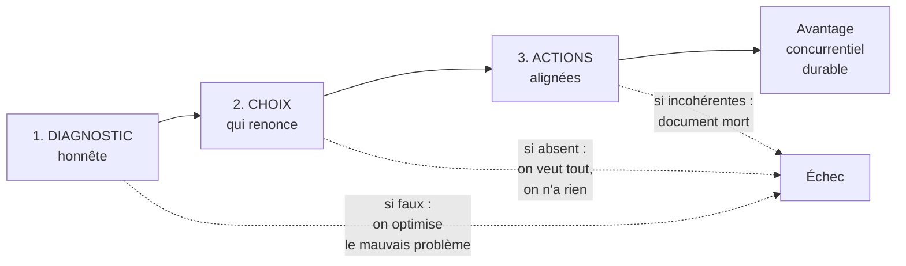

# Q1 — Qu'est-ce qu'une « bonne » stratégie ?

> **La réponse en une phrase**
> Une bonne stratégie n'est pas une ambition, c'est une **chaîne cohérente** : un diagnostic honnête, un choix qui renonce à quelque chose, et des actions qui découlent réellement de ce choix.

---

## Partie 1 — Le mot piégé, c'est « bonne »

Une stratégie n'est pas bonne parce qu'elle est ambitieuse, innovante ou inspirante. Elle est bonne si elle satisfait trois conditions, et si l'une manque, elle échoue.

### Condition 1 — Un diagnostic honnête

📘 Le cours 3 : le diagnostic interne est « la démarche qui va aboutir à l'identification des forces et faiblesses d'une organisation à un moment donné ». Et 📘 le cours 2 pose le diagnostic externe via PESTEL et les 5 (+1) forces.

🔎 Pourquoi c'est premier : **on ne peut pas résoudre un problème mal posé**. Une entreprise qui croit avoir un problème de communication alors qu'elle a un problème de produit dépensera son budget en publicité et fera faillite quand même.

⚠️ « Honnête » veut dire que le diagnostic doit pouvoir contredire la direction. Un diagnostic qui confirme systématiquement ce que le patron pensait déjà n'est pas un diagnostic.

### Condition 2 — Un choix qui renonce

C'est le point le plus mal compris.

🔎 **Une stratégie qui ne renonce à rien n'est pas une stratégie.** « Être le meilleur en qualité, en prix, en service et en innovation » n'est pas un choix, c'est une liste de souhaits. Choisir, c'est accepter d'être moins bon quelque part.

📘 Le cours durabilité impose d'ailleurs de choisir explicitement : « Choisissez une orientation : Différenciation (leader mondial en durabilité), Focalisation (ex : énergie verte), Innovation durable. »

Le mot « choisissez » est au singulier.

### Condition 3 — Des actions alignées

🔎 Une stratégie est vivante si on peut la lire dans les décisions quotidiennes : qui on recrute, ce qu'on achète, ce qu'on refuse de vendre. Si l'organisation continue exactement comme avant, la stratégie est un document, pas une stratégie.

⚠️ Le test le plus efficace : **regardez les critères d'évaluation internes**. Une entreprise qui annonce une stratégie durable tout en évaluant ses acheteurs sur le seul prix d'achat n'a pas de stratégie durable. Voir [[Q53_Les_3R_et_pourquoi_lordre_compte]].

---

## Partie 2 — La finalité : l'avantage concurrentiel durable

Une stratégie sert à obtenir quelque chose. Quoi exactement ?

📘 Le cours 2 donne l'équation fondamentale de Porter : « **Profit = Prix – Coûts** », et précise : « Chacune des cinq forces a un lien direct, clair et prévisible avec la rentabilité de tout secteur. En règle générale, plus une force est puissante, plus la pression qu'elle exerce sur les prix ou les coûts est élevée, et moins le secteur est attrayant. »

🔎 Traduction : votre profit est constamment attaqué par cinq forces qui tirent le prix vers le bas et les coûts vers le haut. La stratégie sert à **construire une protection** contre cette érosion.

📘 Et le cours ajoute une phrase décisive : « Si, au contraire, [le secteur] crée beaucoup de valeur, les intervenants qui participent à chacune des cinq forces **chercheront à se l'approprier**. »

⚠️ Autrement dit : créer de la valeur ne suffit pas. Il faut aussi pouvoir la **garder**. C'est ça, l'avantage concurrentiel. Voir [[Q03_Avantage_concurrentiel_durable]].

---

## Partie 3 — Comment vérifier qu'une stratégie est bonne : le SAF

📘 Le cours 1 donne l'outil de validation : la grille **SAF** — Souhaitabilité, Acceptabilité, Faisabilité.

| Critère | Question | Si ça échoue |
|---|---|---|
| **Souhaitabilité** | Cette stratégie sert-elle nos objectifs et nos valeurs ? | On fait bien quelque chose qui ne sert à rien |
| **Acceptabilité** | 📘 « Les parties prenantes vont-elles s'opposer à la stratégie ? » | La stratégie est bloquée avant d'exister |
| **Faisabilité** | A-t-on les ressources et les compétences ? | On promet ce qu'on ne peut pas tenir |

Détail complet dans [[Q05_La_grille_SAF]].

---

## Partie 4 — Exemple : deux formulations comparées

**L'entreprise.** Un fabricant genevois d'instruments de mesure, 90 personnes.

### Formulation A

> « Notre stratégie est de devenir le leader du marché en misant sur l'innovation, la qualité et la satisfaction client, tout en maîtrisant nos coûts. »

| Test | Résultat |
|---|---|
| Diagnostic ? | Absent — aucune référence à une analyse |
| Choix ? | Aucun — quatre priorités simultanées, dont deux contradictoires |
| Actions ? | Impossible à déduire |
| **Verdict** | Ce n'est pas une stratégie, c'est une déclaration d'intention |

### Formulation B

> « Notre diagnostic montre que nos concurrents asiatiques nous battent sur le prix de 30 % et que nos clients industriels européens sont soumis à des obligations de traçabilité croissantes. Nous renonçons au segment entrée de gamme et nous concentrons nos ressources sur des instruments certifiés, réparables 15 ans, avec traçabilité complète des composants. »

| Test | Résultat |
|---|---|
| Diagnostic ? | ✅ Externe (concurrence, réglementation) et chiffré |
| Choix ? | ✅ Renonce explicitement à un segment |
| Actions ? | ✅ On peut en déduire les achats, la R&D, le recrutement, la communication |
| **Verdict** | C'est une stratégie |

🔎 Ce qui distingue B de A, ce n'est pas l'ambition, c'est le **renoncement**. B accepte de perdre le bas de gamme. A voudrait tout.

---

## Les pièges

> [!danger] Erreurs classiques
> 1. **Confondre stratégie et objectif.** Voir [[Q02_Objectif_vs_strategie]].
> 2. **Confondre stratégie et liste de vœux.** Sans renoncement, il n'y a pas de choix.
> 3. **Sauter le diagnostic.** Une bonne réponse à un mauvais problème reste une erreur.
> 4. **Oublier la cohérence descendante.** La stratégie doit se lire dans les décisions quotidiennes.
> 5. **Oublier l'appropriation de la valeur.** 📘 Créer de la valeur ne suffit pas, les cinq forces cherchent à se l'approprier.

## À retenir

| | |
|---|---|
| **Les 3 conditions** | Diagnostic honnête → choix qui renonce → actions alignées |
| **La finalité** | Un avantage concurrentiel durable |
| **Équation 📘** | Profit = Prix – Coûts, érodé par les cinq forces |
| **L'outil de validation 📘** | SAF : Souhaitabilité, Acceptabilité, Faisabilité |
| **Le test terrain** | Regardez les critères d'évaluation internes |
