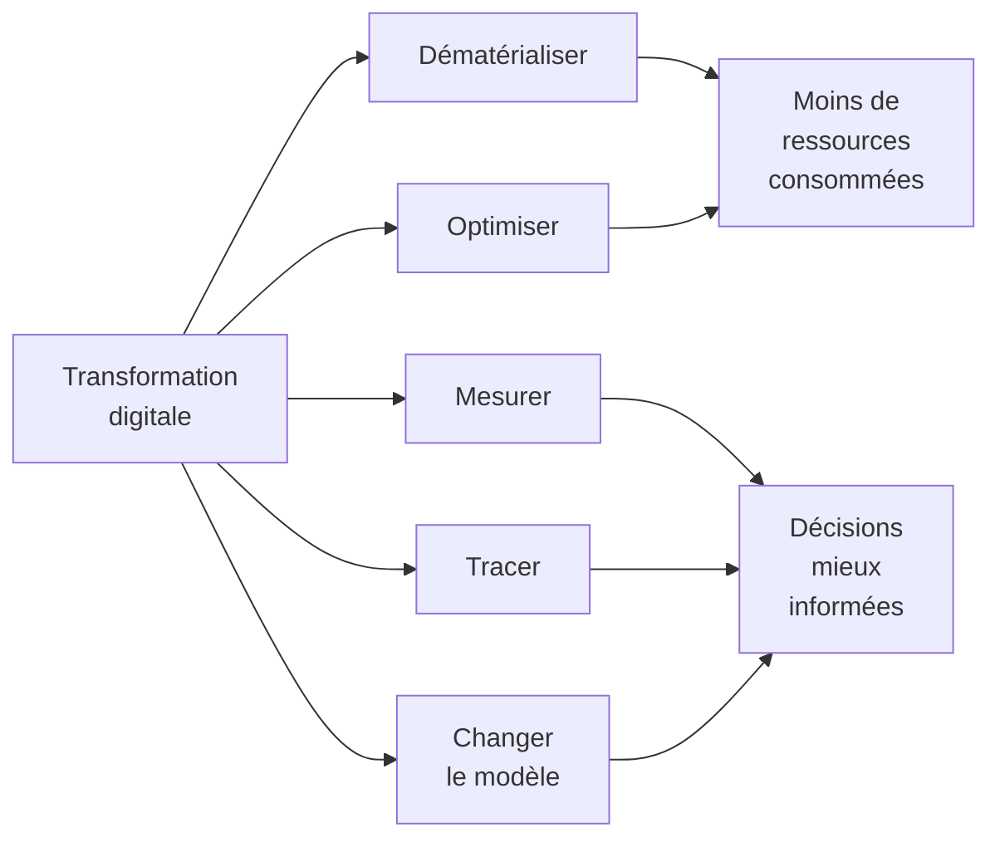

# Q1 — Comment la transformation digitale peut-elle soutenir la durabilité d'une entreprise ?

> **La réponse en une phrase**
> Le numérique ne soutient pas la durabilité par sa nature, mais par les décisions qu'il rend possibles — et il ne le fait que si son propre coût reste inférieur au gain qu'il procure.

---

## Partie 1 — Le mot qui piège tout le monde : « soutenir »

La question ne demande pas « le numérique est-il écologique ». Elle demande s'il peut **soutenir** la durabilité. Ce sont deux choses différentes.

Une béquille soutient un blessé. Elle ne le guérit pas, et elle pèse elle-même quelques centaines de grammes. Le numérique est exactement ça : un instrument qui aide, qui a un poids propre, et dont l'utilité dépend entièrement de l'usage qu'on en fait.

🔎 Si vous retenez une seule chose : **le numérique est un moyen, jamais une fin**. Une entreprise qui « se digitalise » n'a rien fait pour la durabilité. Une entreprise qui utilise le numérique pour prendre de meilleures décisions, oui.

### Définir « transformation digitale »

Ce n'est pas « acheter des ordinateurs ». C'est **changer la façon dont l'entreprise fonctionne** grâce à des outils numériques : comment elle produit, comment elle vend, comment elle décide.

Trois niveaux, du plus faible au plus fort :

| Niveau | Ce qui change | Effet sur la durabilité |
|---|---|---|
| Numérisation | On remplace le papier par un écran | Faible, parfois nul |
| Optimisation | On utilise les données pour mieux piloter l'existant | Réel mais limité |
| Transformation du modèle | On change ce que l'entreprise vend et comment | Le plus fort, et le plus rare |

🔎 Beaucoup d'entreprises s'arrêtent au niveau 1 et croient avoir fait le travail.

### Définir « durabilité »

📘 Votre cours en donne une définition à trois dimensions, dans la slide sur la chaîne de valeur en durabilité :
> « **Environnementales** : réduction de l'empreinte carbone, circularité des matériaux, énergies renouvelables. **Sociales** : conditions de travail, équité, impact sur les communautés locales. **Économiques** : création de valeur à long terme, efficacité des ressources, innovation responsable. »

⚠️ Trois dimensions, pas une. Un projet numérique qui baisse le CO₂ mais exclut une partie de la clientèle échoue sur la dimension sociale. C'est exactement le cas SilverDigital. Voir [[Q20_Risques_de_la_numerisation_au_dela_de_lecologie]].

---

## Partie 2 — Les cinq mécanismes concrets

Voici **comment** le numérique agit. Pas des slogans : des mécanismes.



### Mécanisme 1 — Dématérialiser

**Ce que c'est.** Remplacer un objet physique ou un déplacement par un flux d'information.

**Exemples.** Facture électronique au lieu du papier. Visioconférence au lieu d'un aller-retour Genève–Zurich. Documentation en ligne au lieu d'un manuel imprimé.

**Pourquoi ça marche.** Un déplacement en voiture ou en avion émet beaucoup ; un échange de données émet peu, à condition que le fichier soit léger.

⚠️ **Où ça ne marche pas.** Si la visioconférence remplace un déplacement, gain. Si elle s'y ajoute (on fait la visio *et* on se déplace quand même), perte. Le gain n'existe que par **substitution**, jamais par addition.

### Mécanisme 2 — Optimiser

**Ce que c'est.** Utiliser les données pour éviter le gaspillage : tournées de livraison, pilotage du chauffage, réglage d'une machine, prévision de la demande.

**Pourquoi ça marche.** Une grande partie du gaspillage industriel est un **problème de coordination**, pas un problème de technique. On gaspille parce qu'on ne sait pas, pas parce qu'on ne peut pas.

Développé en détail dans [[Q08_Donnees_temps_reel_et_logistique_durable]].

### Mécanisme 3 — Mesurer

**Ce que c'est.** Rendre visible un impact qui ne l'était pas.

**Pourquoi c'est le mécanisme le plus important.** Parce qu'on ne pilote pas ce qu'on ne mesure pas. Tant que l'empreinte carbone n'est qu'une idée abstraite, aucune décision ne s'appuie dessus.

📘 Le document de cours sur le donut décrit précisément ce rôle à propos de l'extension Oris : son intérêt principal « est de rendre visible un phénomène qui reste habituellement abstrait pour l'utilisateur », parce que l'impact du numérique « repose sur des infrastructures éloignées et invisibles, comme les centres de données, les réseaux et les serveurs ».

Développé dans [[Q07_Numerique_pour_mesurer_et_piloter_impact]].

### Mécanisme 4 — Tracer

**Ce que c'est.** Savoir d'où vient chaque composant, chaque matière, chaque lot.

**Pourquoi ça compte.** 📘 La définition de la chaîne de valeur durable impose un périmètre « depuis les matières premières jusqu'au recyclage ou à la fin de vie ». Or vous ne pouvez pas agir sur vos fournisseurs si vous ne savez pas qui ils sont. La traçabilité est la condition technique du périmètre élargi.

Voir aussi [[Q12_Transparence_labels_et_positionnement]] et [[Q19_Blockchain_et_tracabilite_durable]].

### Mécanisme 5 — Changer le modèle économique

**Ce que c'est.** Vendre un service au lieu d'un bien. Vendre des heures d'éclairage plutôt que des ampoules, des kilomètres plutôt que des voitures.

**Pourquoi c'est le plus puissant.** Parce que ça retourne l'intérêt du vendeur. Si vous vendez des ampoules, votre intérêt est qu'elles cassent. Si vous vendez de la lumière, votre intérêt est qu'elles durent.

📚 *Complément hors cours* : on appelle ça l'économie de la fonctionnalité. Le cours ne l'aborde pas sous ce nom ; présentez-la comme un apport extérieur.

---

## Partie 3 — Le coût propre, ou pourquoi la réponse n'est jamais « oui » tout court

Voici ce qui distingue une bonne réponse d'une réponse naïve.

📘 Le document de cours est explicite : l'OCDE distingue les effets directs des technologies numériques, leurs effets facilitateurs et leurs effets systémiques, et souligne que les bénéfices environnementaux indirects « peuvent être contrebalancés par ses impacts propres et par des effets rebond, ce qui rend le bilan net complexe à établir ».

Décomposons ce que veut dire « impacts propres ».

```
Coût numérique d'une entreprise, par poste :

Terminaux (ordinateurs, téléphones)  ████████████████  fabrication surtout
Centres de données (hébergement)     ██████████        électricité + eau
Réseaux (transmission)               █████             électricité
```

🔎 Ce schéma est une représentation qualitative, pas des chiffres du cours. Ce qu'il faut retenir : le poste dominant pour une entreprise ordinaire est **le matériel**, et l'essentiel de son impact est la **fabrication**, pas l'usage. Voir [[Q18_Economie_circulaire_des_appareils_numeriques]].

📘 Chiffres du cours à connaître :
- Une requête moyenne sur ChatGPT génère environ **4,32 grammes de CO₂**, soit 4 à 5 fois plus qu'une recherche Google.
- Croissance de la consommation électrique du numérique avec l'IA : **16 % par an**, soit un doublement environ tous les 4 ans.

---

## Partie 4 — Le vrai blocage : ce n'est pas la technique

C'est le point le plus fort que vous puissiez faire sur cette question.

📘 Le document de cours l'écrit ainsi : « La difficulté centrale ne vient pas d'abord de la technique, mais du **modèle économique**. Une grande partie de l'économie numérique est structurée par l'augmentation du nombre d'utilisateurs, du temps passé, des interactions et des volumes de données. Or cette logique est en tension directe avec la sobriété. »

### Décryptons

Une entreprise du numérique gagne de l'argent quand :
- le nombre d'utilisateurs augmente,
- le temps passé augmente,
- le volume de données augmente.

Or la sobriété demande exactement l'inverse : moins d'utilisateurs captifs, moins de temps passé, moins de données.

🔎 Conclusion : **le conflit n'est pas entre le numérique et l'écologie, il est entre un modèle économique de croissance des usages et la sobriété**. Tant que le modèle n'est pas revu, les gains techniques sont réabsorbés.

C'est pour ça que cette question débouche nécessairement sur le business model durable. Voir [[Q05_Transformer_un_business_model_en_BM_durable]].

---

## Partie 5 — Les deux positions du débat

📘 Le document de cours identifie explicitement deux camps, et les valide tous les deux.

| Position | Argument | Base citée par le cours |
|---|---|---|
| Le numérique **reste un levier** de durabilité, à condition d'être mieux piloté, mieux mesuré, mieux conçu | 📘 L'OCDE recommande d'utiliser les technologies numériques pour améliorer la performance environnementale tout en réduisant leur empreinte | OCDE |
| **L'efficacité seule ne suffira pas** si le modèle économique reste fondé sur l'expansion continue des usages | 📘 Les données de l'IEA, de l'Arcep et de l'ADEME montrent une hausse structurelle des besoins énergétiques et des impacts du secteur | IEA, Arcep, ADEME |

📘 Et la conclusion que le cours en tire : « Une stratégie crédible suppose donc des arbitrages : moins de surqualité, moins de stockage inutile, moins de fonctionnalités gadgets, moins de dépendance à des infrastructures lourdes lorsque le gain social est faible. »

🔎 Notez la dernière condition : « lorsque le gain social est faible ». Ce n'est pas un appel à tout réduire, c'est un appel à **arbitrer selon l'utilité**.

---

## Partie 6 — Exemple complet

**L'entreprise.** Une PME industrielle genevoise, 60 personnes, fabrication de pièces mécaniques.

| Mécanisme | Ce qu'elle met en place | Gain attendu | Risque |
|---|---|---|---|
| Dématérialiser | Documentation technique en ligne, fin des classeurs papier | Faible mais réel | Nul |
| Optimiser | Capteurs sur les machines pour piloter la consommation d'air comprimé | Élevé : l'air comprimé est un gros poste énergétique | Coût des capteurs |
| Mesurer | Bilan carbone annuel automatisé | Indirect mais décisif | Aucun si la mesure déclenche une action |
| Tracer | Origine des métaux, conditions chez les fournisseurs | Ouvre le périmètre élargi | Charge administrative |
| Changer le modèle | Proposer la reprise et le reconditionnement des pièces usées | Le plus fort | Demande de repenser la facturation |

**Le garde-fou qu'elle se donne.** Deux indicateurs, pas un :
- kg CO₂ par pièce produite (intensité) — mesure le progrès technique ;
- tonnes CO₂ totales sur l'année (absolu) — vérifie qu'il n'y a pas d'effet rebond.

🔎 Si le premier baisse et le second monte, la transformation digitale a échoué du point de vue de la durabilité, même si tous les projets ont été livrés.

---

## Les pièges

> [!danger] Les cinq erreurs qui coûtent des points
> 1. **Répondre à sens unique.** « Le numérique aide la durabilité » sans mentionner son coût propre. La question attend les deux faces.
> 2. **Confondre numérisation et transformation.** Passer au PDF n'est pas une stratégie.
> 3. **Oublier les dimensions sociale et économique.** 📘 La définition du cours en compte trois.
> 4. **Oublier l'effet rebond.** C'est le concept qui montre que vous avez compris la difficulté.
> 5. **Rester au niveau des outils.** Le cours dit que le blocage est dans le modèle économique. Remontez à ce niveau.

## À retenir

| | |
|---|---|
| **Les 5 mécanismes** | Dématérialiser, optimiser, mesurer, tracer, changer le modèle |
| **Le coût propre** | Terminaux, centres de données, réseaux — le matériel domine |
| **Chiffres 📘** | 4,32 g CO₂ par requête ChatGPT ; +16 % par an de consommation électrique |
| **Le vrai blocage** | 📘 « pas d'abord la technique, mais le modèle économique » |
| **La condition** | Sobriété d'abord : questionner le besoin avant d'optimiser |
