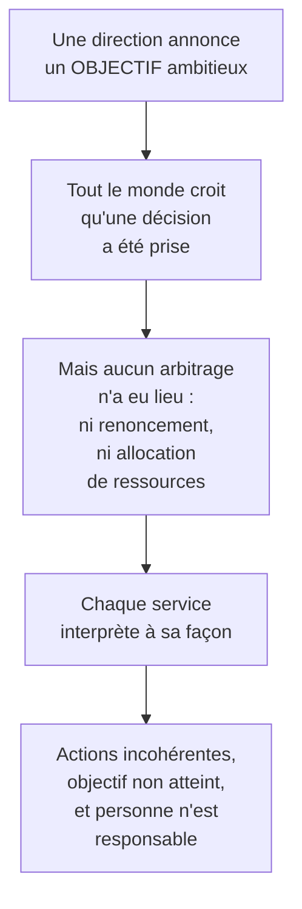

# Q2 — Quelle est la différence entre un objectif et une stratégie ?

> **La réponse en une phrase**
> L'objectif dit **où l'on va**, la stratégie dit **par quel chemin et avec quoi** — et la confusion des deux est l'erreur la plus fréquente en gestion, parce qu'elle donne l'illusion d'avoir décidé.

---

## Partie 1 — La distinction, avec l'analogie qui la fixe

Imaginez que vous êtes à Genève et que vous voulez aller à Milan.

| Élément | Ce que c'est | Exemple du trajet |
|---|---|---|
| **Vision** | L'état futur souhaité, large | « Voyager en Europe » |
| **Mission** | La raison d'être | « Découvrir l'Italie » |
| **Objectif** | Le point d'arrivée, précis et mesurable | « Être à Milan samedi à 18h » |
| **Stratégie** | Le chemin cohérent et les moyens | « Train de 14h, budget 80 CHF, pas de voiture car pas de permis » |
| **Plan d'action** | Les gestes concrets | « Réserver mardi, préparer le sac vendredi » |

🔎 Le point à comprendre : **on peut avoir un objectif sans stratégie**. « Être à Milan samedi » ne dit rien de comment. C'est exactement ce qui se passe quand une entreprise annonce « doubler notre chiffre d'affaires en trois ans » : c'est un objectif, pas une stratégie, et il n'engage à rien tant que le chemin n'est pas décidé.

### L'ancrage dans le cours

📘 Le cours 1 place ces éléments dans la gouvernance : « La **vision**, la **mission**, les **buts** et les **objectifs** définissent la trajectoire. Il est important de comprendre la manière dont les décisions sont prises pour la formulation et la mise en œuvre de la stratégie. »

⚠️ Notez la phrase : ces quatre éléments « définissent la trajectoire ». Ils disent où l'on va. La stratégie, elle, est la manière d'y aller.

---

## Partie 2 — Pourquoi la confusion est dangereuse

🔎 **Le mécanisme** : un objectif est confortable parce qu'il ne coûte rien à annoncer. Une stratégie est inconfortable parce qu'elle oblige à renoncer publiquement à quelque chose. Beaucoup d'organisations s'arrêtent donc à l'objectif — et croient avoir fait le travail.

⚠️ C'est exactement ce qui se passe avec les engagements de durabilité : « neutralité carbone en 2050 » est un objectif. Sans le chemin, sans les jalons, sans le renoncement, ce n'est pas une stratégie — et c'est une forme de greenwashing.

---

## Partie 3 — Ce qui fait un bon objectif : SMART

📘 Le cours durabilité l'exige : « Formulez **1 objectif SMART** […] Les objectifs doivent guider la stratégie et être **mesurables**. »

| Lettre | Ce que ça impose | Contre-exemple |
|---|---|---|
| **S**pécifique | On sait exactement de quoi on parle | « Améliorer notre impact » |
| **M**esurable | Un chiffre existe | « Réduire significativement » |
| **A**tteignable | C'est possible avec nos moyens | « Zéro émission l'an prochain » |
| **R**éaliste / pertinent | Ça sert la stratégie | Un objectif sans lien avec le métier |
| **T**emporel | Une date | « À terme » |

🔎 Remarquez la lettre R : un objectif doit être **pertinent par rapport à la stratégie**. Cela signifie que la stratégie vient logiquement avant, ou au moins en même temps. Un objectif orphelin de stratégie ne peut pas être évalué comme pertinent.

---

## Partie 4 — Le lien avec le business model

📘 Le cours définit le business model comme décrivant « les **choix** d'une entreprise pour générer des revenus. Ces choix concernent les ressources et les compétences mobilisées pour formuler une proposition de valeur, l'offre faite aux clients et l'organisation interne. »

🔎 Regardez le mot « choix », répété deux fois. Le business model est du côté de la **stratégie**, pas de l'objectif : il décrit comment on s'y prend, pas où l'on veut arriver.

Voir [[Q18_Le_modele_RCOV]] et [[Q20_Les_neuf_blocs_du_BMC]].

---

## Partie 5 — Exemple complet

**L'entreprise.** Une entreprise genevoise de services informatiques, 60 personnes.

| Niveau | Formulation |
|---|---|
| **Vision** | Un numérique professionnel qui ne se paie pas sur la planète |
| **Mission** | Fournir aux PME romandes des services numériques sobres et accessibles |
| **Objectif SMART** | Réduire de 40 % le poids moyen des applications livrées d'ici 18 mois |
| **Stratégie** | Se différencier par l'éco-conception et l'accessibilité, en renonçant aux appels d'offres au moins-disant, en formant l'équipe au RGESN et en imposant des critères TCO à nos achats |
| **Plan d'action** | Former 8 développeurs d'ici 6 mois ; réviser le cahier des charges type ; publier un rapport annuel d'impact |

### Le test de cohérence

🔎 Vérifiez que chaque ligne découle de la précédente :
- La stratégie sert-elle l'objectif ? Oui : éco-conception → applications plus légères.
- Le plan sert-il la stratégie ? Oui : former les gens est la condition de l'éco-conception.
- **Le renoncement est-il explicite ?** Oui : « renoncer aux appels d'offres au moins-disant ». C'est ce qui prouve qu'il y a une stratégie et pas seulement une ambition.

⚠️ Si vous enlevez la ligne du renoncement, il ne reste qu'une déclaration.

---

## Les pièges

> [!danger] Erreurs classiques
> 1. **Présenter un objectif comme une stratégie.** « Doubler le CA » ne dit rien du chemin.
> 2. **Oublier le renoncement.** C'est ce qui fait la différence.
> 3. **Formuler un objectif non mesurable.** 📘 Le cours exige du SMART.
> 4. **Inverser l'ordre.** L'objectif oriente, la stratégie exécute — mais un objectif sans stratégie reste vide.
> 5. **Confondre vision et objectif.** La vision est large et non datée, l'objectif est précis et daté.

## À retenir

| | |
|---|---|
| **Objectif** | Où l'on va — précis, mesurable, daté |
| **Stratégie** | Par quel chemin et avec quelles ressources — comporte un renoncement |
| **Ancrage 📘** | « Vision, mission, buts et objectifs définissent la trajectoire » |
| **Exigence 📘** | 1 objectif SMART, mesurable |
| **Le test** | Le renoncement est-il écrit noir sur blanc ? |
