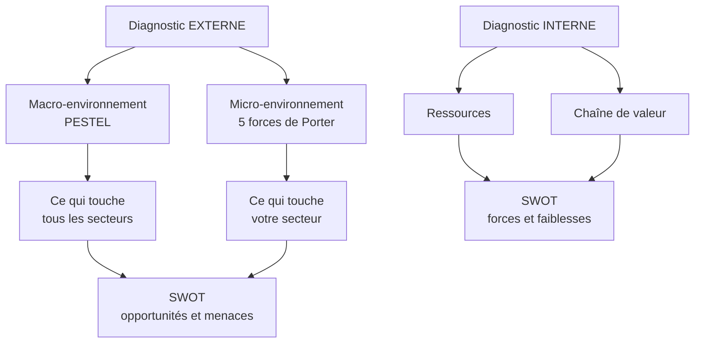
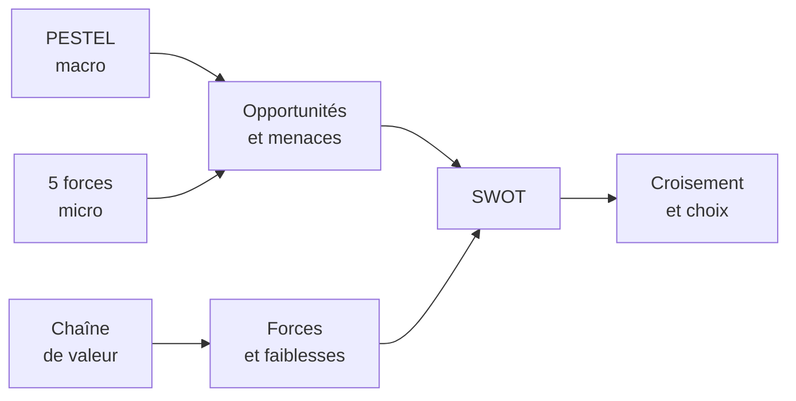

# Q2 — Réalisez un PESTEL intégrant les enjeux écologiques et éthiques (secteur alimentaire)

> **La réponse en une phrase**
> Le PESTEL liste les six familles de forces extérieures que l'entreprise **subit sans pouvoir les changer**, et chaque force doit être classée en opportunité ou en menace — sinon ce n'est qu'un inventaire.

---

## Partie 1 — Comprendre l'outil avant de le remplir

### D'où vient le PESTEL dans la démarche

📘 Le cours 2 annonce son objectif : « Établir un Diagnostic Externe. Analyse de l'environnement au niveau **macroéconomique** : méthode PESTEL. Analyse de l'environnement au niveau **microéconomique** : 5 (+1) forces de Porter. »

Il y a donc **deux niveaux d'extérieur**, et il faut savoir les distinguer :



**Le critère qui sépare macro et micro.** Une inflation générale touche la boulangerie, le garage et la banque : c'est du macro, donc du PESTEL. L'arrivée d'un nouveau concurrent boulanger ne touche que les boulangers : c'est du micro, donc du Porter.

🔎 Le test rapide : *si je changeais de secteur, ce facteur me suivrait-il ?* Si oui, c'est du PESTEL.

### Le piège du E — trois variantes dans vos supports

⚠️ Vos propres documents ne disent pas la même chose selon la slide. Il faut le savoir.

| Support | Ce que dit le E |
|---|---|
| 📘 Cours 2, slide « Le PESTEL » | **Éthique** |
| 📘 Cours 2, slide du tableau opportunités/menaces | **Écologique** |
| 📘 Cours durabilité, exercice PESTEL | « Facteurs **environnemental et éthique** » |

🔎 Que faire : traiter le E comme couvrant **les deux** — écologique et éthique. C'est ce que fait la slide durabilité, qui les fusionne explicitement. Et signalez la variante si on vous interroge dessus, ça montre que vous avez lu vos sources.

📘 Formulation du cours durabilité pour ce facteur : « Évaluez les engagements environnementaux et éthiques (ex. : protection de la biodiversité). »

---

## Partie 2 — La méthode en quatre gestes

Beaucoup d'étudiants remplissent six cases et s'arrêtent. Ce n'est que le premier geste sur quatre.

| Geste | Ce qu'on fait | Pourquoi c'est indispensable |
|---|---|---|
| 1. Recenser | Lister les facteurs par lettre | Sans matière, pas d'analyse |
| 2. Qualifier | Chaque facteur devient une **opportunité** ou une **menace** | 📘 Le tableau du cours a deux colonnes : Opportunités / Menaces |
| 3. Hiérarchiser | Trier par importance et par probabilité | On ne peut pas répondre à 30 facteurs |
| 4. Relier | Croiser avec les forces internes dans le SWOT | 🔎 C'est là que naît la stratégie |

⚠️ Le geste 2 est celui qu'on oublie. Écrire « taxe carbone » ne dit rien. Écrire « taxe carbone → menace sur les coûts de transport, opportunité pour nos concurrents locaux » dit quelque chose.

---

## Partie 3 — Le PESTEL alimentaire, ligne par ligne, avec les justifications

🔎 Le contenu ci-dessous est ma proposition appliquée au secteur alimentaire. La **grille** est celle du cours ; les **exemples** sont les miens.

### P — Politique

**Ce qu'on cherche.** 📘 « Les lois, réglementations ou politiques gouvernementales qui influencent la mise en œuvre des mesures. »

| Facteur | Opportunité ou menace | Pourquoi |
|---|---|---|
| Politique agricole suisse, protection du marché | Opportunité pour les producteurs locaux | Les barrières limitent la concurrence étrangère |
| Souveraineté et sécurité alimentaires | Opportunité | Argument politique favorable au « produit ici » |
| Accords commerciaux internationaux | Menace | Ouvrent le marché à des produits moins chers |

📘 Note utile du cours 2 sur le facteur politique : le gouvernement agit comme « protecteur des intérêts individuels, locaux et nationaux », notamment via des accords bilatéraux, mondiaux et régionaux portant sur les relations commerciales et les investissements étrangers.

### E — Économique

| Facteur | O / M | Pourquoi |
|---|---|---|
| Inflation sur les matières premières agricoles | Menace | Comprime les marges, difficile à répercuter |
| Coût de l'énergie (froid, cuisson, transport) | Menace | L'alimentaire est très intensif en froid |
| Pouvoir d'achat en baisse | Menace | Le consommateur arbitre vers le moins cher |
| Segment premium en croissance | Opportunité | Une partie du marché paie pour la qualité |

🔎 Notez la tension interne à ce facteur : le marché se polarise. Le milieu de gamme se vide, les extrêmes se remplissent. C'est une information stratégique, pas juste un constat.

### S — Socioculturel

| Facteur | O / M | Pourquoi |
|---|---|---|
| Locavorisme, attachement au produit local | Opportunité | Valorise la proximité |
| Végétarisme et végétalisme en progression | O et M | Menace pour la filière viande, opportunité pour les alternatives |
| Défiance envers l'industrie agroalimentaire | Menace | Exige de la preuve, pas du discours |
| Sensibilité au gaspillage alimentaire | Opportunité | Ouvre des modèles anti-gaspi |

📘 Le cours durabilité formule ce facteur ainsi : « Analysez l'acceptation sociale et les changements de comportement nécessaires en matière de consommation durable. »

### T — Technologique

| Facteur | O / M | Pourquoi |
|---|---|---|
| Agritech, capteurs, agriculture de précision | Opportunité | Moins d'intrants pour le même rendement |
| Traçabilité numérique de la chaîne | Opportunité | Condition du périmètre élargi, voir [[Q04_Reduire_lempreinte_carbone_via_la_chaine_de_valeur]] |
| Protéines alternatives | O et M | Selon votre position dans la filière |
| Vente en ligne et livraison | O et M | Nouveau canal, mais empreinte logistique |

### E — Écologique et éthique

C'est le facteur que la question vous demande explicitement de renforcer.

| Facteur | O / M | Pourquoi |
|---|---|---|
| Bilan carbone de l'alimentation | Menace | L'alimentation est un poste d'émission majeur |
| Bien-être animal | Menace, et opportunité si on prend de l'avance | Enjeu éthique devenu attente de marché |
| Gaspillage alimentaire | Menace économique et éthique | Pertes qui pèsent directement sur la marge |
| Pression sur l'eau et les sols | Menace | 📘 Lien direct avec les limites planétaires : 9 identifiées, **7 dépassées en 2025** |
| Conditions de travail dans les filières amont | Menace éthique | 📘 Dimension sociale de la chaîne de valeur durable |

🔎 Le point à faire ici : dans l'alimentaire, écologique et éthique ne sont pas séparables. Le bien-être animal est une question éthique qui a des conséquences écologiques, et l'inverse est vrai aussi. La fusion du E dans votre cours est donc particulièrement pertinente pour ce secteur.

### L — Légal

📘 « Vérifiez la conformité des mesures avec les réglementations nationales et internationales. »

| Facteur | O / M | Pourquoi |
|---|---|---|
| Normes sanitaires et hygiène | Menace de coût, barrière à l'entrée | Protège les acteurs installés |
| Règles d'étiquetage et allégations | Menace | Encadre ce qu'on peut dire, limite le greenwashing |
| Lois anti-gaspillage | Menace puis opportunité | Contraint, mais crée des filières de valorisation |
| Indications d'origine protégées | Opportunité | Barrière et argument de vente |

---

## Partie 4 — La synthèse visuelle

Une fois les six lettres remplies, on ne rend pas six listes. On rend une lecture.

```
Intensité de la menace / de l'opportunité par facteur (lecture qualitative)

Politique     ███████            équilibré
Économique    ██████████████     menace forte, coûts
Socioculturel ████████████       double sens, mutation
Technologique █████████          plutôt opportunité
Écolo-éthique ██████████████     menace forte et croissante
Légal         ███████████        se durcit
```

🔎 Représentation qualitative de ma part, pas un chiffrage du cours.

**Ce que cette lecture donne.** Deux facteurs dominent : l'économique et l'écolo-éthique. Or ils poussent en sens contraire — la pression sur les coûts pousse à rogner, la pression éthique pousse à investir. C'est **ça**, la conclusion d'un PESTEL. Pas une liste : une tension identifiée.

---

## Partie 5 — Où va le PESTEL ensuite

Le PESTEL ne sert à rien tout seul. Il alimente la colonne droite du SWOT.



📘 Le cours 3 résume le cours 2 exactement ainsi : « Le SWOT pour le diagnostic interne (forces/faiblesses) et externe (opportunités/menaces). Le PESTEL pour analyser le macro-environnement (diagnostic externe). Les 5 forces de Porter pour analyser le micro-environnement (diagnostic externe). »

---

## Les pièges

> [!danger] Erreurs classiques
> 1. **Lister sans qualifier.** Six listes de mots ne sont pas un PESTEL. 📘 Le tableau du cours a deux colonnes, Opportunités et Menaces.
> 2. **Mettre du micro dans le PESTEL.** « Notre concurrent baisse ses prix » n'est pas du PESTEL, c'est du Porter.
> 3. **Mettre de l'interne dans le PESTEL.** « Notre équipe manque de compétences » est une faiblesse interne.
> 4. **Traiter le E comme purement écologique** alors que la question demande écologique **et** éthique, et que vos supports varient sur ce point.
> 5. **Ne pas hiérarchiser.** Trente facteurs sans priorité ne permettent aucune décision.

## À retenir

| | |
|---|---|
| **Nature** | Diagnostic externe, niveau macro |
| **Six facteurs 📘** | Politique, Économique, Socioculturel, Technologique, E (écologique/éthique/environnemental selon la slide), Légal |
| **Sortie obligatoire** | Deux colonnes : opportunités et menaces |
| **Test macro/micro** | Le facteur me suivrait-il si je changeais de secteur ? |
| **Suite** | Alimente la moitié droite du SWOT |

Voir aussi [[Q09_PESTEL_entreprise_en_transition_ecologique]] pour la variante transition, et [[Q03_La_durabilite_comme_force_dans_un_SWOT]] pour la suite du raisonnement.
