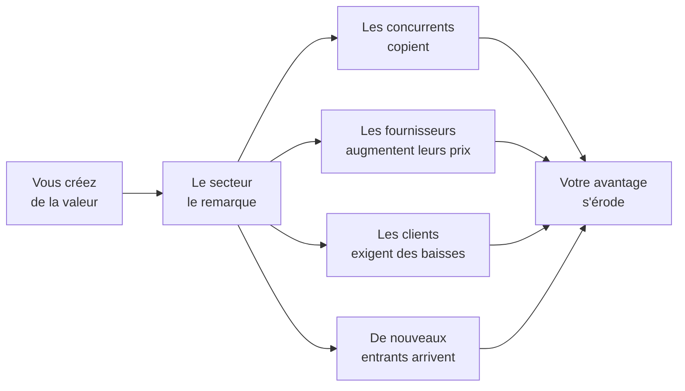

# Q3 — Qu'est-ce qu'un avantage concurrentiel durable ?

> **La réponse en une phrase**
> C'est une supériorité que vos concurrents **ne peuvent pas se procurer** — ni en l'achetant, ni en la copiant, ni en la contournant — et c'est la difficulté d'acquisition, pas la performance elle-même, qui la rend durable.

---

## Partie 1 — Décomposons les trois mots

### « Avantage »

Vous faites quelque chose **mieux** que les autres, ou vous faites quelque chose que les autres **ne font pas**. Attention : mieux du point de vue du client, pas du vôtre.

### « Concurrentiel »

📘 Le cours 3 le formule dans la chaîne de valeur : « l'accent est mis sur les activités où l'entreprise parvient à **se distinguer de ses concurrents** ».

🔎 Le mot impose une comparaison. Rien n'est un avantage dans l'absolu. Être certifié ISO quand tous vos concurrents le sont n'est pas un avantage, c'est un ticket d'entrée. Ne pas l'être devient alors un désavantage.

### « Durable » — le mot qui porte tout

Ici « durable » ne veut pas dire écologique. Il veut dire **qui dure dans le temps**.

🔎 Et la question devient : pourquoi un avantage cesserait-il d'exister ? Réponse : parce qu'un concurrent l'obtient à son tour. Un avantage est donc durable exactement dans la mesure où il est **difficile à acquérir pour les autres**.

---

## Partie 2 — Pourquoi les avantages disparaissent

📘 Le cours 2 explique le mécanisme d'érosion : « Si [un secteur] crée beaucoup de valeur, les intervenants qui participent à chacune des cinq forces **chercheront à se l'approprier**. »



🔎 Conclusion : **la valeur créée ne vous appartient pas automatiquement**. Créer et capter sont deux choses différentes. Une entreprise peut créer énormément de valeur et n'en garder aucune.

---

## Partie 3 — Ce qui rend un avantage difficile à acquérir

### La logique du cours

📘 Le cours 3 distingue les ressources matérielles et immatérielles. Les matérielles sont « relativement faciles à identifier et à évaluer ». Les immatérielles, elles, « tiennent un rôle important dans le processus de production » et comprennent :
> « l'**organisation et le management** de l'entreprise (procédures, contrôle qualité, etc.) ; la **technologie** utilisée (brevets par exemple, et allocation menée pour la recherche et le développement) ; l'**image de marque** (aspect marketing essentiel, la réputation et la notoriété de l'entreprise). »

### Le raisonnement

```
Facilité d'acquisition par un concurrent

Une machine            ████████████████████  s'achète en un mois
Un brevet              ████████              se contourne ou s'achète
Une organisation       ████                  se construit en années
Une réputation         █                     ne s'achète pas du tout
```

🔎 Illustration qualitative. Le message : **plus une ressource est immatérielle, moins elle est transférable, donc plus l'avantage qu'elle fonde est durable**. Détaillé dans [[Q14_Pourquoi_limmateriel_fonde_lavantage_durable]].

### Les quatre barrières à l'imitation

| Barrière | Mécanisme | Exemple |
|---|---|---|
| **Le temps** | Il faut des années, et on ne peut pas accélérer | Une réputation, une relation fournisseur de 20 ans |
| **L'ambiguïté causale** | Le concurrent ne sait pas exactement *ce qui* fait votre succès | Une culture d'entreprise |
| **La complémentarité** | L'avantage vient de la combinaison, pas d'un élément | Un système d'activités qui se renforcent |
| **La protection juridique** | Brevet, marque, droit exclusif | 📘 Oncle Hansi : les droits de l'œuvre |

🔎 La deuxième barrière est la plus solide et la moins comprise : un concurrent qui voit votre résultat sans comprendre sa cause ne peut pas le copier, même avec des moyens illimités.

---

## Partie 4 — L'exemple du cours : Oncle Hansi

📘 Les faits : en 2012, Steve Risch « acquiert les droits de l'œuvre de Jean-Jacques Waltz, personnage emblématique de l'histoire de la région et connu sous le pseudonyme de "l'oncle Hansi", afin d'éviter la dispersion de ce patrimoine particulièrement cher aux Alsaciens ». Il crée une marque ombrelle regroupant **24 entreprises alsaciennes**.

📘 Et le corrigé nomme le point fort décisif : « **l'entreprise possède le label qui fonde la proposition de valeur** ».

### Pourquoi c'est un avantage durable, analysé

| Barrière | Application au cas |
|---|---|
| Protection juridique | Les droits de l'œuvre sont détenus, exclusivement |
| Temps | Le patrimoine culturel alsacien s'est construit sur un siècle |
| Non-substituabilité | Un concurrent peut créer une autre marque régionale, pas *celle-là* |
| Complémentarité | 📘 Trois critères de sélection des partenaires : « l'antériorité dans l'utilisation de l'imagerie Hansi, l'appartenance au groupement "saveurs d'Alsace" et la position de leader sur leur marché » |

🔎 Le dernier point est subtil : en sélectionnant les leaders de chaque marché, l'entreprise verrouille le meilleur partenaire par catégorie. Un concurrent arrivant après trouvera les places prises.

📘 Résultat cinq ans après : « un chiffre d'affaires de l'ordre d'un million d'euros », « une dizaine de salariés », « **170 références alimentaires** et **55 références** dans les arts de la table et l'édition ».

---

## Partie 5 — Le lien avec la durabilité écologique

C'est le pont à faire, et il est fort.

🔎 Une démarche de durabilité crédible coche plusieurs barrières simultanément :

| Barrière | Pourquoi la durabilité la coche |
|---|---|
| Temps | Une réputation environnementale se construit sur des années |
| Ambiguïté causale | Elle repose sur des compétences internes diffuses, pas sur un achat |
| Complémentarité | Elle touche toute la chaîne de valeur : achats, conception, production, services |
| Conformité anticipée | 📘 La loi arrive — « Vers une accessibilité numérique obligatoire pour le secteur privé » — et une avance ne se rattrape pas instantanément |

⚠️ Mais la condition est stricte : elle doit être **réelle et prouvée**. Un affichage se copie en une semaine. Voir [[Q48_La_RNE_comme_avantage_strategique]].

---

## Les pièges

> [!danger] Erreurs classiques
> 1. **Confondre « durable » écologique et « durable » dans le temps.** Ici c'est le second sens.
> 2. **Oublier le comparatif.** Un avantage se définit par rapport aux concurrents.
> 3. **Citer une ressource facilement achetable.** Une machine n'est pas un avantage durable.
> 4. **Confondre créer et capter la valeur.** 📘 Les cinq forces cherchent à se l'approprier.
> 5. **Oublier l'ambiguïté causale.** C'est la barrière la plus solide.

## À retenir

| | |
|---|---|
| **Définition** | Une supériorité difficile à acquérir pour les concurrents |
| **Le critère** | Ce n'est pas la performance qui rend durable, c'est la difficulté d'acquisition |
| **Base 📘** | Les ressources immatérielles : organisation, technologie, image de marque |
| **Les 4 barrières** | Temps, ambiguïté causale, complémentarité, protection juridique |
| **Cas 📘** | Oncle Hansi : « possède le label qui fonde la proposition de valeur » |
| **Menace 📘** | « Les intervenants […] chercheront à se l'approprier » |
