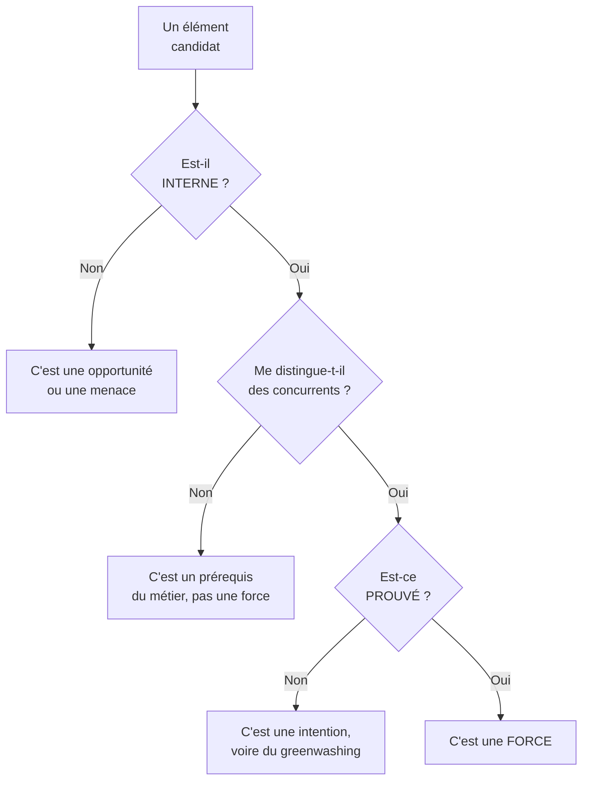
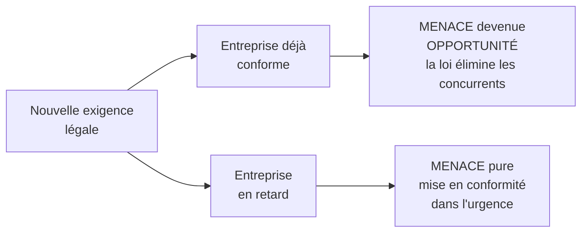

# Q3 — La durabilité peut-elle être une force dans un SWOT ?

> **La réponse en une phrase**
> Oui, mais pas automatiquement : la durabilité n'est une force que si elle est **interne, distinctive et prouvée** — sinon elle est soit une opportunité mal placée, soit une faiblesse de coût, soit du greenwashing.

---

## Partie 1 — Le vrai problème de cette question

La question a l'air d'appeler un « oui » évident. C'est un piège. La bonne réponse n'est pas « oui » : c'est **« oui si »**, et le travail consiste à énoncer les conditions.

Pour ça, il faut d'abord savoir ce qu'est une force. La plupart des étudiants ne le savent pas précisément.

### Qu'est-ce qu'une force, exactement

Une force répond à **trois critères cumulatifs**. Si un seul manque, ce n'est pas une force.

**Critère 1 — Interne.** 📘 Le cours 3 définit le diagnostic interne comme « la démarche qui va aboutir à l'identification des forces et faiblesses d'une organisation ». Interne veut dire : ça vous appartient, ça ne dépend pas du marché.

*Application.* « Les consommateurs demandent des produits durables » n'est pas une force, c'est une **opportunité** externe. « Nous avons une équipe formée à l'éco-conception » est une force.

**Critère 2 — Distinctif.** 📘 Le cours est explicite : dans la chaîne de valeur, « l'accent est mis sur les activités où l'entreprise parvient à **se distinguer de ses concurrents** ». Une force se définit par comparaison, pas dans l'absolu.

*Application.* Si tous vos concurrents sont certifiés, votre certification n'est pas une force, c'est un ticket d'entrée. Elle devient une **faiblesse** si vous ne l'avez pas.

**Critère 3 — Prouvé.** 🔎 Un engagement non vérifiable ne convainc personne et se retourne au premier contrôle. Voir [[Q15_Le_greenwashing]].

---

## Partie 2 — Pourquoi la durabilité peut remplir ces trois critères

### Elle est bien une ressource interne

📘 Le cours 3 dit qu'il faut « commencer par lister l'ensemble des ressources **matérielles et immatérielles** de l'entreprise ».

La durabilité produit des ressources immatérielles, qui sont souvent les plus solides :

| Ressource immatérielle produite | Pourquoi elle est difficile à copier |
|---|---|
| Réputation environnementale | Se construit sur des années, se détruit en un jour |
| Compétences internes en éco-conception | Demandent de la formation et de la pratique |
| Conformité anticipée | Une avance réglementaire ne se rattrape pas instantanément |
| Confiance des parties prenantes | 📘 Le Guide RNE dit que la démarche « renforce le rapport de confiance entre l'entreprise, ses partenaires et ses clientes et clients » |
| Relations fournisseurs durables | Un réseau ne s'achète pas |

🔎 Le point important : une machine s'achète, une réputation se construit. C'est pour ça que les ressources immatérielles font de meilleures forces que les ressources matérielles.

### Elle peut être distinctive

📘 Le Guide de l'État de Genève sur la RNE présente explicitement la démarche comme un moyen de « se démarquer dans le monde numérique tout en contribuant positivement à la société ».

🔎 Deux façons de se distinguer :
- **Par l'avance** : vous êtes conforme avant les autres, avant que la loi ne l'exige.
- **Par la profondeur** : les autres affichent, vous transformez réellement votre chaîne de valeur.

---

## Partie 3 — Les quatre cases : la durabilité peut aller partout

C'est le cœur de la réponse. La durabilité n'est pas assignée à une case du SWOT. Selon la situation, elle est dans les quatre.

| Case | Quand la durabilité y tombe | Exemple |
|---|---|---|
| **Force** (interne, positif) | Compétences réelles, réputation, avance | Équipe formée, produits certifiés, bilan carbone piloté |
| **Faiblesse** (interne, négatif) | Retard, coûts subis, absence de compétences | Aucun critère d'achat responsable, matériel renouvelé tous les 2 ans |
| **Opportunité** (externe, positif) | Le marché ou la loi vous favorisent | Marchés publics exigeant des critères RSE |
| **Menace** (externe, négatif) | La loi ou le marché se durcit contre vous | Nouvelle réglementation, concurrent qui prend l'avance |

⚠️ **Erreur très fréquente.** Écrire « développement durable » dans la case Forces sans préciser quoi. Ce n'est pas une force, c'est un thème. Une force est toujours une **capacité concrète et vérifiable**.

### Le même fait, deux cases opposées

Prenons un durcissement réglementaire sur l'accessibilité numérique.

🔎 C'est le raisonnement le plus fort que vous puissiez tenir sur cette question : **une même force extérieure est une opportunité pour celui qui est prêt et une menace pour celui qui ne l'est pas**. C'est votre position interne qui décide, pas l'événement.

---

## Partie 4 — Quand la durabilité devient une faiblesse

Il faut savoir le dire, sinon la réponse est complaisante.

| Situation | Pourquoi ça devient une faiblesse |
|---|---|
| Surcoût non répercutable | Le client ne paie pas le supplément, la marge se dégrade |
| Engagement pris sans compétence | On promet, on ne tient pas, la réputation se retourne |
| Durabilité vitrine | 📘 Un modèle durable de façade où les externalités négatives restent cachées |
| Complexité de gestion | Reporting, audits, certifications alourdissent les activités de soutien |

📘 Le lien avec le business model durable est direct : le cours dit qu'une entreprise responsable cherche à « réduire ou compenser les **externalités négatives** ». Tant qu'elles sont cachées, il n'y a pas de force, il y a une dette dissimulée.

---

## Partie 5 — La justification stratégique complète

Voici l'argumentation à dérouler quand on vous demande « justifiez ».

### Argument 1 — La durabilité crée une ressource non substituable

📚 *Complément hors cours* : en théorie des ressources, une ressource crée un avantage durable si elle est rare, difficile à imiter et non substituable. Une réputation construite sur dix ans coche les trois. Présentez-le comme un apport extérieur, ce cadre n'est pas dans vos slides.

### Argument 2 — Elle transforme une contrainte future en avantage présent

📘 Le cours durabilité rappelle la trajectoire réglementaire : Agenda 2030 adopté par 193 États, 17 ODD et 169 cibles à atteindre d'ici 2030, et en Suisse la Stratégie pour le développement durable 2030 du Conseil fédéral.

🔎 Autrement dit : la contrainte arrive, c'est certain. La seule question est de savoir si vous l'anticipez ou si vous la subissez. Anticiper transforme un coût futur inévitable en différenciation présente.

### Argument 3 — Elle répond à une réalité physique, pas à une mode

📘 Les limites planétaires : **9 variables identifiées**, et **7 sur 9 sont considérées comme dépassées en 2025**. 📘 Le cours ajoute : « Il est donc urgent de revenir au sein d'un espace de fonctionnement sécurisé pour préserver l'habitabilité humaine de la planète. »

🔎 Ce chiffre est votre meilleur argument contre l'objection « c'est un effet de mode ». Une contrainte physique ne se démode pas.

---

## Partie 6 — Exemple complet

**L'entreprise.** Un torréfacteur genevois, 25 personnes, vend en boutique et aux restaurants.

**Diagnostic interne — ce qui est vraiment une force**

| Élément candidat | Est-ce une force ? | Pourquoi |
|---|---|---|
| Relations directes avec 4 coopératives productrices depuis 12 ans | ✅ Force | Interne, distinctif, prouvable par les contrats |
| Torréfaction sur place | ❌ Pas une force | Tous les torréfacteurs le font, c'est le métier |
| « Nous sommes engagés pour la planète » | ❌ Pas une force | Intention non prouvée |
| Emballages compostables développés en interne | ✅ Force | Interne, peu de concurrents l'ont fait |
| Aucun bilan carbone | ❌ Faiblesse | Interne et négatif |

**SWOT résultant**

| | Positif | Négatif |
|---|---|---|
| **Interne** | Relations directes producteurs, emballages compostables, savoir-faire | Aucun bilan carbone, transport aval non optimisé |
| **Externe** | Clientèle genevoise sensible à l'origine, marchés publics exigeants | Prix du café en hausse, concurrents qui communiquent fort |

**Le croisement, qui est l'étape notée**

- Force « relations directes » × Opportunité « clientèle sensible à l'origine » → **stratégie de différenciation par la traçabilité prouvée**. La force répond à l'opportunité.
- Faiblesse « aucun bilan carbone » × Menace « concurrents qui communiquent » → **risque prioritaire** : on est plus vertueux qu'eux mais on ne peut pas le démontrer.

🔎 Ce dernier point est frappant : l'entreprise a la substance et pas la preuve, ses concurrents ont la preuve et pas la substance. Le chantier prioritaire n'est donc pas de devenir plus durable, c'est de **rendre mesurable** ce qui l'est déjà. Voir [[Q07_Numerique_pour_mesurer_et_piloter_impact]] et [[Q12_Transparence_labels_et_positionnement]].

---

## Les pièges

> [!danger] Erreurs classiques
> 1. **Répondre « oui » sans conditions.** La question dit « justifiez ». Les conditions sont la justification.
> 2. **Confondre force et opportunité.** « Le marché demande du durable » est externe.
> 3. **Écrire un thème au lieu d'une capacité.** « Développement durable » n'est pas une force.
> 4. **Oublier le comparatif.** Une force se définit par rapport aux concurrents.
> 5. **Ne pas mentionner le cas où elle devient faiblesse.** Une réponse à sens unique est incomplète.
> 6. **S'arrêter au SWOT rempli.** Le croisement est l'étape qui produit la stratégie.

## À retenir

| | |
|---|---|
| **Réponse** | Oui, si interne + distinctive + prouvée |
| **Les 4 cases** | La durabilité peut occuper les quatre selon la situation |
| **Ressource clé** | Immatérielle : réputation, compétences, conformité anticipée |
| **Argument massue 📘** | 9 limites planétaires, 7 dépassées en 2025 — ce n'est pas une mode |
| **Retournement** | Une même contrainte est opportunité pour celui qui est prêt, menace pour l'autre |

Voir [[Q14_Les_freins_internes_a_une_strategie_durable]] pour le versant faiblesse, et [[Q15_Le_greenwashing]] pour le critère de preuve.
