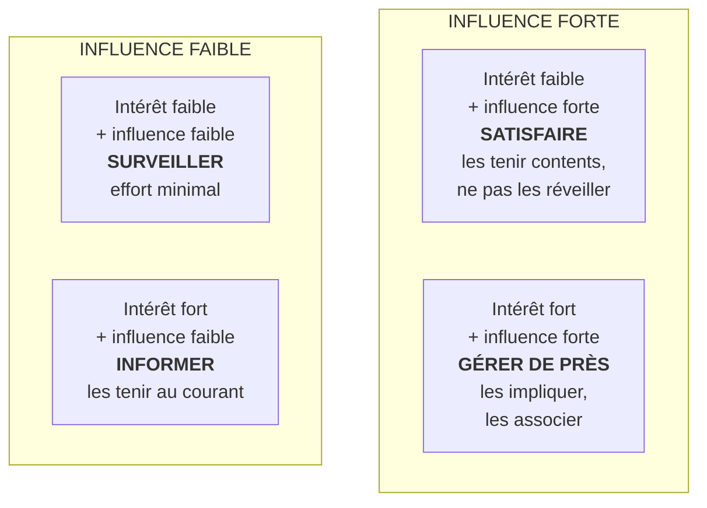

# Q4 — Expliquez la matrice parties prenantes intérêt × pouvoir

> **La réponse en une phrase**
> Deux axes indépendants produisent quatre profils, et chaque profil appelle un **traitement différent** — la matrice ne sert pas à classer des gens, elle sert à décider **combien d'énergie** on met sur chacun et **quoi lui dire**.

---

## Partie 1 — Pourquoi deux axes et pas un seul

C'est la question à se poser en premier, et personne ne la pose.

Si on ne gardait qu'un axe — le pouvoir — on obtiendrait un classement simple : on s'occupe des puissants, on ignore les autres. C'est ce que font naturellement les organisations.

🔎 Le problème : **le pouvoir seul ne prédit pas le comportement**. Un actionnaire puissant mais indifférent à votre projet ne fera rien. Un salarié sans pouvoir mais très concerné peut bloquer un chantier entier. Il faut donc croiser deux informations différentes.

| Axe | Question posée | Ce qu'il prédit |
|---|---|---|
| **Intérêt** | Ce que nous faisons a-t-il des conséquences pour eux ? | S'ils vont **vouloir** agir |
| **Influence / pouvoir** | Peuvent-ils agir sur nos décisions ? | S'ils vont **pouvoir** agir |

⚠️ Vouloir et pouvoir sont indépendants. C'est exactement pour ça qu'il faut deux axes : un acteur n'agit que si les deux sont réunis.

---

## Partie 2 — La méthode exacte du cours

📘 Le cours 1 donne trois gestes.

**Geste 1.** « Lister les parties prenantes **internes** (direction, équipes..) et **externes** (clients, fournisseurs..). »

**Geste 2.** « Construire un tableau de synthèse de votre analyse et évaluer selon le niveau d'**intérêt** et d'**influence** (- / +). Quel est leur intérêt dans l'entreprise (**faible, moyen, fort**) et leur niveau d'influence (**faible, moyen, fort**) ? »

📘 Le cours donne même la structure de tableau :

| Parties prenantes | Intérêt | Influence / pouvoir |
|---|---|---|
| … | faible / moyen / fort | faible / moyen / fort |

**Geste 3.** « **Matrice des parties prenantes** : reporter sur la matrice vos résultats d'analyse. »

⚠️ Notez l'échelle du cours : **faible / moyen / fort**, en trois niveaux, pas en deux. La matrice à quatre cases est une simplification de lecture ; le tableau d'analyse, lui, est plus fin.

---

## Partie 3 — Les quatre cases et leur logique

🔎 Ces quatre stratégies ne sont pas à mémoriser : elles se **déduisent**. Quelqu'un de puissant et concerné, on l'associe. Puissant mais indifférent, on évite de le fâcher. Concerné sans pouvoir, on l'informe. Ni l'un ni l'autre, on n'y consacre pas d'énergie.

### Le détail qui fait la différence : la case « Satisfaire »

⚠️ « Satisfaire » ne veut pas dire « faire plaisir ». Cela veut dire : **maintenir leur intérêt bas**. Un acteur puissant et indifférent est confortable ; s'il devient concerné, il passe en case « gérer de près » et devient un facteur majeur. La stratégie consiste donc à ne pas créer de raison de s'intéresser.

🔎 Exemple : un régulateur qui ne s'intéresse pas à vous est un régulateur qui ne vous contrôle pas. On le tient informé correctement, sans lui donner de motif d'enquête.

---

## Partie 4 — Ce qu'on fait après : le plan de management

📘 C'est l'étape que la plupart oublient, et le cours insiste : « Votre action **ne se limite pas à l'identification** des forces en présence. Vous devez élaborer un véritable **plan de management des parties prenantes** en fonction de leur profil. Pour certains, des actions sont à prévoir. Ce sont essentiellement des **actions de communication** : détailler les objectifs et la méthode retenue, informer de l'avancée des opérations, prévenir d'un risque probable, des difficultés rencontrées… »

| Action citée 📘 | Case concernée en priorité |
|---|---|
| Détailler les objectifs et la méthode | Gérer de près |
| Informer de l'avancée des opérations | Informer |
| Prévenir d'un risque probable | Ceux qui seront affectés |
| Signaler les difficultés | Ceux qui peuvent aider ou bloquer |

🔎 Le point de méthode : la matrice est un **outil de dosage de la communication**. Elle répond à « combien de temps je passe avec qui, et quoi je lui dis ».

---

## Partie 5 — Les deux limites à connaître

### Limite 1 — Les positions ne sont pas stables

⚠️ Une partie prenante à faible influence peut en gagner très vite. Une association d'usagers plus un article de presse, et le profil « informer » devient « gérer de près » en 48 heures.

🔎 Conséquence pratique : la matrice doit être **révisée**, pas établie une fois pour toutes. Et un acteur à intérêt fort mais influence faible est un **risque latent**, pas un acteur négligeable.

### Limite 2 — Elle trie par pouvoir, donc reproduit les rapports de force

C'est le point le plus important pour relier la matrice à la durabilité.

| Partie prenante | Intérêt | Influence | Traitement mécanique |
|---|---|---|---|
| Actionnaire | Fort | Forte | Très entendu |
| Riverain | Fort | Faible | Informé |
| Travailleur de la chaîne amont | Fort | Très faible | Absent |
| Environnement, générations futures | Maximal | Nulle | Absent |

🔎 **Le raisonnement à faire** : la matrice classique est un outil de gestion du risque politique, pas un outil de justice. Ceux qui subissent le plus sont ceux qu'elle écoute le moins, et c'est structurel.

📘 Le donut du cours dit l'inverse : le fondement social concerne « les besoins humains fondamentaux pour **toute l'humanité**, permettant à **chacun·e** d'avoir une vie digne ».

📘 Et l'entreprise a des outils pour corriger : les rôles listés dans le cours — Data Protection Officer, Chief Digital Officer, CISO, Chief AI Officer, **Green Chief Officer**, **Accessibility Officer** — servent précisément à donner une voix interne à des parties prenantes qui n'en ont pas.

---

## Partie 6 — Exemple complet

**Le projet.** Une commune genevoise dématérialise ses démarches administratives.

| Partie prenante | Intérêt | Influence | Case | Action prévue |
|---|---|---|---|---|
| Conseil administratif | Fort | Forte | Gérer de près | Comité de pilotage mensuel |
| Service informatique | Fort | Moyenne | Gérer de près | Association à la conception |
| Canton (subventions) | Moyen | Forte | Satisfaire | Rapport d'avancement trimestriel |
| Habitants de moins de 50 ans | Moyen | Moyenne | Informer | Communication classique |
| **Habitants de plus de 75 ans** | **Fort** | **Faible** | **Informer** ⚠️ | **Insuffisant — voir ci-dessous** |
| Agents de guichet | Fort | Faible | Informer | Plan de requalification |
| Association d'aînés | Fort | Faible… pour l'instant | Surveiller de près | Consultation en amont |

### Le raisonnement de correction

🔎 La ligne des plus de 75 ans est le cœur du problème. La matrice mécanique dit « informer ». Or :
- leur intérêt est maximal (ils perdent leur canal d'accès) ;
- leur influence est faible **aujourd'hui** ;
- l'association d'aînés peut la transformer en influence forte du jour au lendemain ;
- et surtout, les ignorer produit une **exclusion indirecte**. Voir [[Q50_Lexclusion_indirecte]].

**Décision** : traiter cette ligne comme « gérer de près » malgré son influence faible, pour deux raisons — le risque de bascule, et la responsabilité. Un panel d'usagers âgés est consulté **avant** la refonte, pas après.

⚠️ C'est exactement l'erreur du cas SilverDigital : le segment des plus de 65 ans avait un intérêt maximal et une influence faible, et il a été traité comme négligeable. Résultat : **−12 % de clients de plus de 65 ans**.

---

## Les pièges

> [!danger] Erreurs classiques
> 1. **Confondre intérêt et influence.** Deux axes indépendants.
> 2. **S'arrêter à la matrice.** 📘 « Votre action ne se limite pas à l'identification. »
> 3. **Croire que « satisfaire » veut dire « faire plaisir ».** Cela veut dire maintenir l'intérêt bas.
> 4. **Traiter la matrice comme figée.** Les positions basculent.
> 5. **Oublier les parties prenantes sans voix.** La matrice reproduit les rapports de force existants.
> 6. **Oublier l'échelle du cours.** 📘 Faible / moyen / fort, en trois niveaux.

## À retenir

| | |
|---|---|
| **Pourquoi deux axes** | Intérêt = vouloir agir ; influence = pouvoir agir. Les deux sont nécessaires |
| **Échelle 📘** | Faible / moyen / fort |
| **Les 4 stratégies** | Gérer de près, satisfaire, informer, surveiller |
| **Sortie obligatoire 📘** | Un plan de management, essentiellement des actions de communication |
| **La limite** | Elle trie par pouvoir : les plus exposés sont les moins entendus |
| **Position 📘** | « C'est le début de toute analyse pour réaliser un plan » |
