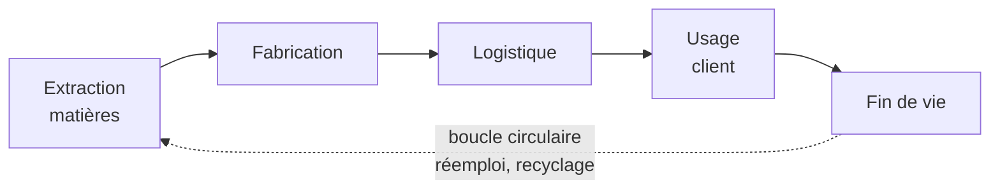
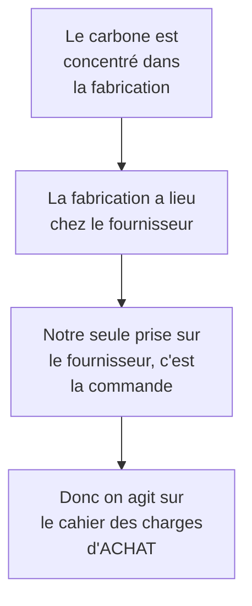
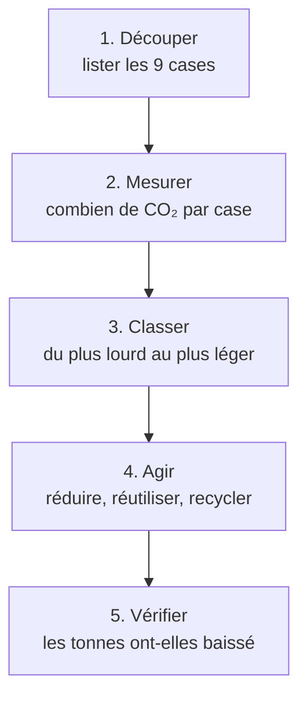

# Q4 — Comment réduire l'empreinte carbone via la chaîne de valeur ?

> **La réponse en une phrase**
> On découpe l'entreprise en neuf activités, on mesure le carbone de chacune, on classe, et on agit d'abord sur les deux ou trois qui pèsent le plus — en appliquant réduire, puis réutiliser, puis seulement recycler.

---

## Partie 1 — Les deux mots, expliqués à quelqu'un qui n'y connaît rien

### L'empreinte carbone

C'est la quantité de gaz à effet de serre émise à cause d'une activité, mesurée en kilos ou en tonnes de CO₂.

Le point que personne ne comprend au début : **les émissions ne sont pas seulement celles qu'on voit**. Quand vous achetez un ordinateur, vous n'avez rien brûlé. Mais pour qu'il existe, il a fallu extraire des métaux, les raffiner, fabriquer des composants, transporter le tout. Tout cela a émis du CO₂ **avant** que vous ne l'allumiez.

On appelle ça le **carbone incorporé** : il est déjà « dans » l'objet au moment de l'achat. Retenez ce mot, tout le reste en découle.

### La chaîne de valeur

📘 Le concept « repose sur l'idée que divers **inputs** sont transformés afin de créer les produits finaux escomptés (**outputs**) ».

En français courant : il entre des choses, il en sort un produit, et entre les deux il y a une suite d'étapes. La chaîne de valeur est la liste de ces étapes.

---

## Partie 2 — Pourquoi cet outil pour ce problème

Le raisonnement en trois temps.

**Premier problème.** Une entreprise veut réduire ses émissions. Mais « l'entreprise » est trop gros pour être un objet d'action. On ne peut pas décider « je réduis l'entreprise de 30 % ». Il faut savoir **où** agir.

**Solution.** La chaîne de valeur fournit un découpage prêt à l'emploi. Chaque morceau devient un endroit où on peut agir séparément.

**Deuxième problème.** Si on ne regarde que l'intérieur de l'entreprise, on rate l'essentiel. Une entreprise qui ferme son usine et fait fabriquer ailleurs voit ses émissions chuter — alors qu'elles n'ont pas disparu, elles ont changé de propriétaire. C'est le **transfert d'impact**.

**Solution.** 📘 Le cours définit la chaîne de valeur en durabilité comme « l'ensemble des activités, **depuis les matières premières jusqu'au recyclage ou à la fin de vie** d'un produit/service, en intégrant systématiquement les dimensions :
> - **Environnementales** : réduction de l'empreinte carbone, circularité des matériaux, énergies renouvelables.
> - **Sociales** : conditions de travail, équité, impact sur les communautés locales.
> - **Économiques** : création de valeur à long terme, efficacité des ressources, innovation responsable. »

Le mot décisif est « depuis… jusqu'à ». Le périmètre commence **avant** l'entreprise et finit **après** elle. C'est ce qui empêche de tricher.



⚠️ Le périmètre classique s'arrête à Fabrication et Logistique. Le périmètre durabilité couvre les cinq blocs. La différence entre les deux, c'est exactement l'espace où se cache le transfert d'impact.

---

## Partie 3 — Les neuf cases, avec leur définition exacte

📘 Toutes les définitions ci-dessous viennent des slides du cours 3.

### Les cinq activités principales — elles touchent le produit et se suivent dans le temps

| Case | Définition du cours 📘 | En clair | Exemple boulangerie |
|---|---|---|---|
| Logistique d'approvisionnement | « Activités logistiques (amont) de réception, de stockage et de manutention interne » | Ce qui arrive et comment on le range | Le camion livre la farine, on la stocke |
| Fabrication / production | « Transformation des matières et sous-ensembles en produits finis » | On transforme | On pétrit, on cuit |
| Logistique de commercialisation | « Activités de livraison des biens et services au client » | Ce qui part vers le client | Le pain arrive au comptoir |
| Marketing et ventes | « Moyens et méthodes utilisées pour faire connaître l'offre, la faire apprécier et déclencher l'achat » | Faire savoir et faire acheter | Enseigne, vitrine, publicité locale |
| Services | « Activités associées à l'offre principale (formation, maintenance…) » | Ce qu'on fait après la vente | Commandes sur mesure, reprise |

### Les quatre activités de soutien — elles servent toutes les autres

📘 « Les activités de soutien ont un impact **transversal** sur toutes les unités et sections. »

« Transversal » veut dire : ça traverse tout. Si les ressources humaines vont mal, tout va mal.

| Case | Définition du cours 📘 | En clair |
|---|---|---|
| Infrastructures de l'entreprise | « Direction générale et autres fonctions communément appelées support, telles que la comptabilité, le juridique » | Ceux qui pilotent et administrent |
| Gestion des ressources humaines | « Recrutement, rémunération, motivation, formation, gestion de carrière » | Tout ce qui concerne les gens |
| Approvisionnement | « Achats de matière, de marchandises, de fournitures diverses, mais également de moyens de production » | Décider quoi acheter et à qui |
| Développement technologique | « Systèmes d'information, R&D, gestion des connaissances » | Concevoir, informatiser, améliorer |

> [!warning] Piège de vocabulaire
> « Approvisionnement » apparaît **deux fois** et ce n'est pas la même chose.
> - En bas (principale) : le mouvement physique. Le camion arrive, on décharge.
> - En haut (soutien) : la décision d'achat. Quel fournisseur, quel contrat, quel cahier des charges.
>
> ⚠️ Le cours 5 appelle cette case « les achats », les slides de la chaîne de valeur disent « approvisionnement ». Même endroit, deux mots.

---

## Partie 4 — Peut-on agir sur tout ? Non, et voici pourquoi

Trois raisons concrètes :

1. **L'argent est limité.** On ne finance pas neuf chantiers en même temps.
2. **Le temps est limité.** Neuf projets de front, c'est neuf projets ratés.
3. **Surtout : les cases n'ont pas le même poids carbone.**

C'est le troisième point qui décide de tout.

```
Répartition typique de l'empreinte d'un appareil numérique
(ordres de grandeur illustratifs, PAS des chiffres du cours)

Fabrication          ███████████████████████████████████  ~75 %
Usage (électricité)  ████████                             ~18 %
Transport            ██                                    ~5 %
Fin de vie           █                                     ~2 %
```

🔎 Ces pourcentages sont mon illustration. Ce qui compte n'est pas le chiffre exact mais la **structure** : la fabrication écrase tout le reste.

### La conséquence logique

Si la fabrication domine, la question la plus efficace n'est pas « comment consommer moins d'électricité ? » mais **« comment éviter de fabriquer un nouvel appareil ? »**.

Réponse : en gardant plus longtemps celui qu'on a.

📘 Et c'est exactement ce que dit le cours 5 : l'économie circulaire des appareils numériques est « l'extension de la vie utile des appareils numériques par le biais d'une amélioration de la fabrication et de la réutilisation, une **minimisation du besoin de nouveaux appareils** et des déchets électroniques ».

### Donc : sur quelle case agit-on ?

Qui décide du moment où on rachète ? Pas la production, pas le marketing. La case **Achats**.



📘 Et le cours 5 donne le contenu du cahier des charges : « Fixer des critères pour les achats (ex : critères **TCO**) » — fabrication socialement responsable, fabrication respectueuse de l'environnement, santé et sécurité des utilisateurs, performance du produit, **extension de la durée de vie**, réduction des substances dangereuses, récupération des matériaux.

📘 Appuyé par les labels ISO 14'024 (2018), ISO 14'021 (2016), ISO 14'025 — et par les certifications TCO certified, Ecolabel européen, Energy Star, EPEAT, Der blaue Engel.

### Le deuxième levier, par le même raisonnement

La case **Développement technologique**. Quand vous concevez un produit, vous décidez de quoi il est fait, s'il est réparable, combien de temps il durera. Une fois conçu, ces choix sont figés.

🔎 L'impact d'un produit est **décidé** à la conception, puis **subi** pendant toute sa vie. Agir en conception est donc plus puissant qu'agir en production. Voir [[Q11_Lecoconception]].

### Attention : le classement dépend du métier

⚠️ Pour un transporteur routier, ce n'est pas la fabrication qui domine, c'est le carburant, donc la logistique. Pour un centre de données, c'est l'électricité d'usage. La **méthode** ne change pas — mesurer puis hiérarchiser — mais le **résultat** change selon l'entreprise. C'est pour ça que le cours fait toujours commencer par un diagnostic.

---

## Partie 5 — La méthode en cinq étapes

📘 Le cours durabilité pose l'exercice ainsi : « Où se crée la valeur durable ? **Où sont les impacts négatifs ?** […] Proposez **2 améliorations** pour renforcer la durabilité. »



| Étape | Ce qu'on fait concrètement | Erreur à éviter |
|---|---|---|
| 1. Découper | Écrire ce que fait votre entreprise dans chaque case | Recopier la théorie sans l'appliquer |
| 2. Mesurer | Chercher ce qui émet, poste par poste | Deviner au lieu de mesurer |
| 3. Classer | Identifier les 2 ou 3 cases dominantes | Traiter les 9 cases également |
| 4. Agir | Appliquer les 3R dans l'ordre | Commencer par le recyclage |
| 5. Vérifier | Deux indicateurs, intensité **et** absolu | N'avoir que l'intensité |

---

## Partie 6 — Les 3R, et pourquoi cet ordre exactement

📘 « Le modèle des 3R : réduire, réutiliser, recycler » — et la phrase que tout le monde saute : « Tout cela dépend des efforts de réduction et de réutilisation, **puis enfin seulement de recyclage**. »

« Puis enfin seulement » n'est pas une liste, c'est un **classement**.

```
Carbone évité selon le niveau d'action

1. Réduire     ████████████████████████████  ne pas acheter = tout évité
2. Réutiliser  ████████████████████          une fabrication en moins
3. Recycler    ████████                      le carbone est déjà émis
```

**Réduire.** Si vous n'achetez pas l'appareil, il n'est pas fabriqué. Vous évitez 100 % de son empreinte. Seul niveau qui évite tout.

**Réutiliser.** Vous gardez votre appareil deux ans de plus. L'appareil neuf n'est pas fabriqué. Vous évitez presque tout.

**Recycler.** L'appareil a été fabriqué, donc le CO₂ est parti. Il ne reviendra pas. Le recyclage récupère de la matière et évite une part d'extraction future, mais le mal est fait. Et recycler consomme de l'énergie.

⚠️ Si votre seule proposition est « on va mieux recycler », vous avez accepté que tout soit fabriqué puis jeté. C'est aussi le mécanisme du greenwashing : communiquer sur le recyclage permet d'avoir l'air vertueux sans toucher aux volumes. Voir [[Q15_Le_greenwashing]] et [[Q18_Economie_circulaire_des_appareils_numeriques]].

---

## Partie 7 — Les leviers case par case

| Case | Ce qui émet | Levier de réduction |
|---|---|---|
| Logistique d'approvisionnement | Transport amont, matières, énergie de stockage | Sourcing de proximité, matériaux à faible empreinte, mutualisation, taux de remplissage |
| Production | Énergie de process, rebuts, chaleur perdue | 📘 Énergies renouvelables, efficacité énergétique, réduction des rebuts, récupération de chaleur |
| Logistique de commercialisation | Transport aval, emballages, dernier kilomètre | Report modal, optimisation des tournées, emballages réemployables |
| Marketing et ventes | Supports physiques, déplacements | Dématérialisation, visioconférence, campagnes numériques sobres |
| Services | Déplacements techniciens, remplacements prématurés | 📘 Extension de la durée de vie : maintenance, réparabilité, pièces détachées |
| **Approvisionnement (soutien)** | 🔴 Le levier n°1 | Critères TCO contraignants au cahier des charges |
| **Développement technologique** | 🔴 Le levier n°2 | Éco-conception ; pour le numérique, RGESN 2024 |
| Ressources humaines | Mobilité domicile-travail, pratiques | Formation, télétravail, critères carbone dans les objectifs |
| Infrastructures / direction | Le pilotage | Bilan carbone, gouvernance, tableau de bord extra-financier |

📘 Sur le RGESN : le référentiel 2024, porté notamment par la DINUM, le ministère de la Transition écologique, l'ADEME et l'Institut du Numérique Responsable, « demande de réduire les impacts des services numériques en agissant sur l'**architecture, les contenus, les flux, l'hébergement, les composants et la durée de vie des données** ».

📘 Exemple concret cité : sur la vidéo, ajuster la définition au contexte de visualisation, car une résolution trop élevée augmente à la fois la consommation du terminal et le volume transféré. Formule à retenir : « ne pas supprimer l'usage utile, mais **adapter la qualité technique au besoin réel** ».

---

## Partie 8 — Les deux pièges qui ruinent une bonne analyse

### Le transfert d'impact

Vous fermez l'atelier, vous sous-traitez. Vos émissions internes chutent de 40 %. Vous n'avez rien réduit : vous avez changé qui les compte. C'est exactement ce que le périmètre élargi empêche.

### L'effet rebond

```
Efficacité par unité   ▼ −20 %
Volumes vendus         ▲ +35 %
--------------------------------
0,80 × 1,35 = 1,08     ▲ +8 % d'émissions totales
```

Vous pouvez communiquer honnêtement sur « −20 % par produit » tout en ayant aggravé la situation.

📘 Le cours le formule ainsi : l'OCDE souligne que les bénéfices environnementaux indirects « peuvent être contrebalancés par ses impacts propres et par des effets rebond, ce qui rend le bilan net complexe à établir ».

**Conséquence pratique — toujours deux indicateurs :**

| Type | Exemple | Ce qu'il dit |
|---|---|---|
| Intensité | kg CO₂ par produit vendu | Progresse-t-on techniquement ? |
| **Absolu** | tonnes CO₂ totales de l'année | Le problème diminue-t-il vraiment ? |

Le premier peut baisser pendant que le second monte. Seul le second compte pour la planète.

---

## Partie 9 — Exemple complet

**L'entreprise.** Agence web genevoise, 12 personnes.

**1. Découper.** Les neuf cases remplies.

**2. Mesurer.** Deux points chauds : Achats (40 ordinateurs renouvelés tous les 2 ans) et Technologie (sites livrés lourds).

**3. Classer.** Achats, puis Technologie, puis le reste.

**4. Agir, dans l'ordre des 3R.**

| Case | Réduire | Réutiliser | Recycler |
|---|---|---|---|
| Achats | A-t-on besoin de 40 machines ? Postes partagés ? | Renouvellement passé de 2 à 5 ans, critères TCO, réparabilité | Filière de réemploi puis recyclage en fin de vie |
| Technologie | Supprimer les fonctionnalités non utilisées | Réutiliser des composants existants au lieu de tout redévelopper | Sans objet |

**5. Vérifier.**

| Indicateur | Type | Cible |
|---|---|---|
| Durée de vie moyenne du parc IT | Absolu | De 2 à 5 ans |
| Part des achats couverts par critères TCO | Intensité | 100 % |
| Poids moyen des pages livrées | Intensité | Divisé par deux |
| Tonnes CO₂ totales | Absolu | Baisse réelle |

---

## Les pièges

> [!danger] Erreurs classiques
> 1. **Inverser les 3R.** Commencer par le recyclage. Le cours corrige explicitement ce réflexe.
> 2. **Ne parler que de la production.** Achats et conception sont les leviers majeurs.
> 3. **Se limiter au périmètre interne.** 📘 La définition impose « matières premières → fin de vie ».
> 4. **Oublier l'effet rebond.**
> 5. **Pas d'indicateur.** Le cours exige des recommandations mesurables.
> 6. **Oublier que la durabilité ≠ carbone seul.** 📘 La définition inclut le social et l'économique.

## À retenir

| | |
|---|---|
| **Périmètre 📘** | Des matières premières à la fin de vie |
| **Découpage** | 5 activités principales + 4 de soutien |
| **Leviers n°1 et n°2** | Achats (critères TCO) et Développement technologique (éco-conception) |
| **Ordre 📘** | Réduire > Réutiliser > « puis enfin seulement » Recycler |
| **Vérification** | Un indicateur d'intensité **et** un indicateur absolu |
