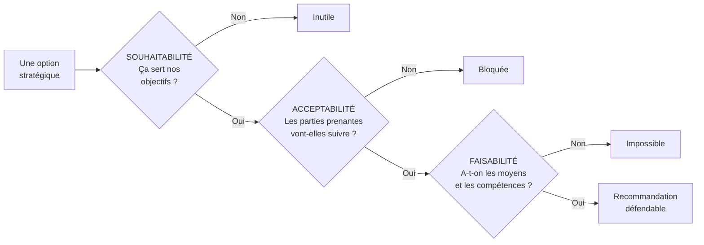

# Q5 — Qu'apporte la grille SAF à une recommandation ?

> **La réponse en une phrase**
> Le SAF transforme une intuition en recommandation défendable, en la soumettant à trois filtres qui échouent pour des raisons différentes : elle peut être **inutile**, **bloquée** ou **impossible**.

---

## Partie 1 — Le problème que le SAF résout

Vous avez fait un diagnostic. Vous avez plusieurs options. Comment choisir sans que ce soit une préférence personnelle ?

🔎 Sans grille, l'argumentation devient : « je pense que c'est la meilleure option ». C'est indéfendable devant un conseil d'administration, et c'est indéfendable à un oral d'examen.

Le SAF apporte une **structure d'argumentation** : trois questions, posées dans cet ordre, auxquelles il faut répondre séparément.

⚠️ Les trois échecs sont de nature différente, et ils appellent des réponses différentes. Une option inutile, on l'abandonne. Une option bloquée, on la renégocie. Une option impossible, on la reporte ou on acquiert les moyens.

---

## Partie 2 — Les trois critères, en détail

### S — Souhaitabilité

**La question.** Cette stratégie sert-elle nos objectifs, notre mission, nos valeurs ?

🔎 Ce critère teste la **cohérence interne**. Une option peut être excellente en soi et ne servir à rien pour vous. Ouvrir une filiale en Asie est peut-être rentable, mais si votre proposition de valeur repose sur la proximité régionale, ce n'est pas souhaitable.

📘 Le lien avec le cours 1 : « La vision, la mission, les buts et les objectifs définissent la trajectoire. » La souhaitabilité teste l'alignement avec cette trajectoire.

### A — Acceptabilité

📘 C'est le critère que votre cours détaille le plus. Citation exacte :

> « **Acceptabilité.** Cette partie du test porte sur l'attractivité de la stratégie proposée auprès des parties prenantes, en prenant en compte leurs **intérêts et pouvoirs d'influence**, et en soulevant les questions suivantes :
> - Le **retour attendu** est-il acceptable ?
> - Le niveau de **risque** est-il acceptable ?
> - Les **parties prenantes vont-elles s'opposer** à la stratégie ?
>
> Outils : analyse des parties-prenantes, analyse des risques »

⚠️ Trois sous-questions, pas une. Et notez les outils cités : l'acceptabilité **se teste avec la matrice intérêt × pouvoir**. Voir [[Q04_Matrice_parties_prenantes_interet_pouvoir]].

🔎 C'est le critère le plus souvent fatal aux stratégies durables : elles sont souhaitables et faisables, et elles échouent parce que les actionnaires voient un coût immédiat pour un bénéfice différé. Voir [[Q27_Durabilite_sans_tuer_la_viabilite]].

### F — Faisabilité

**La question.** Avons-nous les ressources et les compétences ?

📘 L'ancrage est direct dans le cours 3 : le diagnostic interne consiste en « l'analyse des ressources matérielles et immatérielles » et « l'analyse de la chaîne de valeur ».

🔎 La faisabilité est donc le point où le **diagnostic interne** revient dans la décision. Si votre inventaire de ressources ne contient pas la compétence nécessaire, l'option n'est pas faisable — sauf à prévoir de l'acquérir, ce qui est une option en soi.

⚠️ Piège : « faisable » ne veut pas dire « on pourrait y arriver en se donnant du mal ». Cela veut dire : avec les ressources dont on dispose, ou celles qu'on peut raisonnablement obtenir.

---

## Partie 3 — Ce que le SAF apporte concrètement

| Apport | Pourquoi ça compte |
|---|---|
| **Il sépare les raisons d'échouer** | On sait *pourquoi* une option est écartée, donc si elle peut être rattrapée |
| **Il rend la recommandation défendable** | On ne dit plus « je préfère », on dit « elle passe les trois filtres » |
| **Il force à regarder les parties prenantes** | L'acceptabilité empêche de raisonner en vase clos |
| **Il relie diagnostic et décision** | La faisabilité renvoie au diagnostic interne, l'acceptabilité aux parties prenantes |
| **Il permet de comparer plusieurs options** | Trois critères communs, donc comparaison possible |

🔎 Le premier apport est le plus utile à l'oral : « cette option est souhaitable et faisable, mais elle échoue sur l'acceptabilité parce que… » est une phrase qui montre que vous avez analysé, pas choisi au hasard.

---

## Partie 4 — Exemple complet : trois options comparées

**L'entreprise.** Une PME genevoise d'impression, 35 salariés, sous pression de la concurrence numérique.

| Option | Souhaitabilité | Acceptabilité | Faisabilité | Verdict |
|---|---|---|---|---|
| **A. Baisser les prix de 20 %** | ❌ Contraire à notre positionnement qualité | ⚠️ Les salariés craignent des licenciements | ✅ Faisable techniquement | **Écartée : échoue sur S** |
| **B. Se spécialiser dans l'impression écologique certifiée** | ✅ Cohérent avec notre savoir-faire et le marché genevois | ⚠️ Investissement de 200 000 CHF, les associés hésitent | ⚠️ Manque de compétences en certification | **À retravailler : A et F fragiles** |
| **C. Racheter un concurrent** | ✅ Consolide le marché | ❌ Les banques refusent, les salariés s'y opposent | ❌ Trésorerie insuffisante | **Écartée : échoue sur A et F** |

### La recommandation qui en découle

🔎 L'option B est la seule récupérable, et le SAF dit exactement **quoi corriger** :
- Sur l'acceptabilité : chiffrer le risque évité (perte de marchés publics exigeant des certifications) pour rendre l'investissement acceptable aux associés.
- Sur la faisabilité : recruter ou former une personne à la certification, ou passer par un partenariat avec une autre PME. Voir [[Q17_La_coopetition]].

⚠️ Sans le SAF, on aurait dit « l'option B semble la meilleure ». Avec le SAF, on dit « l'option B est la seule souhaitable, et voici les deux conditions à lever ». C'est une recommandation, pas une opinion.

---

## Partie 5 — L'ordre des trois critères

🔎 L'ordre n'est pas neutre, et c'est un point de finesse.

| Ordre | Effet |
|---|---|
| S puis A puis F | On élimine d'abord ce qui ne sert à rien, puis ce qui sera bloqué, puis ce qui est hors de portée |
| F d'abord | ⚠️ Risque de n'envisager que ce qu'on sait déjà faire — l'organisation ne se transforme jamais |

⚠️ Commencer par la faisabilité est confortable et stérilisant : on ne propose jamais que ce qu'on maîtrise déjà. Commencer par la souhaitabilité oblige à penser d'abord à ce qui serait juste, puis à voir comment y arriver.

---

## Les pièges

> [!danger] Erreurs classiques
> 1. **Traiter le SAF comme une case à cocher.** Chaque critère demande un argument.
> 2. **Oublier les trois sous-questions de l'acceptabilité.** 📘 Retour, risque, opposition.
> 3. **Oublier les outils associés.** 📘 Analyse des parties prenantes et analyse des risques.
> 4. **Commencer par la faisabilité.** On s'interdit toute transformation.
> 5. **Ne pas dire pourquoi une option échoue.** C'est justement l'apport du SAF.

## À retenir

| | |
|---|---|
| **Les trois filtres** | Souhaitabilité (utile ?), Acceptabilité (bloquée ?), Faisabilité (possible ?) |
| **Acceptabilité 📘** | Retour acceptable ? Risque acceptable ? Opposition des parties prenantes ? |
| **Outils 📘** | Analyse des parties prenantes, analyse des risques |
| **L'apport principal** | Il dit *pourquoi* une option échoue, donc si elle est rattrapable |
| **Ordre** | S puis A puis F — commencer par F stérilise |
