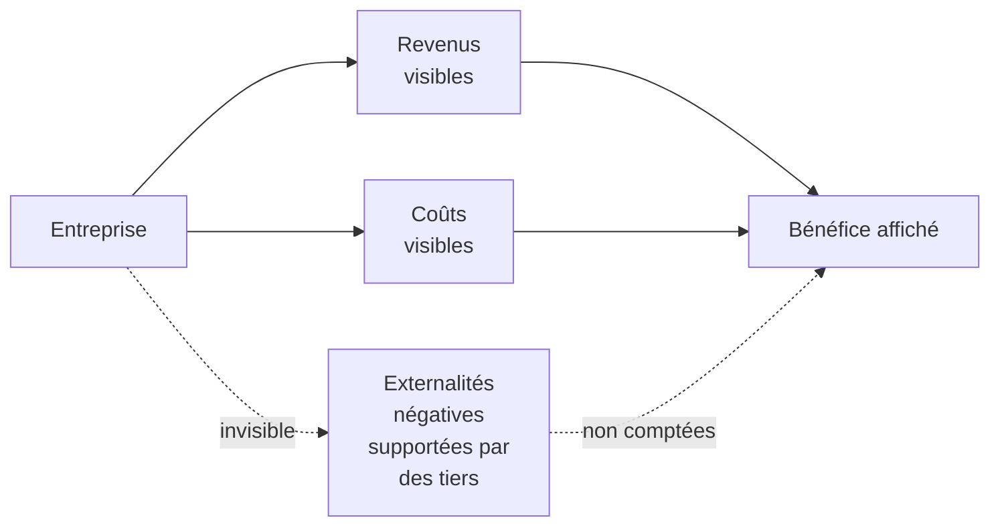
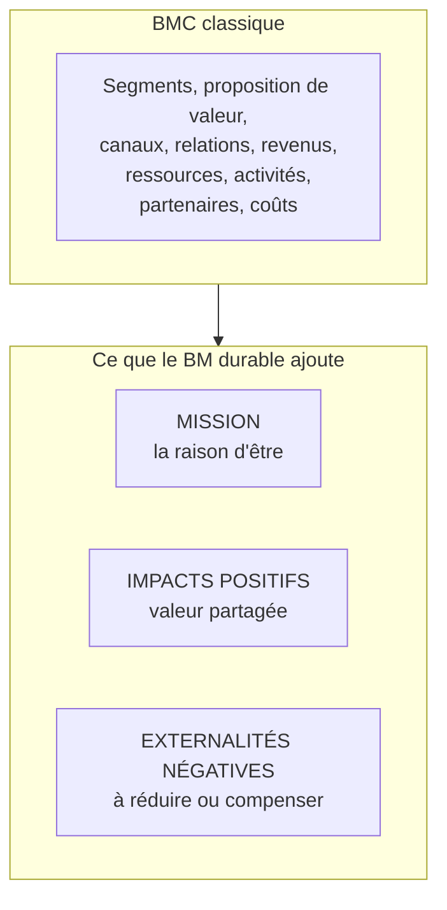

# Q5 — Comment transformer un business model en BM durable ? Quelles tensions court terme / long terme ?

> **La réponse en une phrase**
> On ne « verdit » pas un business model par touches : on repasse **chaque bloc** au filtre de la durabilité, on ajoute la mission, les impacts positifs et les externalités négatives — et on assume que le coût est immédiat alors que le bénéfice est différé.

---

## Partie 1 — Qu'est-ce qu'un business model, au juste

📘 Définition du cours : « Un business model décrit les **choix** d'une entreprise pour **générer des revenus**. Ces choix concernent les **ressources et les compétences** mobilisées pour formuler une **proposition de valeur**, l'**offre** faite aux clients et l'**organisation interne** de l'entreprise. »

Décortiquons cette phrase, car elle contient tout.

| Mot de la définition | Ce que ça veut dire |
|---|---|
| **Choix** | Ce n'est pas une description, c'est une décision. On aurait pu faire autrement |
| **Générer des revenus** | Un BM n'est pas une déclaration d'intention, il doit faire entrer de l'argent |
| **Ressources et compétences** | Ce qu'on a et ce qu'on sait faire |
| **Proposition de valeur** | Ce qu'on promet au client |
| **Offre** | Ce qu'on lui livre concrètement |
| **Organisation interne** | Comment on s'organise pour tenir la promesse |

🔎 Le point important : un business model relie **trois choses** — ce qu'on a, ce qu'on promet, et comment on est payé. Si ces trois choses ne tiennent pas ensemble, le modèle ne tient pas.

### Qu'est-ce qui change quand il devient « durable »

📘 Le cours répond : « Dans le cadre du Business Model Canvas (BMC), les **impacts positifs** et les **externalités négatives** sont des notions liées à la création de valeur **au-delà du seul aspect économique**. Une entreprise responsable cherche à :
> - **Maximiser les impacts positifs** (valeur partagée),
> - **Réduire ou compenser les externalités négatives** (via l'innovation, la réglementation interne, ou la compensation carbone par exemple). »

Le mot clé est « au-delà du seul aspect économique ». Le BM classique mesure une chose : l'argent. Le BM durable en mesure trois.

---

## Partie 2 — Le concept qu'il faut absolument comprendre : l'externalité négative

C'est le concept central de toute cette question. Si vous ne comprenez que ça, vous répondrez correctement.

### Définition en mots simples

Une externalité négative est un **coût réel, supporté par quelqu'un d'autre, et qui n'apparaît nulle part dans vos comptes**.

Exemples :
- Une usine rejette dans une rivière. Le coût est supporté par les pêcheurs en aval. Il n'est pas dans le compte de résultat de l'usine.
- Une banque supprime ses guichets. Le coût est supporté par les clients âgés en temps, en effort, en exclusion. Il n'est nulle part dans les comptes.
- Un appareil non réparable devient un déchet. Le coût est supporté par la collectivité.



### Pourquoi c'est le cœur du sujet

🔎 Un business model peut être rentable **parce que** ses externalités sont cachées. La rentabilité est alors partiellement une illusion comptable : elle vient de coûts que d'autres paient.

Transformer un BM en BM durable, c'est donc **internaliser** ces coûts : les faire rentrer dans les comptes, volontairement, avant que la loi ou un scandale ne les y fasse rentrer de force.

⚠️ Et c'est exactement pour ça que la transformation coûte à court terme : on ajoute au compte de résultat des coûts qui existaient déjà mais qu'on ne payait pas.

---

## Partie 3 — La méthode : la métamorphose bloc par bloc

📘 Votre cours fournit un document intitulé « La métamorphose du Business Model Canvas », construit en trois colonnes : Business Model Traditionnel / Business Model intégrant le Développement Durable / Nouvelles Pratiques DD.

Voici les blocs documentés dans ce tableau, avec le contenu du cours.

| Bloc | 📘 Traditionnel | 📘 Version durable |
|---|---|---|
| **Raison d'être** | « Orientée principalement vers la profitabilité sans intégration explicite de considérations environnementales ou sociales » | « Intégration d'une **mission** centrée sur l'impact environnemental et social positif » |
| **Segments de clients** | « Groupes de clients ciblés selon les besoins et les comportements sans considération spécifique pour la durabilité » | « Identification et ciblage de segments qui **valorisent la durabilité** et l'éthique » |
| **Propositions de valeur** | « Offre centrée sur la performance et le coût du produit/service » | « Produits ou services qui **minimisent l'impact environnemental**, utilisent des matériaux durables et offrent une plus-value sociale » |
| **Canaux** | « Optimisation des canaux pour la massification et la réduction des coûts, avec peu de considérations écologiques » | « Canaux qui **réduisent l'empreinte écologique**, comme l'e-commerce vert ou la distribution locale » |
| **Relations avec les clients** | « Basées principalement sur la transaction et la satisfaction client » | « Relations durables par la **transparence**, le partage d'informations sur la durabilité, et l'engagement communautaire » |

📘 Le document ajoute une colonne « Nouvelles Pratiques DD » qui donne les gestes concrets : définition et communication d'une mission d'entreprise, adoption de technologies propres, réduction des déchets, amélioration du bilan carbone, innovation dans le recyclage et l'économie circulaire, optimisation des chaînes logistiques pour réduire l'empreinte carbone et maximiser l'usage des ressources locales, programmes de fidélité et de sensibilisation.

### Ce que la métamorphose ajoute au canvas classique



🔎 Le geste intellectuel : on ne remplace pas le canvas, on lui ajoute **une ligne au-dessus** (la mission, qui oriente) et **une ligne en dessous** (les impacts, positifs et négatifs, qui mesurent la conséquence).

---

## Partie 4 — La méthode en cinq étapes

| Étape | Question à se poser | Sortie |
|---|---|---|
| 1. Cartographier l'existant | Comment gagne-t-on de l'argent aujourd'hui ? | Le BMC actuel, honnête |
| 2. Chercher les externalités | Qui paie pour nous, sans le savoir ? | Liste des coûts cachés |
| 3. Repasser chaque bloc | Ce bloc peut-il être fait autrement ? | Le BMC version durable |
| 4. Vérifier la cohérence | Le modèle génère-t-il encore des revenus ? | Un modèle viable, pas un vœu |
| 5. Poser les arbitrages | Qu'est-ce qu'on accepte de perdre, et quand ? | Le plan de transition |

⚠️ L'étape 4 est celle qu'on oublie. 📘 Rappel de la définition : un business model décrit les choix pour **générer des revenus**. Un « BM durable » qui ne gagne pas d'argent n'est pas un business model, c'est une association.

---

## Partie 5 — Les tensions court terme / long terme

C'est la deuxième moitié de la question, et elle vaut autant que la première.

### La structure du problème

```
Coûts et bénéfices dans le temps

Aujourd'hui   ████████████████ COÛT (investissement, formation, certification)
Année 1       ████████         coût résiduel
Année 2       ███              ▲ premiers bénéfices
Année 3       ▲▲▲▲▲            bénéfices : réputation, conformité, risque évité
Année 5       ▲▲▲▲▲▲▲▲▲▲       avantage concurrentiel installé
```

🔎 Le problème n'est pas que la durabilité coûte. C'est que **le coût et le bénéfice ne tombent pas au même moment**. Et les mécanismes de décision d'une entreprise sont calés sur l'exercice annuel.

### Les quatre tensions à nommer

| Tension | Le court terme dit | Le long terme dit |
|---|---|---|
| **Investissement / retour** | « Cet argent, on l'a maintenant » | « Sans ça on n'existera plus dans 10 ans » |
| **Coût / réputation** | « Ça augmente notre prix de revient » | « Ça crée une préférence de marque » |
| **Actionnaires / résilience** | « Le dividende de cette année » | « La capacité à traverser un choc réglementaire » |
| **Conformité minimale / avance** | « La loi ne l'exige pas encore » | « Elle l'exigera, autant s'y préparer sans urgence » |

### Comment résoudre la tension, plutôt que de la subir

🔎 Trois leviers, du plus faible au plus fort :

1. **Chiffrer le risque évité.** Une mise en conformité anticipée coûte moins qu'une mise en conformité subie. Le calcul comparatif rend le long terme visible aujourd'hui.
2. **Trouver le gain immédiat.** Certaines actions durables paient tout de suite : réduire la consommation d'énergie, allonger la durée de vie du matériel, réduire les déchets. On commence par celles-là pour financer les suivantes.
3. **Reformuler le dilemme.** Ce n'est pas *rentabilité contre durabilité*, c'est *rentabilité de court terme contre rentabilité de long terme*. Formulé ainsi, le dilemme se dissout en partie.

📘 Le lien avec l'outil d'évaluation du cours : le **SAF** (Souhaitabilité, Acceptabilité, Faisabilité). 📘 Le cours précise pour l'acceptabilité : « Le retour attendu est-il acceptable ? Le niveau de risque est-il acceptable ? Les parties prenantes vont-elles s'opposer à la stratégie ? »

🔎 La tension court/long terme est donc précisément un **problème d'acceptabilité** au sens du SAF. Le nommer ainsi montre que vous reliez les outils entre eux. Voir [[Q10_Integrer_les_parties_prenantes]].

---

## Partie 6 — Exemple complet

**L'entreprise.** Un fabricant suisse de mobilier de bureau, 80 personnes.

### BMC actuel

| Bloc | Situation |
|---|---|
| Proposition de valeur | Mobilier design à prix compétitif |
| Segments | Entreprises, budget serré, renouvellement tous les 7 ans |
| Canaux | Revendeurs, livraison sous-traitée |
| Ressources | Atelier, bois importé, 12 machines |
| Revenus | Vente unitaire |
| Coûts | Matières, main-d'œuvre, transport |

### Étape 2 — les externalités négatives identifiées

| Externalité | Qui la supporte |
|---|---|
| Bois issu de forêts non gérées durablement | Les écosystèmes et les communautés locales |
| Mobilier non réparable, jeté après 7 ans | La collectivité qui traite les déchets |
| Transport aval en camion peu rempli | L'atmosphère |

### Étape 3 — la métamorphose bloc par bloc

| Bloc | Version durable |
|---|---|
| Raison d'être | Mission : du mobilier qui dure 25 ans, pas 7 |
| Proposition de valeur | Mobilier réparable, pièces détachées garanties 15 ans, reprise en fin de vie |
| Segments | Entreprises et collectivités sensibles au coût total de possession et aux marchés publics responsables |
| Canaux | Distribution régionale, livraison mutualisée |
| Ressources | Bois certifié, conception modulaire |
| Revenus | Vente **plus** location longue durée **plus** service de reconditionnement |
| Coûts | Matière plus chère, mais moins de SAV et fidélisation |

🔎 Regardez la ligne Revenus. C'est là que le modèle devient viable : si vous fabriquez du mobilier qui dure 25 ans, vous vendez moins souvent. Il faut donc **une autre source de revenus** — la location et le reconditionnement. Sans ça, la durabilité tue le modèle.

⚠️ C'est le raisonnement le plus fort de cette fiche : **un produit plus durable réduit mécaniquement la fréquence d'achat**. Un BM durable doit donc résoudre ce problème, sinon il est suicidaire. C'est là qu'intervient le passage de la vente d'un bien à la vente d'un usage.

### Étape 5 — les arbitrages assumés

| Ce qu'on perd | Quand | Ce qu'on gagne | Quand |
|---|---|---|---|
| Marge unitaire sur la matière | Immédiatement | Accès aux marchés publics responsables | 1 à 2 ans |
| Volume de ventes de remplacement | 5 à 7 ans | Revenus récurrents de location et reconditionnement | 3 ans et au-delà |
| Investissement en conception modulaire | Immédiatement | Différenciation difficile à copier | 2 ans et au-delà |

---

## Les pièges

> [!danger] Erreurs classiques
> 1. **Lister les blocs sans montrer l'arbitrage.** La question demande explicitement les tensions.
> 2. **Oublier les revenus.** 📘 Un business model décrit les choix pour générer des revenus. Un modèle qui ne gagne rien n'est pas un modèle.
> 3. **Ne pas nommer les externalités négatives.** C'est le concept central et il est dans le cours.
> 4. **Verdir un seul bloc.** La métamorphose passe par tous les blocs, sinon c'est du greenwashing. Voir [[Q15_Le_greenwashing]].
> 5. **Oublier la mission.** 📘 Le document du cours commence par la raison d'être : c'est le bloc qui oriente tous les autres.

## À retenir

| | |
|---|---|
| **Définition 📘** | Le BM décrit les choix pour générer des revenus : ressources, proposition de valeur, offre, organisation |
| **Ce que la durabilité ajoute 📘** | Mission, impacts positifs (valeur partagée), externalités négatives à réduire ou compenser |
| **Méthode** | Passer chaque bloc au filtre, sans oublier la ligne des revenus |
| **La tension centrale** | Coût immédiat, bénéfice différé |
| **La reformulation gagnante** | Pas rentabilité contre durabilité, mais court terme contre long terme |
| **Outil de validation** | SAF, et notamment le critère d'acceptabilité |
