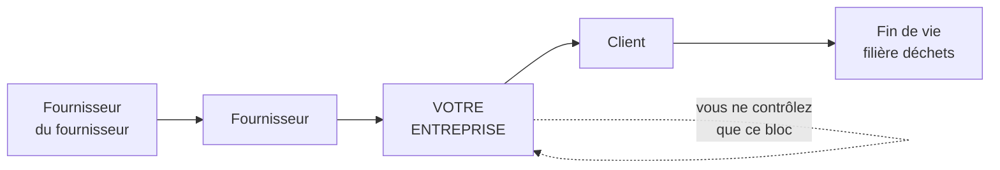
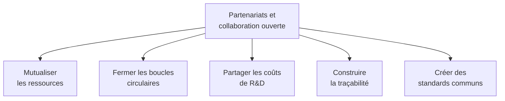

# Q6 — En quoi la collaboration ouverte et les partenariats soutiennent-ils une stratégie durable ?

> **La réponse en une phrase**
> Parce que les problèmes de durabilité sont **structurellement trop grands pour une entreprise seule** : ils dépassent son périmètre, ses moyens et son cycle de décision — la coopération n'est donc pas une option morale, c'est une nécessité technique.

---

## Partie 1 — Partir du problème, pas de la solution

La plupart des réponses à cette question commencent par « les partenariats permettent de mutualiser ». C'est vrai mais c'est faible, parce que ça ne dit pas **pourquoi il le faut**.

Commençons par le vrai point de départ : il existe des problèmes qu'une entreprise ne peut pas résoudre seule, même si elle le veut, même si elle a de l'argent.

### Les trois raisons structurelles

**Raison 1 — Le périmètre de la durabilité dépasse celui de l'entreprise.**

📘 Rappel de la définition du cours : la chaîne de valeur en durabilité couvre « l'ensemble des activités, **depuis les matières premières jusqu'au recyclage ou à la fin de vie** d'un produit/service ».

Or l'extraction des matières premières se passe chez un fournisseur du fournisseur. La fin de vie se passe chez le client. Vous ne contrôlez ni l'un ni l'autre.

🔎 Conclusion immédiate : pour agir sur ce que vous ne contrôlez pas, il n'existe que deux moyens — la contrainte contractuelle (les achats, voir [[Q04_Reduire_lempreinte_carbone_via_la_chaine_de_valeur]]) et le **partenariat**.

**Raison 2 — Certaines boucles ne se ferment qu'à plusieurs.**

L'économie circulaire suppose que le déchet de l'un devienne la ressource de l'autre. Une entreprise seule ne peut pas fermer une boucle : elle produit un déchet qu'elle ne sait pas utiliser.

📘 Le cours 5 décrit l'économie circulaire des appareils numériques comme « l'extension de la vie utile des appareils numériques par le biais d'une amélioration de la fabrication et de la réutilisation ». Réutiliser suppose quelqu'un qui reprend, reconditionne et redistribue. C'est un acteur tiers.

**Raison 3 — Les coûts de la transition dépassent la capacité d'un seul acteur.**

Développer un matériau de substitution, une filière de recyclage, une norme de traçabilité : ce sont des investissements que peu d'entreprises peuvent porter seules et dont le bénéfice se diffuse à tout le secteur.

---

## Partie 2 — L'ancrage institutionnel : l'ODD 17

📘 Le cours durabilité pose le cadre : « Le 25 septembre 2015, les 193 États membres de l'ONU ont adopté l'Agenda 2030 de développement durable. Les **17 objectifs de développement durable (ODD)** et leurs **169 cibles** forment la clé de voûte de l'Agenda 2030. »

📘 Et surtout : « Les ODD s'articulent autour des **5P : Populations, Planète, Prospérité, Paix et Partenariats**. »

🔎 Retenez ce détail : le partenariat n'est pas un moyen parmi d'autres dans l'architecture onusienne, c'est **l'un des cinq piliers**. Le dernier ODD, le 17, porte précisément sur les partenariats pour la réalisation des objectifs.

Autrement dit : l'ONU a jugé que les 16 premiers objectifs étaient inatteignables sans le dix-septième. C'est une reconnaissance officielle du fait qu'aucun acteur ne peut y arriver seul.

---

## Partie 3 — Les cinq bénéfices concrets

Maintenant qu'on sait pourquoi il le faut, voici ce que ça apporte.

### 1. Mutualiser les ressources et les savoirs

**Comment.** Une PME seule ne peut pas s'offrir un expert en analyse de cycle de vie. Cinq PME du même secteur, si.

**Lien avec le cours.** 📘 Le diagnostic interne commence par lister « l'ensemble des ressources matérielles et immatérielles ». Le partenariat élargit ce que vous pouvez mobiliser sans le posséder.

### 2. Fermer les boucles de l'économie circulaire

**Comment.** Le résidu de production de l'un devient la matière première de l'autre. La logistique de retour est mutualisée.

**Pourquoi c'est impossible seul.** Une boucle a par définition au moins deux extrémités. Voir [[Q18_Economie_circulaire_des_appareils_numeriques]].

### 3. Partager les coûts et les risques de la R&D durable

**Comment.** Développer un emballage réutilisable, une filière de matière recyclée, un protocole d'échange de données.

🔎 Le raisonnement économique : si le résultat bénéficie à tout le secteur, aucune entreprise n'a intérêt à le financer seule. C'est un problème classique de bien collectif. Le partenariat est la réponse.

### 4. Construire la traçabilité

**Comment.** Aucune entreprise ne peut tracer une chaîne d'approvisionnement toute seule : elle ne voit que son fournisseur direct. La traçabilité complète suppose que chaque maillon partage l'information.

Voir [[Q12_Transparence_labels_et_positionnement]] et [[Q19_Blockchain_et_tracabilite_durable]].

### 5. Créer des standards et des labels crédibles

📘 Le cours 5 liste des labels IT : TCO certified, Ecolabel européen, Energy Star, EPEAT, Der blaue Engel, ainsi que les normes ISO 14'024, 14'021 et 14'025.

🔎 Regardez ce que ces labels ont en commun : aucun n'est le label d'une entreprise. Ce sont des constructions collectives. Un label auto-décerné ne vaut rien — c'est même la définition du greenwashing.

---

## Partie 4 — La coopétition, ou coopérer avec ses concurrents

📚 *Complément théorique hors cours.* Le terme « coopétition » ne figure pas dans vos slides. Présentez-le comme un apport extérieur.

**L'idée.** Deux entreprises restent concurrentes sur le marché, mais coopèrent sur un terrain précis où la concurrence ne sert personne.

**Pourquoi c'est rationnel.** Sur quoi se concurrence-t-on ? Sur le produit, le prix, le service. Pas sur la norme de recyclage ou la logistique de retour. Ces domaines sont des **coûts communs**, pas des terrains de différenciation.

| Terrain | On se concurrence ? | Pourquoi |
|---|---|---|
| Prix, produit, service client | ✅ Oui | C'est là que se joue la préférence du client |
| Filière de collecte des déchets | ❌ Non | Aucun client ne choisit une marque pour sa benne |
| Norme de traçabilité | ❌ Non | Une norme n'a de valeur que si tout le monde l'applique |
| Formation aux métiers du secteur | ❌ Non | La pénurie de compétences frappe tout le monde |

🔎 La règle simple : **on coopère sur ce qui ne fait pas vendre, on se concurrence sur ce qui fait vendre**.

---

## Partie 5 — Les limites, à ne pas oublier

Une réponse à sens unique est incomplète. Voici les difficultés réelles.

| Limite | En quoi c'est un problème |
|---|---|
| Coût de coordination | Réunir cinq acteurs prend du temps et de l'énergie ; parfois plus que le gain |
| Passager clandestin | Certains bénéficient du travail collectif sans y contribuer |
| Partage d'information sensible | Tracer une chaîne suppose de révéler ses fournisseurs et ses marges |
| Dilution de la responsabilité | Quand tout le monde est responsable, personne ne l'est |
| Risque de cartel | ⚠️ Coopérer entre concurrents a des limites juridiques strictes en droit de la concurrence |

🔎 La dernière ligne est un point de nuance apprécié : la coopétition doit rester sur le terrain de la durabilité et ne jamais toucher aux prix ou aux volumes, sous peine d'entente illicite.

---

## Partie 6 — Exemple complet

**La situation.** Cinq PME genevoises de services numériques, entre 10 et 40 salariés. Chacune a le même problème : un parc informatique renouvelé trop vite, sans filière de réemploi.

### Ce qu'aucune ne peut faire seule

| Obstacle | Pourquoi seule c'est impossible |
|---|---|
| Négocier des critères TCO avec un fournisseur | 12 machines par an ne donnent aucun poids de négociation |
| Monter une filière de reconditionnement | Le volume est trop faible pour être rentable |
| Financer un expert en éco-conception | Le coût dépasse la capacité d'une PME de 12 personnes |

### Ce que le partenariat rend possible

| Action collective | Mécanisme |
|---|---|
| Centrale d'achat commune avec cahier des charges TCO | 200 machines par an, le fournisseur écoute |
| Contrat unique avec un reconditionneur régional | Le volume rend la filière viable |
| Formation mutualisée à l'éco-conception et à l'accessibilité | Coût divisé par cinq |
| Charte commune, vérifiée par un tiers | Crédibilité impossible à obtenir seul |

### La sortie stratégique

🔎 Le résultat n'est pas seulement environnemental. Les cinq PME obtiennent ensemble ce qui, individuellement, était hors de portée : un argument de différenciation face aux grandes agences, et un accès aux marchés publics exigeant des critères responsables.

Le partenariat transforme donc une **faiblesse partagée** (la petite taille) en **force collective**. C'est exactement le genre de raisonnement qu'un SWOT bien croisé fait apparaître. Voir [[Q03_La_durabilite_comme_force_dans_un_SWOT]].

---

## Les pièges

> [!danger] Erreurs classiques
> 1. **Dire « il faut collaborer » sans dire pourquoi c'est nécessaire.** La force de la réponse est dans la raison structurelle : le périmètre dépasse l'entreprise.
> 2. **Oublier l'ancrage ODD.** 📘 Partenariats est l'un des 5P, et l'ODD 17 porte exactement là-dessus.
> 3. **Ne pas mentionner les limites.** Coûts de coordination, passager clandestin, droit de la concurrence.
> 4. **Présenter la coopétition comme du cours.** 📚 Ce mot ne figure pas dans vos slides.
> 5. **Oublier le lien avec la circularité.** Une boucle a besoin d'au moins deux acteurs, c'est l'argument le plus concret.

## À retenir

| | |
|---|---|
| **La raison de fond** | 📘 Le périmètre de la durabilité va des matières premières à la fin de vie, il dépasse l'entreprise |
| **Ancrage 📘** | 17 ODD, 169 cibles, 5P dont **Partenariats** ; l'ODD 17 y est consacré |
| **Cinq bénéfices** | Mutualiser, fermer les boucles, partager la R&D, tracer, standardiser |
| **Coopétition 📚** | On coopère sur ce qui ne fait pas vendre |
| **Limites** | Coordination, passager clandestin, information sensible, droit de la concurrence |
