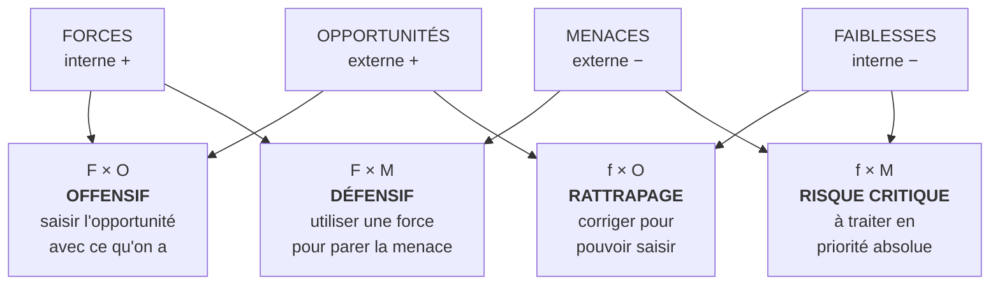
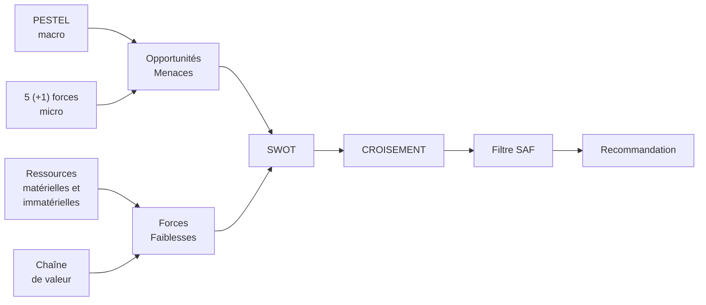

# Q6 — Comment passe-t-on d'un SWOT à une recommandation ?

> **La réponse en une phrase**
> Par le **croisement** : un SWOT rempli n'est qu'un inventaire ; la stratégie naît quand on met une force en face d'une opportunité, ou une faiblesse en face d'une menace — et qu'on filtre le résultat par le SAF.

---

## Partie 1 — Pourquoi un SWOT rempli ne sert à rien

C'est le point de départ, et il est brutal.

Un SWOT donne quatre listes. Quatre listes ne disent pas quoi faire. Elles décrivent une situation.

```
Ce qu'on rend habituellement          Ce qui produit une décision

Forces      : F1, F2, F3              F2 × O1 → stratégie offensive
Faiblesses  : f1, f2                  f1 × M2 → risque prioritaire
Opportunités: O1, O2                  F3 × M1 → stratégie défensive
Menaces     : M1, M2, M3              f2 × O2 → chantier de rattrapage

= un état des lieux                   = quatre pistes d'action
```

🔎 **Le raisonnement fondateur** : une stratégie est toujours une **mise en relation entre l'intérieur et l'extérieur**. Une force n'a d'intérêt que si elle sert à saisir quelque chose. Une faiblesse n'est grave que s'il existe une menace qui l'exploite.

⚠️ C'est pour ça que le SWOT a deux dimensions et pas une : interne / externe, et positif / négatif. Le croisement se fait toujours entre les deux dimensions internes et les deux externes.

---

## Partie 2 — Les quatre croisements



| Croisement | Question | Type de décision |
|---|---|---|
| **Force × Opportunité** | Quelle force nous permet de saisir quelle opportunité ? | Là où on investit — c'est la stratégie principale |
| **Force × Menace** | Quelle force nous protège de quelle menace ? | Défense, résilience |
| **Faiblesse × Opportunité** | Quelle faiblesse nous empêche de saisir une opportunité ? | Chantier de rattrapage, avec un calendrier |
| **Faiblesse × Menace** | Où sommes-nous vulnérables et attaqués en même temps ? | **Priorité absolue** — c'est là qu'on meurt |

🔎 Le dernier croisement est le plus important et le moins fait. Une faiblesse seule est gérable, une menace seule est supportable ; leur rencontre est ce qui tue une entreprise.

---

## Partie 3 — D'où vient le contenu de chaque case

📘 Le cours 3 résume la construction :
> « Le **SWOT** pour le diagnostic interne (forces/faiblesses) et externe (opportunités/menaces). Le **PESTEL** pour analyser le macro-environnement (diagnostic externe). Les **5 forces de Porter** pour analyser le micro-environnement (diagnostic externe). »

📘 Et pour l'interne, cours 3 : « Analyse des ressources matérielles et immatérielles. Analyse de la chaîne de valeur. »



⚠️ Erreur fréquente : remplir le SWOT directement, sans passer par les outils. Résultat : des cases remplies d'impressions au lieu d'analyses.

---

## Partie 4 — Le dernier filtre : le SAF

Le croisement produit des **pistes**, pas encore une recommandation. Il faut les trier.

📘 Le cours 1 : « **Acceptabilité.** Cette partie du test porte sur l'attractivité de la stratégie proposée auprès des parties prenantes, en prenant en compte leurs intérêts et pouvoirs d'influence […] Le retour attendu est-il acceptable ? Le niveau de risque est-il acceptable ? Les parties prenantes vont-elles s'opposer à la stratégie ? »

🔎 Enchaînement complet : **diagnostic → SWOT → croisement → SAF → recommandation**. Chaque étape a une fonction distincte. Sauter le croisement donne un rapport descriptif ; sauter le SAF donne une recommandation indéfendable.

Voir [[Q05_La_grille_SAF]].

---

## Partie 5 — Ce qu'une recommandation doit contenir

📘 Le cours durabilité donne le format attendu : « Choisissez une orientation : Différenciation, Focalisation, Innovation durable. Formulez **1 objectif SMART**. **Plan d'action** : proposez **2 actions concrètes, 1 indicateur de suivi**. Les objectifs doivent guider la stratégie et être mesurables. »

| Élément | Rôle |
|---|---|
| Une orientation | Le choix, avec son renoncement |
| Un objectif SMART | Ce qu'on vise, mesurable et daté |
| Deux actions concrètes | Ce qu'on fait, de façon vérifiable |
| Un indicateur de suivi | Comment on saura si ça marche |

⚠️ Une recommandation sans indicateur n'est pas vérifiable, donc pas pilotable.

---

## Partie 6 — Exemple complet

**L'entreprise.** Un torréfacteur genevois, 25 personnes.

### Le SWOT

| | Positif | Négatif |
|---|---|---|
| **Interne** | Relations directes avec 4 coopératives depuis 12 ans ; emballages compostables développés en interne | Aucun bilan carbone ; transport aval non optimisé |
| **Externe** | Clientèle genevoise sensible à l'origine ; marchés publics exigeant des critères responsables | Prix du café en hausse ; concurrents qui communiquent fortement sur leur engagement |

### Les croisements

| Croisement | Piste dégagée |
|---|---|
| **F** relations directes **× O** clientèle sensible à l'origine | Différenciation par la traçabilité prouvée |
| **F** emballages compostables **× O** marchés publics | Candidater aux appels d'offres à critères environnementaux |
| **f** pas de bilan carbone **× M** concurrents qui communiquent | ⚠️ **Risque critique** : on est plus vertueux qu'eux et on ne peut pas le démontrer |
| **f** transport aval **× M** prix en hausse | Optimiser les tournées pour absorber la hausse |

🔎 Le troisième croisement est le plus révélateur : l'entreprise a la **substance** sans la **preuve**, ses concurrents ont la preuve sans la substance. Le chantier prioritaire n'est donc pas de devenir plus durable, c'est de **rendre mesurable** ce qui l'est déjà.

### Le filtre SAF sur la piste retenue

| Critère | Analyse |
|---|---|
| Souhaitabilité | ✅ Cohérent avec l'identité de l'entreprise et son historique |
| Acceptabilité | ✅ Coût modéré ; les producteurs partenaires y gagnent en visibilité |
| Faisabilité | ⚠️ Aucune compétence interne en bilan carbone → recourir à un prestataire ou mutualiser |

### La recommandation finale

| Élément | Contenu |
|---|---|
| Orientation | Différenciation par la traçabilité prouvée |
| Objectif SMART | Publier un bilan carbone vérifié et une traçabilité complète de 100 % des lots d'ici 12 mois |
| Action 1 | Mandater un prestataire pour le bilan carbone, avec deux indicateurs (intensité et absolu) |
| Action 2 | Documenter et publier l'origine, le prix payé et les conditions pour chaque coopérative |
| Indicateur | Part des lots tracés de bout en bout ; kg CO₂ par kg de café **et** tonnes CO₂ totales |

---

## Les pièges

> [!danger] Erreurs classiques
> 1. **Rendre un SWOT rempli.** Quatre listes ne sont pas une analyse.
> 2. **Croiser interne avec interne.** Le croisement se fait toujours interne × externe.
> 3. **Oublier le croisement faiblesse × menace.** C'est le plus dangereux.
> 4. **Sauter le SAF.** Une piste n'est pas une recommandation.
> 5. **Oublier l'indicateur.** 📘 Le cours l'exige explicitement.
> 6. **Remplir le SWOT sans passer par PESTEL, Porter, ressources et chaîne de valeur.**

## À retenir

| | |
|---|---|
| **L'enchaînement** | Diagnostic → SWOT → croisement → SAF → recommandation |
| **Les 4 croisements** | F×O offensif, F×M défensif, f×O rattrapage, f×M risque critique |
| **La règle** | Toujours interne × externe |
| **Format attendu 📘** | Orientation + 1 objectif SMART + 2 actions + 1 indicateur |
| **Le piège n°1** | S'arrêter au tableau rempli |
