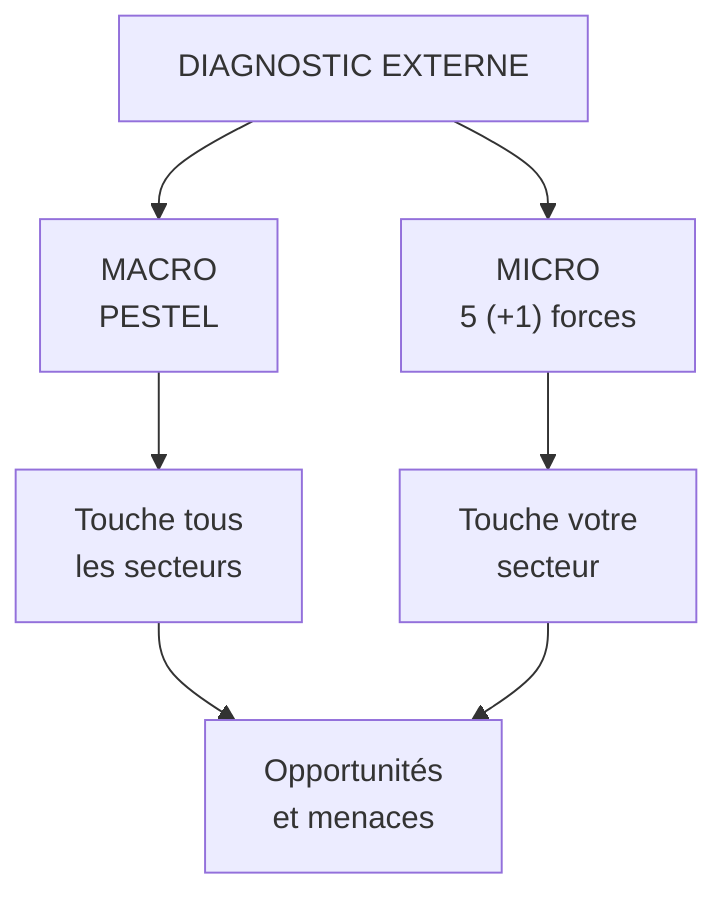

# Q7 — Citez et expliquez les six dimensions du PESTEL, version du cours

> **La réponse en une phrase**
> Six familles de forces extérieures que l'entreprise **subit sans pouvoir les modifier** — et dans votre cours, la cinquième porte trois noms différents selon la slide, ce qu'il faut savoir dire.

---

## Partie 1 — La liste exacte, telle qu'elle figure dans vos slides

📘 Cours 2, slide « Le PESTEL » : « Appréhender l'environnement à l'aide de **six facteurs** :
> 1) Politique
> 2) Economique
> 3) Sociétaux (ou socioculturels)
> 4) Technologique
> 5) **Ethique**
> 6) Légal »

⚠️ Vous avez bien lu : le point 5 dit **Éthique**, pas Écologique.

### Les trois variantes du « E », toutes dans vos supports

| Source 📘 | Ce que dit le cinquième facteur |
|---|---|
| Cours 2, slide « Le PESTEL » | **Éthique** |
| Cours 2, tableau Opportunités / Menaces | **Écologique** |
| Cours durabilité, exercice PESTEL | « Facteurs **environnemental et éthique** » |

🔎 **Que faire à l'oral** : traiter le E comme couvrant les deux — écologique et éthique — parce que c'est ce que fait la troisième source, qui est la plus récente et la plus explicite. Et signaler la variante si on vous interroge : cela prouve que vous avez lu les sources et pas une synthèse.

---

## Partie 2 — Ce que le PESTEL est, et ce qu'il n'est pas

### Sa place dans la démarche

📘 Le cours 2 : « Établir un **Diagnostic Externe**. Analyse de l'environnement au niveau **macroéconomique** : méthode PESTEL. Analyse de l'environnement au niveau **microéconomique** : 5 (+1) forces de Porter. »

### Le test qui évite l'erreur la plus fréquente

🔎 **Si je changeais de secteur, ce facteur me suivrait-il ?**
- Une inflation générale touche la boulangerie, le garage et la banque → macro → PESTEL.
- Un nouveau concurrent boulanger ne touche que les boulangers → micro → Porter.
- « Notre équipe manque de compétences » → interne → diagnostic interne, pas PESTEL.

---

## Partie 3 — Les six facteurs, un par un

📘 Pour chaque facteur, je cite la consigne exacte du cours durabilité, qui est la formulation la plus opérationnelle de vos supports.

### P — Politique

📘 « Identifiez les **lois, réglementations ou politiques gouvernementales** qui influencent la mise en œuvre des mesures. »

📘 Le cours 2 précise le rôle de l'État : le gouvernement est « protecteur des intérêts individuels, locaux et nationaux », « en particulier dans le cadre d'**accords avec d'autres gouvernements** portant sur les relations commerciales (import-export) et les investissements étrangers », accords qui « s'inscrivent dans le cadre de relations **bilatérales, mondiales et régionales** ».

⚠️ Ne confondez pas P et L. Le politique, c'est l'**orientation** et la volonté d'agir. Le légal, c'est le **texte** qui existe et s'impose. Une subvention annoncée est politique ; une norme en vigueur est légale.

### E — Économique

📘 « Évaluez l'**impact économique** des mesures sur les secteurs clés comme l'énergie ou l'industrie. »

Ce qu'on y met : croissance, inflation, taux d'intérêt, prix de l'énergie et des matières, taux de change, pouvoir d'achat, accès au financement.

### S — Sociétaux ou socioculturels

📘 « Analysez l'**acceptation sociale** et les changements de comportement nécessaires en matière de consommation durable. »

Ce qu'on y met : démographie, valeurs, modes de vie, attentes, niveau d'éducation, rapport au travail.

🔎 Le facteur S est le plus lent et le plus puissant : les changements de valeurs mettent une génération à s'installer, et ne se renversent pas.

### T — Technologique

📘 « Déterminez les **innovations technologiques à encourager** pour appuyer la stratégie. »

⚠️ Notez le verbe « encourager ». Dans la version durabilité du cours, la technologie n'est pas seulement subie : elle est un levier qu'on choisit d'activer.

### E — Éthique / Écologique / environnemental et éthique

📘 « Évaluez les **engagements environnementaux et éthiques** (ex. : protection de la biodiversité). »

Ce qu'on y met : contraintes climatiques, ressources, biodiversité, mais aussi bien-être animal, conditions de travail dans la chaîne amont, attentes morales de la société.

🔎 La fusion des deux n'est pas un accident : dans la plupart des secteurs, l'écologique et l'éthique sont indissociables. Le travail des enfants dans une mine de cobalt est un problème éthique ; l'extraction elle-même est un problème écologique ; c'est la même mine.

### L — Légal

📘 « Vérifiez la **conformité** des mesures avec les réglementations nationales et internationales. »

Ce qu'on y met : droit du travail, normes produits, protection des données, propriété intellectuelle, droit de la concurrence, obligations de reporting.

---

## Partie 4 — L'étape que tout le monde saute : qualifier

📘 Le cours 2 donne le tableau de sortie, et il a **deux colonnes** :

| | Opportunités | Menaces |
|---|---|---|
| Politique | | |
| Economique | | |
| Socioculturel | | |
| Technologique | | |
| Ecologique | | |
| Légal | | |

⚠️ Un PESTEL n'est pas six listes : c'est un tableau à deux colonnes. Chaque facteur doit être **qualifié** en opportunité ou en menace — et parfois les deux, ce qui est en soi une information stratégique.

🔎 Exemple : « végétarisme en progression » est une menace pour un producteur de charcuterie et une opportunité pour le même s'il lance une gamme végétale. Le même fait, deux qualifications, selon la position.

---

## Partie 5 — Exemple express, secteur de l'hôtellerie genevoise

| Facteur | Élément | O ou M |
|---|---|---|
| **P** | Politique de promotion touristique cantonale | Opportunité |
| **E** | Franc fort, coût pour la clientèle étrangère | Menace |
| **S** | Attentes de séjours plus longs et plus locaux | Opportunité |
| **T** | Plateformes de réservation qui captent la marge | Menace |
| **E** (éco-éthique) | Attentes sur l'empreinte des séjours ; conditions de travail dans l'hôtellerie | Menace, opportunité si on prend l'avance |
| **L** | Réglementation sur les locations de courte durée | Opportunité (limite la concurrence informelle) |

🔎 **La conclusion à formuler** : ici deux facteurs dominent en sens contraires — l'économique pousse à comprimer les coûts, l'éco-éthique pousse à investir. C'est cette tension qui est la vraie sortie du PESTEL, pas la liste.

---

## Les pièges

> [!danger] Erreurs classiques
> 1. **Dire « Écologique » sans savoir que votre slide dit « Éthique ».** Connaissez les trois variantes.
> 2. **Lister sans qualifier.** 📘 Le tableau du cours a deux colonnes.
> 3. **Mettre du micro dans le PESTEL.** Un concurrent n'est pas un facteur macro.
> 4. **Mettre de l'interne dans le PESTEL.** Un manque de compétences est une faiblesse.
> 5. **Confondre P et L.** Orientation politique ≠ texte en vigueur.
> 6. **Ne pas hiérarchiser.** Trente facteurs sans priorité ne permettent aucune décision.

## À retenir

| | |
|---|---|
| **Liste 📘** | Politique, Économique, Sociétaux (socioculturels), Technologique, **Éthique**, Légal |
| **Les 3 variantes du E 📘** | Éthique / Écologique / environnemental et éthique |
| **Niveau** | Macro-environnement, diagnostic externe |
| **Sortie obligatoire 📘** | Un tableau Opportunités / Menaces |
| **Le test macro** | Ce facteur me suivrait-il si je changeais de secteur ? |
