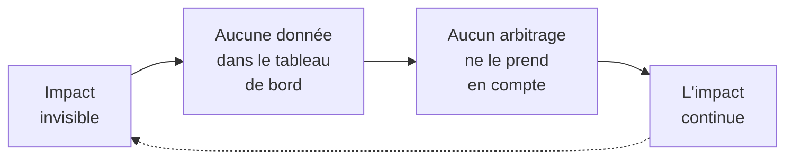
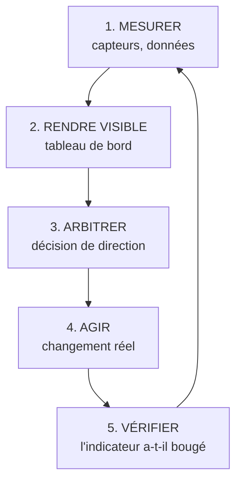

# Q7 — Comment le numérique permet-il de mesurer et piloter l'impact écologique ?

> **La réponse en une phrase**
> Le numérique rend **visible** un impact qui était invisible, et c'est cette visibilité qui le rend **pilotable** — mais une mesure qui ne déclenche aucune décision est un coût pur, pas un progrès.

---

## Partie 1 — Pourquoi l'impact écologique est invisible par défaut

C'est le point de départ, et il est plus profond qu'il n'y paraît.

### Le problème de l'invisibilité

📘 Le document de cours sur le donut l'explique très bien à propos du numérique : « l'impact environnemental du numérique est souvent difficile à percevoir, car il repose sur des **infrastructures éloignées et invisibles**, comme les centres de données, les réseaux et les serveurs ».

Trois raisons rendent l'impact invisible :

| Raison | Explication | Exemple |
|---|---|---|
| **Éloignement géographique** | L'impact a lieu ailleurs | Le serveur est en Irlande, l'usine en Asie |
| **Éloignement temporel** | L'impact a eu lieu avant, ou aura lieu après | Le carbone incorporé d'un ordinateur, les déchets dans 5 ans |
| **Absence de prix** | Ce qui n'est pas facturé n'apparaît nulle part | 📘 Les externalités négatives |

🔎 Conséquence : un dirigeant de bonne foi peut prendre des décisions destructrices sans le savoir. Ce n'est pas un problème de volonté, c'est un problème d'information.

### La règle fondamentale

> **On ne pilote pas ce qu'on ne mesure pas.**

Ce n'est pas un slogan, c'est une contrainte mécanique de gestion. Une entreprise décide sur la base de ses tableaux de bord. Si le carbone n'est pas dans le tableau de bord, il n'entre dans aucune décision, quelle que soit la sincérité de la direction.



---

## Partie 2 — Les cinq outils numériques de mesure

### 1. Les capteurs

**Ce qu'ils font.** Transformer un phénomène physique en donnée : consommation électrique d'une machine, température d'un local, remplissage d'un camion, débit d'eau.

**Pourquoi c'est fondateur.** Sans capteur, la mesure repose sur des factures mensuelles agrégées. On sait combien on a consommé au total, pas où ni quand. Le capteur passe du **global** au **localisé**.

🔎 C'est la différence entre savoir que votre entreprise a consommé 400 MWh l'an dernier et savoir que la machine 7 consomme 40 % du total en veille la nuit. Seule la deuxième information permet d'agir.

### 2. Les tableaux de bord carbone

**Ce qu'ils font.** Agréger les données en indicateurs suivis dans le temps.

**Pourquoi ça compte.** 📘 La case Infrastructures de la chaîne de valeur regroupe « la direction générale et autres fonctions communément appelées support ». C'est là que se prennent les arbitrages. Tant que le carbone n'atteint pas ce niveau, il reste un sujet technique.

⚠️ Point de méthode capital : le tableau de bord doit contenir **deux types d'indicateurs**.

| Type | Exemple | Ce qu'il dit | Risque s'il est seul |
|---|---|---|---|
| Intensité | kg CO₂ par produit | Le progrès technique | Peut baisser pendant que le total monte |
| **Absolu** | tonnes CO₂ de l'année | Le problème réel | Ne dit pas si l'entreprise progresse |

🔎 Un tableau de bord qui n'a que des indicateurs d'intensité est un tableau de bord qui cache l'effet rebond. Voir [[Q08_Donnees_temps_reel_et_logistique_durable]].

### 3. L'analyse de cycle de vie outillée

**Ce qu'elle fait.** Calculer l'impact d'un produit sur toute sa vie, de l'extraction à la fin de vie.

📘 C'est exactement le périmètre que le cours impose à la chaîne de valeur durable : « depuis les matières premières jusqu'au recyclage ou à la fin de vie ». L'analyse de cycle de vie est l'outil de calcul de ce périmètre.

📚 *Complément hors cours* : le sigle ACV et sa méthodologie normalisée ne figurent pas dans vos slides. Mentionnez-le comme un apport.

### 4. Le reporting extra-financier

**Ce qu'il fait.** Publier des indicateurs non financiers selon un cadre standardisé, vérifiable par un tiers.

**Pourquoi le numérique change la donne.** Le reporting manuel est si lourd qu'il est fait une fois par an, tard, et sur des estimations. L'automatisation le rend continu et fiable.

### 5. Les outils de sensibilisation individuelle

📘 Le cours donne un exemple précis : l'extension Oris, qui « a pour objectif d'estimer en temps réel l'empreinte carbone liée à l'usage de plateformes comme Google, ChatGPT, YouTube ou Netflix, en affichant notamment les volumes de données transférées, les requêtes liées à l'IA et une estimation du CO₂ associé ».

📘 Le cours souligne aussi sa valeur : « En proposant une lecture directe de certains indicateurs d'usage, Oris transforme donc une réalité technique cachée en information compréhensible. Cela lui donne une vraie valeur pédagogique. »

⚠️ Mais notez le titre exact de la section du cours : « Oris : un exemple **utile, mais limité** ». Le cours ne le présente pas comme une solution.

---

## Partie 3 — De la mesure au pilotage : la chaîne complète

C'est ici que se joue la différence entre une entreprise qui mesure et une entreprise qui pilote.



### Les trois endroits où la chaîne casse

| Rupture | Symptôme | Conséquence |
|---|---|---|
| Entre 1 et 2 | Les données existent mais restent dans un service technique | Personne ne décide dessus |
| Entre 2 et 3 | Le tableau de bord existe mais n'est jamais discuté en direction | Indicateur décoratif |
| Entre 3 et 4 | La décision est prise mais rien ne change sur le terrain | Effet d'annonce |

🔎 C'est votre argument le plus fort sur cette question : **la mesure ne vaut que par la décision qu'elle déclenche**. Une entreprise peut installer 200 capteurs et n'avoir strictement rien amélioré — elle aura simplement ajouté une consommation électrique et un carbone incorporé supplémentaires.

---

## Partie 4 — La limite : la mesure a un coût

📘 Le cours pose le cadre général : l'OCDE souligne que les bénéfices environnementaux indirects du numérique « peuvent être contrebalancés par ses impacts propres et par des effets rebond, ce qui rend le bilan net complexe à établir ».

Appliqué à la mesure, ça donne un calcul simple :

```
Bilan d'un système de mesure

Gain : émissions évitées grâce aux décisions prises   ████████████
Coût : fabrication des capteurs                       ██
Coût : transmission et stockage des données           █
Coût : calcul et hébergement                          █
-------------------------------------------------------------
Solde                                                 ████████ favorable

MAIS si aucune décision n'est prise :

Gain                                                  (rien)
Coût                                                  ████ défavorable
```

🔎 Représentation qualitative de ma part. Le message : le bilan n'est favorable que **conditionnellement**.

### Le principe qui en découle

📘 Le cours donne exactement la règle : « **Sobriété** : questionner les besoins en première intention. **Lucidité** : penser les conséquences directes et indirectes. »

Appliqué à la mesure : avant d'installer un capteur, écrire **quelle décision il va changer**. Si on ne sait pas répondre, on ne l'installe pas.

📘 Et le RGESN 2024 donne les leviers techniques pour alléger le système : agir sur « l'architecture, les contenus, les flux, l'hébergement, les composants et la **durée de vie des données** ».

⚠️ Ce dernier point est souvent oublié : conserver dix ans d'historique de capteurs a un coût énergétique permanent, pour une valeur décisionnelle quasi nulle après quelques mois.

---

## Partie 5 — Le lien avec la gouvernance

Mesurer suppose que quelqu'un soit responsable de la mesure.

📘 Vos supports listent les nouveaux rôles dans l'entreprise : « Protection des données : Data Protection Officer. Questions numériques : Chief Digital Officer. Sécurité informatique : Chief Information Security Officer. Nouvelles technologies / IA : Chief AI Officer. **Environnement : Green Chief Officer**. Accessibilité : Accessibility Officer. »

🔎 L'existence même de ces fonctions dit quelque chose : sans porteur désigné, un indicateur extra-financier ne survit pas à la première réunion budgétaire. La mesure est autant un sujet de **gouvernance** que de technique.

📘 Et le Guide RNE de l'État de Genève confirme le bénéfice organisationnel : la démarche « favorise une gouvernance technologique de l'entreprise et de l'information plus efficace par une meilleure maîtrise de ses données et de ses outils ».

---

## Partie 6 — Exemple complet

**L'entreprise.** Un hôtel genevois de 60 chambres.

### Avant

Une facture d'électricité mensuelle globale. Une facture d'eau trimestrielle. Aucune idée de la répartition.

### Étape 1 — Mesurer

| Ce qu'on installe | Ce que ça révèle |
|---|---|
| Compteurs par zone (chambres, cuisine, buanderie, spa) | La buanderie et le spa pèsent bien plus que prévu |
| Sondes de température par étage | Le chauffage tourne dans des étages vides en basse saison |
| Suivi de la consommation d'eau par usage | Les fuites représentent une part non négligeable |

### Étape 2 — Rendre visible

Un tableau de bord mensuel, présenté en réunion de direction, avec :
- kWh par nuitée (intensité) ;
- kWh totaux du mois (absolu) ;
- taux d'occupation (pour interpréter les deux précédents).

🔎 La troisième ligne est indispensable : sans elle, une baisse de consommation peut simplement refléter un hôtel vide.

### Étape 3 à 5 — Arbitrer, agir, vérifier

| Décision | Action | Indicateur de vérification |
|---|---|---|
| Couper le chauffage des étages fermés | Automatisation par zone | kWh chauffage par étage |
| Regrouper les cycles de buanderie | Réorganisation des plannings | Nombre de cycles par kg de linge |
| Réparer les fuites | Intervention plombier | m³ d'eau par nuitée |

### Le garde-fou

⚠️ On ne conserve pas les données de température minute par minute pendant cinq ans. Un agrégat horaire sur 12 mois suffit à décider. C'est l'application directe du principe de durée de vie des données du RGESN.

---

## Les pièges

> [!danger] Erreurs classiques
> 1. **Confondre mesurer et piloter.** Mesurer produit une information ; piloter produit un changement.
> 2. **N'avoir que des indicateurs d'intensité.** Ils masquent l'effet rebond.
> 3. **Oublier que la mesure coûte.** 📘 Le cours parle explicitement des « impacts propres » du numérique.
> 4. **Oublier la gouvernance.** Sans porteur, un indicateur extra-financier disparaît.
> 5. **Accumuler des données sans durée de vie définie.** 📘 Le RGESN en fait un critère explicite.

## À retenir

| | |
|---|---|
| **Le problème de fond 📘** | L'impact repose sur « des infrastructures éloignées et invisibles » |
| **La règle** | On ne pilote pas ce qu'on ne mesure pas |
| **Les 5 outils** | Capteurs, tableaux de bord, cycle de vie, reporting, sensibilisation |
| **La chaîne** | Mesurer → visualiser → arbitrer → agir → vérifier |
| **La condition 📘** | Sobriété : questionner le besoin en première intention |
| **Exemple du cours** | Oris, « utile, mais limité » |
