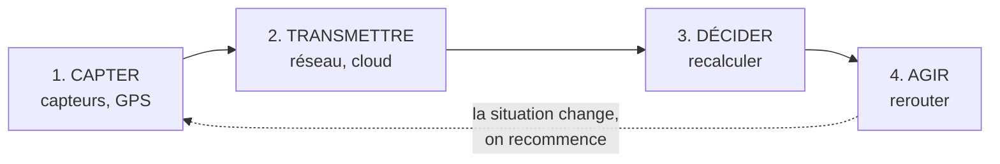
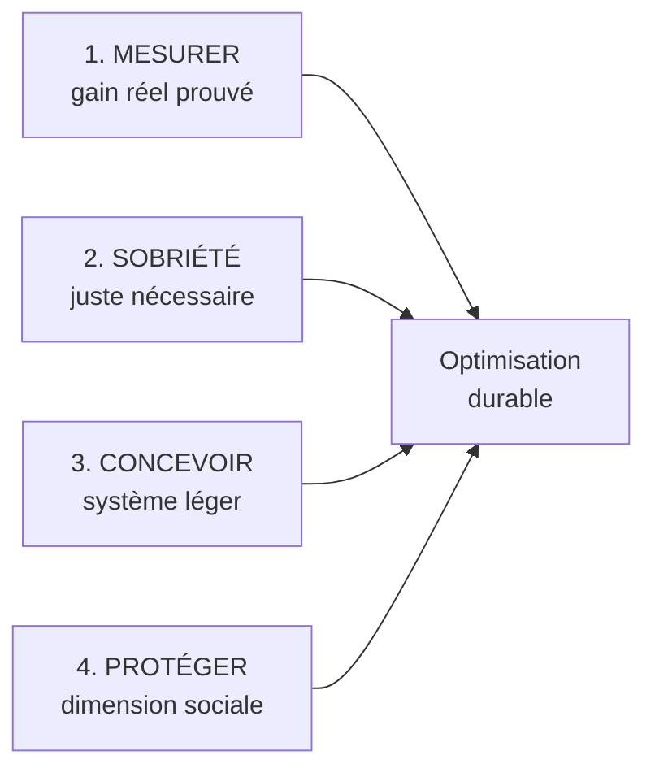

# Q8 — Les données en temps réel peuvent-elles optimiser la logistique de façon durable ?

> **La réponse en une phrase**
> Oui, mais pas en rendant les camions plus propres : en **supprimant des trajets inutiles** — parce que le gaspillage logistique est d'abord un problème de coordination, donc d'information.

> [!note] Note de provenance
> Votre cours ne traite pas directement ce sujet. Il n'y a pas de slide « données temps réel et logistique ». Cette fiche reconstruit la réponse à partir des outils du cours : chaîne de valeur, 3R, sobriété, effet rebond. Les 📘 sont exacts, les 🔎 sont mon raisonnement.

---

## Partie 1 — Les quatre mots de la question

### « Données en temps réel »

Une donnée classique est enregistrée puis consultée plus tard. À la fin du mois, vous regardez combien de kilomètres vos camions ont parcourus.

Une donnée en temps réel est disponible **pendant** que la chose se passe et permet de changer la décision **maintenant**. À 14h07, vous savez que le camion 12 est bloqué et ne livrera pas à 15h.

🔎 La différence n'est pas technique, elle est **décisionnelle**. Une donnée n'est temps réel que si elle arrive assez tôt pour qu'on puisse encore agir. Sinon c'est de l'historique.

**D'où viennent ces données.** GPS des véhicules, sondes de température, lecteurs de codes-barres, capteurs de remplissage, données de trafic, prévisions météo.

### « Logistique »

📘 Votre cours 3 distingue **deux** logistiques dans la chaîne de valeur :

| Case | Définition du cours 📘 |
|---|---|
| Logistique d'approvisionnement | « Activités logistiques (amont) de réception, de stockage et de manutention interne » |
| Logistique de commercialisation | « Activités de livraison des biens et services au client » |

⚠️ Quand on dit « la logistique », on parle donc de **deux cases différentes**. On n'agit pas de la même façon sur les deux.

### « Optimiser »

Optimiser veut dire obtenir le meilleur résultat sous contrainte. Mais selon quel critère ?

| Objectif | Ce qu'il produit |
|---|---|
| Minimiser le coût | Camions groupés, itinéraires longs mais économiques |
| Minimiser le délai | Livraisons urgentes, camions à moitié vides |
| Minimiser le carbone | Attendre d'avoir un chargement plein |

🔎 Ces trois objectifs **ne donnent pas la même solution**. « Optimiser » n'est jamais neutre : il faut toujours demander optimiser quoi.

### « De façon durable »

📘 La chaîne de valeur en durabilité intègre systématiquement trois dimensions : « **Environnementales** : réduction de l'empreinte carbone, circularité des matériaux, énergies renouvelables. **Sociales** : conditions de travail, équité, impact sur les communautés locales. **Économiques** : création de valeur à long terme, efficacité des ressources, innovation responsable. »

⚠️ Trois dimensions. Une optimisation qui réduit le CO₂ en dégradant les conditions de travail des chauffeurs n'est pas durable au sens du cours. Voir partie 7.

---

## Partie 2 — Le mécanisme : la boucle de pilotage



### Le point crucial

La boucle ne sert à rien si **l'étape 4 n'existe pas**.

Beaucoup d'entreprises installent des capteurs, accumulent des données, produisent de jolis tableaux de bord — et ne changent jamais rien. La boucle s'arrête à l'étape 3. Elles ont alors ajouté une consommation d'énergie sans obtenir aucun gain.

🔎 Votre premier vrai argument : **une donnée qui ne change aucune décision est un coût pur**.

📘 C'est la version logistique du principe du cours : « Sobriété : questionner les besoins en première intention. » Avant d'installer un capteur : quelle décision cette donnée va-t-elle changer ?

---

## Partie 3 — Où est le gaspillage dans la logistique

Avant d'agir, il faut savoir où est le problème. Dans le transport routier, l'énergie ne sert pas uniquement à déplacer des marchandises utiles.

```
Répartition de l'énergie dans le transport routier
(ordres de grandeur illustratifs, PAS des chiffres du cours)

Camions sous-remplis   ██████████████████████████████  ~30 %
Transport utile        ██████████████████████████████  ~30 %
Roulage à vide         █████████████████████████       ~25 %
Attente, congestion    ███████████████                 ~15 %
```

🔎 Ce qui compte n'est pas le chiffre mais la structure : **une grande partie de l'énergie du transport ne sert pas à transporter**.

### Le tableau qui répond vraiment à la question

| Poste de gaspillage | En quoi ça consiste | Une donnée temps réel aide-t-elle ? |
|---|---|---|
| Camions sous-remplis | Le camion roule à moitié vide faute d'avoir su regrouper | **Oui, fortement** — c'est un problème de coordination |
| Roulage à vide | Le camion revient vide après livraison | **Oui, fortement** — il faut savoir qui a du fret à faire remonter |
| Attente et congestion | Moteur qui tourne, bouchons | Oui, moyennement — réacheminer ou décaler |
| Transport utile | Le trajet nécessaire | **Non** — on ne peut que le rendre plus efficace |

### Le raisonnement à retenir

Regardez la colonne de droite. La donnée temps réel est efficace là où le problème est un **problème de coordination**, c'est-à-dire de « qui sait quoi, et quand ».

Un camion roule à vide non pas parce que la technique est mauvaise, mais parce que le transporteur ne sait pas qu'à 20 km de là quelqu'un a un chargement à expédier. C'est un manque d'information, pas un manque de moteur.

🔎 D'où la formule : **la donnée ne rend pas les camions plus propres, elle réduit le nombre de camions nécessaires**. Elle joue sur l'organisation, pas sur la technique. Et c'est pour ça qu'elle attaque les 70 % de gaspillage, pas les 30 % de transport utile.

---

## Partie 4 — Où ça se situe dans la chaîne de valeur

| Case | Ce que la donnée temps réel y fait |
|---|---|
| Logistique d'approvisionnement (principale) | Savoir quand la marchandise arrive vraiment, éviter surstock et livraisons d'urgence |
| Logistique de commercialisation (principale) | Optimiser les tournées, regrouper, éviter les retours à vide |
| **Développement technologique** (soutien) | C'est ici qu'on conçoit le système : capteurs, algorithme, hébergement |

🔎 Notez le schéma, identique à celui des achats dans [[Q04_Reduire_lempreinte_carbone_via_la_chaine_de_valeur]] : **le gain est dans les activités principales, mais la décision est dans une activité de soutien**. La case qui décide n'est jamais la case qui émet.

Conséquence : si le système est mal conçu, le gain logistique sera mangé par le coût numérique.

---

## Partie 5 — Le coût caché du système lui-même

Pour obtenir une donnée temps réel, il faut fabriquer des capteurs (carbone incorporé), les alimenter, transmettre, stocker, calculer.

📘 Le cours pose la règle générale : les bénéfices environnementaux indirects du numérique « peuvent être contrebalancés par ses impacts propres et par des effets rebond, ce qui rend le bilan net complexe à établir ».

```
Bilan net d'une optimisation logistique (illustration)

Tournées optimisées        ▼ −12 %
Coût du système numérique  ▲ +1 %
------------------------------------
Solde net                  ▼ −11 %  favorable
```

### Pourquoi ce cas penche du bon côté

Comparez :
- ce que vous économisez : du diesel brûlé par des camions de 40 tonnes ;
- ce que vous dépensez : quelques boîtiers GPS et du calcul serveur.

Un camion consomme de l'ordre de 30 litres aux 100 km. Un boîtier GPS consomme quelques watts. Ce ne sont pas les mêmes ordres de grandeur.

🔎 **La règle générale qui en découle** : quand le numérique optimise du numérique, le gain est incertain. Quand le numérique optimise du transport lourd, le gain est net. C'est ce qui distingue ce cas de celui du numérique grand public. Voir [[Q21_Le_cloud_soutient_il_la_durabilite]].

---

## Partie 6 — L'effet rebond, version logistique

Vos livraisons deviennent 12 % moins coûteuses. Que faites-vous de cette économie ?

| Scénario | Ce qui se passe | Résultat |
|---|---|---|
| **1. On encaisse** | Même service, économie conservée | Émissions −11 % réellement |
| **2. On réinvestit dans le service** | Livraison en 24h au lieu de 72h, car c'est devenu abordable | Commandes plus fréquentes, plus petites, plus de tournées → émissions en hausse |

Le scénario 2 est le plus fréquent, parce qu'une entreprise en concurrence réinvestit ses gains dans le service plutôt que de les garder.

📘 C'est exactement le conflit que le cours identifie : « La difficulté centrale ne vient pas d'abord de la technique, mais du **modèle économique**. »

🔎 **Le point le plus important de toute cette fiche** : la technologie détermine le gain **possible**, le modèle économique détermine le gain **réel**. Si votre modèle repose sur « toujours plus vite, toujours plus souvent », l'optimisation servira à accélérer, pas à réduire.

---

## Partie 7 — La dimension sociale, qu'on oublie toujours

📘 Rappel : la chaîne de valeur durable intègre « conditions de travail, équité, impact sur les communautés locales ».

Or les données logistiques portent sur des **personnes**, pas seulement sur des colis. Un GPS dans un camion géolocalise un chauffeur.

🔎 Les risques concrets :

| Risque | Description |
|---|---|
| Surveillance permanente | Géolocalisation continue, y compris hors tâches de travail |
| Pression sur les cadences | L'algorithme fixe des temps de trajet sans marge |
| Perte d'autonomie | Le chauffeur exécute un itinéraire au lieu de décider |
| Données personnelles | Traitement soumis à la législation sur la protection des données |

📘 Et le lien direct avec la notion de **sobriété juste** du cours : « Le critère central n'est pas "moins", mais **moins de superflu, sans réduire l'essentiel**. »

🔎 Transposé ici : collecter la position du véhicule pour optimiser une tournée est utile ; collecter le comportement de conduite minute par minute pour noter le chauffeur relève du superflu intrusif.

Voir [[Q20_Risques_de_la_numerisation_au_dela_de_lecologie]].

---

## Partie 8 — Les quatre conditions



| Condition | D'où elle vient | Comment on fait |
|---|---|---|
| 1. Mesurer le gain réel | Le problème de l'effet rebond | Deux indicateurs : intensité **et** absolu |
| 2. Sobriété dans la collecte | 📘 « Questionner les besoins en première intention » | Avant chaque capteur, écrire quelle décision il change |
| 3. Système léger | 📘 RGESN 2024 : architecture, contenus, flux, hébergement, composants, durée de vie des données | Position toutes les 5 min plutôt que chaque seconde ; 3 mois d'historique plutôt que 3 ans |
| 4. Dimension sociale | 📘 Définition de la chaîne de valeur durable | Collecter le véhicule, pas la personne ; associer les chauffeurs ; limiter les finalités |

⚠️ Les quatre doivent être réunies. Trois sur quatre ne suffisent pas.

---

## Partie 9 — Exemple complet

**L'entreprise.** Distributeur alimentaire genevois, 15 camions, livraisons de restaurants en ville.

**Situation de départ.** Tournées fixes décidées la veille. Un chauffeur découvre sur place qu'un restaurant est fermé. Un autre roule à vide au retour. Un troisième perd 40 minutes dans un bouchon.

### Étape 1 — Où est le gaspillage
Retours à vide, tournées non regroupées, temps d'attente.

### Étape 2 — Quelle donnée changerait une décision

| Donnée | Décision qu'elle change | On la collecte ? |
|---|---|---|
| Position des véhicules toutes les 5 min | Rerouter en cas d'incident | ✅ Oui |
| Trafic en temps réel | Choisir l'itinéraire | ✅ Oui |
| Confirmation de réception client | Éviter un passage inutile | ✅ Oui |
| Température des camions frigorifiques | Éviter la perte de marchandise | ✅ Oui |
| Comportement de conduite seconde par seconde | Aucune décision opérationnelle | ❌ **Non** — superflu et intrusif |

🔎 La ligne « non » est le cœur de la démonstration : appliquer la sobriété, c'est **refuser une donnée disponible** parce qu'elle ne sert aucune décision.

### Étape 3 — Actions
Regroupement dynamique des tournées, recherche de fret retour, ajustement des créneaux avec les restaurants pour éviter les heures de congestion.

### Étape 4 — Garde-fous
- Contre l'effet rebond : engagement de ne pas augmenter la fréquence de livraison. Le gain reste un gain.
- Sur le social : les données de conduite individuelle ne servent pas à l'évaluation du personnel ; les chauffeurs gardent la main pour dévier de l'itinéraire proposé.

### Étape 5 — Indicateurs

| Indicateur | Type | Rôle |
|---|---|---|
| Litres de carburant pour 100 livraisons | Intensité | Mesure le progrès |
| Tonnes CO₂ totales sur l'année | Absolu | Vérifie l'absence d'effet rebond |
| Part des kilomètres à vide | Intensité | Suit le levier principal |
| **Nombre de livraisons annuelles** | Contrôle | Détecte si le volume a augmenté |

🔎 Le dernier est le plus malin : il permet de savoir si la baisse d'émissions vient d'une vraie optimisation ou d'une simple baisse d'activité.

---

## Les pièges

> [!danger] Erreurs classiques
> 1. **Répondre oui sans conditions.** La question dit « de façon durable » : ce sont les conditions qui comptent.
> 2. **Oublier le coût du système lui-même.**
> 3. **Oublier l'effet rebond.** C'est le mécanisme central.
> 4. **Oublier la dimension sociale.** 📘 Elle est dans la définition du cours.
> 5. **Rester sur la technique.** 📘 Le blocage est dans le modèle économique.
> 6. **Croire qu'un capteur suffit.** La boucle doit aller jusqu'à l'action.

## À retenir

| | |
|---|---|
| **Le mécanisme réel** | Supprimer des trajets, pas rendre les camions propres |
| **Pourquoi ça marche** | Le gaspillage logistique est un problème de coordination |
| **Pourquoi le bilan est favorable** | Le numérique optimise ici quelque chose de bien plus lourd que lui |
| **Les trois annulateurs** | Boucle qui n'atteint pas l'action, effet rebond, oubli du social |
| **La formule** | La technologie détermine le gain possible, le modèle économique le gain réel |
