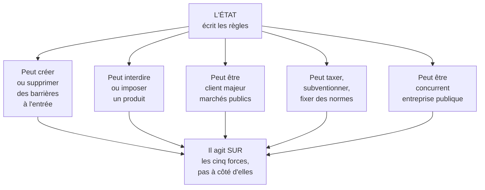

# Q8 — Quelle est la sixième force de Porter ajoutée dans le cours ?

> **La réponse en une phrase**
> C'est **le pouvoir de l'État**, et l'ajouter n'est pas un détail de vocabulaire : cela reconnaît qu'un acteur peut changer les règles du jeu sans participer au marché.

---

## Partie 1 — Rappel des cinq forces, avec les mots du cours

📘 Cours 2 : « Pour Michael Porter, l'**intensité concurrentielle** est la résultante d'un certain nombre de forces qui s'exercent sur les firmes en place. »

| Force 📘 | Formulation exacte du cours |
|---|---|
| 1 | « Les **entrants potentiels** soit la menace d'une nouvelle concurrence » |
| 2 | « Les **offreurs de substituts** soit la menace des produits substituts » |
| 3 | « Les **fournisseurs** soit le pouvoir de négociation en amont dans la filière » |
| 4 | « Les **acheteurs** soit le pouvoir de négociation des clients » |
| 5 | « Les **concurrents directs** soit la rivalité concurrentielle » |
| **6** | « **Le pouvoir de l'État** peut constituer une **6ième force** » |

⚠️ Notez la formulation du cours : « **peut constituer** ». Le conditionnel est important — l'État est une force dans certains secteurs, moins dans d'autres.

---

## Partie 2 — Pourquoi l'État ne rentre pas dans les cinq autres

C'est le raisonnement à faire, et il justifie l'ajout.

🔎 Les cinq forces classiques ont un point commun : ce sont toutes des **acteurs du marché**, qui achètent, vendent ou concurrencent. Ils exercent leur pouvoir **à l'intérieur des règles**.

L'État, lui, ne joue pas dans le marché : **il écrit les règles**.

⚠️ **Le point clé** : l'État n'est pas une sixième force *parallèle* aux cinq autres, il est une force qui **agit sur les cinq autres**. Une norme nouvelle augmente les barrières à l'entrée (force 1). Une interdiction supprime un substitut (force 2). Une commande publique change le pouvoir des acheteurs (force 4).

---

## Partie 3 — Les cinq visages de l'État dans un secteur

| Rôle | Ce qu'il fait | Exemple |
|---|---|---|
| **Régulateur** | Fixe des normes, autorise, interdit | Normes sanitaires, protection des données |
| **Client** | Achète, souvent massivement | Marchés publics avec critères responsables |
| **Financeur** | Subventionne, exonère, garantit | Aides à l'efficacité énergétique |
| **Concurrent** | Opère lui-même dans le secteur | Services publics, régies |
| **Protecteur** | 📘 « protecteur des intérêts individuels, locaux et nationaux » | Accords commerciaux bilatéraux et régionaux |

📘 Ce dernier rôle est explicitement décrit dans le cours 2, au titre du facteur politique du PESTEL.

🔎 Notez que le troisième rôle, financeur, est le plus sous-estimé par les étudiants. Une subvention modifie la structure de coûts de tout le secteur.

---

## Partie 4 — Le lien avec l'équation de Porter

📘 Le cours donne l'équation fondamentale : « **Profit = Prix – Coûts** », et précise : « plus une force est puissante, plus la pression qu'elle exerce sur les prix ou les coûts est élevée, et **moins le secteur est attrayant** ».

🔎 Appliquons ça à l'État. Il peut agir dans les deux sens, et c'est ce qui le rend particulier.

| Action de l'État | Effet sur le profit |
|---|---|
| Taxe carbone | ▲ Coûts → profit en baisse |
| Norme de sécurité coûteuse | ▲ Coûts, mais ▲ barrières à l'entrée → effet ambigu |
| Subvention | ▼ Coûts → profit en hausse |
| Commande publique massive | ▲ Prix garanti → profit en hausse |
| Ouverture du marché à la concurrence étrangère | ▼ Prix → profit en baisse |

⚠️ **La conséquence stratégique la plus fine** : une réglementation coûteuse n'est pas toujours une menace. Elle augmente les coûts pour tout le monde, mais elle élève aussi les barrières à l'entrée — donc elle protège les entreprises déjà installées et capables de s'y conformer.

🔎 D'où le retournement qui vaut des points : **une même norme est une menace pour l'entreprise en retard et une opportunité pour celle qui est déjà prête**. C'est votre position interne qui décide.

---

## Partie 5 — Pourquoi c'est décisif pour la durabilité

C'est le pont à faire, et il est central dans votre cours.

📘 Le cours numérique et durabilité note à propos des centres de données : « Subventions/avantages fiscaux aux entreprises pour créer des "Green data centers". **Mais cela ne change pas le modèle économique.** Avoir une réflexion sur la localisation des data centers ? **Le rôle de l'État de mettre des normes strictes.** »

📘 Et sur l'exploitation des données : « **C'est l'État qui doit agir sur l'entreprise.** »

🔎 Ces deux notes disent la même chose : sur les sujets de durabilité, les cinq forces classiques ne produisent pas spontanément le bon résultat, parce qu'une entreprise qui internalise ses externalités est momentanément désavantagée face à une concurrente qui ne le fait pas. Seul l'État peut **égaliser les conditions** en imposant la même règle à tous.

⚠️ C'est l'argument le plus solide contre l'objection « pourquoi être vertueux si mes concurrents ne le sont pas ». Réponse : parce que la règle arrive, et qu'il vaut mieux l'anticiper que la subir.

📘 Trajectoire réglementaire à citer : AI Act entré en vigueur le **1er août 2024** ; European Accessibility Act en **juin 2025** ; « **Vers une accessibilité numérique obligatoire pour le secteur privé** » avec la révision de la LHand.

---

## Partie 6 — Exemple complet

**Le secteur.** Les services numériques en Suisse.

| Force | Intensité | Justification |
|---|---|---|
| Entrants potentiels | Forte | Barrières faibles : un ordinateur et des compétences |
| Substituts | Moyenne | Solutionslow-code, développement interne, IA générative |
| Fournisseurs | **Forte** | Dépendance aux hébergeurs et éditeurs, majoritairement américains |
| Acheteurs | Forte | Comparaison facile, appels d'offres au moins-disant |
| Rivalité | Forte | Marché fragmenté, concurrence sur le prix |
| **État (6ᵉ)** | **Croissante** | Accessibilité obligatoire à venir, protection des données, souveraineté |

### Ce que la sixième force change à l'analyse

🔎 Sans elle, le diagnostic serait : secteur peu attractif, cinq forces fortes, océan rouge.

Avec elle, une piste apparaît : **l'arrivée des obligations d'accessibilité et de conformité va relever les barrières à l'entrée et éliminer les acteurs qui ne savent faire que du moins-disant**.

Une entreprise qui se prépare aujourd'hui transforme une menace réglementaire en opportunité concurrentielle. C'est un croisement force × menace au sens du SWOT. Voir [[Q06_Du_SWOT_a_la_recommandation]].

---

## Les pièges

> [!danger] Erreurs classiques
> 1. **Oublier le conditionnel.** 📘 L'État « **peut** constituer » une sixième force, selon les secteurs.
> 2. **Traiter l'État comme une force parallèle.** Il agit sur les cinq autres.
> 3. **Ne voir que le régulateur.** Il est aussi client, financeur, concurrent, protecteur.
> 4. **Voir la réglementation comme une pure menace.** Elle protège aussi ceux qui sont prêts.
> 5. **Confondre avec le P du PESTEL.** Le PESTEL est macro et général ; ici l'État agit sur **votre** secteur.

## À retenir

| | |
|---|---|
| **La 6ᵉ force 📘** | « Le pouvoir de l'État peut constituer une 6ième force » |
| **Pourquoi elle est à part** | Elle écrit les règles au lieu de jouer dedans |
| **Cinq visages** | Régulateur, client, financeur, concurrent, protecteur |
| **Équation 📘** | Profit = Prix – Coûts ; l'État agit sur les deux termes |
| **Rôle en durabilité 📘** | « C'est l'État qui doit agir sur l'entreprise » ; « mettre des normes strictes » |
| **Le retournement** | Une norme est une menace pour le retardataire, une opportunité pour celui qui est prêt |
