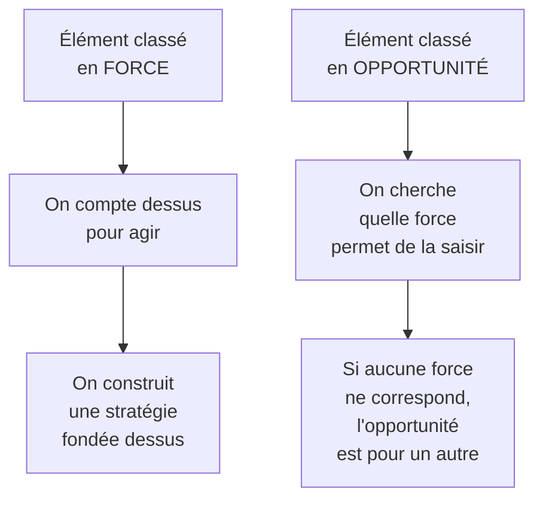
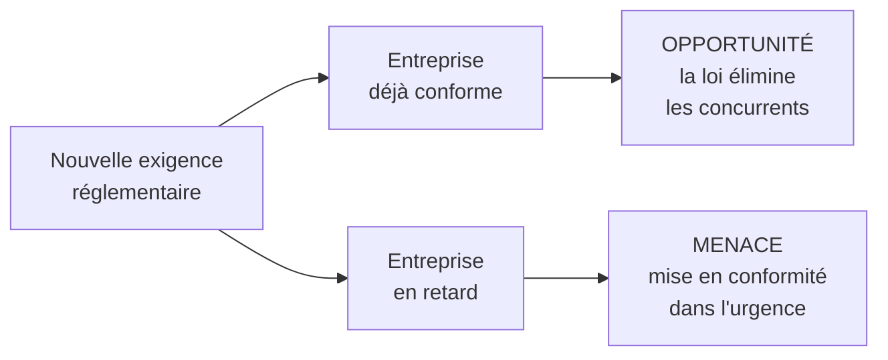

# Q9 — Quelle est la différence entre une opportunité et une force ?

> **La réponse en une phrase**
> Une force est **à vous** et vous suivrait si tout le marché changeait ; une opportunité est **dans le monde** et existe même si vous n'existez pas — et le test qui les sépare tient en une seule question.

---

## Partie 1 — Le test unique

Posez-vous cette question devant n'importe quel élément :

> **Est-ce que cet élément existerait encore si mon entreprise disparaissait demain ?**

| Réponse | Conclusion |
|---|---|
| Oui, ça existerait quand même | C'est **externe** → opportunité ou menace |
| Non, ça disparaîtrait avec nous | C'est **interne** → force ou faiblesse |

🔎 Ce test est infaillible et vous évitera l'erreur la plus fréquente de tout le cours.

### Application immédiate

| Élément | Existerait sans vous ? | Case |
|---|---|---|
| « Les consommateurs veulent des produits durables » | Oui | **Opportunité** |
| « Nous avons une équipe formée à l'éco-conception » | Non | **Force** |
| « Une nouvelle loi impose l'accessibilité » | Oui | Opportunité ou menace, selon votre position |
| « Nous sommes certifiés depuis 2019 » | Non | **Force** |
| « Le prix du café augmente » | Oui | **Menace** |
| « Nous n'avons pas de bilan carbone » | Non | **Faiblesse** |

---

## Partie 2 — Pourquoi la confusion est grave, et pas seulement fausse

Ce n'est pas une question de vocabulaire. Se tromper de case fait prendre la mauvaise décision.

🔎 **Le mécanisme de l'erreur** : si vous mettez « le marché du bio est en croissance » dans la case Forces, vous croyez avoir un atout. Vous n'en avez aucun. Cette croissance profite à tous vos concurrents exactement autant qu'à vous.

⚠️ Formulation à retenir : **une opportunité n'appartient à personne tant qu'une force ne l'a pas saisie**. C'est précisément ce que fait le croisement force × opportunité du SWOT. Voir [[Q06_Du_SWOT_a_la_recommandation]].

---

## Partie 3 — D'où vient chaque colonne

📘 Le cours 3 résume : « Le SWOT pour le diagnostic **interne** (forces/faiblesses) et **externe** (opportunités/menaces). »

| Colonne | Outils qui l'alimentent 📘 |
|---|---|
| **Forces et faiblesses** | Analyse des ressources matérielles et immatérielles ; analyse de la chaîne de valeur |
| **Opportunités et menaces** | PESTEL (macro) ; 5 (+1) forces de Porter (micro) |

🔎 Le raccourci mnémotechnique : **si l'élément vient d'un PESTEL ou d'un Porter, il ne peut pas être une force**. Et réciproquement, si l'élément vient de votre inventaire de ressources ou de votre chaîne de valeur, il ne peut pas être une opportunité.

---

## Partie 4 — Les trois cas limites qui piègent

### Cas 1 — « Nous sommes situés à Genève »

⚠️ Ambigu, et c'est la bonne réponse à donner.

- « Genève est un bassin économique dense et solvable » → **opportunité** : c'est vrai pour tous les acteurs présents.
- « Nous disposons d'un local en centre-ville avec un bail à loyer fixe jusqu'en 2035 » → **force** : c'est à vous, et c'est difficile à reproduire.

🔎 La leçon : **une caractéristique du contexte est externe, une ressource que vous détenez dans ce contexte est interne**. Le même fait géographique se décline dans les deux cases selon la formulation.

### Cas 2 — « Nos concurrents sont en retard sur la durabilité »

⚠️ C'est **externe**. C'est un état du marché, pas une capacité de votre entreprise.

La force correspondante serait : « nous avons trois ans d'avance en compétences internes en éco-conception ». Notez la différence : la première décrit les autres, la seconde décrit ce que vous savez faire.

### Cas 3 — « Nos salariés résistent au changement »

⚠️ C'est **interne**, donc une faiblesse. C'est un piège très fréquent parce que le mot « résistance » évoque un obstacle venu de l'extérieur. Il vient de chez vous.

Voir [[Q06_Du_SWOT_a_la_recommandation]].

---

## Partie 5 — La nuance qui fait la bonne copie : le même fait, deux cases

🔎 **Le raisonnement le plus fort sur cette question** : un même événement extérieur est une opportunité ou une menace selon votre situation interne. Ce n'est donc pas l'événement qui décide de la case, c'est le croisement avec vos forces.

⚠️ Conséquence méthodologique : vous ne pouvez pas remplir correctement la colonne externe sans connaître votre colonne interne. Les deux diagnostics se répondent.

---

## Partie 6 — Exemple complet

**L'entreprise.** Une PME romande de services numériques, 30 personnes.

### Version fausse du SWOT

| | Positif | Négatif |
|---|---|---|
| Interne | Le marché de l'accessibilité est en croissance ; les clients demandent du responsable | Nos concurrents cassent les prix |
| Externe | Notre équipe est motivée | La réglementation arrive |

⚠️ Trois erreurs sur quatre cases. Croissance du marché et demande client sont externes ; les prix des concurrents sont externes ; l'équipe motivée est interne.

### Version correcte

| | Positif | Négatif |
|---|---|---|
| **Interne** | Deux développeurs certifiés en accessibilité ; méthodologie d'éco-conception documentée ; portefeuille de clients publics fidèles | Aucune capacité commerciale dédiée ; pas de mesure de l'empreinte de nos livrables |
| **Externe** | Croissance de la demande en accessibilité ; obligation légale à venir ; marchés publics à critères responsables | Concurrents qui cassent les prix ; dépendance aux hébergeurs étrangers |

### Le croisement qui en découle

| Croisement | Piste |
|---|---|
| Force « développeurs certifiés » × Opportunité « obligation légale à venir » | Se positionner comme référence romande sur l'accessibilité avant que la loi ne s'applique |
| Faiblesse « pas de capacité commerciale » × Opportunité « marchés publics » | Chantier de rattrapage : formation aux appels d'offres publics |

🔎 Remarquez que la **même opportunité** — l'obligation légale — serait une **menace** pour un concurrent sans compétence en accessibilité. C'est exactement la démonstration de la partie 5.

---

## Les pièges

> [!danger] Erreurs classiques
> 1. **Mettre une tendance de marché dans les Forces.** C'est l'erreur n°1 de tout le cours.
> 2. **Mettre la résistance interne dans les Menaces.** Elle est interne.
> 3. **Décrire les concurrents dans la colonne interne.** Décrire les autres n'est jamais une force.
> 4. **Oublier que le même fait peut basculer.** Selon votre position interne.
> 5. **Écrire un thème au lieu d'une capacité.** « Développement durable » n'est pas une force ; « équipe formée à l'éco-conception » l'est.

## À retenir

| | |
|---|---|
| **Le test unique** | Cet élément existerait-il si mon entreprise disparaissait ? |
| **Force** | Interne, à vous, comparative |
| **Opportunité** | Externe, disponible pour tous les acteurs du marché |
| **Origine 📘** | Forces ← ressources et chaîne de valeur ; Opportunités ← PESTEL et Porter |
| **La nuance forte** | Un même fait externe est opportunité ou menace selon votre position interne |
| **Formule** | Une opportunité n'appartient à personne tant qu'une force ne l'a pas saisie |
