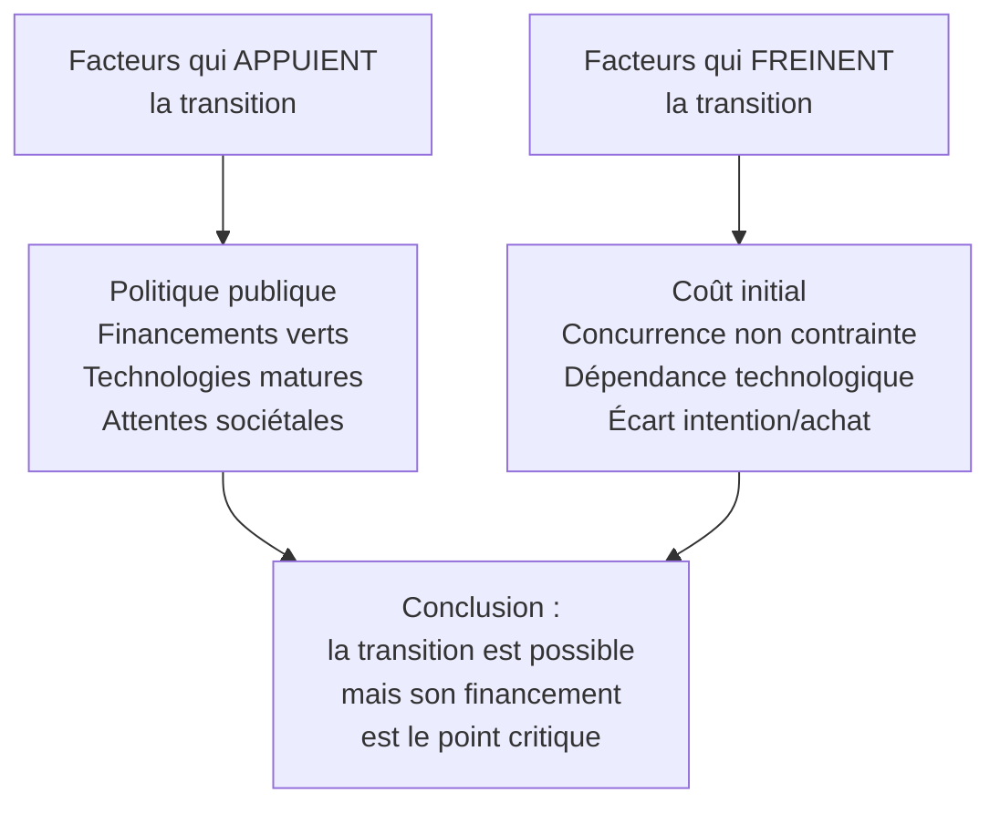

# Q9 — Faites un PESTEL d'une entreprise en transition écologique

> **La réponse en une phrase**
> Ici le PESTEL ne sert pas à décrire un secteur mais à répondre à une question précise : **l'environnement extérieur rend-il ma transition possible, et à quelles conditions** ?

---

## Partie 1 — En quoi cette question diffère de la Q2

C'est le premier point à voir, et il change tout le travail.

| | [[Q02_PESTEL_secteur_alimentaire]] | Q9 (celle-ci) |
|---|---|---|
| Objet analysé | Un **secteur** | Un **projet de transformation** |
| Question posée | Ce secteur est-il attractif ? | Ma transition est-elle soutenue ou freinée par l'extérieur ? |
| Le PESTEL sert à | Cartographier des forces | Identifier des **appuis** et des **obstacles** |

📘 C'est exactement la formulation du cours durabilité, qui applique le PESTEL à un plan d'action : « **Objectif : Identifier les forces macro-environnementales qui peuvent influencer l'atteinte des objectifs de durabilité.** »

🔎 Le mot décisif est « atteinte des objectifs ». On ne décrit plus un paysage, on teste la faisabilité d'un projet. Les cases changent donc de sens : une opportunité devient un **appui à mobiliser**, une menace devient un **obstacle à lever**.

---

## Partie 2 — La grille du cours, appliquée à la transition

📘 Le cours durabilité donne les six consignes exactes, une par facteur. Je les cite intégralement, puis je traduis.

| Facteur | 📘 Consigne du cours | 🔎 Ce que ça veut dire pour votre entreprise |
|---|---|---|
| **Politique** | « Identifiez les lois, réglementations ou politiques gouvernementales qui influencent la mise en œuvre des mesures » | L'État vous pousse-t-il, vous freine-t-il, vous finance-t-il ? |
| **Économique** | « Évaluez l'impact économique des mesures sur les secteurs clés comme l'énergie ou l'industrie » | Combien coûte la transition, et qui peut la payer ? |
| **Socioculturel** | « Analysez l'**acceptation sociale** et les changements de comportement nécessaires en matière de consommation durable » | Vos clients et vos salariés suivront-ils ? |
| **Technologique** | « Déterminez les innovations technologiques à **encourager** pour appuyer la stratégie » | Les technologies nécessaires existent-elles et sont-elles accessibles ? |
| **Environnemental et éthique** | « Évaluez les engagements environnementaux et éthiques (ex. : protection de la biodiversité) » | Quelle est la contrainte physique et morale réelle ? |
| **Légal** | « Vérifiez la **conformité** des mesures avec les réglementations nationales et internationales » | Ce que je veux faire est-il autorisé, obligatoire, ou risqué ? |

⚠️ Notez la nuance sur le T : le cours dit « à **encourager** », pas « à subir ». Dans un PESTEL de transition, la technologie n'est pas une contrainte extérieure, c'est un levier qu'on choisit d'activer.

⚠️ Et rappel sur le E : vos supports varient. 📘 Le cours 2 dit « Éthique » sur une slide et « Écologique » sur le tableau ; 📘 le cours durabilité fusionne en « Facteurs environnemental et éthique ». Traitez-le comme couvrant les deux.

---

## Partie 3 — La grille remplie, avec justifications

🔎 Le contenu ci-dessous est ma proposition pour une entreprise industrielle suisse engageant sa transition. La grille est celle du cours.

### P — Politique : plutôt un appui

| Facteur | Appui ou obstacle | Pourquoi |
|---|---|---|
| 📘 Stratégie pour le développement durable 2030 du Conseil fédéral | **Appui** | Le cadre politique national existe et donne une direction |
| Subventions et programmes cantonaux à l'efficacité énergétique | **Appui** | Réduisent le coût d'entrée |
| Taxe carbone et redistribution | Ambivalent | Coût si on ne fait rien, gain relatif si on agit |
| Instabilité des politiques énergétiques | **Obstacle** | Rend les investissements longs risqués |

📘 Sur le cadre suisse : « Dans sa Stratégie pour le développement durable 2030 (SDD 2030), le Conseil fédéral montre selon quelles priorités il entend mettre en œuvre l'Agenda 2030 pour le développement durable d'ici 2030. »

### E — Économique : le facteur le plus contraignant

| Facteur | Appui ou obstacle | Pourquoi |
|---|---|---|
| Coût de l'énergie | Ambivalent | Un coût élevé rend la sobriété **rentable** |
| Accès aux financements verts | **Appui** | Prêts et conditions préférentielles |
| Investissement initial élevé | **Obstacle** | Le coût est immédiat, le retour différé |
| Concurrence internationale non contrainte | **Obstacle** | Des concurrents qui n'internalisent pas leurs externalités restent moins chers |

🔎 Ce dernier point est le vrai nœud économique de toute transition : vous internalisez vos coûts, vos concurrents non. Vous êtes momentanément désavantagé pour avoir été plus vertueux. C'est exactement pourquoi la réglementation est nécessaire — elle égalise les conditions. Faites ce lien, il est fort.

### S — Socioculturel : la question de l'acceptation

📘 « Analysez l'acceptation sociale et les changements de comportement nécessaires. »

| Facteur | Appui ou obstacle | Pourquoi |
|---|---|---|
| Attentes sociétales croissantes | **Appui** | Le marché suit |
| Attractivité employeur | **Appui** | Un projet de transition attire les candidats |
| Résistance interne au changement | **Obstacle** | 🔎 C'est un facteur **interne** ; attention à ne pas le mettre ici |
| Écart entre discours et comportement d'achat réel | **Obstacle** | Beaucoup déclarent vouloir, peu paient plus cher |

⚠️ Piège classique : la résistance des salariés est **interne**, donc une faiblesse du diagnostic interne, pas un facteur S du PESTEL. Voir [[Q14_Les_freins_internes_a_une_strategie_durable]].

🔎 Le dernier point mérite d'être nommé : il existe un écart documenté entre les intentions déclarées et les achats effectifs. Le mentionner évite une réponse naïve sur « les consommateurs veulent du durable ».

### T — Technologique

| Facteur | Appui ou obstacle | Pourquoi |
|---|---|---|
| Technologies propres matures (solaire, pompes à chaleur, récupération de chaleur) | **Appui** | Disponibles, prix en baisse |
| Outils de mesure et de pilotage | **Appui** | Voir [[Q07_Numerique_pour_mesurer_et_piloter_impact]] |
| Dépendance à des fournisseurs technologiques étrangers | **Obstacle** | 📘 Le cours numérique et durabilité fait travailler ce scénario : rupture d'approvisionnement en matériaux et pièces informatiques en provenance d'Asie, coupure de services dont le siège est aux États-Unis |
| Empreinte propre des solutions numériques | **Obstacle** | 📘 Croissance de la consommation électrique du numérique : **16 % par an** |

🔎 Le facteur T est donc à double tranchant, et le cours l'illustre lui-même : la technologie qui vous aide crée aussi une dépendance et un impact.

### E — Environnemental et éthique : le facteur qui justifie tout

| Facteur | Appui ou obstacle | Pourquoi |
|---|---|---|
| 📘 Limites planétaires : **9 identifiées, 7 dépassées en 2025** | **Obstacle** physique, et justification de l'action | 📘 « Il est donc urgent de revenir au sein d'un espace de fonctionnement sécurisé » |
| Attente éthique sur les conditions de travail dans la chaîne | Obstacle puis appui | 📘 Dimension sociale de la chaîne de valeur durable |
| Raréfaction et criticité des matériaux | **Obstacle** | Renchérit et fragilise l'approvisionnement |
| Pression sur la biodiversité | **Obstacle** | 📘 Exemple explicite du cours pour ce facteur |

🔎 C'est ici qu'il faut mobiliser le cadre du **donut**. 📘 Le cours définit sa limite haute comme le « plafond écologique → limites planétaires, au-delà desquelles les conditions de vie ne sont plus assurées et des basculements irréversibles peuvent se produire », et sa limite basse comme le « fondement social → besoins humains fondamentaux pour toute l'humanité, permettant à chacun·e d'avoir une vie digne ».

Une transition écologique qui ne regarderait que le plafond serait incomplète : il faut aussi ne pas passer sous le plancher.

### L — Légal

📘 « Vérifiez la conformité des mesures avec les réglementations nationales et internationales. »

| Facteur | Appui ou obstacle | Pourquoi |
|---|---|---|
| Réglementation environnementale qui se durcit | Obstacle à court terme, **appui** à moyen terme | Élimine les concurrents non préparés |
| 📘 AI Act (si le projet mobilise l'IA) | Obstacle de conformité | Encadre les usages |
| Protection des données | Obstacle de conformité | Si le projet repose sur des capteurs |
| 📘 Révision de la loi sur les personnes en situation de handicap | Obstacle puis appui | Impose l'accessibilité, voir [[Q20_Risques_de_la_numerisation_au_dela_de_lecologie]] |

---

## Partie 4 — La lecture d'ensemble

Un PESTEL de transition ne se rend pas en six listes. Il se rend en une conclusion.

🔎 **Le raisonnement à formuler** : les facteurs politique, technologique et légal poussent dans le sens de la transition. Le facteur économique la freine. Le facteur socioculturel est ambigu. Donc le point de blocage n'est ni technique ni réglementaire : il est **financier et temporel**. La question n'est pas « peut-on faire », mais « comment tenir jusqu'à ce que ça paie ».

⚠️ C'est exactement la tension court terme / long terme de [[Q05_Transformer_un_business_model_en_BM_durable]]. Faire ce lien montre que vous ne récitez pas des grilles séparées.

---

## Partie 5 — Ce qu'on fait ensuite

📘 Le cours durabilité enchaîne lui-même sur le plan stratégique : « **Choix stratégique** : Choisissez une orientation : Différenciation (leader mondial en durabilité), Focalisation (ex : énergie verte), Innovation durable. Formulez **1 objectif SMART**. **Plan d'action** : Proposez 2 actions concrètes, 1 indicateur de suivi. Les objectifs doivent guider la stratégie et être mesurables. »

🔎 Autrement dit : un PESTEL qui ne débouche pas sur un choix stratégique, un objectif mesurable et un indicateur n'est pas terminé.

**Exemple de sortie complète pour notre entreprise industrielle :**

| Élément | Contenu |
|---|---|
| Orientation | Différenciation par la sobriété énergétique |
| Objectif SMART | Réduire de 30 % la consommation énergétique par unité produite d'ici 24 mois |
| Action 1 | Récupération de la chaleur fatale sur les deux fours principaux |
| Action 2 | Contrat d'électricité renouvelable et pilotage par capteurs |
| Indicateur | kWh par unité produite (intensité) **et** MWh totaux annuels (absolu) |

---

## Les pièges

> [!danger] Erreurs classiques
> 1. **Faire le même PESTEL qu'en Q2.** Ici on teste un projet, pas un secteur.
> 2. **Mettre de l'interne dans le S.** La résistance des salariés est une faiblesse interne.
> 3. **Oublier que le T est ambivalent.** 📘 Le numérique croît de 16 % par an en consommation électrique.
> 4. **Ne pas conclure.** Le PESTEL doit produire une lecture, pas six listes.
> 5. **S'arrêter avant le plan.** 📘 Le cours exige objectif SMART + 2 actions + 1 indicateur.

## À retenir

| | |
|---|---|
| **Objectif 📘** | « Identifier les forces macro-environnementales qui peuvent influencer l'atteinte des objectifs de durabilité » |
| **Sens des cases** | Opportunité = appui à mobiliser ; menace = obstacle à lever |
| **Le nœud** | Économique : coût immédiat, retour différé, concurrence non contrainte |
| **Chiffres 📘** | 9 limites planétaires, 7 dépassées en 2025 ; numérique +16 % par an |
| **Sortie obligatoire 📘** | Orientation + objectif SMART + 2 actions + 1 indicateur |
