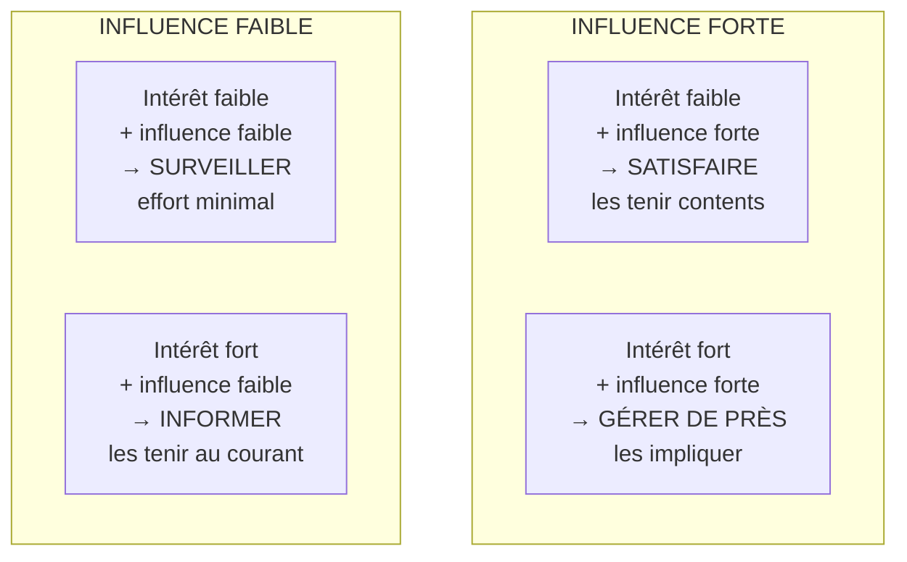
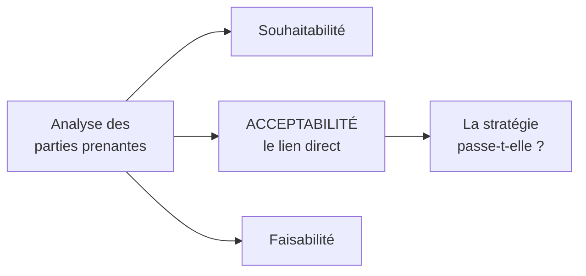

# Q10 — Comment intégrer les parties prenantes dans une stratégie durable ?

> **La réponse en une phrase**
> On les identifie, on les évalue selon deux critères (**intérêt** et **influence**), on adapte le traitement à leur profil — et la durabilité oblige à **élargir le cercle** à ceux qui n'ont pas de voix.

---

## Partie 1 — Ce qu'est une partie prenante, et pourquoi c'est le point de départ

### Définition simple

Une partie prenante est **toute personne ou tout groupe qui affecte l'entreprise ou qui est affecté par elle**.

Le mot « ou » est important : il y a deux sens de circulation.

| Sens | Exemple |
|---|---|
| Elle affecte l'entreprise | Un actionnaire qui peut bloquer un investissement |
| Elle est affectée par l'entreprise | Un riverain qui subit le bruit de l'usine |

🔎 Beaucoup d'analyses n'identifient que le premier groupe, celui qui a du pouvoir. C'est précisément là que la durabilité change la donne, on y revient en partie 5.

### Pourquoi c'est la première étape de toute stratégie

📘 Le cours 1 est catégorique : « L'analyse des parties prenantes est un outil utilisé pour représenter et distinguer les différents acteurs, leur implication et leur degré d'influence dans les décisions de l'entreprise. **C'est le début de toute analyse pour réaliser un plan…** »

📘 Et le résumé du cours 1 le confirme : « L'analyse des parties prenantes **pour commencer son plan**. »

🔎 Pourquoi commencer par là ? Parce qu'une stratégie n'est pas exécutée par un plan, elle est exécutée par des gens. Si vous ne savez pas qui peut bloquer, qui peut aider et qui va subir, votre stratégie est un document, pas un projet.

### Le cadre plus large : la gouvernance

📘 Le cours situe l'outil dans la gouvernance : « La vision, la mission, les buts et les objectifs définissent la trajectoire. Il est important de comprendre la manière dont les décisions sont prises pour la formulation et la mise en œuvre de la stratégie. »

---

## Partie 2 — La méthode en trois gestes

📘 Le cours 1 donne les gestes exacts.

### Geste 1 — Lister

📘 « Lister les parties prenantes **internes** (direction, équipes…) et **externes** (clients, fournisseurs…). »

| Internes | Externes |
|---|---|
| Direction | Clients |
| Équipes, salariés | Fournisseurs |
| Représentants du personnel | Actionnaires, banques |
| | Autorités, régulateur |
| | Riverains, associations |
| | Concurrents |

### Geste 2 — Évaluer sur deux axes

📘 « Construire un tableau de synthèse de votre analyse et évaluer selon le niveau d'**intérêt** et d'**influence** (- / +). Quel est leur intérêt dans l'entreprise (faible, moyen, fort) et leur niveau d'influence (faible, moyen, fort) ? »

📘 Le cours donne même la structure du tableau :

| Parties prenantes | Intérêt | Influence / pouvoir |
|---|---|---|
| … | faible / moyen / fort | faible / moyen / fort |

⚠️ Les deux mots ne veulent pas dire la même chose, et c'est là que les erreurs se produisent :

| Critère | Question à se poser |
|---|---|
| **Intérêt** | Ce que fait l'entreprise a-t-il des conséquences pour eux ? |
| **Influence / pouvoir** | Peuvent-ils agir sur les décisions de l'entreprise ? |

🔎 Un riverain a un **intérêt fort** et une **influence faible**. Un actionnaire minoritaire peut avoir un intérêt faible et une influence forte. Les deux axes sont indépendants.

### Geste 3 — Reporter sur la matrice

📘 « Matrice des parties prenantes : reporter sur la matrice vos résultats d'analyse. »

🔎 Les quatre stratégies découlent logiquement des deux axes. Ce n'est pas à mémoriser bêtement, ça se retrouve : quelqu'un de puissant et concerné, on l'implique ; quelqu'un de puissant mais indifférent, on évite de le fâcher ; quelqu'un de concerné mais sans pouvoir, on l'informe ; quelqu'un ni l'un ni l'autre, on surveille sans investir.

---

## Partie 3 — Ce qu'on fait ensuite : le plan de management

C'est l'étape que la plupart oublient, et le cours insiste dessus.

📘 « Votre action **ne se limite pas à l'identification** des forces en présence. Vous devez élaborer un véritable **plan de management des parties prenantes** en fonction de leur profil. Pour certains, des actions sont à prévoir. Ce sont essentiellement des actions de communication : détailler les objectifs et la méthode retenue, informer de l'avancée des opérations, prévenir d'un risque probable, des difficultés rencontrées… »

| Action citée par le cours 📘 | À qui elle s'adresse en priorité |
|---|---|
| Détailler les objectifs et la méthode | Ceux qu'on gère de près |
| Informer de l'avancée des opérations | Ceux qu'on informe |
| Prévenir d'un risque probable | Ceux qui seront affectés |
| Signaler les difficultés rencontrées | Ceux qui peuvent aider ou bloquer |

⚠️ Remarquez que ce sont toutes des actions de **communication**. La matrice ne sert pas à classer les gens, elle sert à décider **quoi leur dire et quand**.

---

## Partie 4 — Le lien avec le SAF

📘 Le cours 1 relie explicitement les parties prenantes au test d'évaluation d'une stratégie : « **Acceptabilité.** Cette partie du test porte sur l'attractivité de la stratégie proposée auprès des parties prenantes, en prenant en compte leurs intérêts et pouvoirs d'influence, et en soulevant les questions suivantes : Le retour attendu est-il acceptable ? Le niveau de risque est-il acceptable ? **Les parties prenantes vont-elles s'opposer à la stratégie ?** Outils : analyse des parties-prenantes, analyse des risques. »

🔎 Le raisonnement : une stratégie durable est souvent souhaitable et faisable, et elle échoue sur l'acceptabilité. C'est précisément la tension court terme / long terme vue en [[Q05_Transformer_un_business_model_en_BM_durable]] : les actionnaires voient un coût immédiat.

Donc **intégrer les parties prenantes n'est pas une politesse, c'est le test de survie de la stratégie**.

---

## Partie 5 — Ce que la durabilité change : l'élargissement du cercle

C'est le point qui fait la différence sur cette question.

### Le problème

La matrice classique traite les parties prenantes **qui ont une voix**. Or les principales victimes des externalités négatives n'en ont pas.

| Partie prenante | Intérêt | Influence | Voix dans la matrice classique |
|---|---|---|---|
| Actionnaire | Fort | Forte | ✅ Très entendue |
| Client | Fort | Forte | ✅ Entendue |
| Riverain | Fort | Faible | ⚠️ Peu entendue |
| Travailleur de la chaîne amont, à l'étranger | Fort | Très faible | ❌ Absente |
| Écosystème, biodiversité | — | Nulle | ❌ Absente |
| Générations futures | Maximal | Nulle | ❌ Absente |

🔎 **Le raisonnement clé** : une matrice qui trie par pouvoir reproduit mécaniquement les rapports de force existants. Ceux qui subissent le plus sont ceux qu'on écoute le moins. C'est structurel, pas accidentel.

### La réponse conceptuelle du cours

📘 Le modèle du donut donne le cadre : sa limite basse est le « fondement social → besoins humains fondamentaux pour **toute l'humanité**, permettant à **chacun·e** d'avoir une vie digne ».

« Toute l'humanité », « chacun·e » : le donut ne trie pas par pouvoir de négociation.

📘 Et les ODD imposent la même logique : 193 États, 17 objectifs, 169 cibles, articulés autour des 5P dont **Populations** et **Planète**.

### Comment on intègre concrètement les parties prenantes sans voix

| Partie prenante muette | Comment lui donner une voix |
|---|---|
| Environnement | Un indicateur au tableau de bord ; un porteur désigné (📘 « Environnement : Green Chief Officer ») |
| Travailleurs de la chaîne amont | Critères sociaux dans les achats (📘 « Fabrication socialement responsable » dans les critères TCO) |
| Personnes en situation de handicap | 📘 Accessibility Officer ; panel d'utilisateurs consulté en amont |
| Générations futures | Horizon d'évaluation long, arbitrages explicités, indicateurs absolus et non seulement d'intensité |
| Communautés locales | 📘 Dimension sociale de la chaîne de valeur : « impact sur les communautés locales » |

📘 Vos supports listent précisément ces rôles nouveaux : Data Protection Officer, Chief Digital Officer, Chief Information Security Officer, Chief AI Officer, Green Chief Officer, Accessibility Officer.

🔎 L'idée derrière ces fonctions : quand une partie prenante ne peut pas se représenter elle-même, l'entreprise doit **créer un poste qui la représente en interne**. Sinon elle disparaît des arbitrages.

---

## Partie 6 — Exemple complet

**L'entreprise.** Une banque régionale genevoise qui veut digitaliser ses services.

### Étape 1 et 2 — Lister et évaluer

| Partie prenante | Intérêt | Influence | Case |
|---|---|---|---|
| Actionnaires | Fort | Forte | Gérer de près |
| Direction générale | Fort | Forte | Gérer de près |
| Régulateur financier | Moyen | Forte | Satisfaire |
| Clients de moins de 40 ans | Fort | Moyenne | Informer / impliquer |
| **Clients de plus de 65 ans** | **Fort** | **Faible** | **Informer — et c'est insuffisant** |
| Employés des guichets | Fort | Faible | Informer |
| Associations d'aînés | Fort | Faible… jusqu'à ce qu'elles parlent à la presse | Surveiller de près |

### Étape 3 — Ce que la matrice classique ferait

Elle prioriserait les actionnaires et le régulateur, informerait les clients âgés, et considérerait le travail comme fait.

### Étape 4 — Ce que la durabilité impose en plus

⚠️ Regardez la ligne des clients de plus de 65 ans : intérêt maximal, influence faible. C'est exactement le profil des parties prenantes que le pouvoir ignore.

C'est le cas SilverDigital : la digitalisation produit **+15 % de marge opérationnelle** et **−20 % de coûts de support**, mais aussi **−12 % de clients de plus de 65 ans**, avec **30 % des seniors** préférant un contact humain et **9 minutes** d'attente moyenne pour joindre un agent.

🔎 La partie prenante à faible influence a fini par avoir de l'influence — par la presse. Une association de défense des aînés et un article suffisent à transformer un profil « informer » en profil « gérer de près ».

**Ce qu'une intégration correcte aurait produit :**

| Mesure | Logique |
|---|---|
| Panel d'utilisateurs seniors consulté **avant** la refonte | Donner une voix en amont plutôt qu'en aval |
| Indicateur de rétention des plus de 65 ans au tableau de bord de direction | Rendre la partie prenante visible dans les arbitrages |
| Un porteur désigné pour l'accessibilité | 📘 Accessibility Officer |
| Canal humain maintenu et accessible | Ne pas passer sous le plancher social |

---

## Les pièges

> [!danger] Erreurs classiques
> 1. **S'arrêter à la matrice.** 📘 Le cours dit explicitement que l'action « ne se limite pas à l'identification ».
> 2. **Confondre intérêt et influence.** Ce sont deux axes indépendants.
> 3. **Ne garder que les puissants.** C'est reproduire les rapports de force existants.
> 4. **Oublier l'élargissement.** La durabilité ajoute environnement, générations futures, communautés, chaîne amont.
> 5. **Oublier le lien avec le SAF.** 📘 L'acceptabilité se teste avec cet outil.
> 6. **Croire qu'une faible influence est stable.** Une association et un journaliste suffisent à la renverser.

## À retenir

| | |
|---|---|
| **Position 📘** | « C'est le début de toute analyse pour réaliser un plan » |
| **Deux axes 📘** | Intérêt et influence / pouvoir, notés faible / moyen / fort |
| **Quatre stratégies** | Gérer de près, satisfaire, informer, surveiller |
| **Sortie obligatoire 📘** | Un plan de management, essentiellement des actions de communication |
| **Ce que la durabilité ajoute** | Les parties prenantes sans voix, représentées par des rôles dédiés |
| **Lien 📘** | Acceptabilité du SAF |
