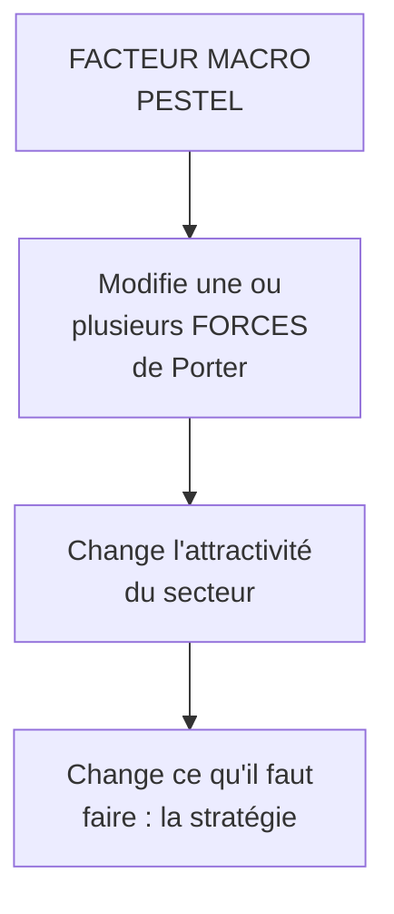

# Q10 — Comment relier PESTEL et Porter ?

> **La réponse en une phrase**
> Le PESTEL ne décrit pas un autre sujet que Porter : il **explique pourquoi les cinq forces évoluent** — le macro est la cause, le micro est l'effet, et une bonne analyse relie explicitement les deux.

---

## Partie 1 — Deux outils, deux échelles, un seul objet

📘 Le cours 2 les présente ensemble comme deux niveaux du même diagnostic : « Analyse de l'environnement au niveau **macroéconomique** : méthode PESTEL. Analyse de l'environnement au niveau **microéconomique** : 5 (+1) forces de Porter. »

| | PESTEL | Porter |
|---|---|---|
| Échelle | Macro | Micro |
| Périmètre | Tous les secteurs | Votre secteur |
| Question | Qu'est-ce qui bouge dans le monde ? | Qui capte la valeur dans mon secteur ? |
| Sortie | Opportunités et menaces générales | Attractivité du secteur, océan rouge ou bleu |

🔎 L'erreur consiste à les traiter comme deux exercices séparés qu'on juxtapose. Ce sont deux **niveaux du même raisonnement**.

---

## Partie 2 — Le lien : macro éclaire micro

### La règle générale

🔎 **Un facteur PESTEL n'a d'effet stratégique que par l'intermédiaire d'une force de Porter.** Une loi ne vous touche pas directement : elle touche vos barrières à l'entrée, vos coûts, votre pouvoir de négociation. C'est là que ça devient actionnable.

### Le tableau de transmission

| Facteur macro (PESTEL) | Force micro touchée | Effet concret |
|---|---|---|
| **L** — Norme technique nouvelle | Entrants potentiels | ▲ Barrières à l'entrée : protège les installés |
| **T** — Technologie de rupture | Substituts | ▲ Menace : un nouveau moyen de répondre au besoin |
| **E** — Prix de l'énergie en hausse | Fournisseurs | ▲ Leur pouvoir : ils répercutent |
| **S** — Nouvelle exigence des consommateurs | Acheteurs | ▲ Leur pouvoir s'ils peuvent comparer, ▼ si vous seul répondez |
| **P** — Ouverture d'un accord commercial | Entrants potentiels + rivalité | ▲ Nouveaux concurrents étrangers |
| **E** (éco-éthique) — Contrainte carbone | Coûts + rivalité | ▲ Coûts pour tous, avantage à celui qui a anticipé |
| **État** (6ᵉ force) | Toutes | Il écrit les règles des cinq autres |

📘 Rappel du cours sur l'effet final : « plus une force est puissante, plus la pression qu'elle exerce sur les prix ou les coûts est élevée, et **moins le secteur est attrayant** », dans le cadre de l'équation « **Profit = Prix – Coûts** ».

---

## Partie 3 — Comment le formuler à l'oral

🔎 La phrase-type qui prouve que vous avez compris le lien :

> « Au niveau macro, [facteur PESTEL] évolue. Cela agit sur [force de Porter], parce que [mécanisme]. La conséquence pour le secteur est [effet sur prix ou coûts], donc pour nous [décision]. »

**Exemple rempli :**

> « Au niveau macro, la réglementation sur l'accessibilité numérique se durcit. Cela agit sur la menace des entrants potentiels, parce qu'un nouvel acteur devra désormais maîtriser des référentiels techniques qu'il ne connaît pas. La conséquence pour le secteur est une hausse des coûts d'entrée, donc une protection des acteurs déjà conformes. Pour nous, qui avons deux développeurs certifiés, c'est une opportunité et non une menace. »

⚠️ Cette phrase enchaîne PESTEL → Porter → équation de profit → décision. C'est exactement ce que l'examinateur cherche.

---

## Partie 4 — Le sens inverse : Porter interroge le PESTEL

Le lien fonctionne aussi dans l'autre sens, et peu d'étudiants le disent.

🔎 Quand vous constatez qu'une force est anormalement puissante, la question suivante est : **pourquoi ?** Et la réponse est souvent dans le PESTEL.

| Constat micro | Question à poser au macro |
|---|---|
| Les fournisseurs ont un pouvoir énorme | Concentration du secteur amont ? Raréfaction d'une matière ? Facteur E |
| Les clients comparent tout et négocient | Transparence permise par une technologie ? Facteur T |
| De nombreux entrants arrivent | Dérégulation ? Baisse d'une barrière technique ? Facteurs L et T |
| La rivalité est destructrice | Marché mature, croissance nulle ? Facteur E économique |

⚠️ Utilité pratique : cette lecture inverse permet de savoir si une force forte est **conjoncturelle** (elle peut retomber) ou **structurelle** (elle est là pour rester). Ce n'est pas la même stratégie.

---

## Partie 5 — Exemple complet : le secteur des services numériques

### Étape 1 — Quelques facteurs PESTEL

| Facteur | Constat |
|---|---|
| **T** | IA générative accessible à tous |
| **L** | Accessibilité numérique bientôt obligatoire pour le privé |
| **P** | Tensions sur la souveraineté numérique |
| **E** (éco) | Coût énergétique du numérique en hausse, 📘 +16 %/an |

### Étape 2 — Transmission vers les forces

| Facteur | Force touchée | Sens | Explication |
|---|---|---|---|
| IA générative | **Substituts** ▲ | Défavorable | Un client peut faire lui-même une partie du travail |
| IA générative | **Entrants** ▲ | Défavorable | Barrières techniques abaissées |
| Accessibilité obligatoire | **Entrants** ▼ | **Favorable** | Nouvelle compétence exigée, barrière relevée |
| Souveraineté | **Fournisseurs** ▲ | Défavorable | Dépendance aux hébergeurs étrangers rendue visible |
| Coût énergétique | **Fournisseurs** ▲ | Défavorable | Hébergement plus cher |

### Étape 3 — Lecture d'ensemble

🔎 Quatre forces poussent vers un océan rouge, une seule vers une protection. Mais cette seule est **sélective** : elle ne protège que ceux qui maîtrisent l'accessibilité.

**Conclusion stratégique** : le secteur devient globalement moins attractif, sauf pour les acteurs qui se positionnent sur les compétences que la réglementation rend obligatoires. L'accessibilité n'est donc pas un sujet de conformité, c'est **le seul terrain où l'attractivité du secteur augmente**.

⚠️ Remarquez qu'aucun des deux outils, pris seul, n'aurait produit cette conclusion. Le PESTEL seul aurait donné une liste. Porter seul aurait dit « secteur peu attractif ». C'est le lien qui produit la stratégie.

---

## Les pièges

> [!danger] Erreurs classiques
> 1. **Juxtaposer les deux analyses sans les relier.** Deux exercices côte à côte ne font pas un diagnostic.
> 2. **Oublier le mécanisme de transmission.** Il faut dire *par quelle force* le facteur agit.
> 3. **Oublier la sixième force.** 📘 L'État agit sur les cinq autres.
> 4. **Ne pas conclure sur l'attractivité.** 📘 C'est la finalité de Porter.
> 5. **Ignorer le sens inverse.** Une force forte s'explique souvent par un facteur macro.

## À retenir

| | |
|---|---|
| **La règle** | Macro éclaire micro : le PESTEL explique l'évolution des forces |
| **Le mécanisme** | Un facteur macro n'agit que par l'intermédiaire d'une force |
| **La phrase-type** | Facteur PESTEL → force touchée → effet sur prix/coûts → décision |
| **Sens inverse** | Une force anormalement forte s'explique par le macro : conjoncturel ou structurel ? |
| **Finalité 📘** | Profit = Prix – Coûts ; plus les forces sont puissantes, moins le secteur est attrayant |
